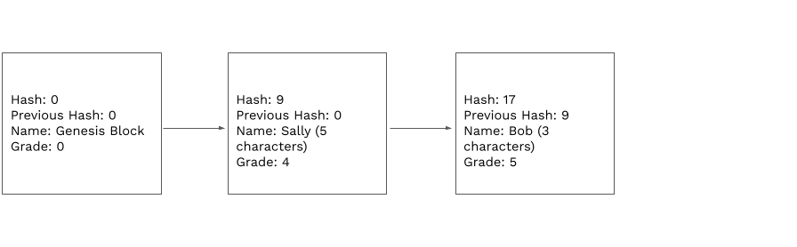

<!-- .slide: data-background-color="#8D3AED" -->

# Overview of Blockchains

## Activity

---

## What is a Blockchain?

At its core, it is just another database. But it is different from the databases we’re used to

---

## The Blockchain Data Structure

---

## The Blockchain Data Structure

---

## So then what’s Inside of a Block?

---

## Block Chaining

---

## Block Chaining

---

<!-- .slide: data-background-color="#8D3AED" -->

# Any questions?

---

## Assignment Grade Chain

<widget-text center>

1. Each participant will get their own block, we will take turns and insert our own blocks
1. Input your data: Name and quiz grade
1. Input the hash of the previous block
1. Calculate your hash and add it to your block
   - Add up the characters in your name with your grade and the previous hash values
   - The sum will be the value of your hash
   - Insert your hash value

---

## Assignment Grade Chain

---

## Assignment Grade Chain

