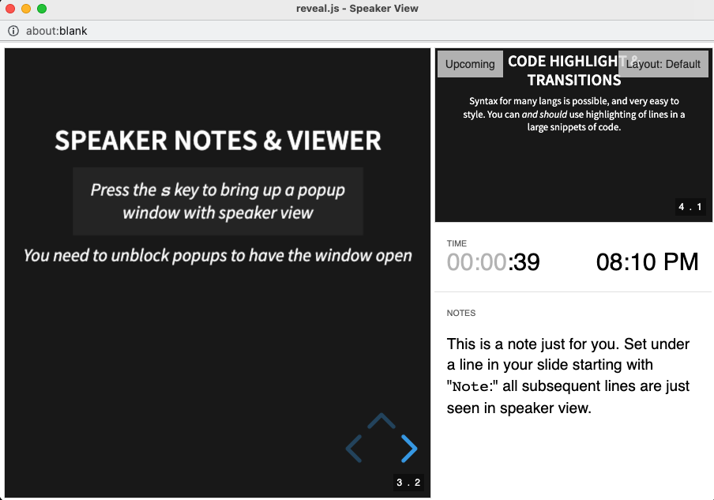

This guide is to help content contributors understand how to navigate this repository, format slides using `reveal.js` and run the repository locally.

**If this is your first time using `reveal.js`, we encourage you to explore [the official demo](https://revealjs.com/demo/#/2) to see what sort of things you can do with it!**
We are creating and customizing slides with [`reveal-md`](https://github.com/webpro/reveal-md): a tool built with `reveal.js` to allow for [Markdown](https://commonmark.org/help/) only slides, with a few extra syntax items to make _your slides look and feel awesome_ with very little effort.

# Table of contents

- [Install and view slides locally](#install-and-view-slides-locally)
- [Content organization](#content-organization)
- [Exercises, workshops and activities](#exercises-workshops-and-activities)
- [`reveal.js` basics](#-revealjs--basics)
  - [Slides](#slides)
  - [Using speaker notes](#using-speaker-notes)
  - [Transitions](#transitions)
  - [Code highlighting](#code-highlighting)
  - [Custom theme and CSS](#custom-theme-and-css)
  - [Presenting](#presenting)

## Install and view slides locally

### *Quick start*

Have `nvm` and `yarn` already installed? All you need to do is:

```sh
# Ensure you have the right node
nvm i
# For yarn 3, you need to enable some node features
corepack enable
# Install Dependancies
yarn 
# Run a slide server watching for file changes
yarn start
```

This should open a new tab with a listing of all slide decks to choose from.
Please start with the [INSTRUCTIONS-HOW-TO-USE-REVEAL-MD-Slides.md](./reveal-md/INSTRUCTIONS-HOW-TO-USE-REVEAL-MD-Slides.md) slides to see what is possible with the slides features and some template slides.
Next, jump to the [Content organization](#content-organization) section to see how this repository is structured ad why before you jump to the [Editing `reveal-md` slides](#editing-reveal-md-slides) section to learn how to create and edit your own slides!

If you are missing node or yarn, please install them as described below.

### Node.js

For all linux and mac users We suggest to use [nvm](https://github.com/nvm-sh/nvm#installing-and-updating) to install and manage multiple node versions.
With `nvm` instailled, from the academy top level dir:

```sh
nvm install
```

This will install (if needed) and set the correct version to use for this project set in the `.nvmrc` file here.

If you choose to not use `nvm`, you need [node](https://nodejs.org/en/) of version greater than `16.10`.
It is likely your [packagemanager](https://nodejs.org/en/download/package-manager/#debian-and-ubuntu-based-linux-distributions) has this version for you.

### Yarn

Please see the [official guide](https://yarnpkg.com/getting-started/install) to install for yarn 3.
Likely all you need to do is:

```sh
corepack enable
```

The only dependencies we need for this project can now all be installed with:

```sh
yarn
```

### Run to view slides

Running this command will open a new browser tab and _watch for file changes_ (update on every time you save a file in this repo):

```sh
yarn start
```

This should open a new tab with a listing of all slide decks to choose from.
Please start with the [INSTRUCTIONS-HOW-TO-USE-REVEAL-MD-Slides.md](./reveal-md/INSTRUCTIONS-HOW-TO-USE-REVEAL-MD-Slides.md) slides to see what is possible with the slides features and some template slides.

## Content organization

The content is organized by module, where each module has a folder for a specific lecture, and every lecture has:

- A markdown file of the formatted slides (this is what `reveal.js` parses to render the final slides)
- A markdown file containing workshops and exercises for that lecture
- A folder containing the markdown files of the original notes and lesson plans for each lecture

Assuming you're in the `syllabus` directory, this structure looks like (where `*` is the name of the lecture):

```
syllabus/
├─ 1-example-module/
│  ├─ 1.1-*/
│  │  ├─ 1.1-Workshops_and_Activities/
│  │  │  ├─ 1.1-*_Activity.md
│  │  │  ├─ 1.1-*_Workshop.md
│  │  ├─ 1.1-*_Slides.md
│  ├─ example-module-lesson-plans/
│  |   ├─ 1.1-Lesson_Plan_Name_of_Lecture_1.md
├  |   ├─ 1.2-Lesson_Plan_Name_of_Lecture_2.md
├─ 2-another-example-module/
│  ├─ ...
```

When creating content for your slide, we recommend you:

1. Start with copying the "Core Ideas to Convey" section of the original lesson plan.
2. Build out the content slide by slide around those notes.
3. Add TODOs to write notes to yourself for adding diagrams or things to get back to later.

## Exercises, workshops and activities

Each lecture may have a set of exercises, workshops and/or activities:

* **Exercises**: these are short (5-10 minutes) exercises that are included as part of the slide deck and can be completing during the lecture.
* **Workshops**: these are step-by-step, guided in-class workshops, intended to be more like individual labs, whose worksheet would live in a separate folder with a separate file called `Name_of_Lecture_Workshop.md`.
* **Activities**: these are in-class activities too, however they are intended to be more like group activities, without the step-by-step guidance that a workshop would have.
These live in a separate folder called `Workshops_and_Activities` in a separate file called `Name_of_Lecture_Activities.md`.

> Note: not all lectures have workshops or activities.

## Editing `reveal-md` slides

When writing slides, separate each one using `---`.

Optionally, you can separate slides vertically using `----` between slides.

If several slides fit closely with some core topic being presented, it may be a good idea to stack those slides vertically.
For example, imagine the core topic was "Code Highlight & Transitions":


### Using speaker notes

It's sometimes useful to have speaker notes for your slides.
This feature can be accessed when in presentation by pressing `s` when presenting (_you need to unblock popups to have the window open_).

To include notes for a slide, use the "Note" keyword inside that slide.
For example:

```md
Note: This is a note just for you.
Set under a line in your slide starting with "`Note`:" all
subsequent lines are just seen in speaker view.
```

And here's an example of the result:



### Transitions

To add transitions in a slide:

```md
_This will render only once the right or down arrow is pressed by presenter._

<!-- .element: class="fragment" data-fragment-index="2" -->
```

TODO: update this once we're more familiar with the css stuff.

### Code highlighting

You can add code snippets to your slides with line highlighting.
You can also animate to step through each highlight with `|` delimited sections of lines as a _fragment_:

```md
<!-- first fragment is line 0, meaning NO highlight -->
<!-- second fragment highlights lines 1 and 13 -->
<!-- last highlight is the block of lines from 4 to 8 -->
```rust [0|1,13|4-8]
fn largest_i32(list: &[i32]) -> i32 {
    let mut largest = list[0];

    for &item in list {
        if item > largest {
            largest = item;
        }
    }

    largest
}

fn largest_char(list: &[char]) -> char {
    let mut largest = list[0];

    for &item in list {
        if item > largest {
            largest = item;
        }
    }

    largest
}
```
```

## Custom theme and CSS

TODO: once we have more details on the template for each lesson and how each `.md` links back to the `.html` page that renders it.

### Presenting

Once you've followed the set-up instructions and have the repository running locally, here are the basic ways to navigate through presenting your slides:

- Use `down/up` arrow keys to navigate _vertical_ slides.
- Use `left/right` arrow keys to navigate horizontal slides.
- Press `Esc` or `o` to see an `overview` view that your arrow keys can navigate. This allows you to click a slide to open it).
- Press `s` to open up speaker view.
