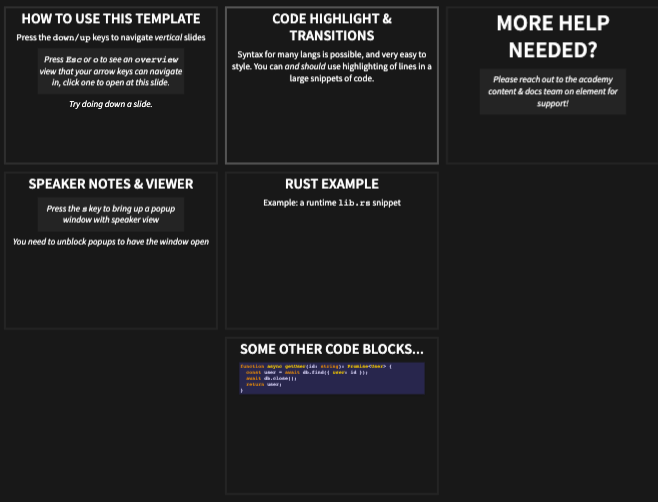
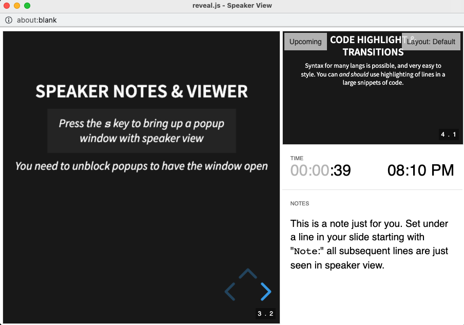

# Polkadot Blockchain Academy Contributors Guide

This guide is to help Academy contributors understand how all materials contained this repository are structured, how to interact with and modify them.
Multiple tools are provided for contributors to make slideshows, leader-guided workshops, and self-directed activities.

## Table of contents

- [Install and view slides locally](#install-and-view-slides-locally)
- [Content organization](#content-organization)
- [Exercises, workshops and activities](#exercises-workshops-and-activities)
  - [Rust Jupyter notebooks with EvCxR](#rust-jupyter-notebooks-with-evcxr)
- [Install and view `reveal.js` slides locally](#install-and-view-revealjs-slides-locally)
  - [Slides](#slides)
  - [Using speaker notes](#using-speaker-notes)
  - [Transitions](#transitions)
  - [Code highlighting](#code-highlighting)
  - [Custom theme and CSS](#custom-theme-and-css)
  - [Presenting](#presenting)

## Content organization

The content is organized by module, where each module has a folder for a specific lesson, and every lesson has:

- A markdown file of the `reveal-md` formatted **_lecture_** slides including **_exercises_** described within
- A markdown file outlining **_workshops_** and/or **_activities_** for that lesson.
- A folder containing the markdown files of the original lesson plan notes (from the Academy retreat)

The `syllabus` directory houses these, where `*` is the name of the lesson:

```
syllabus/
├─ 1-example-module/
│  ├─ 1.1-*/
│  │  ├─ 1.1-Workshops_and_Activities/
│  │  │  ├─ 1.1-*_Activity.md
│  │  │  ├─ 1.1-*_Workshop.md
│  │  ├─ 1.1-*_Slides.md
│  ├─ example-module-lesson-plans/
│  |   ├─ 1.1-Lesson_Plan_*_1.md
├  |   ├─ 1.2-Lesson_Plan_*_2.md
├─ 2-another-example-module/
│  ├─ ...
```

When creating content for your lecture (and exercise) slides, we recommend you:

1. Start with copying the "Core Ideas to Convey" section of the original lesson plan.
1. Build out the content slide by slide around those notes.
1. Add TODOs as markdown comments (`<!-- this is a comment  -->`) to write notes to yourself and to the TAs for adding diagrams or things to get back to later.
1. Place content for workshops and activities in the appropriate files, cross-referencing lecture and exercise content for reference to be build out around.

## Lesson slides with Reveal.js

**If this is your first time using `reveal.js`, we encourage you to explore [the official demo](https://revealjs.com/demo/#/2) to see what sort of things you can do with it!**
We are creating and customizing slides with [`reveal-md`](https://github.com/webpro/reveal-md): a tool built with `reveal.js` to allow for [Markdown](https://commonmark.org/help/) only slides, with a few extra syntax items to make _your slides look and feel awesome_ with very little effort.

### _Quick start_

Have `nvm` and `yarn` already installed? All you need to do is execute this from the top level directory of the Academy repo:

```sh
# Ensure you have the right node
nvm i
# For yarn 3, you need to enable some node features
corepack enable
# Install Dependencies
yarn
# Run a slide server watching for file changes
yarn start
```

This should open a new tab with a listing of all slide decks to choose from.
Please start with the [INSTRUCTIONS-HOW-TO-USE-REVEAL-MD-Slides.md](./reveal-md/INSTRUCTIONS-HOW-TO-USE-REVEAL-MD-Slides.md) slides to see what is possible with the slides features and some template slides.

<details>
<summary>If you are missing node or yarn, please install them as described below. (click to toggle)</summary>

### Node.js

For all linux and mac users We suggest to use [nvm](https://github.com/nvm-sh/nvm#installing-and-updating) to install and manage multiple node versions.
With `nvm` installed, from the academy top level dir:

```sh
nvm install
```

This will install (if needed) and set the correct version to use for this project set in the `.nvmrc` file here.

If you choose to not use `nvm`, you need [node](https://nodejs.org/en/) of version greater than `16.10`.
It is likely your [package manager](https://nodejs.org/en/download/package-manager/#debian-and-ubuntu-based-linux-distributions) has this version for you.

### Yarn

Please see the [official guide](https://yarnpkg.com/getting-started/install) to install for yarn 3.
Likely all you need to do is:

```sh
corepack enable
```

The only dependencies we need for this project can now all be installed with:

```sh
yarn
```

### Run to view slides

Running this command will open a new browser tab and _watch for file changes_ (update on every time you save a file in this repo):

```sh
yarn start
```

</details>

## Exercises, workshops and activities

Each lecture may have a set of exercises, workshops and/or activities:

- **Exercises**: these are short (5-10 minutes) exercises that are included as part of the slide deck and can be completing during the lecture.
- **Workshops**: these are step-by-step, guided in-class workshops, intended to be more like individual labs, whose worksheet would live in a separate folder with a separate file called `Name_of_Lecture_Workshop.md`.
- **Activities**: these are longer-form and self-directed activities for individuals and/or small groups that do not "hand-hold" like workshops with explicit step-by-step guidance.
  These live in a separate folder called `Workshops_and_Activities` in a separate file called `Name_of_Lecture_Activities.md`.

We highly suggest that most activities involving simple Rust examples use the [EvCxR](#rust-jupyter-notebooks-with-evcxr) tooling for it's quite powerful features.

> Note: not all lectures have workshops or activities.

### Rust Jupyter notebooks with EvCxR

REPLs are a fantastic way to experiment with a language interactively.
[`evcxr_jupyter`](https://github.com/google/evcxr/tree/HEAD/evcxr_jupyter) uses the fantastic [Jupyter Notebook](https://jupyter.org/) tooling for interactive documents with a built-in REPL.

**Please watch this [Jupyter 101 demo video](https://youtu.be/HW29067qVWk?t=248) to get to know the basics before proceeding**

#### _Quick start_

1. Install [`evcxr_jupyter`](https://github.com/google/evcxr/tree/HEAD/evcxr_jupyter#installation)
2. Open the [evcxr_jupyter_pba_example.ipynb](/content-templates/evcxr_jupyter_pba_example.ipynb) with the tool of your choice:

- Best-in-class _editing_ support is [Jupyter Lab](https://jupyterlab.readthedocs.io/en/stable/) over the vanilla notebooks tooling.
  Installation [described here](https://jupyter.org/install).
- Easiest and likely to be suggested to students to _use_ your notebooks (but you can edit too!) is the [VSCode plugin](https://github.com/Microsoft/vscode-jupyter).
  Install by searching for this plugin (`@id:ms-toolsai.jupyter`) in the VSCode extensions menu.
  Once installed, as with `evcxr_jupyter` installed, you can select the Rust kernel and start interacting with Rust-based notebooks like the example.

> TODO: figure out if you can, and document how to use rust-analyzer in VSCode with notebooks.

## Editing `reveal-md` slides

**There is a [base slide template example](./slide-templates/lesson-template-slides.md) that is highly suggested to use as a base to start all lesson slides.**
This template can be used just copy and change slide by slide the content, and not worry with styling.
If you do need custom style, please just comment in the slides with a code comment that says as much:

```md


<!-- TODO: I need this image to be rotated 45deg left -->
```

When writing slides, separate each one using `---`.

Optionally, you can separate slides vertically using `---v` between slides.

> Note that Windows uses `\r\n` instead of `\n` as its linefeed character.
> For a regex that supports all operating systems, use `\r?\n` instead of `\n`.
> Ex: `"\r?\n---\r?\n"` and `"\r?\n---v\r?\n"` as separators.

If several slides fit closely with some core topic being presented, it may be a good idea to stack those slides vertically.
For example, imagine the core topic was "Code Highlight & Transitions":



### Using speaker notes

It's sometimes useful to have speaker notes for your slides.
This feature can be accessed when in presentation by pressing `s` when presenting (_you need to unblock popups to have the window open_).

To include notes for a slide, use the "Note" keyword inside that slide.
For example:

```md
Note: This is a note just for you.
Set under a line in your slide starting with "`Note`:" all
subsequent lines are just seen in speaker view.
```

And here's an example of the result:



### Transitions

To add transitions in a slide:

```md
_This will render only once the right or down arrow is pressed by presenter._

<!-- .element: class="fragment" data-fragment-index="2" -->
```

TODO: update this once we're more familiar with the css stuff.

### Code highlighting

You can add code snippets to your slides with line highlighting.
You can also animate to step through each highlight with `|` delimited sections of lines as a _fragment_:

````md
<!-- first fragment is line 0, meaning NO highlight -->
<!-- second fragment highlights lines 1 and 13 -->
<!-- last highlight is the block of lines from 4 to 8 -->

```rust [0|1,13|4-8]
fn largest_i32(list: &[i32]) -> i32 {
    let mut largest = list[0];

    for &item in list {
        if item > largest {
            largest = item;
        }
    }

    largest
}

fn largest_char(list: &[char]) -> char {
    let mut largest = list[0];

    for &item in list {
        if item > largest {
            largest = item;
        }
    }

    largest
}
```
````

## Custom theme and CSS

The [template](#editing-reveal-md-slides) can be used just copy and change slide by slide the content, and not worry with styling.

If you do need custom style, please just comment in the slides with a code comment that says as much:

```md


<!-- TODO: I need this image to be rotated 45deg left -->
```

### Presenting

Once you've followed the set-up instructions and have the repository running locally, here are the basic ways to navigate through presenting your slides:

- Use `down/up` arrow keys to navigate _vertical_ slides.
- Use `left/right` arrow keys to navigate horizontal slides.
- Press `Esc` or `o` to see an `overview` view that your arrow keys can navigate. This allows you to click a slide to open it).
- Press `s` to open up speaker view.
