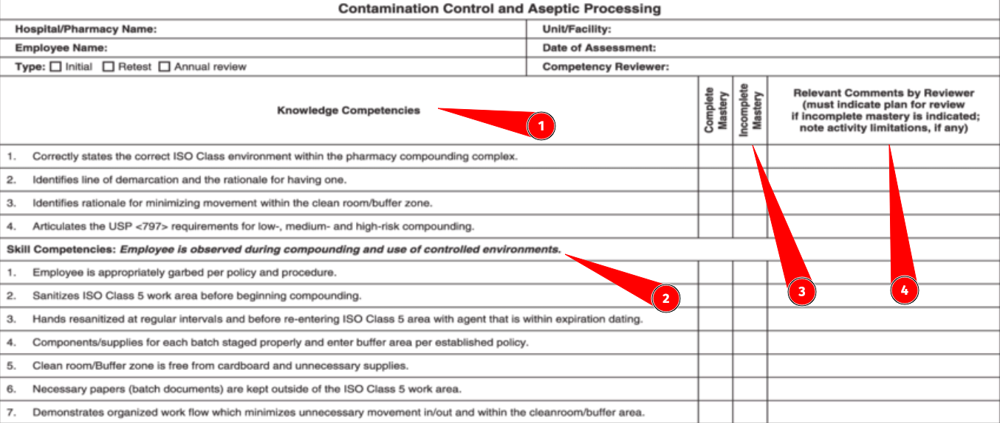

<!-- .slide: data-background-color="#F35289" -->

<h1 style="color:#FFFF;"> ⏰ TODOs before Berkeley ⏰ </h1>

---v

## 🗣️ Dry Runs (Lectures)

- New faculty (required!)
- New and Major refactored content (required!)

Notes:

Anyone still need this? We have VERY little time!

---v

## 💻 Beta Testing (Hands-on/Code)

- New Material
- Assignments

Notes:

Anyone still need this? We have VERY little time!

---v

## 📆 Founders Track Lessons required

- Flag what is applicable for Founders track in module README

Notes:

- founders track pilot program (30% of class, branching off 1/3 of day starting in the smart contracts module)
  - working with daily play-by-play on core content, but need to identify what founders will get most value from: the non-hands-on stuff and concepts most of all past the SC mod
  - internal calendar of events getting close to final draft, will go student and faculty facing ASAP

---v

## 🤙 1on1 checking pre-UCB

- Modules to meet with Nuke to cover their key milestones (???)

---v

## 🙌 Assignment Grading Plan

- Rubrics and solutions (required!)
- Who owns grading?
  - VERY tight turnaround (Start Sunday, ideally done Monday)

---v

## ✅ Create Learning Outcomes

1. Update your module `lesson-plan.md` with LOs
1. Map overall LOs to define assignment specific LOs in README
1. Map assignment LOs to Competency Checklist
1. _Granular list of tests per checklist item that (a fraction of) must pass_

- Scope mapping LOs->tests for now in an issue, impl autograding where possible soon

Notes:

Tests are not mission-critical, but the checklists are to generate a score.
Defining the tests lays the foundation for autograding.
WIP [assignment template](https://github.com/Polkadot-Blockchain-Academy/pba-autograded-assigment-template) we can work together to put in place for each assignment when it's ready

---

<!-- .slide: data-background-color="#4A2439" -->

# Graded Assignments Scheme

---v

## 🤷 Motivations from Faculty

- Variability in educational standards/best practices for assignments & grading, leading to large subjectivity in scores awarded.
- Workload is high for manual grading of 50 to 100 students with _very_ tight deadlines.

Notes:

Based on lessons learned in the first two cohorts about assessment.

---v

## 🤷 Motivations from Students

- Rightly critical of totally opaque grading resulting only in a score with minimal written feedback
- Certification cutoffs leading to _anger and toxicity_ around the program and our ecosystem
- Over-focused on obtaining certification via assignments vs. excellence in their work

---v

## 🎯 Goals

**Objective, easy to concretely define achievement, and concrete measures on assessment - qualitative and quantitative**

- Grading to be uniform and transparent for _everyone_
  - Test suites for code to _test_ functionality
- Maps _exactly_ with learning outcomes
- _Confine_ and make explicit where subjectivity of graders impacts scores
- Rubrics and complete _solutions_ for all graded material

Notes:

SME graders' subjectivity is still very important, topics like code quality, great use of patters/syntax, and "code beauty".
BTU we need to be confine that outside of hard skills & competencies in any assessments/scores/pass or fail
A "Perfect" example for the solution, and ideally various levels of score categories as example for each

---v

## 🎯 Goals

**Minimize faculty's time spent on grading _on-site_**

- Time on site is quite limited, interacting face-to-face is far more valuable than async reviewing and grading
- Minimize grading turn-around time to enable actionable feedback, iterations, and seeking support from SMEs
- (For now) the end of the in-person cohort defines absolute deadline for all grades

Notes:

We must balance between:

<pba-flex center>

1. Providing detailed feedback from SME to all students on all graded assignments
   - (At least option to request this, this can be TA's primary role)
1. Minimizing time and effort needed to assess work during a cohort

</pba-flex>

---v

## 🎯 Goals

**Student focus on growth & learning, not _only_ certification**

- [Learning, not earning! 📺](https://www.youtube.com/watch?v=CnSkOXe90WI)
- Foster intrinsic motivation & drive
- No points system can be high "rigor", focus must be on quality of work
- Encourages unique work & creative thinking
- Better granularity via skills and competencies, vs. "some number" that encompasses overall growth/accomplishment

---v

## 🎯 Goals

**Enable a pathway to thesis based model for multi-track future**

- Flexibility to break "out of the mold" to follow passions & dig deep
- More [latter in this deck](#pba-thesis-driven-certifications)

---v

## 🙅 Anti-goals

- "Shame" under-achievement that leads to exiting the ecosystem.
  - _We want to Maximize continued high-impact involvement post academy for all students and alumni_
- Normalization for the sake of specific percent not certifying
- "Gossip" and personal gripes/bias about students leading to bias & keep (by default, without good cause) _any_ subjective details on students out of the picture _between graders_.
- Unclear and subjective points systems with no clear definition that leads to grader interpretation of what a score means

---

<!-- .slide: data-background-color="#4A2439" -->

# Assessment Framework

Notes:

Research for the curious in the [Alternative Grading Frameworks](#alternative-grading-frameworks) section latter.

---v

## Assessment Framework

- Competency Checklist
- Automated Grading Suite
- PR Reviews for Feedback
- Rubric and Solutions
- Scoring System
- Certification Criteria

---v

## 🛂 Competency Checklist

Each assignment must define a set of **learning outcomes** in:

<pba-flex center>

1. Comprehension or Understanding
1. Skills or Abilities

</pba-flex>

Notes:

This is evaluated in a pass/fail manner, with grader feedback per item noted.

Some are explicitly defined to be optional-to-do items that if completed qualify for a higher level of grade.

---v

## 🛂 Competency Checklist

A "report card" of an assignment,  concatenated into one for the _entire academy_.

Notes:

Competencies are for the course overall, not just the assignment - there will be overlap between assignments.

---v

## 🤖 Automated Grading Framework

Based on Joshy's awesome work on the [📑 qualifying exam](https://github.com/Polkadot-Blockchain-Academy/Rust-Entrance-Exam) and [📑 assignment 0](https://github.com/Polkadot-Blockchain-Academy/pba-pre-course-assignment) we strongly suggest all (Rust based) assignments follow this standard:

<pba-flex center>

- Templated starting point with faculty to craft concrete assignments with `todo!("some things here...")` skeleton code defined
- Include "sanity check" and minimal unit tests that students _must_ complete
- Automated test suite (closed/private) to score granular pass/fail (based on learning objectives)

</pba-flex>

---v

## 🤖 Automated Grading Framework

Fully realized test suites will:

- Push creators to craft very well defined assessments
- Externalize _most_ effort to CI job for grading
- Enable resubmission by students anytime, iterating to passing

Notes:

Goal is to have "black box" that returns only pass/fail on tests, and a score of 1, 2, or 3.

---v

## 🧐 PR Reviews as Feedback

**Submissions include a README and/or PR comment**

- Points explicitly to what the SME should review
- Reflection on the work: key learning, things still to do, unresolved questions/issues the student had

---v

## 🧐 PR Reviews as Feedback

- Github Classrooms feedback PR can be used to comment directly on the work of each student easily
- An issue (template) opened on all classroom submission repos for manual grading
  - This is then the grading rubric and/or checklist for the grader to evaluate if the PR closes the issue.

---v

## 🧙 Rubric and Solutions

All assignments _must_ provide examples of end-to-end completed work to be included in grading, **for each possible score**

Notes:

For reference for faculty only for now, perhaps in a fully open course this should be open sourced.a

---v

## 📊 Scoring System

**0 to 4 integer system, awarded _per assignment_**

- 0 = Nothing submitted or grossly poor performance
- 1 = Incomplete submission, under minimal requirements
- 2 = Passing all minimal requirements, pre-defined percent of test suite passing
- 3 = Passing all test suite items, including explicitly marked optional ones
- 4 = Grader discretion of going above the call of the assignment
  - Taking into account the level expected of students in context
  - Examples of what should qualify defined by creator(s)

Notes:

Here we use the automated grading (where possible) to arrive at a score of 0,1,2, or 3.
A 4 is only manually awarded by graders based on their review of an individual's work.

---v

## ✅ Certification Criteria

**Average of integer scores for all assignments (effectively GPA)**

Future may include:
<pba-flex center>

1. Bundling of checklist items overall (above a 2)
1. Bundling of assignments total score (above a 2)
   - pre-defined
   - contract negotiated
1. Thesis Defense (only)

</pba-flex>

Notes:

All students can come away with a "report card" of all their competencies to (at their discretion) accompany their overall certification and overall score(s).
If we have many assignments we may move to bundles (4 is not enough)

---

<!-- .slide: data-background-color="#4A2439" -->

# Learning Resources for Faculty

_We encourage all content creators to review these!_

---v

## [📺 Developing Quality Assessments](https://www.youtube.com/watch?v=hDjWjbng40U)

A _wonderful_ overview and workshop around various exercise and activity models that we **highly encourage everyone watch**!

- Blooms taxonomy as basis with _explicit_ terms to use when defining learning objectives and outcomes
- WHY give this assignment? in context with content
- We assess on:
  - Process (thinking through) and/or product (shipped solution {code})
  - Express ideas concisely and coherently
  - Convergent (coming to conclusion based on given) or divergent (hypothesis from predictions & unstated things)

---v

## [📺 Best Practices for Grading Objectively and Efficiently](https://www.youtube.com/watch?v=hiUXBr4sgnM)

> Note that this is for typical grading systems (out of 100, A->F) that we will _not_ employ.

---v

## [📺 Make Grading Point-less: Eliminating Points to Foster Student Motivation](https://www.youtube.com/watch?v=CnSkOXe90WI)

Motivation around alternative grading schemes that are rigorous _and_ do not assign points.

---

<!-- .slide: data-background-color="#4A2439" -->

# Alternative Grading Frameworks

_Research for reference_

---v

## Alternative Grading Frameworks

- Overview: [📰 UC Berkeley Alternative Grading Frameworks](https://teaching.berkeley.edu/resources/course-design-guide/design-effective-assessments/alternative-grading-frameworks)
- Also [📰 University of Miami Alternative Grading Frameworks](https://academictechnologies.it.miami.edu/explore-technologies/technology-summaries/alternative-grading/index.html)
- There are many other interesting but even less common frameworks, not discussed in this presentation.

---v

## [📰 Grading for Equity](https://www.insidehighered.com/views/2020/01/27/advice-how-make-grading-more-equitable-opinion)

- Subjective criteria to minimum or zero
- Transparent scoring -> Are mathematically accurate to validly describe a student’s level of mastery
- No normalization
- Support hope and a growth mind-set
- “Lift the veil” on how to succeed

Notes:

- Transparent scoring -> Are mathematically accurate to validly describe a student’s level of mastery
  - They apply a more proportionately structured 0-4 scale instead of the 0-100 scale, which is mathematically oriented toward failure
  - They also use sound mathematical principles that reflect recent performance and growth instead of averaging performance over time
- Support hope and a growth mind-set
  - They allow test/project retakes to emphasize and reward learning rather than penalize it, and they override previous scores with current scores that build learning persistence
- “Lift the veil” on how to succeed
  - They create explicit descriptions of what constitutes demonstration of content mastery through rubrics or proficiency scales.
  - In addition, they simplify grade books and expand the methods of assessments to generate more accurate feedback and reporting about each student’s learning relative to the expected outcomes

---v

## [📰 Specification Grading](https://www.insidehighered.com/views/2016/01/19/new-ways-grade-more-effectively-essay)

- Pass fail only, based on a concrete specification givin to start
- Style is very similar to issues -> PRs, **great fit for our faculty's skill set**
- Bundles of specs fulfilled to achieve various levels

Notes:

Here we craft what students must do to be considered passing.
This is almost a one-to-one mapping with github based workflows, and thus is not only well suited to the style of assigning and completing work that our faculty does daily, but also a bit of on-the-job-training for students.

---v

## [📰 Contract Grading](https://en.wikipedia.org/wiki/Contract_grading)

- Collaboratively define grade qualifications with students (not completely pre-defined)
- Completion of a _contracted_ number of assignments of specified quality that correspond to specific letter grades
  - Instructors and students know exactly what is expected from them to receive a certain letter grade (no normalization)
  - Any student who completes the work that corresponds to a "B" grade will receive a "B" (everyone can pass)
- The grade the student receives is a reflection of how well they completed the pre-determined syllabus.

- _Variant: Labor-based contract grading = writing assessment be based on effort rather than on a subjective evaluation_

---v

## [📰 Ungrading](https://www.insidehighered.com/advice/2017/11/14/significant-learning-benefits-getting-rid-grades-essay)

- Clear instructions, although not necessarily criteria or contracts, for students to follow
- Flexibility with assignment deadlines and provide opportunities for revision
- Open conversations about performance (bi-weekly conferences, feedback surveys, or asking outright what grade they deserve)
  - Self-assessment drives the grade, not nearly as much a grader.

Notes:

Reflection and Dialogue are key: Ungrading builds upon similar aspects of specifications and contract grading
Ungrading does encourage instructors to have more open conversations with students about their performance, whether it is through bi-weekly conferences, feedback surveys, or asking students outright what grade to put in the system at the end of the term (Blum & Kohn, 2020)
These conversations in addition to other self-reflective exercises (i.e. minute tickets, process letters, peer feedback, etc.) require students to think critically about what they’ve learned and articulate how they have developed their knowledge and skills throughout the semester

---v

## [Competency Grading 📺](https://www.youtube.com/watch?v=YQInjf8UjOo)

Great explainer in [three](https://www.nciea.org/blog/what-do-i-need-to-know-about-competency-based-grading) - [part](https://www.nciea.org/blog/what-do-i-need-to-know-about-competency-based-grading-2) - [series](https://www.nciea.org/blog/what-do-i-need-to-know-about-competency-based-grading-3)

**This is the basis for assessments we will mostly embrace**

Notes:

More concrete implementation in the [Assessment Framework](#assessment-framework) section.

---

<!-- .slide: data-background-color="#4A2439" -->

# PBA Thesis Driven Certifications

_For now, just and idea to discuss_

---v

## Thesis Model Motivation

- Students can dig deep into passions, with structure and support to arrive at some tangible result from it
- Ability _subjectively_ assess students' novel work could be PBA's SMEs _unique_ value proposition
- Removes time constraint of cohort closing ceremonies
- _Con: new, extra time, different work scope required from faculty_

Notes:

Especially if course content is much more open, we need things that make the PBA long term value adding over maintaining and running content.

---v

## Thesis Driven Certification Integration

- Certifications based on scoring system remain, with option for _participation only_ if student opts-out of graded work to focus on thesis during the academy
  - Similar in concept to Founders Track (ungraded)
- Post-cohort successful thesis defense lead to specific "proper" certifications/degrees (engineering, founder, etc.)

Notes:

The cert. exception may be the Application Engineers (parachain and solochain engineering) for completion of some level in all assignments.

---v

## Thesis Driven Certification Flow

Successful completion of a PBA cohort is akin to a "mini-masters" program, the thesis track kickoff during, and continue _post cohort_:

<pba-flex center>

1. Commit to Thesis Advisor (During or shortly after PBA)
   - Student & advisor mutually agree on relationship
1. Thesis Proposal: defines work to be done, approved by Advisor (and retries as needed)
   - Modeled like W3F grant (if not actually one)
1. Thesis work: async support from Advisor and PBA
1. Thesis Committee: SMEs to evaluate thesis
1. Thesis Defense
1. Certification Awarded

</pba-flex>

Notes:

This is somewhat akin to a on-the-job training program or internship before a student is hired within our ecosystem.
It is a fantastic chance to help build a relationship with the committee and showcase your ability in a formalized way that is not possible presently (AFAIK).
