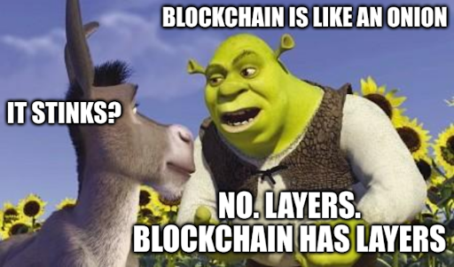

# Testing ink! Smart Contracts

---

## How to validate contract behavior?

<br/>

- linter/static checks
- common vulnerability patterns
- unit testing
- end-to-end testing
- quasi-end-to-end testing
- fuzzing
- ...

---

## How to validate contract behavior?

<br/>

- linter/static checks
- common vulnerability patterns
- <font color="#e6007a">unit testing</font>
- <font color="#e6007a">end-to-end testing</font>
- <font color="#e6007a">quasi-end-to-end testing</font>
- fuzzing
- ...

---

## Blockchain node onion

---

## Blockchain node onion

<br/>



---

## Blockchain node onion


- networking
- block production, dissemination, finalization
- storage management
- off-chain maintenance, querying, indexing

---

## Blockchain node onion


- computing new state based on the previous one and a single transaction

---

## Blockchain node onion


- executing contract calls

---

## Blockchain node onion

<br/>


---

## The stack


---

## Case study

<br/>

- an on-chain round-based game
- a rectangular grid to be colored
- in every round a player can color a single cell with their specific color (they choose the coordinates)
- after a fixed number of rounds the game ends and the player with the most cells of their color wins

---

## Case study

<br/>

https://github.com/Polkadot-Blockchain-Academy/ink-testing-strategies/

---

## Unit tests

<br/>

Just like classic component testing.

---

## Unit tests

<br/>

```rust
#[ink::test]
fn check_dummy_playing() {
    let mut player = MyPlayer::new((4, 4), 0);

    for turn in 0..16 {
        let (x, y) = player.my_turn().expect("should return coordinates");
        assert_eq!(x, turn % 4);
        assert_eq!(y, turn / 4 % 4);
    }
}
```

---

## Unit tests: possibilities

<br/>

```rust [1-3]
#[ink::test]
fn erc20_transfer_works() {
  let mut erc20 = Erc20::new(100);

  assert_eq!(erc20.balance_of(BOB), 0);
  // Alice transfers 10 tokens to Bob.
  assert_eq!(erc20.transfer(BOB, 10), Ok(()));
  // Bob owns 10 tokens.
  assert_eq!(erc20.balance_of(BOB), 10);

  let emitted_events = ink::env::test::recorded_events().collect::<Vec<_>>();
  assert_eq!(emitted_events.len(), 2);

  // Check first transfer event related to ERC-20 instantiation.
  assert_transfer_event(
    &emitted_events[0], None, Some(ALICE), 100,
  );
  // Check the second transfer event relating to the actual transfer.
  assert_transfer_event(
    &emitted_events[1], Some(ALICE), Some(BOB), 10,
  );
}
```

---

## Unit tests: possibilities

<br/>

```rust [5-9]
#[ink::test]
fn erc20_transfer_works() {
  let mut erc20 = Erc20::new(100);

  assert_eq!(erc20.balance_of(BOB), 0);
  // Alice transfers 10 tokens to Bob.
  assert_eq!(erc20.transfer(BOB, 10), Ok(()));
  // Bob owns 10 tokens.
  assert_eq!(erc20.balance_of(BOB), 10);

  let emitted_events = ink::env::test::recorded_events().collect::<Vec<_>>();
  assert_eq!(emitted_events.len(), 2);

  // Check first transfer event related to ERC-20 instantiation.
  assert_transfer_event(
    &emitted_events[0], None, Some(ALICE), 100,
  );
  // Check the second transfer event relating to the actual transfer.
  assert_transfer_event(
    &emitted_events[1], Some(ALICE), Some(BOB), 10,
  );
}
```

---

## Unit tests: possibilities

<br/>

```rust [11-22]
#[ink::test]
fn erc20_transfer_works() {
  let mut erc20 = Erc20::new(100);

  assert_eq!(erc20.balance_of(BOB), 0);
  // Alice transfers 10 tokens to Bob.
  assert_eq!(erc20.transfer(BOB, 10), Ok(()));
  // Bob owns 10 tokens.
  assert_eq!(erc20.balance_of(BOB), 10);

  let emitted_events = ink::env::test::recorded_events().collect::<Vec<_>>();
  assert_eq!(emitted_events.len(), 2);

  // Check first transfer event related to ERC-20 instantiation.
  assert_transfer_event(
    &emitted_events[0], None, Some(ALICE), 100,
  );
  // Check the second transfer event relating to the actual transfer.
  assert_transfer_event(
    &emitted_events[1], Some(ALICE), Some(BOB), 10,
  );
}
```

---

## E2E tests

<br/>

Full flow execution.

---

## E2E pipeline: traps, traps everywhere

<div style="font-size: 0.6em">

1. Preparing and encoding transaction data (_client side_)
1. Signing the transaction (_client side_)
1. Sending transaction to a node (_client side_)
1. Block and event subscribing (_client side_)
1. Transaction pool processing (<font color="#e6007a">_node side_</font>)
1. Block building (<font color="#e6007a">_node side_</font>)
1. Block dissemination (<font color="#e6007a">_node side_</font>)
1. Import queue processing (<font color="#e6007a">_node side_</font>)
1. Block finalizing (<font color="#e6007a">_node side_</font>)
1. Block execution (<font color="#e6007a">_node side_</font>)
1. Transaction execution (<font color="#c2ff33">_runtime side_</font>)
1. Event emitting (<font color="#e6007a">_node side_</font>)
1. Event capturing (_client side_)
1. Event processing (_client side_)
1. State fetching via RPC calling (_client side_)
1. State report (<font color="#e6007a">_node side_</font>)
1. State validation (_client side_)

</div>

---

## E2E pipeline: traps, traps everywhere


---

## E2E pipeline: fear, fear everywhere


---

## E2E pipeline: traps, traps everywhere

<div style="font-size: 0.6em">

1. **Preparing and encoding transaction data (_client side_)**
1. Signing the transaction (_client side_)
1. Sending transaction to a node (_client side_)
1. Block and event subscribing (_client side_)
1. Transaction pool processing (<font color="#e6007a">_node side_</font>)
1. Block building (<font color="#e6007a">_node side_</font>)
1. Block dissemination (<font color="#e6007a">_node side_</font>)
1. Import queue processing (<font color="#e6007a">_node side_</font>)
1. Block finalizing (<font color="#e6007a">_node side_</font>)
1. Block execution (<font color="#e6007a">_node side_</font>)
1. **Transaction execution (<font color="#c2ff33">_runtime side_</font>)**
1. Event emitting (<font color="#e6007a">_node side_</font>)
1. Event capturing (_client side_)
1. Event processing (_client side_)
1. State fetching via RPC calling (_client side_)
1. State report (<font color="#e6007a">_node side_</font>)
1. **State validation (_client side_)**

</div>

---

## Test core

<br/>

1. Preparing and encoding transaction data (<font color="#c2ff33">**given**</font>)
1. Transaction execution (<font color="#c2ff33">**when**</font>)
1. State validation (<font color="#c2ff33">**then**</font>)

---

## quasi-E2E tests

<br/>

Interact directly with runtime, skipping node layer.


---

## quasi-E2E tests with `drink!`

<br/>

https://github.com/inkdevhub/drink


---

## `drink!` test

<br/>

```rust
#[drink::test]
fn flipping() -> Result<(), Box<dyn Error>> {
    let contract = BundleProvider::Flipper.bundle()?;
    let init_value: bool = Session::<MinimalRuntime>::new()?
        .deploy_bundle_and(contract, "new", &["true"], NO_SALT, NO_ENDOWMENT)?
        .call_and("flip", NO_ARGS, NO_ENDOWMENT)?
        .call_and("flip", NO_ARGS, NO_ENDOWMENT)?
        .call_and("flip", NO_ARGS, NO_ENDOWMENT)?
        .call_and("get", NO_ARGS, NO_ENDOWMENT)?
        .record()
        .last_call_return_decoded()?
        .expect("Call was successful");

    assert_eq!(init_value, false);

    Ok(())
}
```

---

## Local playing with contracts using `drink-cli`

<video height="450" controls>
  <source src="./img/ink/ink-testing-drink-cli.mp4" type="video/mp4">
</video>

---

## Takeaways

<br/>

- **Always test your contracts!**
- Unit tests in the initial dev phase and for complex methods.
- drink! during development and for long-running simulations.
- E2E suite for the final product.


