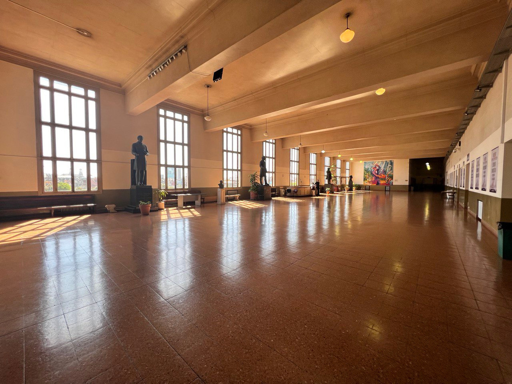
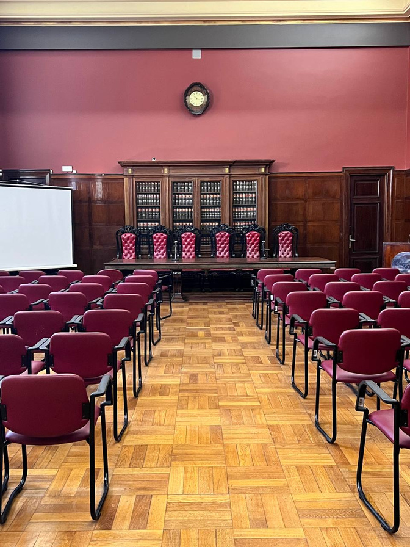

<!-- .slide: data-background-color="#8D3AED" -->

# Content Workshop

 

### _Instructional Staff Briefing_

---

<!-- .slide: data-background-color="#8D3AED" -->

# Kahoot Game

Notes:

- start quiz game: https://play.kahoot.it/v2/?quizId=54f680c9-5040-4c6d-9d02-480843ee53a4
- edit : https://create.kahoot.it/share/academyretreatsession/54f680c9-5040-4c6d-9d02-480843ee53a4

---

## Session Overview

<widget-text center>

1. Introductory Game
1. Logistics (times, dates, location)
1. Curriculum Overview
1. Formal commitments from instructional staff
1. Pedagogy - Teaching Tips
1. Content Brainstorming
1. Guest Lessons

</widget-text>

---

## Typical Day at the Academy

<widget-text center style="font-size: smaller;">

- 8:00 - 9:00: Breakfast (Catered)
- 9:00 - 12:00: Morning Session
- 12:00 - 13:00: Lunch Break (Catered)
- 13:00 - ~16:00: Afternoon Session
  - Session can end between 15:00 and 16:30 at instructor's discretion
  - Allows finding a good stopping point
  - No need to "fill" (aka waste) time
  - No need to rush to finish a point
- Dinner is NOT Catered
- Some nights will have a Guest Lesson

</widget-text>

---

## Modules and Assignments

<widget-columns>
<widget-column>

<widget-text style="font-size: 3px;">

1. Cryptography - 2 Days
2. Econ & Game Theory - 2 Days
3. Assignment 1
4. Blockchain - 2.5 Days
5. Substrate - 2.5 Days
6. Assignment 2
7. FRAME - _5 Days_

</widget-column>
<widget-column>

8. Assignment 3
9. Polkadot - 2.5 Days
10. Smart Contracts - 2.5 Days
11. Assignment 4
12. XCM - 2.5 Days
13. Maybe Optional Ungraded Assignment

</widget-column>
</widget-columns>

</widget-text>

---

## Universidad De Buenos Aires

---v

---v

---v

---v

---v

---v

---

<!-- .slide: data-background-color="#8D3AED" -->

## Commitment Time

<widget-text center>

1. Review exact dates for each module
1. Make some **Formal Commitments**

</widget-text>

Notes:

This is the part where I'm asking each of you to make a formal commitment in front of each other. Don't take this lightly! Don't say you will expecting this to be low priority and last minute work for you.
This endeavor will only succeed with everyone doing their part. If you cannot commit to the dates & to deliver content, we need to know now.

---v

## What am I signing up for?

 

### Instructors are the _Owner_ of content creation and delivery.

 

<widget-columns>
<widget-column>

</widget-column>
<widget-column>

- Ultimately responsible for the success of the module.
- Coordinate with edu. team and TAs to do this.

</widget-column>
</widget-columns>

<!-- .element: class="fragment"-->

---v

### Module 1 - Cryptography

<widget-text center>

- Instructor: (Hopefully) Isaac DeFrain
- TAs: Dan, Giulia, Hector
- Dates: January 10 - 11

 

**_Do you commit?_**

Notes:

We are still struggling to get an offer to Isaac. I've done everything I can to make this happen. Can the TAs commit?

---v

### Module 2 - Economics

<widget-text center>

- Instructors: Samuel
- TAs: Jonas, Florian, Alfonso
- Dates: January 12 - 13

 

**_Do you commit?_**

Notes:

Understood that, unfortunately, Jonas cannot be present this time. He has done great work revising already. Can the others commit.

---v

### Module 3 - Blockchain

<widget-text center>

- Instructor: Joshy Orndorff
- TAs: Dan, Andrew, Isaac (Hopefully)
- Dates: January 16 - 18

 

✅ Already committed

Notes:

Except Isaac doesn't have an offer yet. He is willing to commit but we're waiting on... IDK

---v

### Module 4 - Substrate

<widget-text center>

- Instructor: Kian
- TAs: Andrew, Shawn, Dan, Joshy
- Dates: January 18 - 20

 

**_Do you commit?_**

---v

### Module 5 - FRAME

<widget-text center>

- Instructor: Shawn
- TAs: Kian, Dan, Hector, Alex T
- Dates: January 23 - 27

 

**_Do you commit?_**

---v

### Module 6 - Polkadot

<widget-text center>

- Instructors: Rob, Andronik
- TAs: Kian, Shawn
- Dates: January 30 - February 1

 

**_Do you commit?_**

Notes:

Understood that Rob cannot be present for February 1st.

---v

### Module 7 - Smart Contracts

<widget-text center>

- Instructors: Michi, Alex T
- TAs: Ricardo, Hector
- Dates: February 1 - 3

 

**_Do you commit?_**

---v

### Module 8 - XCM

<widget-text center>

- Instructors: Kieth, Gorka
- TAs: Hector, Andrew
- Dates: February 6 - 8

 

**_Do you commit?_**

Notes:

Gorka is from the Moonbeam team and has already committed.

---v

<!-- .slide: data-background-color="#8D3AED" -->

## Alright! We have a TEAM!

 

---

## Pedagogy

<widget-text center>

_The approach to teaching, is the theory and practice of learning,_

 

Biggest feedback from wave 1:
**_Too much boring lecture_**

<!-- .element: class="fragment"-->

</widget-text >

Notes:

You are all very smart and have many interesting things to teach our students. But nobody can maintain focus for three straight hours. Nor do they want to. Nor do they deserve to be subjected to that.

---v

### Common Fallacy: Lectures in all Lessons

> I want to do more hands-on stuff...
>
> but the time is short and I **have** to lecture first....

### This is WRONG!

<!-- .element: class="fragment"-->

**_Lecture for 50% of time maximum!_**

<!-- .element: class="fragment"-->

Notes:

Even if you decide that you absolutely must do a long lecture, you aren't going to be delivering the value you think.

---v

### Teachers Imagine

Notes:

Teachers imagine eery student is like this one guy. But look at most of them.

---v

### But Really

---v

### But Really

---v

### What to do Instead

- Consider assigning pre-reading or _short_ pre-recorded lectures: explore the [flipped classroom](https://en.wikipedia.org/wiki/Flipped_classroom) and [active learning](https://bokcenter.harvard.edu/active-learning)
- Treat them as **apprentices**

 

Notes:

In the old day, the long long ago, it was expensive to duplicate books and impossible to distribute video. In that setting a teacher explaining a concept live really added value. Today we have the internet and it is trivial to distribute text or video resources. In this setting the teacher's biggest value is interacting with students, answering questions, guiding their work, giving feedback.
It's okay to treat students as apprentices. Let them learn through their work. It's okay to assign them a task that they don't yet know how to do. This will get them to ask you how and they will be motivated to hear and understand the answer.

---v

### Flipped Classroom

1. **Decide how you will use your class time and design those activities.**
1. **Find or create resources for students to use outside class time.** You do not need to create all sources, but you must make sure that all students have a way to access these materials.
1. **Teach students how to use the material at home.** Unlike when they are in a lecture, students cannot ask question as they arise, making note taking especially important to bring to class. _Be mindful of other demands on their time at the academy._

Notes:

If you create the materials for students to use at home, solicit for and use their feedback to revise it.

---v

## Active Learning

- Real-time feedback about what students are learning.
- By grappling with ideas, students connect new concepts to prior knowledge in meaningful ways and construct their own understanding.
- Collaborating with classmates promotes community and connection between students, which can enhance a sense of belonging as well as motivation.
- It creates a low bar to participation for quiet or passive students by encouraging every student to think and do.

---v

## Active Learning

- **Think-pair-share**: In this exercise, students are given a minute to think about—and perhaps respond in writing—to a question on their own. Students next exchange ideas with a partner. Finally, some students share with the entire class.

- **Statement correction, or intentional mistakes**: The instructor provides a prompt containing errors. The students are charged with finding and correcting the errors. Concepts that students commonly misunderstand are well suited for this activity.

Notes:

A think-pair-share engages every student, and also encourages more participation than simply asking for volunteers to respond to a question.

Errors -> Concepts that students commonly misunderstand are well suited for this activity.

---v

## Active Learning

- **Code-along**: student write the same code as you real time. Consider pauses to allow students to try some parts themselves or in small groups, or simply ask what they think should be next. Write in a few bugs for them to spot.

- **Concept map**: Students are provided with a list of terms.They arrange the terms on paper and draw arrows between related concepts, labeling each arrow to explain the relationship.

---v

### When you must lecture for > 30min

<widget-text center>

### Break it up

</widget-text>

- Coffee Break
- Kahoot Game
- Physical Exercise (_yes, seriously_)

Notes:

I'm skeptical that it's ever necessary to lecture continuously this long, but some of us are new to teaching, and I'm not going to be an anti-lecture extremist.
Exercise: Students will do it if you tell them to. I've gotten theaters of 50+ adults to do pushups together. It honestly helps a lot. Gets the blood flowing, stimulates conversation and laughing, encourages class bonding. The key is to make sure everyone feels comfortable and welcome. Not everyone can do perfect pushups. It's okay to do them on your knees or against the wall or do situps or squats instead. Consider setting a cumulative goal for the class and add up everyone's contribution.

---

<!-- .slide: data-background-color="#8D3AED" -->

# Content Brainstorming

 

**Coding exercises, module by module**

<widget-text center>

...in-class activities 
...after-class assignments 
...active learning ideas

</widget-text>

 

There are no stupid ideas! 
Keep 'em coming... 
**📝 write them down! 📝**

Notes:

Everyone is welcome to contribute ideas for any module
We can also brainstorm along the lines of what content to teach, but I'm trying to focus on non-lecture stuff so people start thinking in that direction.
Flip through the repository instead of showing this slide

---

## Guest Lessons

> Guest lessons are 60-90 min one-off lessons (could be Q and A, live coding, hands-on activity, or even just a lecture) where the guest covers any topic that they find interesting and relevant. They are not expected to advance our curriculum directly.

- Suggest topics
- Suggest Speakers
- Volunteer
- We especially need these early in the course

---

## Instructor Action Items

1. Inventory & review of your content.

- Note **in an issue** the outstanding items to be updated/added/removed
- More code content needed throughout all modules!

2. **Get an outline of what work needs to be done for content ASAP to Dan&Joshy and your TAs**

- Kickoff meeting with your TAs to outline work
- Put your TAs to some tasks _now_ so we can get moving!

---

<widget-text center style="font-size: 43px">

<!-- TODO Remove this ignore once the repo is public -->
<!-- markdown-link-check-disable-next-line -->

https://github.com/Polkadot-Blockchain-Academy/pba-content

</widget-text>

 

Everyone should have access to this repo, let Dan know if not.

 

**_📝 New issue by instructors on inventory to kick things off ⏰_**

Note:

Dan will push you before sub0 to do this!

---

<!-- .slide: data-background-color="#8D3AED" -->

Notes:

Education team is counting on you and we are here in full force to help you succeed!
Please reach out anytime and don't wait for us to get started or ask you how things are going.

---

### Moooor Slides

---

## Beta Testing 🧪

 

Eager internal contributors and wannabe students...

 

**_What do \*you\* need they could assist with?_**

Note:

We don't explicitly require working with those interested, but it's an option we should consider as a team!

---v

## Beta Testing 🧪

Maybe...?

<widget-text center>

- Review content
- Try exercises & activities
- Add fresh ideas
- Inform on what is confusing or missing

</widget-text>

---v

## Beta Testing 🧪

They need fresh content to help us...

 

### ⏰ The sooner you create this, the more we can help! ⭐

---

## `#BUILD` a Thing!

Idea: Students produce a portfolio project to showcase a _synthesis_ of their work.

Perhaps A capstone style project _composed_ of the products of assignments and exercises.

### 🤔 WDYT? 🤔

Notes:

Ideally, we can work together to coordinate across modules to have students build upon their work from previous modules as they progress.
Similar in flavor to the final project last time, but here it can be a bigger, more complete, and on the way to a deployable product.

---v

## Kudos Idea

 

### _A fully functional parachain, incorporating custom pallets, contracts, and XCM integrations_

---v

## Kudos Idea (Mod 4&5)

1. Build a minimal chain with:
   - identity style pallet serving as an address book (perhaps on a relay chain) for individuals and eventually for parachains (XCM to send to other people via address book)
   - assets and uniques pallets for managing tokens, add required remark in transfer extrinsic for reasoning behind sending (a Kudos), consider adding "soul bound" option for minting assets.

---v

## Kudos Idea (Mod 6)

2. Migrate to parachain with group:
   - coordinate with group to add a minimal gov pallet
   - Consensus update to allow any group member to run a collator node, with tiny PoW or first to make a block (unix time) wins to progress testnet parachain.
   - Setup ID pallet profiles on a common good parachain (collectives) registrar is edu team

---v

## Kudos Idea (Mod 7)

3. Contracts integrations:
   - Make contracts that build on top of assets pallet (chain extensions) to compose logic
   - plan on another chain extension from hector to execute xcm from this student's chain to another chain (student with same or similar pallet, common good one perhaps)

---v

## Kudos Idea (Mod 8)

4. XCM integrations:
   - Setup channels to other groups
   - Add IDs of other peers in other chains with multi-locations
   - XCM reserve-backed tx Kudos to people on other parachains. Thus you have a double entry accounting method (check sending and receiving side for assets, to assert no manipulation by one side)

Notes:

XCM flow:

- Deposit asset in sov account
- Send XCM notification of deposit and request mint of asset derivative
