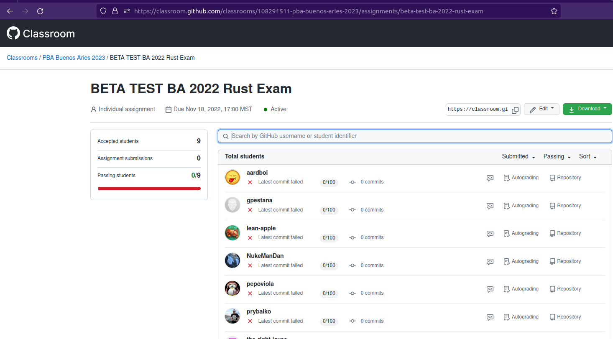

# Rust Entrance Exam

Source Available here: https://github.com/Polkadot-Blockchain-Academy/Rust-Entrance-Exam

> At time of writing this is a private repo to only reveal the exam to that developing it or assigned to take it.
> Instructions are explicitly not to share it outside this group on the repo itself.

All students who attend the academy must be familiar with the [Rust programming language](https://rust-lang.org/).
To that end, they will have to pass this Rust entrance exam in order to be enrolled.

The standard reference in the Rust community is the [Rust Book](https://doc.rust-lang.org/book/).
At minimum, you will need to be familiar with chapters 1 - 11 as well as chapters 13 and 19.
It is generally suggested to read it completely and do all exercises in the book and appendixes.

## Instructions for Use

All students who have made it far enough in the application process to take the Rust entrance exam, will need to receive an invitation to a [Github classroom](https://classroom.github.com/) assignment based on the exam repo.

After accepting the assignment, they will have a private copy of the exam repo to submit their work to.
For those completely new to Github, please checkout [this video](https://www.youtube-nocookie.com/embed/10krMetDSWs)

- Set a point of contact for students for the exam, so they can ask clarifying questions without cheating, per the honor code.
- Use the base exam repo to generate a new `template` _without_ keeping the branches labeled with the year and location of the cohort, like `PBA-Rust-Exam-BA-2023`.
  - In the new repo, there should be only an init commit, and only a `main` branch.
  - In the new rep setting, make this a template repo (needed latter).
- As an _owner_ of the [PBA org](https://github.com/Polkadot-Blockchain-Academy/) you are able to access the https://classroom.github.com/classrooms area and create a `New Classroom` specific to the cohort, like `PBA Buenos Aries 2023`
  - The creator can invite other _PBA org owners_ to be `TAs and Admins` of the classroom under the appropriate tab.
  - Ensure they are indeed owners, then copy the link from TAs tab and ask them to join via it.
- In the new cohort classroom, create a `New Assignment` with a related name to the repo the assignment will use, like `PBA Rust Entrance Exam - BA 2023`.
  - Set a deadline (this can be modified)
  - Keep the repo private
  - Don't give student's admin access to their repo.
  - Select starter code to be the template repo for this assignment
  - Select a single test named `cargo t` and have it run a single command of `cargo t` (Github actions is setup for students that includes a workflow with cargo available.)
  - Don't include a suggested IDE
  - Do opt into a feedback PR opened for all student submissions.
  - Copy the invitation link to start the assignment (note you can disable and invite exclusively by username as well.)
- When appropriate, invite students to start via link or direct invitation via user name.
  - Notify directly of the deadline, to start by completely reading the README and the honor code.
  - Ensure they know the point of contact for questions and who to inform about their work being complete (including a link to their private github repo with solutions in `main`)
- When the deadline has passed, disable the invitation in the assignment settings.

Here is what an active assignment page should resemble:

## Automated Assessment

The exam comes with a minimal test suite and accompanying Github actions that will run the tests and pass/fail submissions on the Classroom assignment.
The tests included in the repo should be thought of as a minimal bar to be considered for further grading, and if not enough of the applicant pool pass this, the failing applicants can be considered for manual review.

## Submission and Grading

Students will let the Academy staff know they are done so grading can begin with a message to us that includes:

- Github username (`@polkafan`).
- Assignment repo's URL (`https://github.com/Polkadot-Blockchain-Academy/rust-entrance-exam-PolkaFan`)

We will grade the last commit on the `main` branch that was pushed before the deadline.

## Internal Testing Suite

The primary way we will grade work is through an automated testing suite that is kept private from students.

TODO add info on this test suite!

There are also some human-graded aspects such as:

- Code quality and readability
- Ensuring that you haven't imported a crate to do the heavy lifting of your code problem
- Ensuring that you have written the actual algorithm requested in a particular problem as opposed to a different algorithm that is easier to code (Eg writing bubble sort when we asked for merge sort).
- Ensuring you have followed any specific directions for a problem.
  (Eg used functional-style iterator methods as opposed to imperative-style loops)
