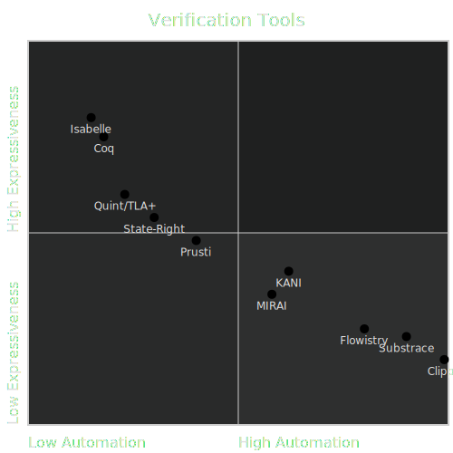

# Formal Methods for Rust

---

## Outline

<pba-flex center>

1. Intro to Formal Methods
1. Landscape of Techniques for Rust
1. Focus on Kani: Bounded Model Checker
1. Applications to Polkadot

</pba-flex>

---

## Introduction to Formal Methods

#### _Story Time!_

---v

### _Ariane 5 Rocket - Flight 501_


- in **1996**, the launcher [rocket disintegrated](https://www-users.cse.umn.edu/~arnold/disasters/ariane.html) 39 secs after take-off.
- **Failure**: An _overflow_, caused by a conversion from 64-bit to 16-bit floating point
- **Mistake**: reusing inertial reference platform of Ariane-4, where overflow cannot happen due to different operational conditions
- **Cost**: 500M USD payload, 8B USD development program

Notes:

---v

## Software Correctness is _very_ important

> Program testing can be used to show the presence of bugs, but never to show their absence! - Edgard Dijkstra

#### Hence, the necessity to go beyond Testing <!-- .element: class="fragment" -->

---v

## Formal Methods to the Rescue!

- Verify/prove correctness of software with reasonable mathematical guarantees.
- **Traditionally**, costs and efforts were justifiable in _safety-critical_ software like avionics, nuclear reactors, medical imaging, etc.
- however, things have changed ...

Notes:

---v

## It is no longer Rocket Science!

- AWS formally verifies Key-Value storage nodes in Amazon S3 (Rust Implementation).
- Meta detects resource leaks and race conditions in Android apps
- Uber uses static analysis to find Null-pointer exceptions
- Ethreum's Beacon chain and Tendermint consensus formally verified for safety and liveness guarantees

Notes:

---v

## Formal Methods Today

> _...have gone from being theoretical research interests to delivering practical cost-effective tools_

<pba-flex center>

- verification tools more efficient
- goals more focused, promises less lofty
- combination of analysis techniques

</pba-flex>

---v

## More like _Light-weight Formal Methods_

1. rigorously **detecting bugs** >> proving overall correctness of system.
1. Developer-centric **Usability** (e.g. workflow integration)

Notes:

- Drastic Speed-up in Underlying Constraint-Solver engines
- reduce the scope of bugs; focus on particular bugs like resource leaks,
- combine symbolic and concrete executions;

---v

## Formal Methods <> Blockchains

#### Hammer finally found the nail!

- lot at stake, justifies the cost and efforts
- business logic is compact and modular, within limits

---v

## Key Takeaways

<pba-flex center>

### Formal Methods is ...

- **not a Panacea** but can improve software quality
- getting more and more **accessible**
- useful for increasing **reliability and security** of blockchains
  </pba-flex>

Notes:

http://www.pl-enthusiast.net/2017/10/23/what-is-soundness-in-static-analysis/
Great blog that explains the trade-offs between soundness and tractability

---

## Tools Landscape


<!-- TODO: Need to convert an image similar to this into an svg. Want the green circle to appear as a transition. Use Figma for creating the image. -->

Notes:

Links to tools listed

- [Isabelle](https://isabelle.in.tum.de/)
- [Coq](https://coq.inria.fr/)
- [TLA+](https://github.com/tlaplus)
- [StateRight](https://github.com/stateright/stateright)
- [Prusti](https://www.pm.inf.ethz.ch/research/prusti.html)
- [Kani](https://github.com/model-checking/kani)
- [MIRAI](https://github.com/facebookexperimental/MIRAI)
- [Flowistry](https://github.com/willcrichton/flowistry)
- [Substrace](https://github.com/kaiserkarel/substrace)
- [Clippy](https://github.com/rust-lang/rust-clippy)

---v

## Tools Landscape

<pba-cols>
<pba-col center>


</pba-col>

<pba-col center>

#### Quint/ State-Right (Model-checkers)

- Humongous effort modelling the system & specifying properties
- Abstraction gap
- Reason about complex properties: safety & liveness of consensus mechanism

</pba-col>
</pba-cols>

---v

## Tools Landscape

<pba-cols>
<pba-col center>


</pba-col>

<pba-col center>

#### Static Analyzers

- code-level
- specify expected behavior (information/data flow)
- default checks: bugs like arithmetic overflow, out-of-bound access panics

</pba-col>
</pba-cols>

---v

## Tools Landscape

<pba-cols>
<pba-col center>


</pba-col>

<pba-col center>

#### Linters

- code-level
- checks for code smells
- other syntactic Properties

</pba-col>
</pba-cols>

---

<!-- .slide: data-background-color="#4A2439" -->

# Our Focus: Kani

---

## Kani: Model Checking tool for Rust

- open-source Rust verifier by AWS
- underlying technique used: [Bounded Model Checking](https://www.cs.cmu.edu/~emc/papers/Books%20and%20Edited%20Volumes/Bounded%20Model%20Checking.pdf)
- Can be used to _prove_:
  - absence of arithmetic overflows
  - absence of runtime errors (index out of bounds, panics)
  - User Specified Properties (enhanced PropTesting)
  - memory safety when using unsafe Rust

---v

lets see some Magic and then the Trick

> Demo of the Rectangle-Example

---v

## Proof Harness

<pba-col centre>

```rust
use my_crate::{function_under_test, meets_specification, precondition};

#[kani::proof]
fn check_my_property() {
   // Create a nondeterministic input
   let input = kani::any();

   // Constrain it according to the function's precondition
   kani::assume(precondition(input));

   // Call the function under verification
   let output = function_under_test(input);

   // Check that it meets the specification
   assert!(meets_specification(input, output));
}
```

- Kani tries to prove that all valid inputs produce outputs that meet specifications, without panicking.

- Else, Kani generates a trace that points to the failure.

</pba-col>

---v

## Property: `decode(encode(x)) == x`

<pba-cols>
<pba-col center>

**Test**

```rust
#[cfg(test)]
fn test_u32 {
  let val: u16 = 42;
  assert_eq!(u16::decode(&mut
    val.encode()[..]).unwrap(), val)
}
```

fixed value `42`

</pba-col>

<pba-col center>

**Fuzzing**

```rust
#[cfg(fuzzing)]
fuzz_target!(|data: &[u8]|) {
  let val = u16::arbitrary(data);
  assert_eq!(u16::decode(&mut
    val.encode()[..]).unwrap(), val)
}
```

multiple random values of `u16`

</pba-col>
</pba-cols>

<pba-col center>

**Kani Proof**

```rust
#[cfg(kani)]
#[kani::proof]
fn proof_u32_roundtrip {
  let val: u16 = kani::any();
  assert_eq!(u16::decode(&mut
    val.encode()[..]).unwrap(), val)
}
```

verifies exhaustively all values of `u16`
</pba-col>

---v

### Under the Hood: Bounded Model Checking

#### Idea:

- Search for counterexamples in (bounded) executions paths
- However, this search is an NP-hard problem

#### Method:

- Efficiently reduce problem to a Propositional Satisfiability (SAT) problem
- counterexmaple for property $\phi$ exists in $P$ $\iff$ $SAT_{\phi,P}$ is satisfiable.
- verification reduced to problem of searching satisfiable assignment to a SAT formula.
- leverages highly optimized SAT solvers making the search tractable.

---v

### Translation to constraints

<pba-cols>

<pba-col centre>

#### Code

```rust
fn foo(x: i32) -> i32 {
    let mut y: i32 = 8;
    let mut w: i32 = 0;
    let mut z: i32 = 0;
    if x != 0 {
        z -= 1;
    } else {
        w += 1;
    }
    assert!(z == 7 || w == 9);
    w+z
}
```

</pba-col>

<pba-col centre>

#### Constraints

```rust
y = 8,
z = x? y-1: 0,
w = x? y+1: 0,
z != 7 /\ w != 9 (negation of the assert condition)
```

- Constraints fed into a Solver (minisat)

- for no value of `x` the constraints hold $\implies$ Assert conditions verified

- else the solver found a failing test (counterexample)

<!-- show the number of clauses and variables used in the formula in the demo-->>

</pba-col>
</pba-cols>

<!--
TODO: Depict this reduction with a diagram.

-->

---v

## How does it handle loops?

- _Bounded_ in BMC to the rescue!

- loops are unwinded up to a certain bounded depth $k$, else the verification does not terminate. (show in Demo)

- determining the _sweet-spot_ $k$ is a trade-off between _tractability_ and _verification confidence_ .

---v

## Demo: Unwinding Loops

```rust
fn initialize_prefix(length: usize, buffer: &mut [u8]) {
    // Let's just ignore invalid calls
    if length > buffer.len() {
        return;
    }

    for i in 0..=length {
        buffer[i] = 0;
    }
}

#[cfg(kani)]
#[kani::proof]
#[kani::unwind(1)] // deliberately too low
fn check_initialize_prefix() {
    const LIMIT: usize = 10;
    let mut buffer: [u8; LIMIT] = [1; LIMIT];

    let length = kani::any();
    kani::assume(length <= LIMIT);

    initialize_prefix(length, &mut buffer);
}
```

---v

## Dealing with Loops: Summary

**Process:**

- start with unwinding $k$ times
- if no bug is found, increase $k$ until either:
  - A bug is found
  - verifier times-out
  - predetermined upper-bound $N$ for $k$ is reached

---v

## Implementing Arbitrary for custom type

Show demo for the following type:

```rust
use arbitrary::{Arbitrary, Result, Unstructured};

#[derive(Copy, Clone, Debug)]
pub struct Rgb {
    pub r: u8,
    pub g: u8,
    pub b: u8,
}

impl<'a> Arbitrary<'a> for Rgb {
    fn arbitrary(u: &mut Unstructured<'a>) -> Result<Self> {
        let r = u8::arbitrary(u)?;
        let g = u8::arbitrary(u)?;
        let b = u8::arbitrary(u)?;
        Ok(Rgb { r, g, b })
    }
}
```

---

## Exercise

> Verify [Fixed-width](https://github.com/paritytech/parity-scale-codec/blob/master/src/codec.rs) & [Compact](https://github.com/paritytech/parity-scale-codec/blob/master/src/compact.rs) Encoding for integer types in SCALE.

#### Open Ended properties!

- _RoundTrip_: `Decode (Encode (x)) == x`
- `DecodeLength(x) == Decode(x).length()`
- `EncodeAppend(vec,item) == Encode(vec.append(item))`
- ......

<!--
Any other FRAME pallet that they can write Proof Harnesses for?

TODO: write-up the exercises in PBA format

DecodeLength, EncodeAppend more properties for SCALE;
-->

---

<!-- .slide: data-background-color="#4A2439" -->

# Less Trust.

# More Truth.

<!-- Meta TODOs:
add internal reference link to chapters

-->
