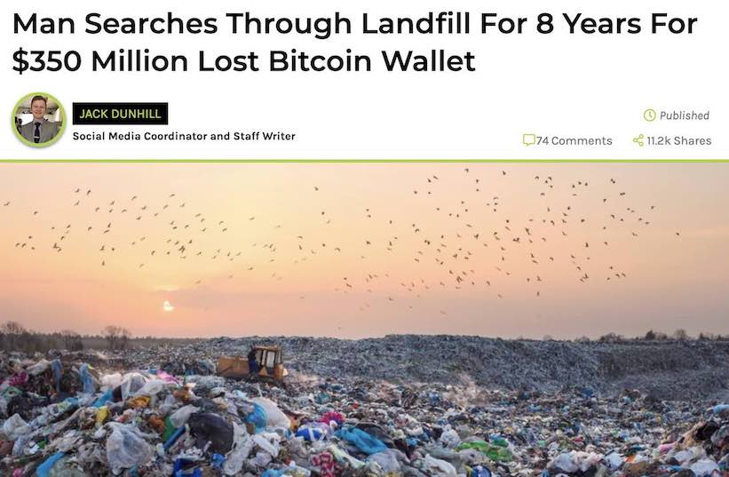
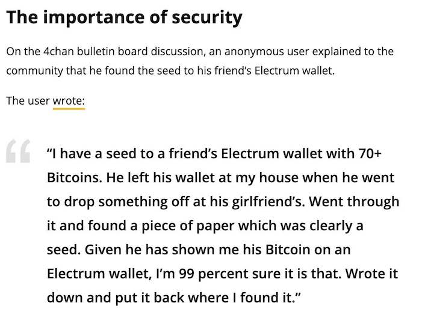
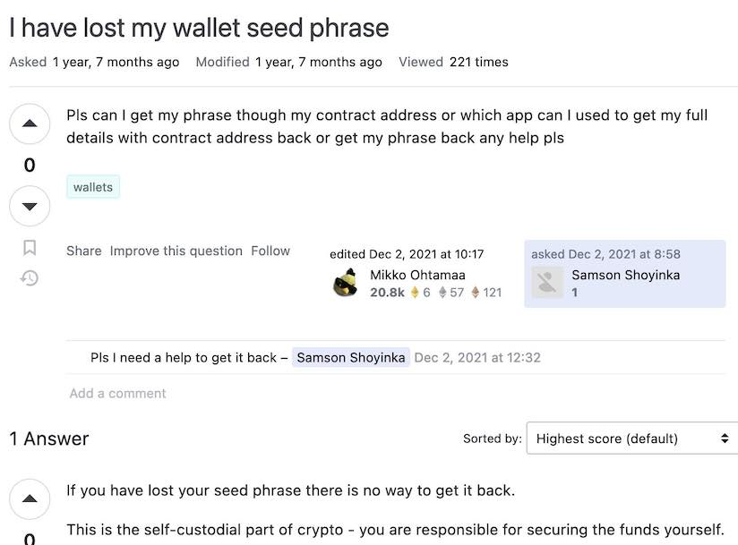
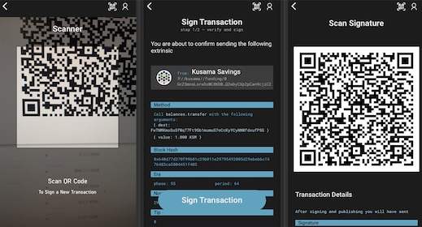

# User Centric Security in Web3 

Notes: 

In this session we will cover the basic of wallet ( private and public pairs of keys ), key management ( how to protect your public-private keys), how to protect the endpoint you are using to manage your keys, and some tips, tricks and security best practices and logics.

In the end, we will give you some advice in case you are compromised.

The objective of the session is to provide a set of guidelines and mental models to questions the operational security of your keys. Some of you might find these advices basic, while others will find it useful. Some of the ideas are just abstractions of more complex technical concepts, as we would like to approach it in a high level educational piece. But also give the opportunity to dig into the rabbit holes for those who may want to follow Alice in that direction. 

---

**"Security is a process, not a product"** 

_Bruce Scheiner (Click here to kill everybody, 2019)_

Notes:

Security is not something that is set in stone, it some that is in changing from - it is framework/it is mental model that helps you to tackle the specific problem of protecting your assets. Security is something that is different for everyone, for every moment or usecases. 

---

### Outline

<!--
You can reference slides within this presentation like [this other slide](#at-the-end-of-this-lecture-you-will-be-able-to) by use of the header title.

Please make your lecture precise.

- Limit the main points in a lecture to five or fewer.
- Create effective visuals, analogies, demonstrations, and examples to reinforce the main points.
  {TAs and the Parity design team can assist! Please let us know marking an item here as `TODO`}
- Emphasize your objectives and key points in the beginning, as you get to them, and as a summary at the end.

-->

<pba-flex center>

1. Keys and key management
1. Wallet landscape
1. Sharding and Secret Sharing
1. Best Protecting Practices

</pba-flex>

---

### _At the end of this lecture, you will be able to:_

<pba-flex center>

- Undertand the different types of wallets - and the risks associated with them 
- Get the basic foundation to be able to outline a strategy to protect your private keys.
- Be familiar with the best practices to protect your computer and digital tools

</pba-flex>

---

## Threats or what we need to be worried about

<pba-flex center>

- Vulnerabilities on laptops/phones
- Network vulnerabilties
- Poor self Operational Security

</pba-flex>

Notes:

What is a threat? It is a _potential_ danger that can tresspass security and put your assets are risks. The threats are the events/things/personas in the horizon we need to have an eye on them.

Different security context - have a different security threats. Edward Snownen faces different security threats ( changing geopolitical situations, nation state actors, ...) than a regular random internet user ( script kidding phissing attempt, port scanning, non targeted malware, ...).

---

### Vulnerabily on Laptop - What not to do

---

### Vulnerability on network - What not to do

---

### Poor self Operational Security - What not to do

---

## Risk or what can go wrong - definitions

But, What is a risk?

Notes:

What is a risk? According to Oxford English Dictionary is the *possibility* of loss, injury, or other adverse or welcome circustance; a chance or situation of situation of something bad happening. But that is what _bad_ means in security terms?

---

## Let's visit the C I A triad

* Confidenciality - keep information private.
* Avaliability - have information accessible when you need it.
* Integrity - keep information as you have note it down when you stored it.

#### (_you will see this many times_)

---

## Risks or what can go wrong

<pba-flex center>

- Keys compromised - Loss of confidenciality

- Keys lost - Loss of avalability/integrity

</pba-flex>

Notes:

In this case, which risks ( things that can go wrong ) we need to be aware? That someone else has access to our keys? Then they are compromised. Or that we cannot access back our keys becuase we cannot access them or they are noted/stored wrongly. By our fault or others fault.

But - what are these keys?

---

## Keys compromised - Bad risk management

---

## Keys lost - Bad risk management

---

### What are the private-public keys ?

( in **Web3** context )

Notes:

Simplifying, Private keys are a type of digital signature that allow you to prove ownership of your tokens on a blockchain network. The public key is used to receive tokens (this is the “address” where tokens are received).

These pairs of keys are generated by a cryptographic process, generating a public and private key.  This key pair has a very particular relationship, the public key can be derived from the private key, but not the other way around ( asimetric encryption). In mathematical lingo it is called a one-way function, as it only works in one direction. Also, another property, using the public key you can verify that a message or a signature has been created by the associated private key without disclosing the private key itself. The public key is meant to be shared, the private key is meant to be kept, as its name states, private.

---

## And the seeds?

The seed is a list of random words that is generated when you create a new “wallet” (a pair of cryptographic keys). 
With the seed, you can generate a private and public key. This could mean a seed phrase is the mnemonic human readable version of a private key.

---

It is easier to note down this

"caution juice atom organ advance problem want pledge someone senior holiday very

than the following private key. 

0x056a6a4e203766ffbea3146967ef25e9daf677b14dc6f6ed8919b1983c9bebbc

---

## Key management

A key is protected by

<pba-flex center>

* Strong math
* Lenght
* **Handling of the key (key management) by humans or machines**

</pba-flex>

Notes:

We have determined that this keys are important for the user to operate on the blockchain. But how secure they are? They are protected by strong math ( the encryption algorithms that they confer their particular asimetric properties ). They are long, so any adversary will need to take longer to(if) calculate the original private key with a longer key than when a shorter key ( is just a cases of attempts, cpu speed and probabilistic). And the most important - and most of the time the weakest: how we handle these keys.

---

## Key management risks - again 

<pba-flex center>

- Loss of confidenciality - your key is leaked or compromised - i.e: someone else has access to the wallet. 
- Loss of availability - you cannot access your key anymore - i.e: you don't know where you noted.
- Loss of integrity - your key is wrong - i.e: you noted the key incorrectly.

</pba-flex>

Notes:

When handling the keys, what we need are the 3 key points we mentioned earlier. The private key stays in secret ( don't leaked in ther internet, don't be part of a screenshot uploaded to a cloud service, ...). That they key is available - you can access to it when you need it - the hard disk where you have it noted is wrong, And that the key you stored is correct: That you noted it well, in these cases a "3 cannot be an 8, a 4 cannot be a 9", or we cannot forget to select the last chracter when copy and paste.

---

## Quick and dirty definitions on public/private keys

* The public key is used to receive tokens - and by definition is **public**

* The private key is used to sign transactions - and should stay **private**

* The seed is used to calculate the private key - and should stay **private**.

---

### Multisig accounts
    

A multisig is composed of one or more addresses and a threshold. The threshold defines how many signatories (participating addresses) need to agree on submitting an extrinsic for the call to be successful. This is particularly interesting when protecting tokens (funds) or opinions ( on chain voting).

Notes: 

These address can be distributed among different individuals - even in different locations - so a transaction is only validated when the minimum required of signatures are achieved. This way the individuals-parties need to agree on signing a particular transactionl. This is a common way to protect corporate funds or big amount of tokens - and not to rely in one individual or single point of failure.

Another method - for protecting individual funds, is that one individiual is keeping different wallets of a multisig account. This way, if one of the wallets is exposed, compromise or lost. The individual can still operate with this wallet ( and most recommened, migrate the tokens to another multi-sig wallet where they have control over all the addresses).
---

## What is a wallet

A wallet holds a pair of cryptograhpic keys (public and private).

Notes:

A wallet is a software application that stores your private keys and allows you to receive tokens through a public key. As the wallet contains the keys in order to operate with the tokens, a keychain could be a better metaphor.

---

## Wallets

Hot n Cold

Notes:

We have been talking about keys, and in the blockspace there is a great differenciantion between to what are your keys exposed. Hot/Cold is a metaphore of the amount of risk we want to expose our private keys.

---

## Hot wallets

<pba-flex center>

1. Heavy clients - full nodes (deprecated use as wallet)
1. Light clients

</pba-flex>

Notes:

Heavy client  - 

Light client - A light client or light node is a piece of software that connects to full nodes to interact with the blockchain. Unlike their full node counterparts, light nodes don’t need to run 24/7 or read and write a lot of information on the blockchain. In fact, light clients do not interact directly with the blockchain; they instead use full nodes as intermediaries. This is the todays standard for hot wallets. 

---

## Everything connected to the internet is at bigger risk

The listening post (2005) - Exhibited in the British Museum

---

## Cold wallets

<pba-flex center>

1. Full node offline (_old school_)
1. Paper wallet (beware fo the change address!)
1. (Hybrid?) Hardware wallet
1. Offline seed backup
1. EXTRA BALL: Polkadot Vault

</pba-flex>

Notes:

On the other hand, the cold wallets are not connected to the internet, they are air-gapped from the network, substantially reducing all risks that might come from there. These wallet concepts are more suitable for long term storage, or wallets that don't need constant operation.

Heavy client offline  - is a the full implementation of a node. It is possible to use a "full" node in order to create a priv/public key pair. The client is disconnected from the internet - not even synced with the chain -, but is able to receive transactions. In order to operate with received tokens, we just need to connect the node to the net, and allow it syncing. Due to progressive weight ( in Gigabytes ) of the chains, this method is deprecated.

Paper Wallet - A paper wallet is a paper document that contains your seed or private key and the public key. It would need to be accessed and copied to compromise your private keys, but at the same time the paper needs to be properly stored and/or backed up. As being a totally analog format, they are immune to digital attacks but subject to events on the physical world.

Depending on the chain there are some offline tools that allows you generate derived private or public keys while being offline. 

Ideally they are printed using an offline ( ideally a dedicated clean airgapped computer for this purpose) and local printer.

A paper wallet cannot be used to transfer fund from the same address various times, it generates a change address that might not be in possession of the sender. It is possible to set the outputs of the transaction, but technical knowledge is required for this configuration.

Hardware wallets - There are several commercial projects that offer a reasonable level of protection when protecting your tokens. These are - usually - hardware devices that allow you to create a seed - for the whole device, and the rest of private keys ( usually kept in the device ) and public keys ( to receive tokens ).

In most of the systems, the device includes some other manual controls that need to be physically manipulated in order to, for example, validate a transaction. The need to the physical interaction for this restricts the operation of the hardware wallet - as the rules of the objects of the physical world, to a certain place in a certain time.

---

## Polkadot Vault

Polkadot Vault is a software app that transforms an Android or iOS device in an airgapped hardware wallet. The wallet is not connected to the net or even to the device which is interacting with the blockchain. The signing of the transactions is made by a series of QR communications between computer and the Vault Device.

Notes:

Some hardware wallets are completely air-gapped - like Vault, software installed in a android or iOS device in Airplane mode - 

Other hardware wallets require connection between the computer/phone and the hardware wallet. This connection can be via a cabled connection ( recommended ) or wireless connection ( not recommended, as we would like not to radiate - even in an encrypted form - anything related to these blockchain operations ).

---

## Sharding ( or divide and not be conquered)

Sharding is a technique to divide your secret in diferent parts, so an adversary could not have access to the full secret in case one of the pieces is compromised. 

Notes:

Traditional methods for encryption are ill-suited for simultaneously achieving high levels of confidentiality and reliability. This is because when storing the encryption key, one must choose between keeping a single copy of the key in one location for maximum secrecy, or keeping multiple copies of the key in different locations for greater reliability. Increasing reliability of the key by storing multiple copies lowers confidentiality by creating additional attack vectors; there are more opportunities for a copy to fall into the wrong hands.

---

### Sharding challenges:

* Recovery
* Fault tolerance - storage/persons
* Still secret?

Notes:

How to divide the secret in a way that is recoverable correctly, how to make it fault tolerant ( as now they are many pieces to take care of, do we need to protect them all to ensure recovery, can I trust all people to keep their part secret all time?), how to make sure that with one of the pieces of the secret, the rest cannot be infered.

---

### Secret Sharing Technique

Is a method to distribute a secret in different parts/persons, in a way that no part holds any intelligle information about the secret.
But the secret can be recostructed with a minimum number of shares.

**And remember:**  These secrets are managed by humans - that are driven by motivations. And motivations change.

---

### Requisites for successful secret sharing

* Information should stay secure.  
* Flexible ( n of m pieces required )
* Recoverable

Notes:

We need a technology that will allow us, when we divide our secret:

- That the secret stays confidential, and the different individual shards cannot be used to infer the original secret. Confidentiality
- That the recovery is flexible, meaning that we would need only n of m pieces of the secret to recover it. This can be because the secrets are no longer available ( are lost), or because we cannot trust the persons we gave the secret piece anymore. Availability.
- That the secret is recoverable with no glitches/errors. Integrity.

---

### How we can achieve this?

**Using strong Math**

---

### Shamir Secret Sharing - Banana Split

Shamir Secret Sharing is an effcient Secret Sharing algorithm for distributing private information.

The secret is mathematically divided into parts (the "shares") from which the secret can be reassembled only when a sufficient number of shares are combined.

There are different implementation of it: we will take a look to Banana Split
Notes:

SSS is used to secure a secret in a distributed form, most often to secure encryption keys. The secret is split into multiple shares, which individually do not give any information about the secret.

To reconstruct a secret secured by SSS, a number of shares is needed, called the threshold. No information about the secret can be gained from any number of shares below the threshold (a property called perfect secrecy). 

It was invented in the late 70;s by the isreali cryptographer. He is the S on the RSA algorithm (Rivest-Shamir-Adleman)

---

### Banana Split - bs.parity.io

* Offline HTML file used to generate and recover secrets
* To be used in airgarpped computers and local printers
* Uses QR codes to store information and cameras to retrieve
* It is flexible allowing n:m type of shared secret creation

---

### Key protection Operational Security Logics

* Security is contextual
* Define your risk apetite
* Backups not only of information also for processes - do not rely on single point of failure.
* Don't put all your eggs in the same basket

Notes:

---

### Some mental exercises (1)

What is the operational model to a wallet that is tranfering funds to third parties every day?

---

### Some mental exercises (2)

How to protect a personal wallet with 10 million tokens?

---

### Some mental exercises (3)

How to protect an corporate wallet with 100 million tokens?

---

### Some mental exercises (4)

How to ensure C I A of a wallet, in a future when we would not be around?

---

### Last but not least - Basic laptop/phone hygiene

* Software up-to-date
* Use of different profiles or even different computers
* Avoid malicious enviroments (links containing malware)
* Double-triple check the software we download for the internet
* Second factor of authentication where possible - physical key prefered

---

## Conclusion

---

### Never Assume - Practice a legitimate distrust.

* Many actors or institutions have different objetives of the one you have. 
* Software have bugs and errors. They are made by people like you and me, which needs to eat and go to sleep.
* No technology is agnostic. This includes they technology we communicate with, we work with or the one we use to keep us entertained.
* Sometimes we are our worst adversary. Be diligent.

---

## Thank you!

### Questions ?

<!--
Compile an **annotated** list of URLs to source material referenced in making these lessons.
Ideally this is exhaustive, it can be cleaned up before delivery to students, but must include _why_ a reference is used.
For example:

- [ss58-registry](https://github.com/paritytech/ss58-registry) - A list of known SS58 account types as an enum, typically used by the Polkadot, Kusama or Substrate ecosystems.
- [wiki on parathreads](https://wiki.polkadot.network/docs/learn-parathreads) - A description of the parathread model.
-->
