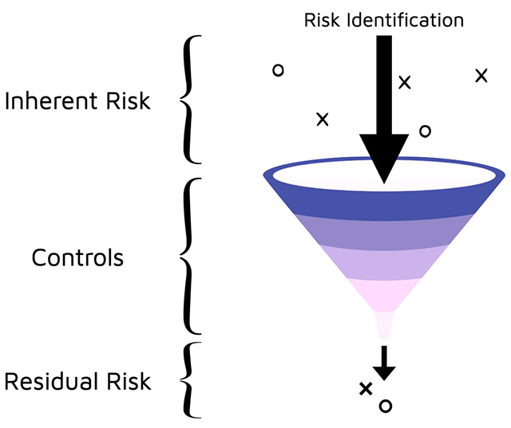
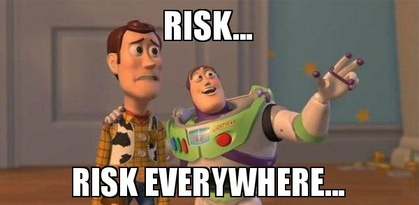
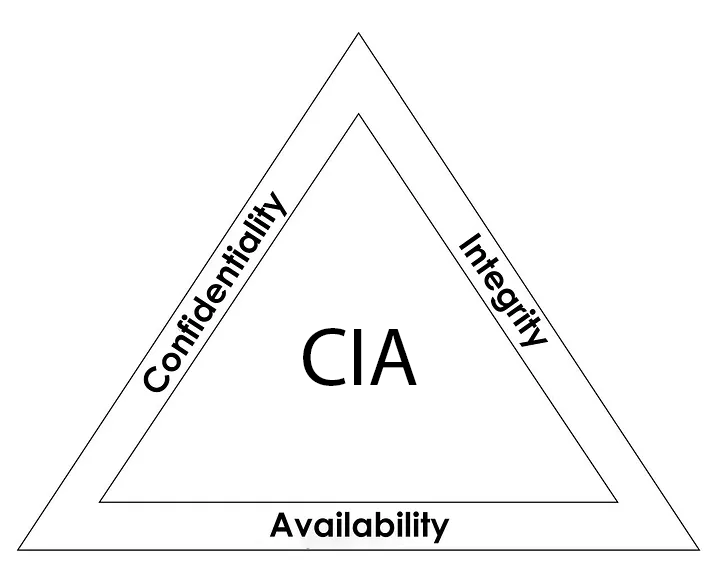
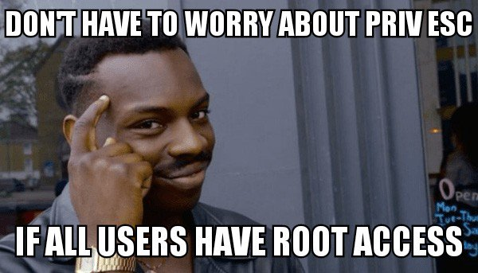
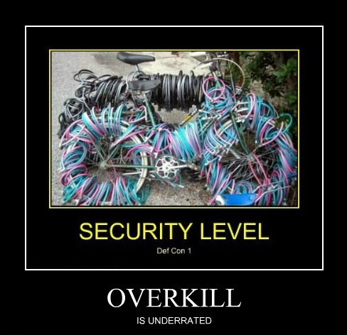
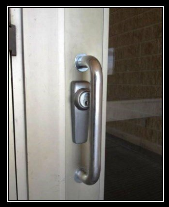
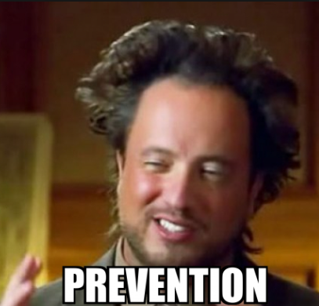
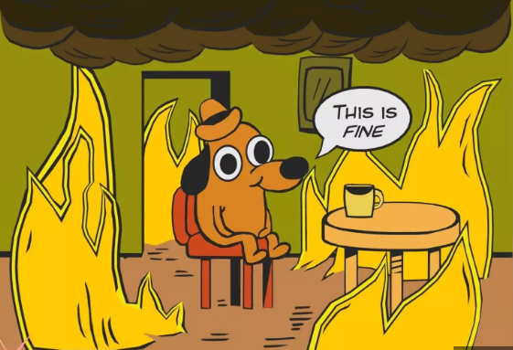
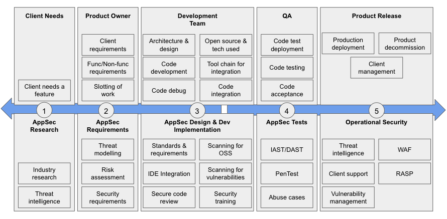

Security is a matter of balance, not too much, not less. Only **adequate security**.

---

Security is about your **residual risks**, not what you have prevented.

---

# Application Security

---

### Index

<pba-flex center>

1. #### Securing SDLC
    * The Big Picture of AppSec
    * Components of AppSec
    * Shifting Left
2. #### Known Attack Surfaces & Vectors
    * Known Rust Vulnerabilities
    * Known Substrate Vulnerabilities
    * Known ink! Vulnerabilities

</pba-flex>

---

### 1. Securing SDLC

---

### The Big Picture of AppSec 

We will visit this picture multiple times.

---

### Security needs to be enforced through the use of controls. Controls must be:

<pba-flex center>

* Designed
* Developed
* Implemented
* Configured
* Operated
* Monitored
* Improved

</pba-flex>     

---

### How do we decide on Controls?

The likelihood of a threat exploiting a vulnerability and thereby causing damage to an asset.

---

### In case you have yet to hear of the CIA Triad

---

* **Confidentiality:** Ensure that only authorised people can access their authorised entities.
* **Integrity:** Ensure that only authorised changes are made by authorised entities.
* **Availability:** Ensure that the data will always be available when it is required.

---

### The AAA + NR
(The 4 "F*ck")

* **Authentication:** Who the f8ck you are
* **Authorization:** What the f8ck you allowed to do
* **Accountability:** Who the f8ck is responsible
* **Non-Repudiation:** Can't f8cking deny

---

## A brief look at design principles

---

## Good enough security
Don’t spend $10.000 on a safe to protect a $20 bill

---

## Least Privilege
Don't give your safe's key to everybody, give only what they need

---

## Separation of Duties
Don't give the power of creating invoices, approving invoices and sending money to one person

---

## Defense in Depth
A castle has a moat, thick walls, restricted access points, high points for defence, multiple checkpoints inside etc.; what do you have?

---

## Fail-Safe
Any function that is not specifically authorised is denied by default

---

### Economy of Mechanism
Security is already a complex topic, don’t make it more complicated (KISS)

---

### Complete Mediation
Every critical operation must have verification at every time.

---

### Open Design
Don't even try: Security over obscurity

---

### Least Common Mechanism
is like the rarest key that opens specific locks, not used often but still can cause significant damage when it does.

---

### Psychological Acceptability
There is no point if users cannot use your security controls seamlessly.

---

### Weakest Link
A chain is only as strong as its weakest link (Booooo)

---

### Leverage Existing Components
Fewer components, fewer attack surface, but more;

---

### Single Point of Failure
If SPoF fails, means the entire system fails

---

## Securing a software is very simple(!)

---

<pba-flex center>

* **Identify Attack Surfaces**
What potential surfaces do you have?
* **Identify Attack Vectors**
What potential vectors do you have?
* **Allocate Security Controls**
Risk based approach + Security Controls 

</pba-flex>

---

## Security Controls are easy-peasy(!)

---

### Security controls can be;
* **Directive (Safeguard \[Proactive\] - means before the incident)**
    * The policy is an example. This is what you are allowed to do, or you are not allowed to do

---

### Security controls can be;
* **Deterrent (Safeguard \[Proactive\] - means before the incident)**
    * Discourage somebody from doing something wrong. For ex. watching people with a security camera. Once they know they are under observation, they will hesitate.

---

Deterrent

---

### Security controls can be;
* **Preventive (Safeguard \[Proactive\] - means before the incident)**
    * Try to stop a person from doing something wrong. For ex. Password is a preventive control.

---

### Security controls can be;
* **Detective (Countermeasures \[Reactive\] - means in the incident moment or afterwards)**
    * Trying to detect an incident. For ex. logs

---

### Security controls can be;
* **Corrective (Countermeasures \[Reactive\] - means afterwards)**
    * Tries to reestablish control after an incident and correct the immediate problem.

---

### Security controls can be;
* **Restoration/Recovery (Countermeasures \[Reactive\] - means afterwards)**
    * Try to rebuild and get back to normal.

---

### Implementation is tough, sorry

<pba-flex center>

* Secure coding practices
* Seperation of environments
* Proper testing
* Validation and discovery
* Mitigation
* Root cause analysis
* Documentation in every steps

</pba-flex>

---

## Components of AppSec

---

<pba-flex center>

* **Threat Modelling:** Manuel or Automated
* **Security Testing:** SAST, DAST, IAST, SCA, RASP
* **Vuln. Collection & Prioritisation:** Jira, Asana

</pba-flex>

---

There will be blood (**risk**), you need to manage the blood. But how?

---

* **Risk Management but how?**
    * **Risk Avoidance:** This approach mitigates risk by refraining from activities that could negatively impact the organisation.

---

* **Risk Management but how?**
    * **Risk Reduction:** This risk management method aims to limit the losses rather than completely eradicate them. It accepts the risk but works to contain potential losses and prevent their spread.

---

* **Risk Management but how?**
    * **Risk Sharing:** In this case, the risk of potential loss is distributed among a group instead of being borne by an individual.

---

* **Risk Management but how?**
    * **Transferring Risk:** This involves contractually shifting risk to a third party. For instance, insuring against property damage or injury transfers the associated risks from the property owner to the insurance company.

---

* **Risk Management but how?**
    * **Risk Acceptance and Retention:** After applying risk sharing, risk transfer, and risk reduction measures, some risk inevitably remains, as it's virtually impossible to eliminate all risks. This remaining risk is known as residual risk.

---

### Vulnerability Disclosure Program vs Bug Bounty

---

### Shifting Left vs Right

---

## Known Attack Surfaces & Vectors

---

## Known Rust Vulnerabilities 

<pba-flex center>

1. Rust-specific issues
1. Unsafe code
1. Cryptographic errors

</pba-flex>

---

## Known Substrate Vulnerabilities

<pba-flex center>

1. Insufficient testing
1. Centralization vulnerabilities
1. Pallet-specific vulnerabilities

</pba-flex>

---

## Known ink! Vulnerabilities

<pba-flex center>

1. Incorrect access control
1. Denial-of-Service (DoS)
1. Timestamp dependence
1. Outdated version

</pba-flex>

---

**Summary:** Do the damn input validation, good to go!

---

**Question:** How would you defend a castle if there is no castle to defend?

---

Don't forget to check lecture [materials](https://hackmd.io/CIafTaQFRg2wg-YXYVDhvw?view)
