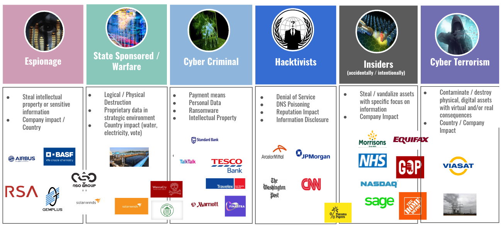
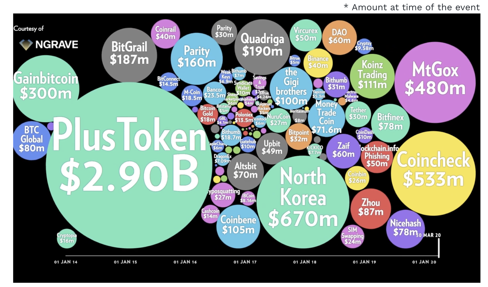
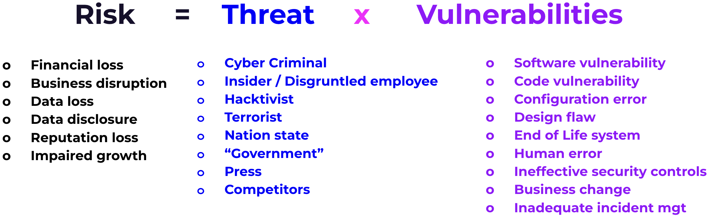
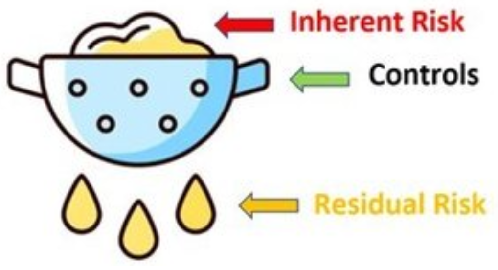
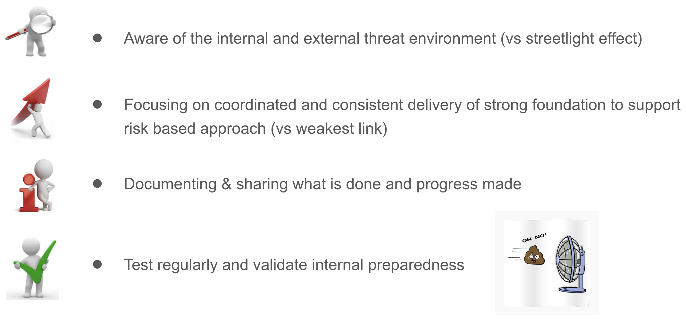

# Cyber Security Overview

- Cyber threat landscape
  - Key threat actors
  - Largest crypto heists / loss
  - Crypto incidents
- Cyber risk management
  - What is it ?
  - Inherent & Residual risk
  - Key steps of an attack
  - Importance of culture
- Cyber and development
  - Development and key focus
  - CI/CD
- Conclusion
- Q&A

---

## CYBER THREAT LANDSCAPE - 6 MAIN ACTORS

- ==> Different actors with different drivers but commonalities on modus operandi

---

## LARGEST CRYPTO LOSS

Notes:
On the crypto ecosystem there have been number of cyber events !
https://medium.com/ngrave/the-history-of-crypto-hacks-top-10-biggest-heists-that-shocked-the-crypto-industry-828a12495e76

## Some were ponzi scheme, most were breaches/exploits

## MORE RECENT CRYPTO INCIDENTS

- ==> Strong cyber control foundation decrease exposure to incidents

Notes:

https://www.forbes.com/sites/ninabambysheva/2022/12/28/over-3-billion-stolen-in-crypto-heists-here-are-the-eight-biggest/?sh=5d411c13699f
https://www.zdnet.com/article/iota-cryptocurrency-shuts-down-entire-network-after-wallet-hack/
https://news.bitcoin.com/kucoin-boss-on-strategy-after-hack-we-chose-to-act/
https://halborn.com/explained-the-ronin-hack-march-2022/
https://www.bitdefender.com/blog/hotforsecurity/cryptocurrency-monero-website-h
acked-original-binaries-replaced
https://www.coindesk.com/markets/2020/02/10/new-crypto-exchange-altsbit-says-it-will-close-following-hack/
https://peckshield.medium.com/akropolis-incident-root-cause-analysis-c11ee59e05d4
https://www.coindesk.com/markets/2020/12/21/bitgrail-operator-may-have-hacked-own-exchange-to-steal-120m-police-allege/
https://coinmarketcap.com/alexandria/article/bitgrail-hack-one-of-the-largest-crypto-hacks-in-history
https://www.coindesk.com/tech/2020/04/08/hacker-exploits-flaw-in-decentralized-bitcoin-exchange-bisq-to-steal-250k/
https://www.coindesk.com/policy/2021/02/20/cryptopia-exchange-currently-in-liquidation-gets-hacked-again-report/
https://bravenewcoin.com/insights/cryptopia-exchange-liquidator-releases-third-report
https://elementus.io/blog/cryptopia-hack-transparency/
https://blog.merklescience.com/hacktrack/hack-track-eterbase-cryptocurrency-exchange
https://www.reuters.com/investigates/special-report/fintech-crypto-binance-dirtymoney/

---

## INFOSEC & CYBER RISK - Taxonomy

Notes:

When a threat is leveraging a vulnerability, the consequence is a risk.
Usually Threats cannot be influenced, when vulnerabilities can be.
Both Threats and Vulnerabilities are evolving over time based on multiple factors, so the importance of deploying controls to identify, prevent, detect and respond & recover against them (NIST)

---

## TAXONOMY - Threats Examples

- Cyber Criminal : In the last 12 months, cyber criminal activity +200%
- Insider / Disgruntled employee : lot of evolution on resources
- Hacktivist : Crypto projects and Web3 have some detractors
- Terrorist : they are increasingly using cyber as a weapon
- Nation state : Geopolitical evolution with China, North Korean, Russia/Ukraine
- "Government" : There is lot of regulatory scrutiny on crypto area
- Media : Web3 & Cryptocurrency evolutions are regularly in the Media
- Competitors : Polkadot approach is a game changer

---

## WHAT IS CYBER RISK MANAGEMENT (1/2)

---

## WHAT IS CYBER RISK MANAGEMENT (2/2)

## 

## INHERENT AND RESIDUAL RISK

- ==> Having visibility of inherent risk facilitates a common view on area of focus and priorities

Notes:

- It is foundational to identify inherent risk. Including in partnership with asset owner. Especially from an impact perspective

- Controls are key to :
  - Reduce likelihood of initial compromise
  - Limit the impact of compromise once a foothold has been established

And to enhance ability to detect compromise asap

Starting from the inherent risk is foundational as the threat landscape will evolve including the effectiveness of the control

---

## ATTACK KILL CHAIN

Notes:
Usually an attacker is not attacking directly the target but :

1. Collect information leveraging the digital footprint available (linkedin profile, dns records, website, repositories, 3rd parties, anything publicly available)
2. Use information available and vulnerabilities to create a “weapon” to prepare an attack
3. Deliver the “weapon” via available channels : email (prof./person.), usb, WhatsApp/Signal/Telegram, webpage (legit or squatting), code update, etc
4. Use the “weapon” delivered on the victim’s system to execute code
5. Get a foothold on the target
6. Move laterally smoothly to reach the target objective including staying hidden for a period of time
7. Execute final objective : ransom, denial or service, data exfiltration, corruption, fund stealing

---

## IMPORTANCE OF CULTURE

---

## INFOSEC & CYBER RISK - EMBEDDED

Security embedded and partnering at each steps with key success factors:

- Upfront threat modeling
- Peers code review
- Code scanning
- Independent security code review
- Pentest
- Secret management
- Supply chain management
- Monitoring
- Playbooks

---

## INFOSEC & CYBER RISK - CICD

This is a continuous process, at each steps

---

## CONCLUSION

---

## NEXT PRACTICAL SESSIONS

- Security Awareness (40/50mn) :
  Context and adversaries, Attack Surface and Social Engineering
- User Centric Security in Web3 (40/50mn) :
  Wallet landscape, Key management and User device protection
- Infrastructure Security (40/50mn) :
  Concentration, deplatforming, supply chain risks, Key management on the nodes and Passwords management for Infrastructure
- Application Security (60mn) :
  Securing SDLC, Components of AppSec and Known Attack Surfaces & Vectors

---

##

---

##

---

## APPENDIX - STREETLIGHT EFFECT

