# Summary of Cryptography

<pba-flex center>

- Introduction<!-- .element: class="fragment" data-fragment-index="0" -->
- Hashes<!-- .element: class="fragment" data-fragment-index="1" -->
- Encryption<!-- .element: class="fragment" data-fragment-index="2" -->
- Signatures<!-- .element: class="fragment" data-fragment-index="3" -->
- Verifiable Random Functions (VRFs)<!-- .element: class="fragment" data-fragment-index="4" -->
- Erasure coding<!-- .element: class="fragment" data-fragment-index="5" -->
- Shamir Secret Sharing<!-- .element: class="fragment" data-fragment-index="6" -->

</pba-flex>

---

# Introduction

---

## Some Useful Equations

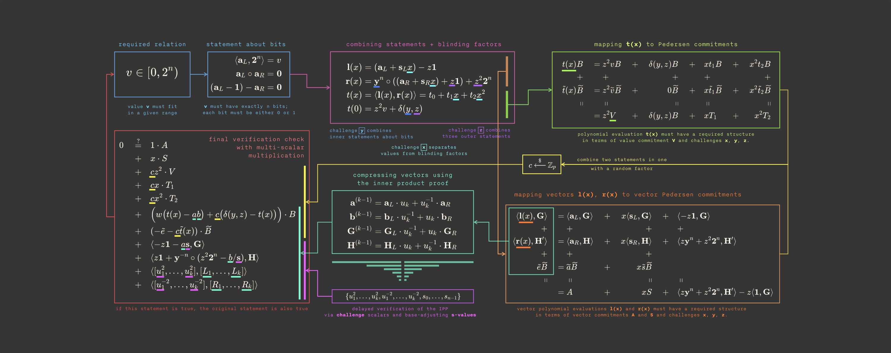

Notes:

Just kidding!

---

## Goals for this lesson

<pba-flex center>

- Understand the goals of cryptography<!-- .element: class="fragment" data-fragment-index="0" -->
- Understand security guarantees for resources<!-- .element: class="fragment" data-fragment-index="1" -->
- Learn the primitives<!-- .element: class="fragment" data-fragment-index="2" -->

</pba-flex>

---

## Cryptography Landscape

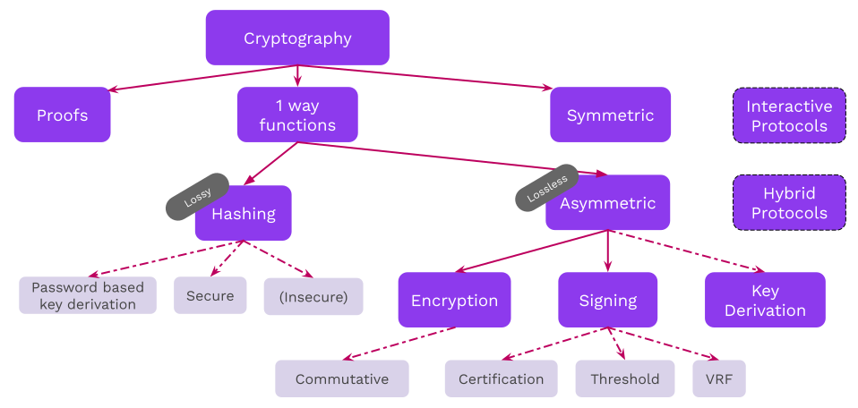

Notes:

What is covered in this course is all connected subjects.
We will not cover any details for hybrid or interactive protocols in the course.

---

## Operating Context

##### _Protocols use resources and cryptography ensures that they provide security guarantees_

- **Network, storage, computation, etc.**: We want to specify guarantees on what the resources provide.

<pba-flex center>

- Stored/transmitted data is untampered,<!-- .element: class="fragment" data-fragment-index="1" -->
- Transmitted data comes from a specific sender,<!-- .element: class="fragment" data-fragment-index="2" -->
- A computation over data has been performed correctly,<!-- .element: class="fragment" data-fragment-index="3" -->
- Sensitive data does not get leaked,<!-- .element: class="fragment" data-fragment-index="4" -->
- and many more...<!-- .element: class="fragment" data-fragment-index="5" -->

</pba-flex>

---

## Operating Context: Example

##### _The internet is a public space_

We communicate over public channels.
Adversaries may want to:

<pba-flex center>

- Read messages not intended for them<!-- .element: class="fragment" data-fragment-index="0" -->
- Impersonate others<!-- .element: class="fragment" data-fragment-index="1" -->
- Tamper with messages<!-- .element: class="fragment" data-fragment-index="2" -->

</pba-flex>

Notes:

Use e-mail as an example of an flawed system.

Some examples include:

- An attacker may impersonate your boss, trying to get you to send them money<!-- .element: class="fragment" data-fragment-index="0" -->
- An attacker may change a message sent over a network, e.g. an instruction to transfer 100 EUR to 10000 EUR<!-- .element: class="fragment" data-fragment-index="1" -->

Probably best for the teacher to ask students to participate with examples of application messages,
not just person-to-person messages.

---

## Public vs. Private Systems

_Cryptography based on public systems is more sound_

**Kerckhoff's Principle:** Security should not rely on secret _methods_,<br/>but rather on secret _information_

Notes:

There is no such thing as a "closed channel" :)

- Methods can be reverse engineered.
  After that, the communication channel is completely insecure.
  For example, CSS protection for DVDs.
- We always work with public, open protocols.

---

## Security Guarantees\*

<pba-flex center>

- Data confidentiality<!-- .element: class="fragment" data-fragm ent-index="0" -->
- Data authenticity<!-- .element: class="fragment" data-fragm ent-index="1" -->
- Data integrity<!-- .element: class="fragment" data-fragm ent-index="2" -->
- Non-repudiation<!-- .element: class="fragment" data-fragm ent-index="3" -->
- Data availability<!-- .element: class="fragment" data-fragm ent-index="4" -->
- Data verifiability<!-- .element: class="fragment" data-fragm ent-index="5" -->
- ...<!-- .element: class="fragment" data-fragm ent-index="6" -->
  </pba-flex>

Notes:

Cryptography is one of the (most important) tools we have to build tools that are _guaranteed_ to work correctly.
This is regardless of who (human, machine, or otherwise) is using them and their intentions (good or bad).

Why an asterisk?
There generally are no perfect & absolute guarantees here, but for most practical purposes the bounds on where these fail are good enough to serve our needs as engineers and users.
Do note the assumptions and monitor their validity over time (like quantum tech).

---

## Data Confidentiality

A party may gain access to information<br/>if and only if they know some secret (a key).

<br/>

Confidentiality ensures that a third party cannot read my confidential data.

Notes:

The ability to decrypt some data and reveal its underlying information directly implies knowledge of some secret, potentially unknown to the originator of the information.
Supplying the original information (aka plain text message) can be used in a "challenge game" mechanism as one means of proving knowledge of the secret without compromising it.

Mention use of the term "plaintext".

Allegory: A private document stored on server where sysadmin has _access_ can be subpoenaed, violating assumed Attorney-Client Privilege on the document.

---v

<!-- This slide should potentially be pushed into the lecture on encryption. I can see it in either spot. Alternately, could be cut entirely, as encrypted communication is not an emphasized topic. -->

## Confidentiality in Communication Channels

Suppose Alice and Bob are sending confidential messages back and forth. There are some subtypes of confidentiality here:

- **Forward Secrecy**: Even if an adversary temporarily learns Alice's secret, it cannot read future messages after some point.
- **Backwards Secrecy**: Even if an adversary temporarily learns Alice's secret, it cannot read past messages beyond some previous point.

---

## Data Authenticity

Users can have the **credible** expectation that the stated origin of a message is authentic.

<br/>

Authenticity ensures that a third party cannot pretend I created some data.<!-- .element: class="fragment" data-fragm ent-index="1" -->

Notes:

- Digital signatures should be difficult (practically speaking: impossible) to forge.
- Digital signatures should verify that the signer knows some secret, without revealing the secret itself.

---

## Data Integrity

If data is tampered with, it is detectable. In other words, it possible to check if the current state of some data is the consistent with when it was created.

<br/>

Integrity ensures that if data I create is corrupted, it can be detected.<!-- .element: class="fragment" data-fragm ent-index="1" -->
---v

## Physical Signatures

Physical signatures provide weak authenticity guarantees<br/>(i.e. they are quite easy to forge), and no integrity guarantees.

---v

## An Ideal Signature


Notes:

For example, if you change the year on your university diploma, the dean's signature is still valid.
Digital signatures provide a guarantee that the signed information has not been tampered with.

---

## Non-repudiation

The sender of a message cannot deny that they sent it.

<br/>

Non-repudiation ensures if Bob sends me some data, I can prove to a third party that they sent it.<!-- .element: class="fragment" data-fragm ent-index="1" -->

---

## Data availability

Not always considered a cryptographic guarantee, but in many contexts we would like that data is available to people when they want to access it.

Notes:

Cryptography alone cannot make strong guarantees that data is available to people when they want to access it.

There are many schemes to get around this, and this topic will come up later in the course.
We will touch on erasure coding, which makes data availability more efficient.

---

## Data Verifiability

In some contexts we want to show that (possibly sensitive) data satisfies certain properties.

Notes:

Proving without showing --> we will see that zero-knowledge proofs will allow us to show that a data satisfies certain properties. For example, that I know the key that corresponds to the ciphertext data that I have sent you. Or that the data I have sent you is indeed the correct result of a computation.

---

## One-Way Functions

One-way functions form the basis of cryptographic primitives. A function $f$ is one way if:

- it is reasonably fast to compute<!-- .element: class="fragment" data-fragm ent-index="1" -->
- it is very, very slow to undo<!-- .element: class="fragment" data-fragm ent-index="2" -->

Notes:

There are a lot of assumptions about why these functions are hard to invert, but we cannot rigorously prove it.
We often express inversion problems in terms of mathematical games or oracles.

---

## Hash Functions

**Motivation:** We often want a succinct, yet unique representation of some (potentially large) data.

</br>

A fingerprint, which is much smaller than a person, yet uniquely identifies an individual.<!-- .element: class="fragment" data-fragm ent-index="1" -->

Notes:

The following slides serve as an intro.
Many terms may be glossed over, and covered in detail later.
There are lessons later in this module dedicated to hashes and hash-based data structures.

---

## Hash Function Applications

Hashes can be useful for many applications:

<pba-flex center>

- Representation of larger data object<br/>(history, commitment, file)<!-- .element: class="fragment" data-fragm ent-index="0" -->
- Keys in a database<!-- .element: class="fragment" data-fragm ent-index="1" -->
- Digital signatures<!-- .element: class="fragment" data-fragm ent-index="2" -->
- Key derivation<!-- .element: class="fragment" data-fragm ent-index="3" -->
- Pseudorandom functions<!-- .element: class="fragment" data-fragm ent-index="4" -->

</pba-flex>


---

## Hash Function Properties

- Accept unbounded size input <!-- .element: class="fragment" data-fragment-index="0" -->
- Map to a bounded output <!-- .element: class="fragment" data-fragment-index="1" -->
- Be fast to compute <!-- .element: class="fragment" data-fragment-index="2" -->
- Resist pre-image attacks:<br />Given an output, it is hard to compute a pre-image <!-- .element: class="fragment" data-fragment-index="3" -->
- Second pre-image resistance: <br />Given an input (and its hashed output), it is hard to compute another input with the same hash<br /><!-- .element: class="fragment" data-fragment-index="4" -->
- Resist collisions:<br />It is hard to compute two inputs that have the same hash<!-- .element: class="fragment" data-fragment-index="5" -->

Notes:

1.  one way meaning for a given output difficult to get the input
1.  attacker has the value 5 and from that can find a preimage that hashes to 5 (5 just an example value)
1.  attacker has input and output and cant find a another input which maps to the output
1.  More generally the attacker has the entire input space and cant find two inputs which hash to the same value

---

## Hash Function API

A hash function should:

- Accept an unbounded input size (`[u8]` byte array)
- Return a fixed-length output (here, a 32 byte array).

```rust
fn hash(s: &[u8]) -> [u8; 32];
```

---

## Example

**Short input (5 bytes):**

```text
hash('hello') =
 0x1c8aff950685c2ed4bc3174f3472287b56d9517b9c948127319a09a7a36deac8
```

**Large input (1.2 MB):**

```text
hash(Harry_Potter_series_as_string) u
 0xc4d194054f03dc7155ccb080f1e6d8519d9d6a83e916960de973c93231aca8f4
```

---

## Input Sensitivity

Changing even 1 bit of a hash function _completely_ scrambles the output.

```text
hash('hello') =
 0x1c8aff950685c2ed4bc3174f3472287b56d9517b9c948127319a09a7a36deac8
```

```text
hash('hellp') =
 0x7bc9c272894216442e0ad9df694c50b6a0e12f6f4b3d9267904239c63a7a0807
```

---

## Speed

- Some hash functions are designed to be slow. <!-- .element: class="fragment" data-fragment-index="0" -->
- Does anyone know why someone would want a hash function to be slow? <!-- .element: class="fragment" data-fragment-index="1" -->
- These have applications like password hashing, which would slow down brute-force attackers. <!-- .element: class="fragment" data-fragment-index="2" -->
- For our purposes, we generally want them to be fast. <!-- .element: class="fragment" data-fragment-index="3" -->

---

## Famous Hash Algorithms

<pba-flex center>

- xxHash a.k.a TwoX (non-cryptographic)
- MD5
- SHA1
- RIPEMD-160
- SHA2-256 (aka SHA256) &c.
- SHA3
- Keccak
- Blake2

xxHash64 is about 20x faster than Blake2.

</pba-flex>

---

## Hash Functions in Blockchains

<pba-flex center>

- Bitcoin: SHA2-256 & RIPMD-160
- Ethereum: Keccak-256 (though others supported via EVM)
- Polkadot: Blake2 & xxHash (though others supported via host functions)

</pba-flex>

Notes:

Substrate also implements traits that provide 160, 256, and 512 bit outputs for each hasher.

Exercise: Write your own benchmarking script that compares the performance of these algorithms with various input sizes.

---

### Hashing Benchmarks


Notes:

Benchmarks for the _cryptographic_ hashing algorithms.
Source: <https://www.blake2.net/>

---

#### XXHash - _Fast_ hashing algorithm


Notes:

Benchmarks for the XX-hash algorithms.
Source: <https://github.com/Cyan4973/xxHash#benchmarks>

---

## Non-Cryptographic Hash Functions

Non-cryptographic hash functions provide weaker<br />guarantees in exchange for performance.

They are OK to use when you know that the input is not malicious.

**If in doubt, use a cryptographic hash function.**

---

## One Way

Given a hash, it should be difficult to find an input value (pre-image)<br />that would produce the given hash.

That is, given `H(x)`, it should be difficult to find `x`.

Notes:

We sometimes add random bytes to pre-images to prevent guesses based on context (e.g., if you are hashing "rock, paper, scissors", then finding a pre-image is trivial without some added randomness.)

---

## Second Pre-Image Attacks

Given a hash and a pre-image, it should be difficult to find _another_<br />pre-image that would produce the same hash.

Given `H(x)`, it should be difficult to find any `x'`

such that `H(x) == H(x')`.

Notes:

Since most signature schemes perform some internal hashing, this second pre-image would also pass signature verification.

---

## Collision Resistance

It should be difficult for someone to find two messages that<br />hash to the same value.

It should be difficult to find an `x` and `y`

such that `H(x) == H(y)`.

---

## Collision Resistance

**Difference from second pre-image attack:**

In a second pre-image attack, the attacker only controls one input.

In a collision, the attacker controls both inputs.

Notes:

Attacker has intention to impersonate the signer with the other. Generally speaking, even finding a
single hash collision often results in the hash function being considered unsafe.

---

## Birthday Problem

<pba-cols>
<pba-col style="font-size:smaller">

> With 23 people, there is a 6% chance that someone will be born on a specific date, but a 50% chance that two share a birthday.

- Must compare each birthday with every other, not with a single one.<br /> <!-- .element: class="fragment" data-fragment-index="0" -->
- Number of possible "hits" increases exponentially for more attempts, reducing the expected success to the square-root of what a specific target would be. <!-- .element: class="fragment" data-fragment-index="1" -->

</pba-col>
<pba-col>


</pba-col>
</pba-cols>

---

## Birthday Attack

Thus, with a birthday attack, it is possible to find a collision of a hash function in $\sqrt {2^{n}}=2^{^{\frac{n}{2}}}$, with $\cdot 2^{^{\frac{n}{2}}}$ being the classical preimage resistance security.

So, hash function security is only half of the bit space.

Notes:

e.g., a 256 bit hash output yields 2^128 security

- <https://en.wikipedia.org/wiki/Birthday_attack>

- <https://en.wikipedia.org/wiki/Birthday_problem>

---

## Partial Resistance

It should be difficult for someone to partially (for a substring of the hash output) find a collision or "second" pre-image.

- Bitcoin PoW is a partial pre-image attack. <!-- .element: class="fragment" data-fragment-index="0" -->
- Can anyone explain how? <!-- .element: class="fragment" data-fragment-index="1" -->

Notes:
This is a technique used to trick users into thinking they are interacting with a trusted entity (like a account or piece of data) when they are actually interacting with a malicious actor. This can be done by creating a fraudulent address that looks similar to a legitimate one.
example AEVXZ AEVYZ

---

## Hash Function Selection

<pba-flex center>

When users (i.e. attackers) have control of the input, cryptographic hash functions must be used.

When input is not controllable (e.g. a system-assigned index), a non-cryptographic hash function can be used and is faster.

Notes:

Only safe when the users cannot select the pre-image, e.g. a system-assigned index.

Keccak is available for Ethereum compatibility.

---

<!-- .slide: data-background-color="#4A2439" -->

# Applications

---

## Cryptographic Guarantees

Let's see which cryptographic properties apply to hashes.

---v

## Confidentiality

- Sending or publicly posting a hash of some data $D$ keeps $D$ confidential, as only those who already knew $D$ recognize $H(D)$ as representing $D$.
- Both cryptographic and non-cryptographic hashes work for this, _only if the input space is large enough_.

---v

## Confidentiality Bad Example

Imagine playing rock, paper, scissors by posting hashes and then revealing. However, if the message is either "rock", "paper", or "scissors", the output will always be either:

```text
hash('rock') = 0x10977e4d68108d418408bc9310b60fc6d0a750c63ccef42cfb0ead23ab73d102
hash('paper') = 0xea923ca2cdda6b54f4fb2bf6a063e5a59a6369ca4c4ae2c4ce02a147b3036a21
hash('scissors') = 0x389a2d4e358d901bfdf22245f32b4b0a401cc16a4b92155a2ee5da98273dad9a
```

The other player doesn't need to undo the hash function to know what you played!

Notes:

Question:
How can we fix this issue?

The data space has to be _sufficiently large_.
Adding some randomness to input of the hash fixes this. Add x bits of randomness to make it x bits of security on that hash.

---v

## Authenticity

Anyone can make a hash, so hashes provide no authenticity guarantees.

---v

## Integrity

A hash changes if the data changes, so it does provide integrity.

---v

## Non-Repudiation

Hashes on their own cannot provide authenticity, and as such cannot provide non-repudiation.

However, if used in another cryptographic primitive that _does_ provide non-repudiation, $H(D)$ provides the same non-repudation as $D$ itself.

Notes:

- The hash alone doesnt give one the ability to authenticate or identify the originator of the data because anyone with access to the data can produce the same hash.

This is key in digital signatures. However, it's important to realize that if $D$ is kept secret, $H(D)$ is basically meaningless.

---

## Content-Derived Indexing

Hash functions can be used to generate deterministic<br />and unique lookup keys for databases.

Notes:

Given some fixed property, like an ID and other metadata the user knows beforehand, they can always find the database entry with all of the content they are looking for.

---

## Data Integrity Checks

Members of a peer-to-peer network may host and share<br />file chunks rather than large files.

In [Bittorrent](https://en.wikipedia.org/wiki/BitTorrent), each file chunk is hash identified so peers can<br /> _request and verify_ the chunk is a member of the larger,<br /> _content addressed_ file.

Notes:

- Content addressed file is when a file is identified based on the content of the file.

- The hash of the large file can also serve as a signal to the protocol that transmission is complete.

---

## Account Abstractions

Public keys can be used to authorize actions by signing of instructions.

The properties of hash functions allow other kinds of representations.

---

## Public Key Representation

Because hashes serve as unique representations of other data,<br />that other data could include public keys.<br />
A system can map a plurality of key sizes to a fixed length<br />(e.g. for use as a database key).

For example, the ECDSA public key is 33 bytes:

```text
Public key (hex):
  0x02d82cdc83a966aaabf660c4496021918466e61455d2bc403c34bde8148b227d7a

Hash of pub key:
  0x8fea32b38ed87b4739378aa48f73ea5d0333b973ee72c5cb7578b143f82cf7e9
                                                                    ^^
```

---

## Commitment Schemes

It is often useful to commit to some information<br /> without storing or revealing it:

- A prediction market would want to reveal predictions only after the confirming/refuting event occurred.<!-- .element: class="fragment" data-fragment-index="0" -->
- Users of a system may want to discuss proposals without storing the proposal on the system.<!-- .element: class="fragment" data-fragment-index="1" -->
- However, participants should not be able to modify their predictions or proposals.<!-- .element: class="fragment" data-fragment-index="2" -->

Notes:
What is an example of an application would use an application like this?

---

## Commit-Reveal

<pba-flex center>

1. Share a hash of data as a commitment ($c$)
1. Reveal the data itself ($d$)

<pba-flex>

It is normal to add some randomness to the message<br />to expand the input set size:

$$ hash(message + randomness) => commitment $$

<pba-flex style="font-size: smaller;">

Commitment: `0x97c9b8d5019e51b227b7a13cd2c753cae2df9d3b435e4122787aff968e666b0b`

---

## Reveal

Message with some added randomness:

<pba-flex style="font-size: smaller;">

> "I predict Boris Johnson will resign on 7 July 2022. facc8d3303c61ec1808f00ba612c680f"

---

## Data Identifiers

Sometimes people want to store information in one place and reference it in another. For reference, they need some "fingerprint" or digest.

As an example, they may vote on executing some privileged instructions within the system.

The hash of the information can succinctly represent the information and commit its creator to not altering it.

---

## Data Structures (in Brief)

---

## Pointer-Based Linked Lists

Pointer-based linked lists are a foundation of programming.

But pointers are independent from the data they reference,<br />so the data can be modified while maintaining the list.

That is, pointer-based linked lists are not tamper evident.


---

## Hash-Based Linked Lists

Hash-based lists make the reference related to the data they are referencing.<br />
The properties of hash functions make them a good choice for this application.

Any change at any point in the list would create downstream changes to all hashes.

---

## Merkle Trees


Notes:

Each leaf is the hash of some data object and each node is the hash of its children.

---

## Proofs

Merkle trees allow many proofs relevant to the rest of this course,<br />e.g. that some data object is a member of the tree<br />without passing the entire tree.

---


## Symmetric Cryptography

<pba-flex center>

- Symmetric cryptography assumes all parties begin with some shared secret information.
- This is a potentially very difficult requirement.<!-- .element: class="fragment" data-fragm ent-index="1" -->
- The shared secret can then be used to protect further communications from others who do not know this secret.<!-- .element: class="fragment" data-fragm ent-index="2" -->
- In essence, it gives a way of "extending" a shared secret over time.<!-- .element: class="fragment" data-fragm ent-index="3" -->

</pba-flex>

Notes:

Remember that these communications are over an _open channel_, as we assumed that all channels can be monitored.

---

## Symmetric Encryption

For example, the Enigma cipher in WW2. A _channel_ was initiated by sharing a secret ("key") between two participants. Using the cipher, those participants could then exchange information securely.

However, since the key contained only limited "entropy" ("information"), enough usage of it eventually compromised the secret and allowed the allies to decode messages. Even altering it once per day was not enough.<!-- .element: class="fragment" data-fragm ent-index="0" -->

Notes:

When communicating over a channel that is protected with only a certain amount of entropy, it is still possible to extend messages basically indefinitely by introducing _new entropy_ that is used to protect the channel sufficiently often.

---

## Symmetric Encryption

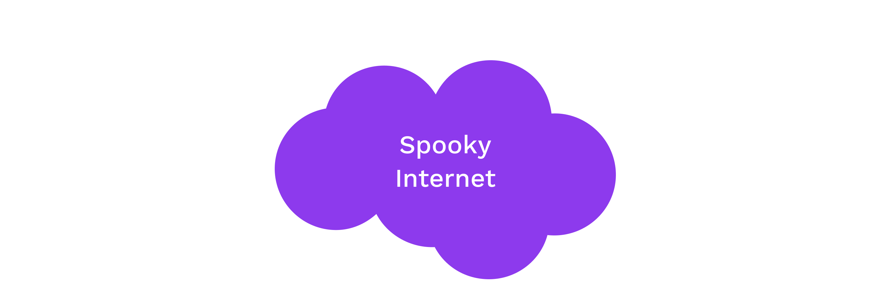

Examples: ChaCha20, Twofish, Serpent, Blowfish, XOR, DES, AES<!-- .element: class="fragment" data-fragment-index="0" -->

---

## Symmetric Encryption API

Symmetric encryption libraries should generally all expose some basic functions:

- `fn generate_key(r) -> k;` <br/> Generate a `k` (secret key) from some input `r`.
- `fn encrypt(k, msg) -> ciphertext;` <br/> Takes `k` and a message; returns the ciphertext.
- `fn decrypt(k, ciphertext) -> msg;` <br/> Takes `k` and a ciphertext; returns the original message.

It always holds that `decrypt(k, encrypt(k, msg)) == msg`.

Notes:

The input `r` is typically a source of randomness, for example the movement pattern of a mouse.

---

## Symmetric Encryption Guarantees

Provides:

- Confidentiality

Does not provide:

- Authenticity
- Integrity
- Non-Repudiation

Notes:

- Authenticity: The message could only be sent by someone who knows the shared secret key. In most cases, this is functionally authentication to the receiving party.
- Integrity: There is no proper integrity check, however the changed section of the message will be gibberish if it has been changed. Detection of gibberish could function as a form of integrity-checking.

---

## Symmetric Encryption

#### _Example: XOR Cipher_

<pba-cols>
<pba-col>

The encryption and decryption functions are identical: applying a bitwise XOR operation with a key.

</pba-col>
<pba-col style="padding-right: 100px">

```text
Plain: 1010  -->Cipher: 0110
Key:   1100  |          1100
       ----  |          ----
       0110--^          1010
```

Notes:

A plaintext can be converted to ciphertext, and vice versa, by applying a bitwise XOR operation with a key known to both parties.

</pba-col>
</pba-cols>

---

## Symmetric Encryption

#### ⚠ Warning ⚠

We typically expect symmetric encryption to preserve little about the original plaintext.
We caution however that constructing these protocols remains delicate, even given secure primitives, with two classical examples being unsalted passwords and the [ECB penguin](https://tonybox.net/posts/ecb-penguin/).

---

### ECB penguin

<pba-cols>
<pba-col>


_Original image_

</pba-col>
<pba-col>


_Encrypted image_

(by blocks)

</pba-col>
<pba-col>


_Encrypted image_

(all at once)

</pba-col>
</pba-cols>

Notes:

The ECB penguin shows what can go wrong when you encrypt a small piece of data, and do this many times with the same key, instead of encrypting data all at once.

Image sources: <https://github.com/robertdavidgraham/ecb-penguin/blob/master/Tux.png> and <https://github.com/robertdavidgraham/ecb-penguin/blob/master/Tux.ecb.png> and <https://upload.wikimedia.org/wikipedia/commons/5/58/Tux_secure.png>


---

## Asymmetric Cryptography

- In asymmetric cryptography, we devise a means to transform one value (the "secret") into some corresponding counterpart (the "public" key), preserving certain properties.
- We believe that this is a one-way function (that there is no easy/fast inverse of this function).<!-- .element: class="fragment" data-fragm ent-index="1" -->
- Aside from preserving certain properties, we believe this counterpart (the "public key") reveals no information about the secret.<!-- .element: class="fragment" data-fragm ent-index="2" -->

---

## Asymmetric Encryption

_Using only the public key_, information can be transformed ("encrypted") such that only those with knowledge of the secret are able to inverse and regain the original information.

---

## Asymmetric Encryption

- Assumes the sender does not know the recipient's secret "key" 🎉😎
- Sender only knows a special identifier of this secret<!-- .element: class="fragment" data-fragment-index="0" -->
- Messages encrypted with the special identifier can only be decrypted with knowledge of the secret.<!-- .element: class="fragment" data-fragment-index="1" -->
- Knowledge of this identifier does not imply knowledge of the secret, and thus cannot be used to decrypt messages encrypted with it.<!-- .element: class="fragment" data-fragment-index="2" -->
- For this reason, the identifier may be shared publicly and is known as the "public key".<!-- .element: class="fragment" data-fragment-index="3" -->

---

## Asymmetric Encryption


---

## Why "Asymmetric"?

_Using only the public key_, information can be transformed ("encrypted") such that only those with knowledge of the secret are able to inverse and regain the original information.

i.e. Public key is used to encrypt but a different, _secret_, key must be used to decrypt.

---

## Asymmetric Encryption API

Asymmetric encryption libraries should generally all expose some basic functions:

- `fn generate_key(r) -> sk;` <br/> Generate a `sk` (secret key) from some input `r`.
- `fn public_key(sk) -> pk;` <br/> Generate a `pk` (public key) from the private key `sk`.
- `fn encrypt(pk, msg) -> ciphertext;` <br/> Takes the public key and a message; returns the ciphertext.
- `fn decrypt(sk, ciphertext) -> msg;` <br/> For the inputs `sk` and a ciphertext; returns the original message.

It always holds that `decrypt(sk, encrypt(public_key(sk), msg)) == msg`.

Notes:

The input `r` is typically a source of randomness, for example the movement pattern of a mouse.

---

## Asymmetric Encryption Guarantees

Provides:

- Confidentiality

Does not provide:

- Integrity
- Authenticity
- Non-Repudiation

Notes:

- Authenticity: The message could only be sent by someone who knows the shared secret key. In most cases, this is functionally authentication to the receiving party.
- Integrity: There is no proper integrity check, however the changed section of the message will be gibberish if it has been changed. Detection of gibberish could function as a form of integrity-checking.

---

## Diffie-Hellman Key Exchange

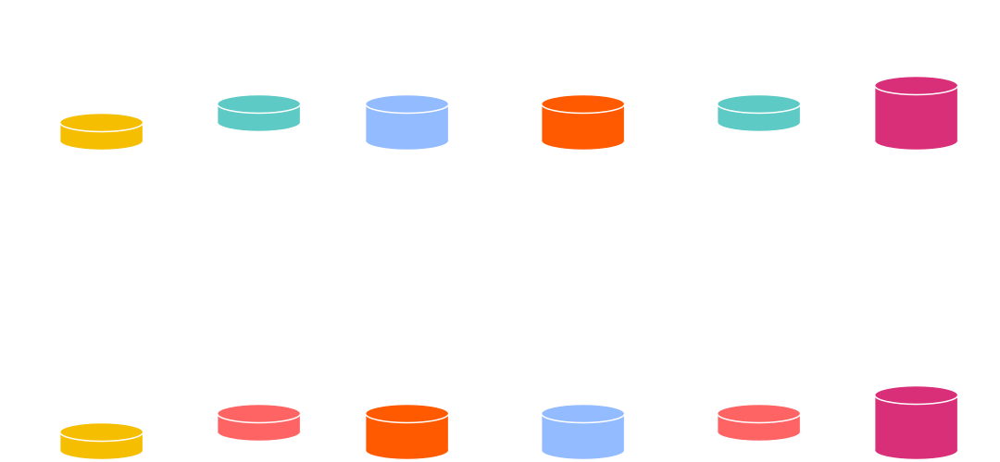

Mixing Paint Visualization

Notes:

Mixing paint example.
Image Source: <https://upload.wikimedia.org/wikipedia/commons/4/46/Diffie-Hellman_Key_Exchange.svg>


---

## Digital Signatures

- _Using the secret key_, information can be transformed ("signed") such that anyone with knowledge of the information and the counterpart public key is able to affirm the operation.
- Digital signatures provide message authenticity and integrity guarantees.<!-- .element: class="fragment" data-fragm ent-index="1" -->
- There are two lessons dedicated to digital signatures,<br/>this is strictly an intro.<!-- .element: class="fragment" data-fragm ent-index="1" -->

---

## Digital Signatures

**Signing function**: a function which operates on some<br/>_message data_ and some _secret_ to yield a _signature_.

A **signature** _proves_ that the signer had knowledge of the secret,<br/>without revealing the secret itself.

The signature cannot be used to create other signatures, and is unique to the message.<!-- .element: class="fragment" data-fragm ent-index="1" -->

Notes:

A **signing function** is a pure function which operates on some _message data_ (which may or may not be small, depending on the function) and some _secret_ (a small piece of information known only to the operator).
The result of this function is a small piece of data called a _signature_.

Pure means that it has no side effects.

It has a special property: it proves (beyond reasonable doubt) that the signer (i.e. operator of the signing function) had knowledge of the secret and utilized this knowledge with the specific _message_ data, yet it does not reveal the secret itself, nor can knowledge of the signature be used to create other signatures (e.g. for alternative message data).

---

## Non-repudiation for Cryptographic Signatures

There is cryptographic proof that the secret was known to the producer of the signature.

<br/>

The signer cannot claim that the signature was forged, unless they can defend a claim that the secret was compromised prior to signing.<br/><!-- .element: class="fragment" data-fragm ent-index="1" -->

---

## Signature API

Signature libraries should generally all expose some basic functions:

<ul>
<li class="fragment"><code>fn generate_key(r) -> sk;</code> <br />Generate a <code>sk</code> (secret key) from some input <code>r</code>.</li>
<li class="fragment"><code>fn public_key(sk) -> pk;</code> <br /> Return the <code>pk</code> (public key) from a <code>sk</code>.</li>
<li class="fragment"><code>fn sign(sk, msg) -> signature;</code> <br /> Takes <code>sk</code> and a message; returns a digital signature.</li>
<li class="fragment"><code>fn verify(pk, msg, signature) -> bool;</code> <br /> For the inputs <code>pk</code>, a message, and a signature; returns whether the signature is valid.</li>
</ul>

Notes:

The input `r` could be anything, for example the movement pattern of a mouse.

For some cryptographies (ECDSA), the verify might not take in the public key as an input. It takes in the message and signature, and returns the public key if it is valid.

---

## Signing Hashed Messages

As mentioned in the introduction,<br />it's often more practical to sign the hash of a message.

Therefore, the sign/verify API may be _used_ like:

- `fn sign(sk, H(msg)) -> signature;` <!-- .element: class="fragment" data-fragment-index="0" -->
- `fn verify(pk, H(msg), signature) -> bool;` <!-- .element: class="fragment" data-fragment-index="1" -->

Notes:

Where `H` is a hash function (for our purposes, Blake2).<br />
This means the verifier will need to run the correct hash function on the message.

---

## Cryptographic Guarantees

Signatures provide many useful properties:

<ul>
<li class="fragment"><strong>Confidentiality: </strong> Weak, the same as a hash</li>
<li class="fragment"><strong>Authenticity: </strong> Yes</li>
<li class="fragment"><strong>Integrity: </strong> Yes</li>
<li class="fragment"><strong>Non-repudiation: </strong> Yes</li>
</ul>

Notes:

Question what do each of these mean?

- Confidentiality - If a hash is signed, you can prove a signature is valid _without_ telling anyone the actual message that was signed, just the hash.
- Authenticity: Authenticity assures that the data comes from a verified source.
- Integrity assures that the data has not been changed in an unauthorized manner.
- Non-Repudiation provides evidence that can be used to prove the involvement of parties in a communication, preventing them from denying their actions.

---

## Signing Payloads

<ul>
<li class="fragment">Signing payloads are an important part of system design.</li>
<li class="fragment">Users should have credible expectations about how their messages are used.</li>
<li class="fragment">For example, when a user authorizes a transfer, they almost always mean just one time.</li>
</ul>

Notes:

There need to be explicit rules about how a message is interpreted. If the same signature can be used in multiple contexts, there is the possibility that it will be maliciously resubmitted.

In an application, this typically looks like namespacing in the signature payload.

---

## Signing and Verifying


Notes:

Note that signing and encryption are _not_ inverses.

---

# Signature Schemes

---

## ECDSA

<ul>
<li class="fragment">Commonly uses Secp256k1 elliptic curve.</li>
<li class="fragment">ECDSA (used initially in Bitcoin/Ethereum) was developed to work around the patent on Schnorr signatures.</li>
<li class="fragment">ECDSA complicates more advanced cryptographic techniques, like threshold signatures.</li>
<li class="fragment">Non-Deterministic</li>
</ul>

Notes:

inverted nonce to get from all signing parties
is difficult

Setup is difficult secret sharing and setup

Show image of ECDSA vs schnorr to demonstrate this

---

## Ed25519

<ul>
<li class="fragment">Schnorr signature designed to reduce mistakes in implementation and usage in classical applications, like TLS certificates.</li>
<li class="fragment">Signing is 20-30x faster than ECDSA signatures.</li>
<li class="fragment">Deterministic</li>
</ul>

---

## Schnorr Signature

- To Sign: <!-- .element: class="fragment" data-fragment-index="0" -->
  - $r \leftarrow kG$ <!-- .element: class="fragment" data-fragment-index="1" -->
  - $e \leftarrow H(r | M)$<!-- .element: class="fragment" data-fragment-index="2" --> (<s>Verify sends random $e$</s>) <!-- .element: class="fragment" data-fragment-index="2" -->
  - $s \leftarrow k - xe$ ($x$ is signer's secret key). <!-- .element: class="fragment" data-fragment-index="3" -->
  - Send $(s, e)$. <!-- .element: class="fragment" data-fragment-index="4" -->
- To Verify : <!-- .element: class="fragment" data-fragment-index="5" -->
  - recover $r = sG + e Pub_{Signer}.$ <!-- .element: class="fragment" data-fragment-index="6" -->
  - Verify $e \stackrel{?}{=}  H(r | M)$ <!-- .element: class="fragment" data-fragment-index="7" -->

---

## Sr25519

Sr25519 addresses several small risk factors that emerged<br />from Ed25519 usage by blockchains.

Notes:

Can be Deterministic but in Substrate is implemented as non-deterministic

---

## Use in Substrate

- Sr25519 is the default key type in most Substrate-based applications.
- Its public key is 32 bytes and generally used to identify key holders (likewise for ed25519).
- Secp256k1 public keys are _33_ bytes, so their _hash_ is used to represent their holders.

---


### Certificates

A certificate is essentially a witness statement concerning one or more public keys. It is a common usage of digital signatures, but _it is not a cryptographic primitive_!

Notes:

A certificate is one issuing key signing a message containing another certified key, which attests to some properties or relationship about the certified key.

We must already trust the issuing key to give this attestation any significance, traditionally provided under "Certificate Authority" or "Web of Trust" schemes.

---

### Certificates

A certification system specified conventions on who is allowed to issue certificates, the rules over their issuance (e.g. time limits and revocation) as well as their format and semantics.

For example, the certificate transparency protocol for TLS certificates helps protect against compromised Certificate Authorities.<!-- .element: class="fragment" data-fragment-index="0" -->

Notes:

Certificate transparency: [explanation](https://certificate.transparency.dev/howctworks/) and [dashboard](https://ct.cloudflare.com/)

- Maybe mention PGP web-of-trust style schemes

---

### Certificates in Web3

We are building systems that do not have a centralized "Certificate Authority".<br/>
But we can still use certificates to transfer some power from one key to another.

Notes:

Potential example to give verbally:

- Session keys are a set of keys that generally run in online infrastructure.
  An account, whose keys are protected, can sign a transaction to certify all the keys in the set.
- Session keys are used to sign operational messages, but also in challenge-response type games to prove availability by signing a message.
- Registrar.
- Identity chains.

---

### Multi-Signatures

We often want signatures that must be signed<br/>by multiple parties to become valid.

<pba-flex center>

- Require some threshold of members to<br/>agree to a message<!-- .element: class="fragment" data-fragment-index="0" -->
- Protect against key loss<!-- .element: class="fragment" data-fragment-index="1" -->

</pba-flex>

---

### Types of Multi-Signature

<pba-flex center>

- Trivial: Sending all individual signatures together.<!-- .element: class="fragment" data-fragment-index="0" -->
- Cryptographically Aggregated.<!-- .element: class="fragment" data-fragment-index="1" -->
- Cryptographically Threshold.<!-- .element: class="fragment" data-fragment-index="2" -->

---

### Trivial Multiple Signatures

- We assume that there is some verifier, who can check that some threshold of individual keys have provided valid signatures.
- This could be a trusted company or third party.<!-- .element: class="fragment" data-fragment-index="1" -->
- For our purposes, "it's a blockchain."<!-- .element: class="fragment" data-fragment-index="2" -->

---

### Trivial Multiple Signatures

Trivial multiple signatures generally provide a good user experience, as no interaction is required from the participants.

Notes:

This good experience comes at the cost of using state and more user interactions with the system, but is generally low.

Even in a web3 system, the verifier can be _distinct_ from the blockchain. 5 people can entrust a verifier with the identity of "all 5 signed this" associated to a verifier-owned private key.

---

### Cryptographic Multi-Sigs

We want a succinct way to demonstrate that everyone from some set of parties have signed a message. This could be achieved purely on the signer side (without support from the verifier).

<pba-flex center>

_Example: "The five key holders have signed this message."_

---

### Key Generation for Multi-Sigs

In cryptographic multi-signatures,<br/>signatures from individual public keys are aggregated.
.

Each participant can choose their own key to use for the multi-signature.<!-- .element: class="fragment" data-fragment-index="0" -->

Notes:

In some cases, a security requirement of these systems is that every participant demonstrates ownership of the public key submitted for the multi-signature, otherwise security can be compromised.

---

### Cryptographic Threshold Multi-Sigs

- Makes more compact signatures compatible with legacy systems.
- The public key is associated with a "threshold" number of signing parties.<!-- .element: class="fragment" data-fragment-index="0" -->
- Not all parties are needed to take part in the signing process to create a valid signature.<!-- .element: class="fragment" data-fragment-index="1" -->
- This requires MPC protocols and may need multiple rounds of interaction to generate the final signature.<!-- .element: class="fragment" data-fragment-index="2" -->
- They may be vulnerable to DoS from a malfunctioning (or malicious) key-holder.<!-- .element: class="fragment" data-fragment-index="3" -->

<pba-flex center>

Example: "5 of 7 key holders have signed this message.".<!-- .element: class="fragment" data-fragment-index="4" -->

Notes:

These require multi-party computation (MPC) protocols, which add some complexity for the signing users.

---

### Key Generation - Threshold

- Threshold multi-signature schemes require that all signers run a distributed key generation (DKG) protocol that constructs key "shares".
  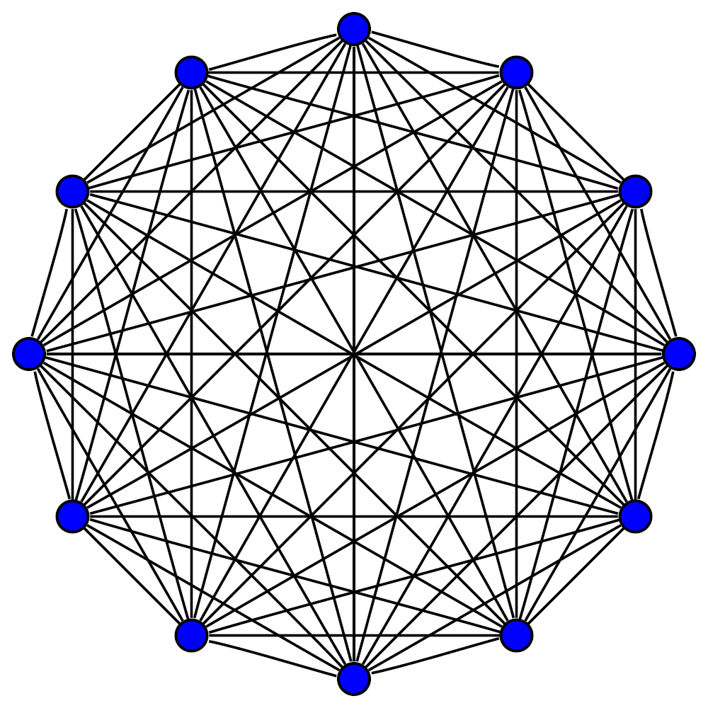<!-- .element: class="fragment" data-fragment-index="0" -->
- The secret encodes the threshold behavior, and signing demands some threshold of signature "fragments".<!-- .element: class="fragment" data-fragment-index="1" -->
- This DKG protocol breaks other useful things, like hard key derivation.<!-- .element: class="fragment" data-fragment-index="2" -->

Notes:

DKG requires MPC which adds a lot of communication overhead.

---

### Schnorr Multi-Sigs

Schnorr signatures are primarily used for threshold multi-sig.

- Fit legacy systems nicely, and can reduce fees on blockchains.<!-- .element: class="fragment" data-fragment-index="0" -->
- Reduce verifier costs in bandwidth & CPU time, so great for certificates.<!-- .element: class="fragment" data-fragment-index="1" -->
- Could support soft key derivations.<!-- .element: class="fragment" data-fragment-index="2" -->

---

### Schnorr Multi-Sigs - Downside

- However, automation becomes tricky.
- We need agreement upon the final signer list and two random nonce contributions from each prospective signer, before constructing the signature fragments.<!-- .element: class="fragment" data-fragment-index="0" -->

---

### BLS Signatures

- BLS signatures are especially useful for aggregated multi-signatures (but can be used for threshold as well).<!-- .element: class="fragment" data-fragment-index="0" -->
- Signatures can be aggregated without advance agreement upon the signer list.<!-- .element: class="fragment" data-fragment-index="1" -->
- This simplifies automation and makes them useful in consensus.<!-- .element: class="fragment" data-fragment-index="2" -->
- Verifying individual signatures is slow, but verifying aggregated ones is relatively fast.<!-- .element: class="fragment" data-fragment-index="3" -->
- (Coming to Substrate soonish.)<!-- .element: class="fragment" data-fragment-index="4" -->

---

### BLS Signatures

Allows multiple signatures generated under multiple public keys for multiple messages to be aggregated into a single signature.

<pba-flex center>

- Uses heavier pairing friendly elliptic curves than ECDSA/Schnorr.<!-- .element: class="fragment" data-fragment-index="0" -->
- Very popular for consensus.<!-- .element: class="fragment" data-fragment-index="1" -->

<pba-flex>

---

### BLS Signatures - Downside

- DKGs remain tricky (for threshold).<!-- .element: class="fragment" data-fragment-index="0" -->
- Soft key derivations are typically insecure for BLS.<!-- .element: class="fragment" data-fragment-index="1" -->
- Verifiers are significantly slower than Schnorr, due to using pairings, for a single signature.<!-- .element: class="fragment" data-fragment-index="2" -->
- But for hundreds or thousands of signatures on the same message, aggregated signature verification can be much faster than Schnorr.<!-- .element: class="fragment" data-fragment-index="3" -->

---

### Schnorr and BLS Summary

Schnorr & BLS multi-signatures avoid complicating verifier logic,<br/>but introduce user experience costs such as:

- DKG protocols<!-- .element: class="fragment" data-fragment-index="0" -->
- Reduced key derivation ability<!-- .element: class="fragment" data-fragment-index="1" -->
- Verification speed<!-- .element: class="fragment" data-fragment-index="2" -->
- Proof of possession verification.<!-- .element: class="fragment" data-fragment-index="3" -->

---

### Ring Signatures

- Ring signatures prove the signer lies within some "anonymity set" of signing keys, but hide which key actually signed.
  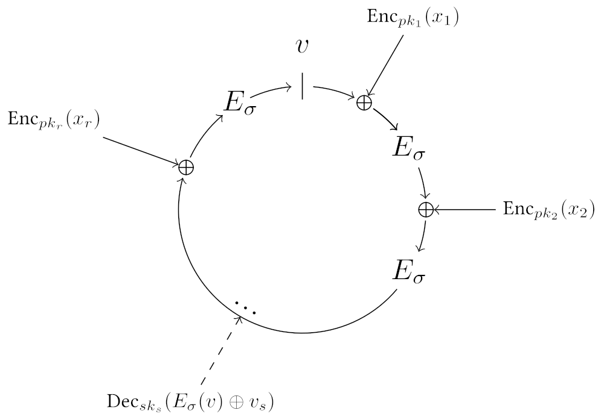<!-- .element: class="fragment" data-fragment-index="1" -->
- Ring signatures come in many sizes, with many ways of presenting their anonymity sets.<!-- .element: class="fragment" data-fragment-index="2" -->
- Anonymous blockchain transactions typically employ ring signatures (Monero, ZCash).<!-- .element: class="fragment" data-fragment-index="3" -->

Notes:

- ZCash uses a ring signature based upon Groth16 zkSNARKs which makes the entire chain history be the anonymity set.
- Monero uses ring signatures with smaller signer sets.
- Ring signatures trade some _non-repudation_ for _privacy_.


---

## Practical Considerations

**Symmetric cryptography** is much faster, but requires more setup (key establishment) and trust (someone else knows the secret).

**Asymmetric cryptography** is slow, but typically preserves specific algebraic relationships, which then permit more diverse if fragile protocols.

---

## Hybrid Cryptography

Hybrid cryptography composes new mechanisms from different cryptographic primitives.

For example:

- Symmetric encryption can provide speed, and often confidentiality,<!-- .element: class="fragment" data-fragm ent-index="1" -->
- Hash functions can reduce the size of data while preserving identity,<!-- .element: class="fragment" data-fragm ent-index="2" -->
- Asymmetric cryptography can dictate relations among the participants.<!-- .element: class="fragment" data-fragm ent-index="3" -->

---

## Certifications

Certifications are used to make attestations about public key relationships.

Typically in the form of a _signature_ on:

- One or more cryptographically strong identifiers (e.g. public keys, hashes).
- Information about its ownership, its use and any other properties that the signer is capable of attesting/authorizing/witnessing.<!-- .element: class="fragment" data-fragm ent-index="1" -->
- "(Meta-)information" about this information itself, such as how long it is valid for and external considerations which would invalidate it.<!-- .element: class="fragment" data-fragm ent-index="1" -->

Notes:

- Real application is the hierarchy of SSL certs.
  - Root keys -> State level entities -> Smaller entities.
- Web of Trust & GPG cross-signing
- In the case of signature-based certificates, as long as you have the signature, data, and originating public key, you can trust a certificate no matter where it came from. It could be posted on a public message board, sent to you privately, or etched into stone.

---


## Verifiable Random Functions<br/>(VRFs)

<widget-center>

- Used to obtain <ins>private randomness</ins>, that is <ins>publicly verifiable</ins>

- A variation on a signature scheme:
  - still have private/public key pairs, input as message
  - in addition to signature, we get an output

---

## VRF Interface

- `eval(sk,input) -> output`

- `sign(sk, input) -> signature`

- `verify(pk, input, signature) -> option output`

Notes:

The output of verification being an option represents the possibility of an invalid signature

---

## VRF Output properties

- Output is a deterministic function of _key_ and _input_
  - i.e. eval should be deterministic
- It should be pseudo-random
- But until the VRF proof is revealed, only the holder<br/>of the secret key knows the output
- Revealing output does not leak secret key

---

## VRF Usage

- Choose input after key, then the key holder cannot influence the output
- The output then is effectively a random number known only to the key holder
- But they can later reveal it, by publishing the VRF proof (signature)

Notes:

The signature proves that this is the output associated to their input and public key.

---

## VRF Example

- Playing a card game in a distributed and trustless way
- For player A to draw a card, the players agree on a new random number x
- A's card is determined by `eval(sk_A,x) mod 52`
- To play the card, A publishes the VRF proof (signature)

---

## VRF Example

_Lottery_

- Lottery organizer generate $pk$,$sk$ for VRF;
- Each participants choose their own tickets $t_i$;

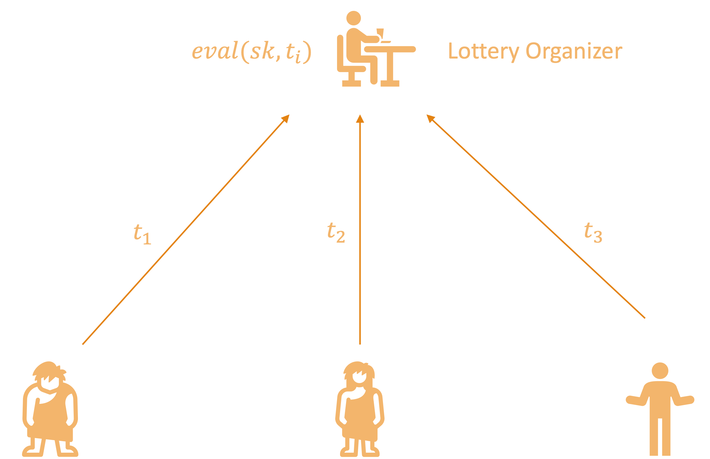

---

## VRF Example

_Lottery_

- Lottery organizer computes `eval(sk,$t_i$)-> $y_i$` for each participants;
- $y_i$ determines wining or not;
- `sign(sk, $t_i$) -> $\sigma_i$` published for verification.
  

---

## Recall Signature Interface

- `sign(sk, msg) -> signature;`

- `verify(pk, msg, signature) -> bool;`

---

## BLS-based VRF

- `sign(sk,input) `: run `BLS.sign(sk, input)->signature`, return `signature`

- `eval(sk,input)`： return `Hash(signature)`

- `verify(pk,input,signature)`: `BLS.verify(pk, input, signature)?=1`, if holds, output `Hash(signature)`

---

## VRF Extensions

- Threshold VRFs / Common coin

  - Generate the same random number if $t$ out of $n$ people participate

- RingVRFs

  - The VRF output could be from any one of a group of public keys.

Notes:

Common coins were used in consensus before blockchains were a thing.
Dfinity based their consensus on this.
But this needs a DKG, and it's unclear if a decentralized protocol can do those easily.
A participant in a RingVRF could still only reveal _one_ random number.

---

## Threshold VRFs

- Also called Distributed VRFs;
- Each of the $n$ users get their public/secret key $(pk_i,sk_i)$;
- $t$ participants generate `output_i`, `signature_i` using their key on the same `input`;
- Combine $t$ `output_i`, `signature_i` to get `output`, `signature`.

---

## Ring Signature and Ring VRFs

- Ring Signature: Sign on behalf of a group people without revealing the true identity of the signer;

- Ring VRFs: generate `output` and `signature` on behalf of a group of people without revealing the true identity of the signer.


---

## Erasure Coding

_Magical data expansion_

- A type of Error Correction Code </br>Detect and correct errors occur in data transmission without the need for retransmission

- Turn data into pieces (with some redundancy) so it can be reconstructed even if some pieces are missing

- A message of $k$ symbols is turned into a coded message of $n$ symbols and can be recovered from any $k$ of these $n$ symbols

---

## Erasure Coding Intuition

Erasure coding relies on both parties sharing an understanding of what possible messages are valid. This lets mistakes be noticed and corrected.

Imagine you are receiving a message, and you know ahead of time that the only two possible messages you would receive are `file` and `ruin`.

Notes:

This concept of a subset of messages being valid is super common in real life, and occurs all over the place.
At a restaurant, when they ask you if you want soup or salad, even if you mumble they will probably understand you.

---v

## Erasure Coding Intuition

How would you classify each of the following words?

<span style="color: red;">file</span> pile pale tale tall rule tail rail rain <span style="color: blue;">ruin</span>

---v

## Erasure Coding Intuition

How would you classify each of the following words?

<span style="color: red;">file pile pale tale tall</span> <span style="color: purple;">rule</span> <span style="color: blue;"> tail rail rain ruin</span>

You can classify them based on how close they are to a valid input. This also means we can find the errors in these messages.

Notes:

There is no perfect way to separate these, but one very reasonable one is to do it based on the edit distance of the received word with any valid messsage you could receive.

---v

## Erasure Coding Intuition

Now, you are receiving messages that could be `msg1` or `msg2`. Can you apply the same technique? Is it as easy to separate received messages?

What if you receive `msg3`?

Notes:

If the messages are not far apart, it is impossible to distinguish in many cases. There is not enough "distance" between the two possibilities.

---v

## Erasure Coding Intuition

With erasure coding, we extend each message magically so they are different enough. The sender and receiver know the same encoding procedure. These extensions will be very different, even if the messages are similar.

`msg1`<span style="color: red;">`jdf`</span> and `msg2`<span style="color: red;">`ajk`</span>

Notes:

It is actually always possible to make the extra magic only appended to the message. This is called a _systematic encoding_.

For those curious about how the "magic" works:

The magic here is polynomials, and the fact that a polynomial of degree $n$ is completely determined by $n+1$ points. There are many good explanations online.

---

## Erasure Coding


---

## Example for 1 Bit Erasuring

Parity Check: $n=k+1$

- Codeword length $(x_1,\cdots,x_k)$: $k$
- Add a sum of the codeword

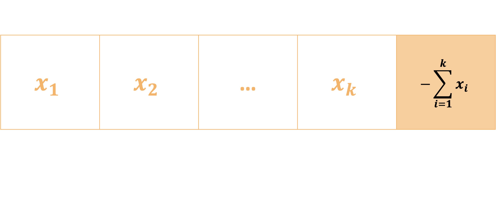

- What if one element gets erasured during transmission?

---

## Erasure Coding Classical use

- Used for noisy channels
- If a few bits of the coded data are randomly flipped,<br/> we can still recover the original data
- Typically $n$ is not much bigger than $k$

---

## Use in Decentralized Systems

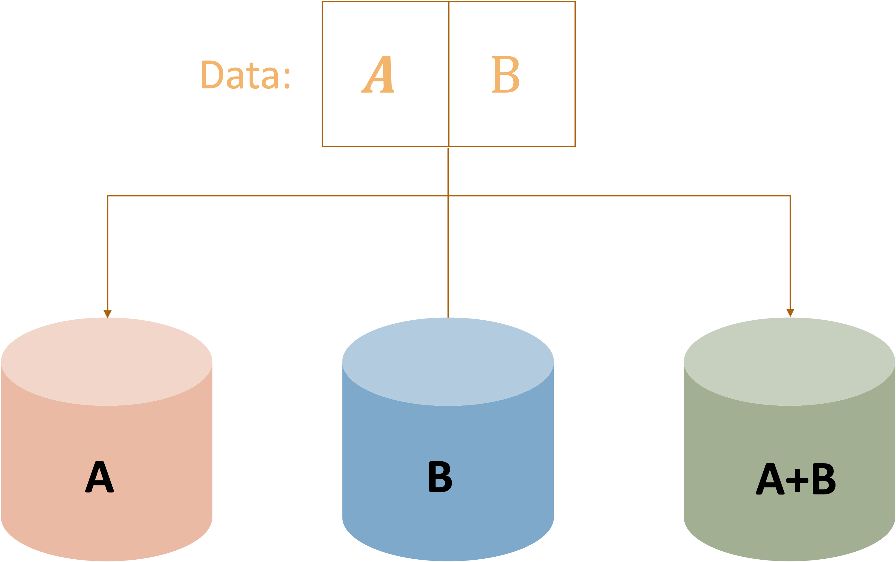

---

## Use in Decentralized Systems

- We have data we want to keep publicly available

  - but not have everyone store
  - but we don't trust everyone who is storing pieces

---

## Shamir Secret Sharing

_Redundancy for your secrets_

- Turn data (typically a secret) into pieces so it can be reconstructed from some subset of the pieces.

- A secret is turned into $n$ shares, and be recovered by any $k$ of the shares. $k-1$ shares together reveals nothing about the secret.

---

## Shamir Secret Sharing


Notes:

Image credit here: https://medium.com/clavestone/bitcoin-multisig-vs-shamirs-secret-sharing-scheme-ea83a888f033

---

## How to Share Secrets?

- A polynomial of degree $t$ is completely determined by $t+1$ points.
- We can reconstruct the $t$ polynomial from any of its $t+1$ points (use Lagrange interpolation).
- With point less than $t+1$, the polynomial cannot be uncovered.
- $y=x^3+4x^2+2$
  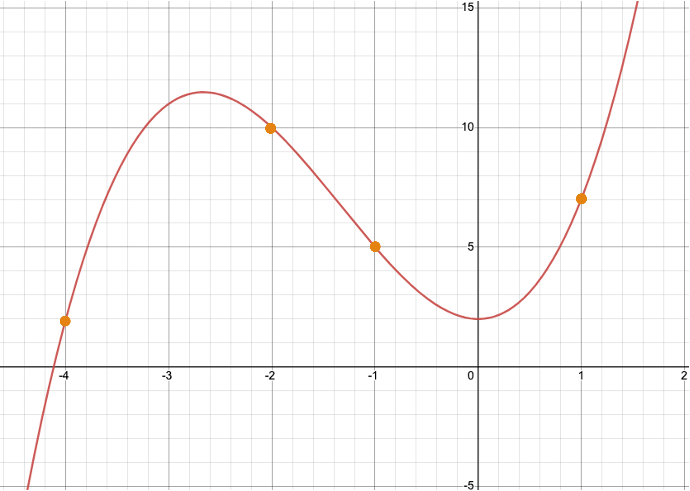

---

## How to Share Secrets?

- Assume we want to share a secret value $a$ among $n$ people
- We expect that with any $k$ secret shares we are able to reconstruct $a$;

---

## Share Secret Value $a$

- Construct polynomial $f(X)=a_0+a_1X+a_2X^2+\cdots+a_{k-1}X^{k-1}$ with degree $k-1$;

- **$a_0=a$**;
- $a_1$,$\cdots$, $a_{k-1}$ are all randomly picked;

- The $n$ secret shares are $f(1)$, $f(2)$,$\cdots$, $f(n)$;

- With any $k$ of the $n$ secret shares, we are able to recover $f(x)$.

---

## Example:$a=12, n=5, k=4$

- Construct a polynomial $f(x)=12-13x-7x^2+2x^3$

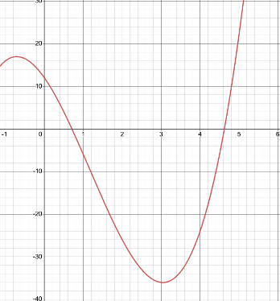

---

## Example:$a=12, n=5, k=4$

- Evaluate on $f(1)$, $f(2)$, $f(3)$, $f(4)$, $f(5)$

  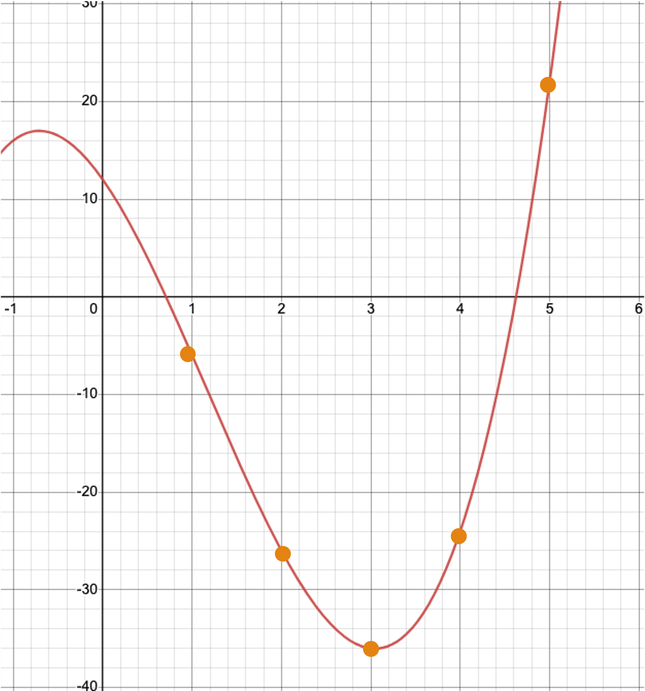

---

## Distributed Private Key Storage

- The management and protection of private keys is important;

- There are wallet introduced Shamir secret sharing to help share private key into multiple pieces;

- Shares are stored in different locations.

---

## Pros and Cons

- Can reconstruct a secret if you lose it.
- So can other people who collect enough shares.


---

## Summary

Cryptography is much more than encryption.

<pba-flex center>

- Communicate on public networks, in the open<!-- .element: class="fragment" data-fragm ent-index="1" -->
- Access information<!-- .element: class="fragment" data-fragm ent-index="1" -->
- Have expectations about a message's authenticity and integrity<!-- .element: class="fragment" data-fragm ent-index="1" -->
- Prove knowledge of some secret information<!-- .element: class="fragment" data-fragm ent-index="1" -->
- Represent large amounts of data succinctly<!-- .element: class="fragment" data-fragm ent-index="1" -->

</pba-flex>

---

<!-- .slide: data-background-color="#4A2439" -->

# Questions


##### _What insights did you gain?_

Notes:

Class discussion.
Last slide.
