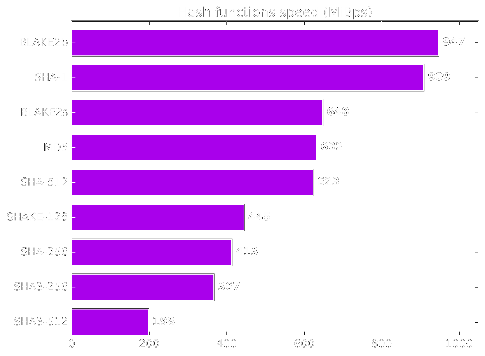
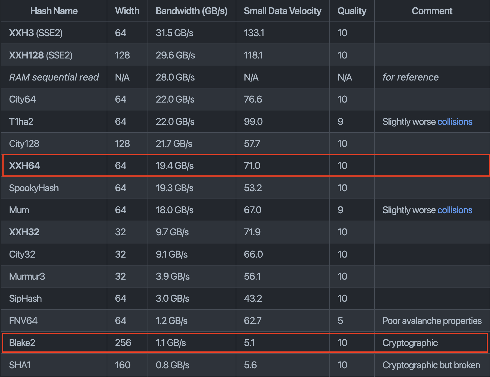

# Introduction to Cryptography

---

## Goals for this lesson

<widget-text center>

- Understand the goals of cryptography
- Understand some network and contextual assumptions
- Learn what expectations cryptography upholds
- Learn the primitives

</widget-text>

---

## Operating Context

### _The internet is a public space._

We communicate over public channels.
Adversaries may want to:

<widget-text center>

- Read messages not intended for them
- Impersonate others
- Tamper with messages

</widget-text>

Notes:

Use e-mail as an example of an flawed system.

Some examples include:

- An attacker may impersonate your boss, trying to get you to send them money
- An attacker may change a message sent over a network, e.g. an instruction to transfer 100 EUR to 10000 EUR

Probably best for the teacher to ask students to participate with examples of application messages,
not just person-to-person messages.

---

## Operating Context

### _Resources are constrained._

- **Network, storage, computation, etc.**: We don't want to send, store, or operate on the same data, but we want guarantees about it, e.g. that we agree on a message's contents.
- **Privacy**: We must assume that all channels can be monitored, and thus closed channels are heavily constrained (i.e. assumed to not exist).

---

## Open vs. Closed Channels

_Cryptography based on public systems is more sound anyway._

**Kerckhoff's Principle:** Security should not rely on secret _methods_, but rather on secret _information_.

Notes:

There is no such thing as a "closed channel" :)

- Methods can be reverse engineered.
  After that, the communication channel is completely insecure.
  For example, CSS protection for DVDs.
- We always work with public, open protocols.

---

## Cryptographic Guarantees\*

<widget-text center>

- Secure communication
- Data accessibility
- Message authenticity
- Data integrity
- Non-repudiation (later)

</widget-text>

Notes:

Cryptography is one of the (most important) tools we have to build tools that are _guaranteed_ to work correctly.
This is regardless of who (human, machine, or otherwise) is using them and their intentions (good or bad).

Why an asterisk?
There generally are no perfect & absolute guarantees here, but for most practical purposes the bounds on where these fail are good enough to serve our needs as engineers and users.
Do note the assumptions and monitor their validity over time (like quantum tech).

---

## Data Accessibility

A party may gain access to information if and only if they know some secret (a key).

Notes:

The ability to decrypt some data and reveal its underlying information directly implies knowledge of some secret, potentially unknown to the originator of the information.
Supplying the original information (aka plain text message) can be used in a "challenge game" mechanism as one means of proving knowledge of the secret without compromising it.

Mention use of the term "plaintext".

Allegory: A private document stored on server where sysadmin has _access_ can be subpoenaed, violating assumed Attorney-Client Privilege on the document.

---

## Message Authenticity

Like physical signatures, cryptography may be used to give a reasonable expectation of a message's provenance (origin), in order to give the users the **credible** expectation that the stated origin is authentic.

Notes:

- Digital signatures should be difficult (practically speaking: impossible) to forge.
- Digital signatures should verify that the signer knows some secret, without revealing the secret itself.

---

## Data Integrity

Physical signatures provide weak authenticity guarantees (i.e. they are quite easy to forge), and no integrity guarantees.

---

## Data Integrity


Notes:

For example, if you change the year on your university diploma, the dean's signature is still valid.
Digital signatures provide a guarantee that the signed information has not been tampered with.

---

## One-Way Functions

One-way functions form the basis of both **(cryptographic) hashing** and **asymmetric cryptography**.

- Functions for which we know fast algorithms to compute
- But for which we believe to be hard to invert
- And for which there may be some secret which makes it easy

Notes:

There are a lot of assumptions about why these functions are hard to invert, but we cannot rigorously prove it.
We often express inversion problems in terms of mathematical games or oracles.

---

## Hash Functions

**Motivation:** We often want a succinct representation of some data with the expectation that we are referring to the same data.
A "fingerprint".

Notes:

The following slides serve as an intro.
Many terms may be glossed over, and covered in detail later.
There are lectures later in this module dedicated to hashes and hash-based data structures.\_

---

## Hash Function Applications

Hashes can be useful for many applications:

- Representation of larger data object (history, commitment, file)
- Keys in a database
- Digital signatures
- Key derivation
- Pseudorandom functions

---

## Hash Function Properties

<widget-columns>
<widget-column>

- Accept unbounded size input
- Map to a bounded output
- Be fast to compute
- Be computable strictly one-way (_Difficult_ to find a pre-image for a hash)
- Resist pre-image attacks (attacker controls one input)
- Resist collisions (attacker controls both inputs)

</widget-column>
<widget-column>


</widget-column>
</widget-columns>

Notes:

Based on the first two properties, _there must exist_ infinite collisions.
A.k.a. Dirichlet's Drawer Principle, a.k.a. pigeonhole principle.

---

## Hash Function


---

## Input Sensitivity

Changes to a hash are not related to the magnitude of change in the input.


---

## Cryptographic vs. <br> Non-Cryptographic

Cryptographic hash functions provide stronger guarantees on the last three properties.

But non-cryptographic hash functions are much faster.

Notes:

Substrate uses both (more on that later).

---

## Famous Hash Algorithms

<widget-text center>

- xxHash (non-cryptographic)
- MD5
- SHA1
- RIPEMD-160
- SHA2-256 (aka SHA256) &c.
- SHA3
- Keccak
- Blake2

TwoX64 is about 20x faster.

</widget-text>

---

### Cryptographic Hashing - Benchmarks



Notes:

Benchmarks for the XX-hash algorithms.
Source: https://www.blake2.net/

---

### xxHash - Extremely fast hash algorithm - Benchmarks



Notes:

Benchmarks for the XX-hash algorithms.
Source: https://github.com/Cyan4973/xxHash#benchmarks

---

## Symmetric Encryption


Examples: ChaCha20, Twofish, Serpent, Blowfish, XOR, DES, AES

---

## Symmetric Encryption

### _Example: XOR Cipher_

<widget-columns>
<widget-column>

The encryption and decryption functions are identical: applying a bitwise XOR operation with a key.

</widget-column>
<widget-column style="padding-right: 100px">

```text
Plain: 1010  -->Cipher: 0110
Key:   1100  |          1100
       ----  |          ----
       0110--^          1010
```

Notes:

A plaintext can be converted to ciphertext, and vice versa, by applying a bitwise XOR operation with a key known to both parties.

</widget-column>
</widget-columns>

// TODO one time pad @ ~1:40:00 here: https://drive.google.com/drive/folders/1KgxglGwVf63NhFWf6oyZoDoTlLjihBdK
// entropy discussion

---

## Symmetric Encryption

### Warning

We typically expect symmetric encryption to preserve little about the original plaintext.
We caution however that constructing these protocols remains delicate, even given secure primitives, with two classical examples being unsalted passwords and the [ECB penguin](https://tonybox.net/posts/ecb-penguin/).

---

<widget-columns>
<widget-column>

<center>


_Original image_

</center>

</widget-column>
<widget-column>

<center>


_Encrypted image_

</center>

</widget-column>
</widget-columns>

Notes:

Image sources: https://github.com/robertdavidgraham/ecb-penguin/blob/master/Tux.png and https://github.com/robertdavidgraham/ecb-penguin/blob/master/Tux.ecb.png

---

## Asymmetric Cryptography

- In asymmetric cryptography, we devise a means to transform one value (the "secret") into some corresponding counterpart (the "public" key), preserving certain properties.

- We believe that this is a one-way function (that there is no easy/fast inverse of this function).

- Aside from preserving certain properties, we believe this counterpart (the "public key") reveals no information about the secret.

- _Using only the public key_, information can be transformed ("encrypted") such that only those with knowledge of the secret are able to inverse and regain the original information.

- _Using the secret key_, information can be transformed ("signed") such that anyone with knowledge of the information and the counterpart public key is able to affirm the operation.

---

## Asymmetric Protocols

- Asymmetric cryptography includes RSA, Elgamal, Elliptic Curve (slowest to fastest)
- Elliptic Curve Cryptography (ECC) includes:
  - ECDSA (SECP256k1, SECP256r1)
  - Schnorr
  - EdDSA (Ed25519, Ed448)
  - Schnorr/Ristretto 25519
  - BLS
- ECC requires double the bits to the symmetric AES for the same level of security.
  E.g. 128 bit security requires a 256 bit ECC key.

Notes:

Discuss misuse resistance and motivation for support here.
Or could be in more runtime focused lesson?

- ECDSA: Lots of footguns, but we support for legacy Ethereum compatibility
- Ed25519: Some misuse / insecure libraries, e.g. [this tweet](https://twitter.com/kostascrypto/status/1537245592019054593)
- Sr25519: Reduces misuse risks, but mainly has adoption in Substrate ecosystem

---

## Practical Considerations

**Symmetric cryptography** is much faster, but requires more setup (key establishment) and trust (someone else knows the secret).

**Asymmetric cryptography** is slow, but typically preserves specific algebraic relationships, which then permit more diverse if fragile protocols.

---

## Hybrid Cryptography

Hybrid cryptography mixes symmetric and asymmetric cryptography.

- Symmetric encryption can provide speed, and often confidentiality,

- And asymmetric can dictate relations among the participants.

---

## Digital Signatures

Digital signatures provide message authenticity and integrity guarantees.

_The next two lectures are dedicated to digital signatures, this is strictly an intro._

---

## Digital Signatures

**signing function**: a pure function which operates on some _message data_ and some _secret_ to yield a _signature_.

A **signature** _proves_ that the signer had knowledge of the secret, without revealing the secret itself.

The signature cannot be used to create other signatures.

Notes:

A **signing function** is a pure function which operates on some _message data_ (which may or may not be small, depending on the function) and some _secret_ (a small piece of information known only to the operator).
The result of this function is a small piece of data called a _signature_.

It has a special property: it proves (beyond reasonable doubt) that the signer (i.e. operator of the signing function) had knowledge of the secret and utilized this knowledge with the specific _message_ data, yet it does not reveal the secret itself, nor can knowledge of the signature be used to create other signatures (e.g. for alternative message data).

---

## Digital Signatures

In this model, secrets are identified not by their actual data (which we assume only the signer knows) but rather a derivative counterpart (known as the _public key_) which maps 1:1 with the secret (and so can be used to identify it), yet does not compromise it.

---

## Digital Signatures on Plaintext

Digital signatures are not limited to encryption.
Some information you even want to share publicly.

**Example:** Affirmation of a document's author.
Digital signatures still guarantee that the message is authentic and has not been modified (e.g. to some other document).

---

## Non-repudiation

Only those with knowledge of some secret information could have produced a valid signature.

The signer cannot claim that the signature was forged, unless they can defend a claim that the secret was compromised prior to signing.
Symmetric cryptography does not provide this guarantee: someone else knows the secret.

---

## Certifications

Certifications are used to make attestations about public key relationships.

Typically in the form of a _signature_ on:

- One or more cryptographically strong identifiers (e.g. public keys, hashes).
- Information about its ownership, its use and any other properties that the signer is capable of attesting/authorizing/witnessing.
- _(Meta-)information_ about this information itself, such as how long it is valid for and external considerations which would invalidate it.

---

## Digital Signatures (again)

_Signing_ large amounts of data is _not_ efficient.

_Hashing_ large amounts of data _is_ efficient.

A signature on the hash of some data implies a signature on the data itself.

This requires that the verifier also compute the hash.

Notes:

Based on pre-image resistance, a signature on the hash of some data implies a signature on the data itself.
That is, we assume that attackers are unable to find or construct some data that would generate the same output hash.

This requires that the verifier also compute the hash.

---

## Digital Signatures (again)


---

<!-- .slide: data-background-color="#4A2439" -->

# Exercise

## Discuss some reasons why the 6 listed <br> hash properties are so important.

Notes:

- If an attacker can find a colliding pre-image, they can "authorize" something unintended.
- Or if they can find a collision on their own, attempt to trick you into signing one.

---

## Summary

Cryptography is much more than encryption.

<widget-text center>

- Communicate on public networks, in the open
- Access information
- Have expectations about a message's authenticity and integrity
- Prove knowledge of some secret information
- Represent large amounts of data succinctly

</widget-text>

---

# END

---

## Hash Examples in Substrate

**Sr25519 Signatures**

Sr25519 hashes the message as part of its signing process.

**Transactions**

In transactions in Substrate, key holders sign a _hash of the instructions_ when the instructions are longer than 256 bytes.

---

## Database Keys

**TwoX64** is safe to use when users (read: attackers) cannot control the input, e.g. when a database key is a system-assigned index.

**Blake2b** should be used for everything else.

_Again, there is a whole lecture on hash-based data structures._

---

## Other Uses of Hashes in Substrate

Hashes are also used for:

<widget-text center>

- Generating multisig accounts
- Generating system-controlled accounts
- Generating proxy-controlled accounts
- Representing proposals
- Representing claims (e.g. the asset trap)

</widget-text>

---

## Commutative En-/Decryption

In a commutative structure, a message may be encrypted/decrypted multiple times with potentially multiple keys.

The output does not depend on the order of operations.

---


Notes:

Mixing paint example.
Image Source: https://upload.wikimedia.org/wikipedia/commons/4/46/Diffie-Hellman_Key_Exchange.svg

---

## Commutative En-/Decryption

Encrypting a message with key $A$, and then encrypting the ciphertext with key $B$, would result in the same ciphertext had one encrypted with $B$ and then $A$.

\begin{align}
M &=> E_A(E_B(M)) == E_B(E_A(M)) => C \\\\
C &=> D_A(D_B(C)) == D_B(D_A(C)) \ => M
\end{align}

Elliptic curve cryptography is based on _commutative_ algebraic structures.

---

## Polkadot in Practice

In Substrate and Polkadot, we use ECDSA, ed25519, and sr25519.

Of course a valid signature is a valid signature, and there are lots of libraries.
Some specific to Polkadot/Substrate:

- Subkey (CLI)
- Substrate Primitives (runtime)
- Polkadot JS Crypto (applications)

---

## Certifications in Substrate

Practically speaking, in Substrate we will use certifications to:

- Associate physical hardware with on-chain accounts (called session keys)
- Link disparate and potentially keyless on-chain accounts in certain contexts (proxies)

Notes:

See: https://docs.substrate.io/main-docs/fundamentals/accounts-addresses-keys/#specialized-accounts
