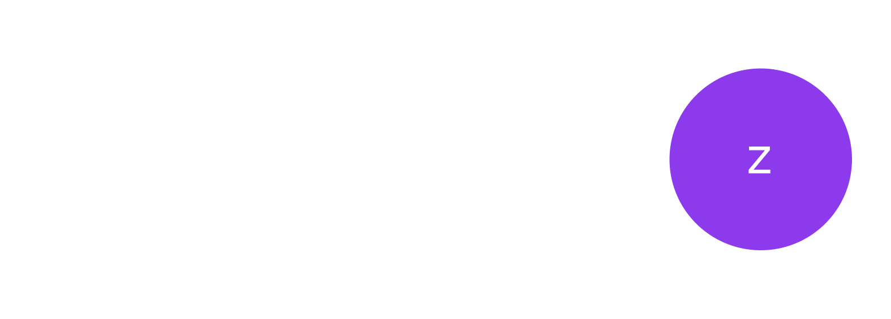
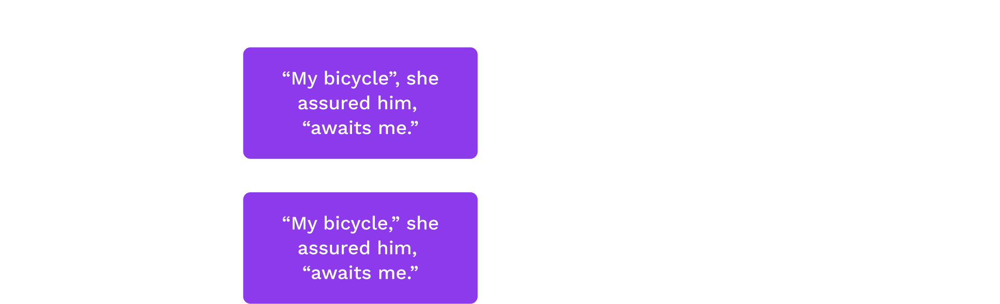
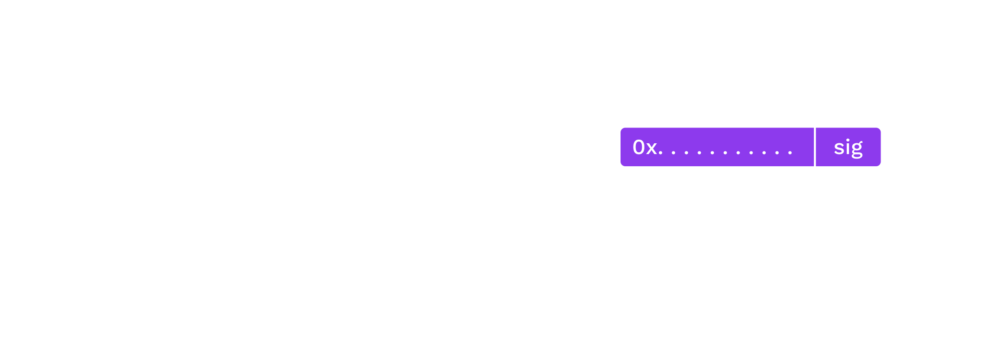

# Introduction to Cryptography

<widget-text style="padding: 0 200px 50px 200px" center >
. . . . . . . . . .
</widget-text>

## Gavin Wood

### _Founder, Parity Technologies_

---

## Goals for this lesson

<br>

<widget-text center>

- Understand the goals of cryptography
- Understand some network and contextual assumptions
- Learn what expectations cryptography upholds
- Learn the primitives

</widget-text>

---

## Operating Context

### _The internet is a public space._

<widget-text style="padding: 10px 200px 40px 200px;" center>

We communicate over public channels.

Adversaries exist who may want to:

</widget-text>

<widget-text center>

- Read messages not intended for them
- Impersonate others
- Tamper with messages

</widget-text>

</widget-column>
</widget-columns>

Notes:

Use e-mail as an example of an flawed system.

Some examples include:

- An attacker may impersonate your boss, trying to get you to send them money
- An attacker may change a message sent over a network, e.g. an instruction to transfer 100 EUR to 10000 EUR

Probably best for the teacher to ask students to participate with examples of application messages,
not just person-to-person messages.

---

## Operating Context

<widget-text style="padding: 10px 200px 40px 200px;" center>

### _Resources are constrained._

</widget-text>

<widget-text style="padding: 0 200px 0px 200px;">

- **Network, storage, computation, etc.**: We don't want to send, store, or operate on the same data, but we want guarantees about it, e.g. that we agree on a message's contents.
- **Privacy**: We must assume that all channels can be monitored, and thus closed channels are heavily constrained (i.e. assumed to not exist).

</widget-text>

---

## Open vs. Closed Channels

_Cryptography based on public systems is more sound anyway._

<br>

<widget-text style="padding: 0 200px 0 200px">

**Kerckhoff's Principle:** Security should not rely on secret _methods_, but rather on secret _information_.

</widget-text>

Notes:

There is no such thing as a "closed channel" :)

- Methods can be reverse engineered. After that, the communication channel is completely insecure. For example, CSS protection for DVDs.
- We always work with public, open protocols.

</widget-text>

## Cryptographic Guarantees

<widget-text style="padding: 0 200px 25px 200px" >

Cryptography provides tools for communicating securely in the open.

Encryption is one use of cryptography, hashing is another.

It also provides other powerful guarantees:

</widget-text>
<widget-text center>

- Data accessibility
- Message authenticity
- Data integrity
- Nonrepudiation (later)

</widget-text>

---

## Data Accessibility

<widget-text style="padding: 0 200px 25px 200px">

A party may gain access to information if and only if they know some secret (a key).

</widget-text>

Notes:

The ability to decrypt some data and reveal its underlying information directly implies knowledge of some secret, potentially unknown to the originator of the information. Supplying the original information (aka plain text message) can be used in a "challenge game" mechanism as one means of proving knowledge of the secret without compromising it.

Mention use of the term "plaintext".

---

## Message Authenticity

<widget-text style="padding: 0 200px 25px 200px" >

Like physical signatures, cryptography may be used to give a reasonable expectation of a message's provenance (origin), in order to give the users the credible expectation that the stated origin is authentic.

</widget-text>

Notes:

- Digital signatures should be difficult (practically speaking: impossible) to forge.
- Digital signatures should verify that the signer knows some secret, without revealing the secret itself.

---

## Data Integrity

<widget-text style="padding: 0 200px 25px 200px" >

Physical signatures provide weak authenticity guarantees (i.e. they are quite easy to forge), and no integrity guarantees.

</widget-text>

---

## Data Integrity

<br>


Notes:

For example, if you change the year on your university diploma, the dean's signature is still valid.
Digital signatures provide a guarantee that the signed information has not been tampered with.

---

## One-Way Functions

<br>

One-way functions form the basis of both **(cryptographic) hashing** and **asymmetric cryptography**.

<br>

<widget-text style="padding: 0 200px 0 200px" center>

- Functions for which we know fast algorithms to compute
- But for which we believe to be hard to invert
- And for which there may be some secret which makes it easy

</widget-text>

Notes:

There are a lot of assumptions about why these functions are hard to invert, but we cannot rigorously prove it. We often express inversion problems in terms of mathematical games or oracles.

---

## Hash Functions

<br>

<widget-text style="padding: 0 200px 0 200px">

**Motivation:** We often want a succinct representation of some data with the expectation that we are referring to the same data. A "fingerprint".

<br>

_Again, just an intro. There are lectures later in this module dedicated to hashes and hash-based data structures._

</widget-text>

---

## Hash Function Applications

<br>

<widget-text style="padding: 0 200px 0 200px">

Hashes can be useful for many applications:

- Representation of larger data object (history, commitment, file)
- Keys in a database
- Digital signatures
- Key derivation
- Pseudorandom functions

</widget-text>

---

## Hash Function Properties

<br>

<widget-text style="padding: 0 200px 0 200px">

1. Accept unbounded size input
1. Map to a bounded output
1. Be fast to compute
1. Be computable strictly one-way (difficult to find a pre-image for a hash)
1. Resist pre-image attacks (attacker controls one input)
1. Resist collisions (attacker controls both inputs)

</widget-text>

Notes:

Based on the first two properties, _there must exist_ infinite collisions. A.k.a. Dirichlet's Drawer Principle, a.k.a. pigeonhole principle.

---

## Hash Function

<br>



---

## Input Sensitivity

<br>

<widget-text style="padding: 0 200px 0 200px">

Changes to a hash are not related to the magnitude of change in the input.

</widget-text>

<br>



---

## Cryptographic vs. Non-Cryptographic

<br>

<widget-text style="padding: 0 200px 0 200px">

Cryptographic hash functions provide stronger guarantees on the last three properties.

<br>

But non-cryptographic hash functions are much faster.

</widget-text>

Notes:

Substrate uses both (more on that later).

---

## Famous Hash Algorithms

<br>

<widget-text style="padding: 0 200px 0 200px" center>

<widget-text center>

- xxHash (non-cryptographic)
- MD5
- SHA1
- RIPEMD-160
- SHA2-256 &c.
- SHA3
- Keccak
- Blake2

</widget-text>

<br>

</widget-text>

TwoX64 is about 20x faster.

</widget-text>

---

### Cryptographic Hashing - Benchmarks


Notes:

Benchmarks for the XX-hash algorithms.
Source: https://www.blake2.net/

---

### xxHash - Extremely fast hash algorithm - Benchmarks


Notes:

Benchmarks for the XX-hash algorithms.
Source: https://github.com/Cyan4973/xxHash#benchmarks

---

## Symmetric Encryption

<br>


<br>

Examples: ChaCha20, Twofish, Serpent, Blowfish, AES, DES, XOR

---

## Symmetric Encryption Example

### _Example: XOR Cipher_

<widget-columns>
<widget-column>

<br>

<widget-text style="padding: 0 0 0 200px">

The encryption and decryption functions are identical: applying a bitwise XOR operation with a key.

</widget-text>

</widget-column>
<widget-column style="padding-right: 100px">

```text
Plain: 1010  -->Cipher: 0110
Key:   1100  |          1100
       ----  |          ----
       0110--^          1010
```

Notes:

A plaintext can be converted to ciphertext, and vice versa, by applying a bitwise XOR operation with a key known to both parties.

</widget-column>
</widget-columns>

---

## Symmetric Encryption Warning

<br>

<widget-text style="padding: 0 200px 0 200px">

We typically expect symmetric encryption to preserve little about the original plaintext. We caution however that constructing these protocols remains delicate, even given secure primitives, with two classical examples being unsalted passwords and the [ECB penguin](https://tonybox.net/posts/ecb-penguin/).

</widget-text>

---

<widget-columns>
<widget-column>


<widget-text center>

_Original image_

</widget-text>

</widget-column>
<widget-column>


<!-- Image sources: https://github.com/robertdavidgraham/ecb-penguin/blob/master/Tux.png and https://github.com/robertdavidgraham/ecb-penguin/blob/master/Tux.ecb.png -->

<widget-text center>

_Encrypted image_

</widget-text>

</widget-column>
</widget-columns>

---

## Asymmetric Cryptography

<br>

<widget-text style="padding: 0 200px 0 200px">

- In asymmetric cryptography, we devise a means to transform one value (the "secret") into some corresponding counterpart (the "public" key), preserving certain properties.

- We believe that this is a one-way function (that there is no easy/fast inverse of this function).

- Aside from preserving certain properties, we believe this counterpart (the "public key") reveals no information about the secret.

- _Using only the public key_, information can be transformed ("encrypted") such that only those with knowledge of the secret are able to inverse and regain the original information.

- _Using the secret key_, information can be transformed ("signed") such that anyone with knowledge of the information and the counterpart public key is able to affirm the operation.

</widget-text>

---

## Asymmetric Protocols

<br>

<widget-text style="padding: 0 200px 0 200px">

- Asymmetric cryptography includes RSA, Elgamal, Elliptic Curve (slowest to fastest)
- Elliptic Curve Cryptography (ECC) includes:
  - ECDSA (SECP256k1, SECP256r1)
  - Schnorr
  - EdDSA (Ed25519, Ed448)
  - Schnorr/Ristretto 25519
  - BLS
- ECC requires double the bits to the symmetric AES for the same level of security. E.g. 128 bit security requires a 256 bit ECC key.

</widget-text>

Notes:

Discuss misuse resistance and motivation for support here. Or could be in more runtime focused lesson?

- ECDSA: Lots of footguns, but we support for legacy Ethereum compatibility
- Ed25519: Some misuse / insecure libraries, e.g. [this tweet](https://twitter.com/kostascrypto/status/1537245592019054593)
- Sr25519: Reduces misuse risks, but mainly has adoption in Substrate ecosystem

---

## Practical Considerations

<br>

<widget-text style="padding: 0 200px 0 200px">

**Symmetric cryptography** is much faster, but requires more setup (key establishment) and trust (someone else knows the secret).

<br>

**Asymmetric cryptography** is slow, but typically preserves specific algebraic relationships, which then permit more diverse if fragile protocols.

</widget-text>

---

## Hybrid Cryptography

<br>

<widget-text style="padding: 0 200px 0 200px" center>

Hybrid cryptography mixes symmetric and asymmetric cryptography.

- Symmetric encryption can provide speed, and often confidentiality,

- And asymmetric can dictate relations among the participants.

</widget-text>

---

## Digital Signatures

<br>

<widget-text style="padding: 0 200px 0 200px">

Digital signatures provide message authenticity and integrity guarantees.

<br>

_The next two lectures are dedicated to digital signatures, this is strictly an intro._

</widget-text>

---

## Digital Signatures

<br>

<widget-text style="padding: 0 200px 0 200px">

**signing function**: a pure function which operates on some _message data_ and some _secret_ to yield a _signature_.

<br>

A **signature** _proves_ that the signer had knowledge of the secret, without revealing the secret itself.

The signature cannot be used to create other signatures.

Notes:

A **signing function** is a pure function which operates on some _message data_ (which may or may not be small, depending on the function) and some _secret_ (a small piece of information known only to the operator). The result of this function is a small piece of data called a _signature_.

It has a special property: it proves (beyond reasonable doubt) that the signer (i.e. operator of the signing function) had knowledge of the secret and utilised this knowledge with the specific _message_ data, yet it does not reveal the secret itself, nor can knowledge of the signature be used to create other signatures (e.g. for alternative message data).

</widget-text>

---

## Digital Signatures

<br>

<widget-text style="padding: 0 200px 0 200px">

In this model, secrets are identified not by their actual data (which we assume only the signer knows) but rather a derivative counterpart (known as the _public key_) which maps 1:1 with the secret (and so can be used to identify it), yet does not compromise it.

</widget-text>

---

## Digital Signatures on Plaintext

<br>

<widget-text style="padding: 0 200px 0 200px">

Digital signatures are not limited to encryption. Some information you even want to share publicly.

<br>

**Example:** Affirmation of a document's author.
Digital signatures still guarantee that the message is authentic and has not been modified (e.g. to some other document).

</widget-text>

---

## Nonrepudiation

<br>

<widget-text style="padding: 0 200px 0 200px">

Only those with knowledge of some secret information could have produced a valid signature.

<br>

The signer cannot claim that the signature was forged, unless they can defend a claim that the secret was compromised prior to signing.
Symmetric cryptography does not provide this guarantee: someone else knows the secret.

</widget-text>

---

## Certifications

<br>

<widget-text style="padding: 0 200px 0 200px">

Certifications are used to make attestations about public key relationships.

<br>

Typically in the form of a _signature_ on:

- One or more cryptographically strong identifiers (e.g. public keys, hashes).
- Information about its ownership, its use and any other properties that the signer is capable of attesting/authorising/witnessing.
- _(Meta-)information_ about this information itself, such as how long it is valid for and external considerations which would invalidate it.

</widget-text>

---

## Digital Signatures (again)

<br>

<widget-text style="padding: 0 200px 0 200px">

_Signing_ large amounts of data is _not_ efficient.

<br>

_Hashing_ large amounts of data _is_ effecient.

<br>

A signature on the hash of some data implies a signature on the data itself.

This requires that the verifier also compute the hash.

</widget-text>

Notes:

Based on pre-image resistance, a signature on the hash of some data implies a signature on the data itself. That is, we assume that attackers are unable to find or construct some data that would generate the same output hash.

This requires that the verifier also compute the hash.

---

## Digital Signatures (again)

<br>



---

<!-- .slide: data-background-color="#8D3AED" -->

# Exercise

## Discuss some reasons why the 6 listed <br> hash properties are so important.

</widget-text>

Notes:

- If an attacker can find a colliding pre-image, they can "authorize" something unintended.
- Or if they can find a collision on their own, attempt to trick you into signing one.

---

## Summary

<widget-text style="padding: 0 200px 0 200px" center>

Cryptography is much more than encryption.

<widget-text center>

- Communicate on public networks, in the open
- Access information
- Have expectations about a message's authenticity and integrity
- Prove knowledge of some secret information
- Represent large amounts of data succinctly

</widget-text>

</widget-text>

---

# END

---

## Hash Examples in Substrate

<br>

<widget-text style="padding: 0 200px 0 200px">

**Sr25519 Signatures**

Sr25519 hashes the message as part of its signing process.

<br>

**Transactions**

In transactions in Substrate, key holders sign a _hash of the instructions_ when the instructions are longer than 256 bytes.

</widget-text>

---

## Database Keys

<br>

<widget-text style="padding: 0 200px 0 200px">

**TwoX64** is safe to use when users (read: attackers) cannot control the input, e.g. when a database key is a system-assigned index.

<br>

**Blake2b** should be used for everything else.

<br>

_Again, there is a whole lecture on hash-based data structures._

</widget-text>

---

## Other Uses of Hashes in Substrate

<br>

<widget-text style="padding: 0 200px 0 200px" center>

Hashes are also used for:

<br>

<widget-text center>

- Generating multisig accounts
- Generating system-controlled accounts
- Generating proxy-controlled accounts
- Representing proposals
- Representing claims (e.g. the asset trap)

</widget-text>

---

## Commutative En-/Decryption

<br>

<widget-text style="padding: 0 200px 0 200px">

In a commutative structure, a message may be encrypted/decrypted multiple times with potentially multiple keys.

<br>

The output does not depend on the order of operations.

</widget-text>

---

<!-- .slide: data-background-color="#8D3AED" -->


<!-- Source: https://upload.wikimedia.org/wikipedia/commons/4/46/Diffie-Hellman_Key_Exchange.svg -->

Notes:

Mixing paint example.

---

## Commutative En-/Decryption

<br>

<widget-text style="padding: 0 200px 0 200px">

Encrypting a message with key $A$, and then encrypting the ciphertext with key $B$, would result in the same ciphertext had one encrypted with $B$ and then $A$.

<br>

\begin{align}
M &=> E_A(E_B(M)) == E_B(E_A(M)) => C \\\\
C &=> D_A(D_B(C)) == D_B(D_A(C)) \ => M
\end{align}

<br>

Elliptic curve cryptography is based on _commutative_ algebraic structures.

</widget-text>

---

## Polkadot in Practice

<br>

<widget-text style="padding: 0 200px 0 200px">

In Substrate and Polkadot, we use ECDSA, ed25519, and sr25519.

<br>

Of course a valid signature is a valid signature, and there are lots of libraries. Some specific to Polkadot/Substrate:

- Subkey (CLI)
- Substrate Primitives (runtime)
- Polkadot JS Crypto (applications)

</widget-text>

---

## Certifications in Substrate

<br>

<widget-text style="padding: 0 200px 0 200px">

Practically speaking, in Substrate we will use certifications to:

- Associate physical hardware with on-chain accounts (called session keys)
- Link disparate and potentially keyless on-chain accounts in certain contexts (proxies)

</widget-text>

Notes:

See: https://docs.substrate.io/main-docs/fundamentals/accounts-addresses-keys/#specialized-accounts
