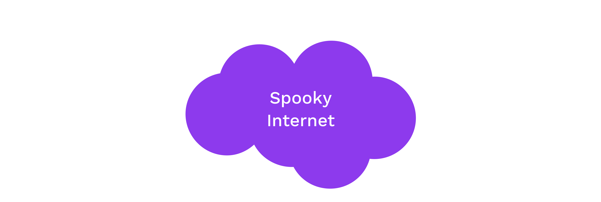

# Encryption

---

## Goals for this lesson

<pba-flex center>

- Learn about symmetric cryptography.
- Understand how symmetric encryption works.
- Learn about asymmetric cryptography.
- Understand how asymmetric encryption works.

</pba-flex>

---

## Symmetric Cryptography

Symmetric encryption assumes all parties begin with some shared secret information, a potentially very difficult requirement.<br>The shared secret can then be used to protect further communications from others who do not know this secret.

In essence, it gives a way of *extending* a shared secret over time.

---

## Symmetric Encryption



Examples: ChaCha20, Twofish, Serpent, Blowfish, XOR, DES, AES

---

## Symmetric Encryption

#### _Example: XOR Cipher_

<pba-cols>
<pba-col>

The encryption and decryption functions are identical: applying a bitwise XOR operation with a key.

</pba-col>
<widget-column style="padding-right: 100px">

```text
Plain: 1010  -->Cipher: 0110
Key:   1100  |          1100
       ----  |          ----
       0110--^          1010
```

Notes:

A plaintext can be converted to ciphertext, and vice versa, by applying a bitwise XOR operation with a key known to both parties.

</pba-col>
</pba-cols>

<!-- TODO one time pad @ ~1:40:00 here: https://drive.google.com/drive/folders/1KgxglGwVf63NhFWf6oyZoDoTlLjihBdK and define entropy w/ discussion -- MENTION ACTIVITY that will use OTP exploit to find key -->
---

## Symmetric Encryption

#### ⚠ Warning ⚠

We typically expect symmetric encryption to preserve little about the original plaintext.
We caution however that constructing these protocols remains delicate, even given secure primitives, with two classical examples being unsalted passwords and the [ECB penguin](https://tonybox.net/posts/ecb-penguin/).

---

### ECB penguin

<br>

<pba-cols>
<pba-col>


_Original image_

</pba-col>
<pba-col>


_Encrypted image_

</pba-col>
</pba-cols>

Notes:

Image sources: https://github.com/robertdavidgraham/ecb-penguin/blob/master/Tux.png and https://github.com/robertdavidgraham/ecb-penguin/blob/master/Tux.ecb.png

---

## Asymmetric Cryptography

- In asymmetric cryptography, we devise a means to transform one value (the "secret") into some corresponding counterpart (the "public" key), preserving certain properties.

- We believe that this is a one-way function (that there is no easy/fast inverse of this function).

- Aside from preserving certain properties, we believe this counterpart (the "public key") reveals no information about the secret.

---

## Asymmetric Encryption

- _Using only the public key_, information can be transformed ("encrypted") such that only those with knowledge of the secret are able to inverse and regain the original information.

---

## Commutative En-/Decryption

In a commutative structure, a message may be encrypted/decrypted<br>multiple times with potentially multiple keys.

The output does not depend on the order of operations.

---


Notes:

Mixing paint example.
Image Source: https://upload.wikimedia.org/wikipedia/commons/4/46/Diffie-Hellman_Key_Exchange.svg

---

## Commutative En-/Decryption

Encrypting a message with key $A$, and then encrypting the ciphertext with key $B$, would result in the same ciphertext had one encrypted with $B$ and then $A$.

\begin{align}
M &=> E_A(E_B(M)) == E_B(E_A(M)) => C \\\\
C &=> D_A(D_B(C)) == D_B(D_A(C)) \ => M
\end{align}

Elliptic curve cryptography is based on _commutative_ algebraic structures.
