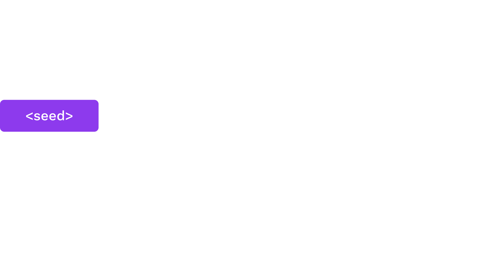
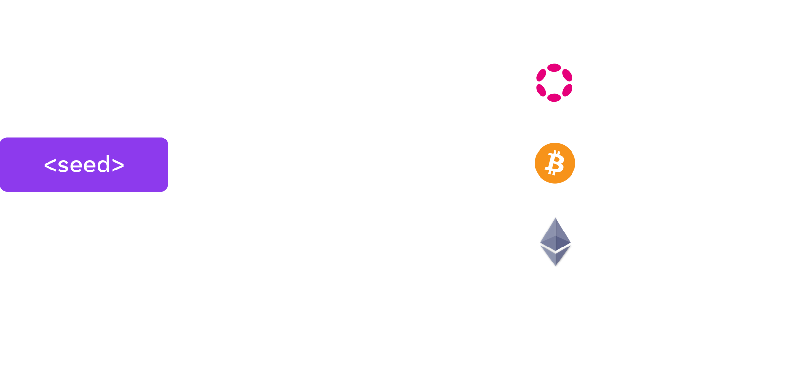

# Digital Signatures Basics

---

## Signature API

Signature libraries should generally all expose some basic functions:

- `fn generate_key(r) -> sk;`   Generate a `sk` (secret key) from some input `r`.
- `fn public_key(sk) -> pk;`   Return the `pk` (public key) from a `sk`.
- `fn sign(sk, msg) -> signature;`   Takes `sk` and a message; returns a digital signature.
- `fn verify(pk, msg, signature) -> bool;`   For the inputs `pk`, a message, and a signature; returns whether the signature is valid.

Notes:

The input `r` could be anything, for example the movement pattern of a mouse.

---

<!-- .slide: data-background-color="#4A2439" -->

# Rust Demo

## Key Generation and Signing

Notes:

See the Jupyter notebook and/or HackMD cheat sheet for this lesson.

1. Generate a secret key
1. Sign a message
1. Verify the signature
1. Attempt to alter the message

---

## Hash Functions

There are two lessons dedicated to hash functions. But they are used as part of all signing processes.

For now, we only concern ourselves with using Blake2.

---

## Hashed Messages

As mentioned in the introduction, it's often more practical to sign the hash of a message.

Therefore, the sign/verify API may be _used_ like:

<pba-flex center>

- `fn sign(sk, H(msg)) -> signature;`
- `fn verify(pk, H(msg), signature) -> bool;`

</pba-flex>

Where `H` is a hash function (for our purposes, Blake2). 
This means the verifier will need to run the correct hash function on the message.

---

## Signing Payloads

Signing payloads are an important part of system design. 
Users should have credible expectations about how their messages are used.

For example, when a user authorizes a transfer, they almost always mean just one time.

---

## Replay Attacks

Replay attacks occur when someone intercepts and resends a valid message. 
The receiver will carry out the instructions since the message contains a valid signature.

<pba-flex center>

- Since we assume that channels are insecure, all messages should be considered intercepted.
- The "receiver", for blockchain purposes, is actually an automated system.

</pba-flex>

Notes:

Lack of _context_ is the problem.
Solve by embedding the context and intent \_within the message being signed.
Tell the story of Ethereum Classic replays.

---

## Replay Attack Prevention

Signing payloads should be designed so that they can only be used _one time_ and in _one context_. 
Examples:

<pba-flex center>

- Monotonically increasing account nonces
- Timestamps (or previous blocks)
- Context identifiers like genesis hash and spec versions

---

## HDKD

Hierarchical Deterministic Key Derivation

---

## Hard vs. Soft

Key derivation allows one to derive (virtually limitless) child keys from one "parent".

Derivations can either be "hard" or "soft".

---

## Hard Derivation

Hard derivation requires the secret key and derives new child secret keys.

Typical "operational security" usages should favor hard derivation over soft derivation because hard derivations avoid leaking the sibling keys, unless the original secret is compromised.

Always do hard paths first, then conclude in soft paths.

---

## Hard Derivation in Wallets

Wallets can derive keys for use in different consensus systems while only needing to back up one secret plus a pattern for child derivation.

 

---

## Hard Derivation in Wallets

Let's imagine we want to use this key on multiple networks, but we don't want the public keys to be connected to each other.

 

---

<!-- .slide: data-background-color="#4A2439" -->

# Rust Demo

## Hard Derivation

Notes:

Hard keys: Take a _path_ (data like a name/index), concatenate with the original key, and hash it for a new key.
They reveal nothing about keys above them, and only with the _path_ between it and children could they be recovered.

---

## Soft Derivation

Soft derivation allows one to create derived addresses from only the public key.
Contrary to hard derivation, _all_ keys are related.

Notes:

- With any key and the paths to children and. or parents, the public _and_ private keys can be recovered.
- Soft derivations can break some niche advanced protocols, but our sr25519 crate avoids supporting protocols that conflict with soft derivations.

---

## Soft Derivation

- Note that these generate new addresses, but use the same secret seed.
- We can also use the same paths, but only using the Account ID from `//polkadot`. It generates the same addresses!

---

## Soft Derivation in Wallets

Wallets can use soft derivation to link all payments controlled by a single private key, without the need to expose the private key for the address derivation.

**Use case:** _A business wants to generate a new address for each payment, but should be able to automatically give customers an address without the secret key owner deriving a new child._

Notes:

See: https://wiki.polkadot.network/docs/learn-accounts#soft-vs-hard-derivation

---

<!-- .slide: data-background-color="#4A2439" -->

# Rust Demo

## Soft Derivation

Notes:

See the Jupyter notebook and/or HackMD cheat sheet for this lesson.

Mention that these derivations create entirely new secret seeds.

---

# Mnemonics and Seed Creation

---

## Mnemonics

Many wallets use a dictionary of words and give people phrases, often 12 or 24 words, as these are easier to back up/recover than byte arrays.

Notes:

High entropy needed.
People are _bad_ at being random.
Some people create their own phrases... this is usually stupid.

---

## Dictionaries

<pba-cols>
<pba-col>

There are some standard dictionaries to define which words (and character sets) are included in the generation of a phrase. Substrate uses the dictionary from BIP39.

</pba-col>
<pba-col>

| No. | word    |
| --- | ------- |
| 1   | abandon |
| 2   | ability |
| 3   | able    |
| 4   | about   |
| 5   | above   |

<pba-flex style="font-size: .6em;" center>

_The first 5 words of the [BIP39 English dictionary](https://github.com/bitcoin/bips/blob/master/bip-0039/english.txt)_

</pba-col>
</pba-cols>

---

## Mnemonic to Secret Key

Of course, the secret key is a point on an elliptic curve, not a phrase.

BIP39 applies 2,048 rounds of the SHA-512 hash function to the mnemonic to derive a 64 byte key.

Substrate uses the entropy byte array from the mnemonic.

---

## Portability

Different key derivation functions affect the ability to use the same mnemonic in multiple wallets as different wallets may use different functions to derive the secret from the mnemonic.

---

<!-- TODO: Gav comments in Cambridge already covered before HDHK? consider moving to Substrate module? -->

# Signature Schemes

---

## ECDSA

- Uses Secp256k1 elliptic curve.
- ECDSA (used initially in Bitcoin/Ethereum) was developed to work around the patent on Schnorr signatures.
- ECDSA complicates more advanced cryptographic techniques, like threshold signatures.

---

## Ed25519

- Schnorr signature designed to reduce mistakes in implementation and usage in classical applications, like TLS certificates.
- Signing is 20-30x faster than ECDSA signatures.

---

## Sr25519

Sr25519 addresses several small risk factors that emerged from Ed25519 usage by blockchains.

---

## Use in Substrate

- Sr25519 is the default key type in most Substrate-based applications.
- Its public key is 32 bytes and generally used to identify key holders (likewise for ed25519).
- Secp256k1 public keys are _33_ bytes, so their _hash_ is used to represent their holders.

---

<!-- .slide: data-background-color="#4A2439" -->

# Questions
