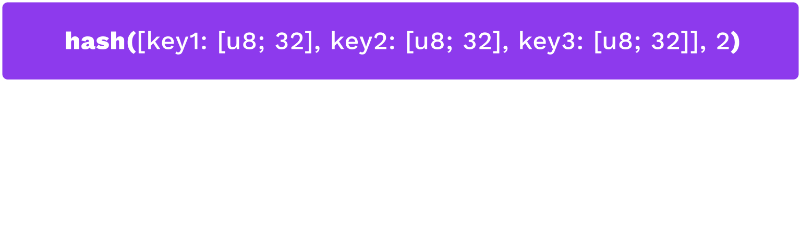

# Hash Functions

---

## Introduction

We often want a succinct representation of some data with the expectation that we are referring to the same data.

A "fingerprint".

---

## Hash Function Properties

1. Accept unbounded size input
1. Map to a bounded output
1. Be fast to compute
1. Be computable strictly one-way (difficult to find a pre-image for a hash)
1. Resist pre-image attacks (attacker controls one input)
1. Resist collisions (attacker controls both inputs)

---

## Hash Function API

A hash function should:

- Accept an unbounded input size (`[u8]` byte array)
- Return a fixed-length output (here, a 32 byte array).

```rust
fn hash(s: &[u8]) -> [u8; 32];
```

---

## Example

**Short input (5 bytes):**

```text
hash('hello') =
	0x324dcf027dd4a30a932c441f365a25e86b173defa4b8e58948253471b81b72cf
```

**Large input (1.2 MB):**

```text
hash(polkadot_runtime-v9190.compact.compressed.wasm) =
	0xc4d194054f03dc7155ccb080f1e6d8519d9d6a83e916960de973c93231aca8f4
```

---

## Speed

Some hash functions are designed to be slow.

These have applications like password hashing, which would slow down brute-force attackers.

For our purposes, we generally want them to be fast.

---

## Speed

<center>

</center>

---

## Non-Cryptographic Hash Functions

Non-cryptographic hash functions provide weaker guarantees in exchange for performance.

They are OK to use when you know that the input is not malicious.

**If in doubt, use a cryptographic hash function.**

---

## One Way

Given a hash, it should be difficult to find an input value (pre-image) that would produce the given hash.

That is, given `H(x)`, it should be difficult to find `x`.

Notes:

We sometimes add random bytes to pre-images to prevent guesses based on context (e.g., if you are hashing "rock, paper, scissors", then finding a pre-image is trivial without some added randomness.)

---

## Second Pre-Image Attacks

Given a hash and a pre-image, it should be difficult to find _another_ pre-image that would produce the same hash.

Given `H(x)`, it should be difficult to find any `x'`

such that `H(x) == H(x')`.

Notes:

Since most signature schemes perform some internal hashing, this second pre-image would also pass signature verification.

---

## Collision Resistance

It should be difficult for someone to find two messages that hash to the same value.

It should be difficult to find an `x` and `y`

such that `H(x) == H(y)`.

---

## Collision Resistance

**Difference from second pre-image attack:**

In a second pre-image attack, the attacker only controls one input.

In a collision, the attacker controls both inputs.

They may attempt to trick someone into signing one message.

Notes:

Attacker has intention to impersonate the signer with the other.

---

## Birthday Paradox

But, remember, collision exists!

_With 23 people, there is a 50% chance that two share a birthday._

Need to compare each output with every other, not with a single one.

Result: Hash function security is only half of the bit space.

Notes:

e.g., a 256 bit hash output yields 2^128 security

---

## Hash Function Selection

<widget-text center>

When users have control of the input, use cryptographic hash functions.

- Non-cryptographic is faster.
- Safe _only_ when the users cannot select the pre-image.

Notes:

Only safe when the users cannot select the pre-image, e.g. a system-assigned index.

Keccak is available for Ethereum compatibility.

---

<!-- .slide: data-background-color="#8D3AED" -->

# Applications

---

## Database Keys

Hash functions can be used to generate deterministic and unique lookup keys for databases.

Notes:

Given some fixed property, like an ID and other metadata the user knows beforehand, they can always find the database entry with all of the content they are looking for.

---

## Data Integrity Checks

Members of a peer-to-peer network may host and share file chunks rather than large files.

In [Bittorrent](https://en.wikipedia.org/wiki/BitTorrent), each file chunk is hash identified so peers can _request and verify_ the chunk is a member of the larger, _content addressed_ file.

Notes:

The hash of the large file can also serve as a signal to the protocol that transmission is complete.

---

## Account Abstractions

Public keys can be used to authorize actions by signing of instructions.

The properties of hash functions allow other kinds of representations, a.k.a one can change the form of the key without changing it's properties to make it fit in specific functions.

---

## Public Key Representation

Because hashes serve as unique representations of other data, that other data could include public keys. A system can map a plurality of key sizes to a fixed length (e.g. for use as a database key).

For example, the ECDSA public key is 33 bytes:

```text
Public key (hex):  0x02d82cdc83a966aaabf660c4496021918466e61455d2bc403c34bde8148b227d7a
Hash of pub key:   0x8fea32b38ed87b4739378aa48f73ea5d0333b973ee72c5cb7578b143f82cf7e9
                                                                                     ^^
```

---

## Multi-Signatures



Notes:

By hashing a concatenation of several public keys, a system can create new IDs that require signature thresholds to authorize activity.

---

## Internal System IDs

Modules within a system may have their own information stored in other parts of the system.

Storage they authorize use of by the module's internal logic. 

Similar intuition to account abstraction and database key.

Notes:

The hash of some input (e.g. a byte-string representing the module) can be used to identify a particular module within a system.

---

## Commitment Schemes

It is often useful to commit to some information without storing or revealing it.

Examples:
- A prediction market would want to reveal predictions only after the confirming/refuting event occurred.
- Users of a system may want to discuss proposals without storing the proposal on the system.
- Citizens vote for a decision and want to reveal that they voted, but not what they voted for.

However, participants should not be able to modify their predictions or proposals.

---

## Commit-Reveal

1. Share a hash of data as a commitment ($c$)
1. Reveal the data itself ($d$)

It is normal to add some randomness to the message to expand the input set size.

$$ hash(message + randomness) => commitment $$

<widget-text style="font-size: smaller;">

Commitment: `0x97c9b8d5019e51b227b7a13cd2c753cae2df9d3b435e4122787aff968e666b0b`

---

## Reveal

Message with some added randomness:

<widget-text style="font-size: smaller;">

> "I predict Boris Johnson will resign on 7 July 2022. facc8d3303c61ec1808f00ba612c680f"

---

## Data Identifiers

Sometimes people want to store information in one place and reference it in another. For reference, they need some "fingerprint" or digest.

As an example, they may vote on executing some privileged instructions within the system.

The hash of the information can succinctly represent the information and commit its creator to not altering it.

---

## Data Structures (in Brief)

This is the focus of the next lecture.

Notes:
For now, just a brief introduction.

---

## Pointer-Based Linked Lists

Pointer-based linked lists are a foundation of programming.

But pointers are independent from the data they reference, so the data can be modified while maintaining the list.

That is, pointer-based linked lists are not tamper evident.

---

<!--
Add linked list picture here
-->

---

## Hash-Based Linked Lists

Hash-based lists make the reference related to the data they are referencing. The properties of hash functions make them a good choice for this application.

Any change at any point in the list would create downstream changes to all hashes.

---

<!--
Add hash-based list picture here
-->

---
# Trees

But lists are unidimensional... What if we need each cell to have multiple children?

That is a tree

---

<!--
Add tree picture here
-->
---

## Merkle Trees

Just like we have hash-based lists, we can have hash-based trees, right?

---

## Merkle Trees


Notes:

Each leaf is the hash of some data object and each node is the hash of its children.

---

## Proofs

Merkle trees allow many proofs relevant to the rest of this course, e.g. that some data object is a member of the tree without passing the entire tree.

**_More info in the next lecture._**
