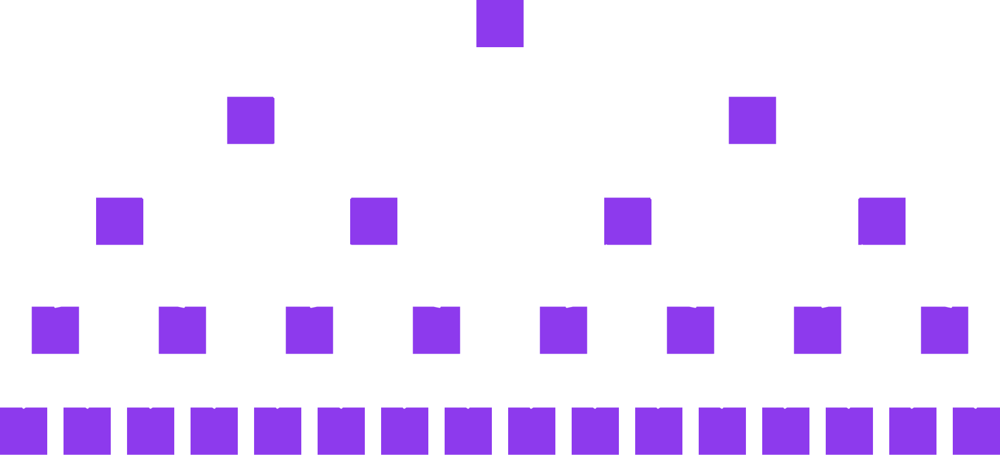
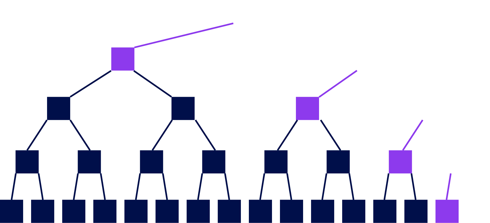
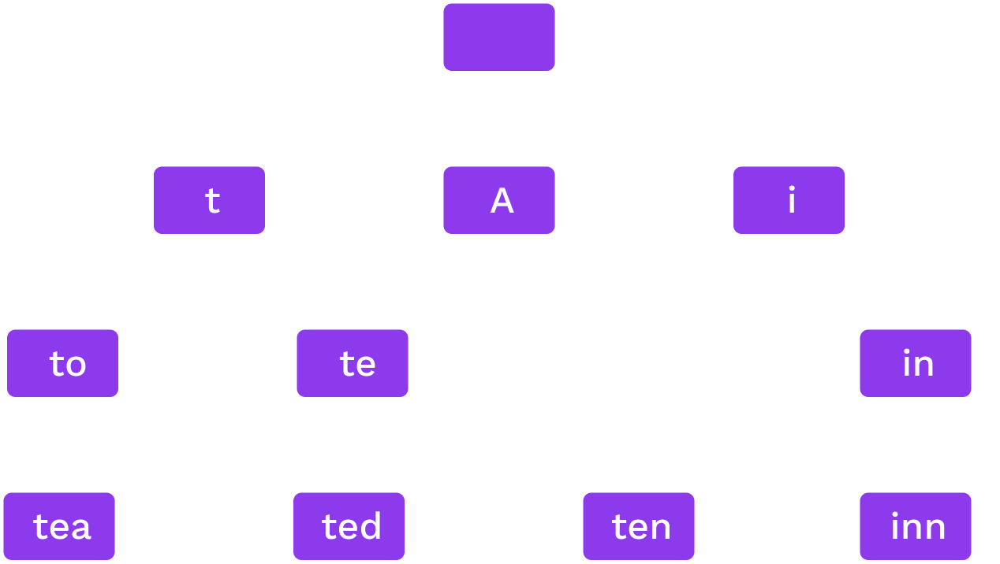
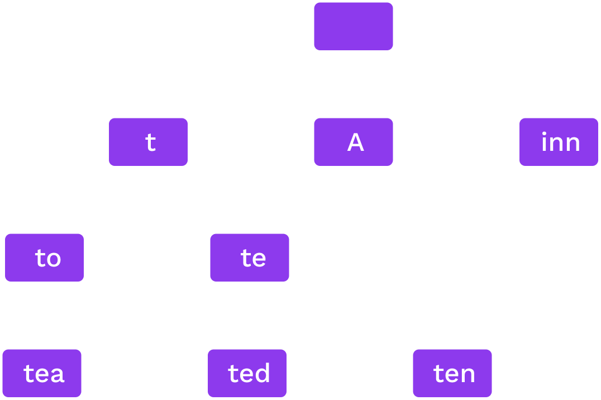
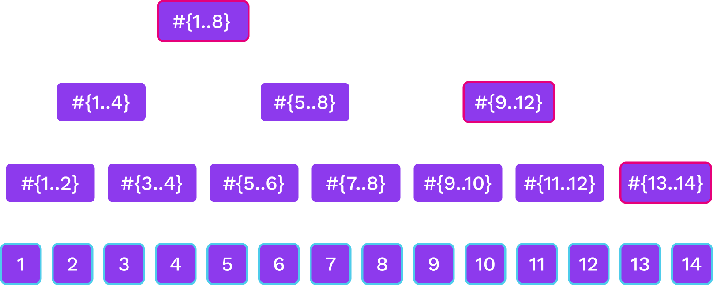

# Hash Based Data Structures

---

## Comparison to Pointer Based Data Structures

- A hash is a commitment to what is in the linked part.
  A pointer tells you where it is
- We can't have cycles of hashes

---

## Hash Chains

---

## Merkle Trees

A binary Merkle tree

---

## Proofs

- The root or head hash is a commitment to the entire data structure
- Generate a proof by expanding some but not all hashes

---

## Proofs: Merkle Copaths

Notes:

Given the children of a node, we can compute a node
Given the purple nodes and the white leaf, we can compute the white nodes bottom to top.
If we compute the correct root, this proves that the leaf was in the tree

---

## Security

- collision resistance
  - can give only-one preimage for each hash
  - so a binding commitment to the link

Notes:

explain what could happen when this fails.

---

- Proof of a leaf has size $O(\log n)$
- and so do proofs of updates of a leaf

---

## Key-Value Databases and Tries

---

## Key-value database

The data structure stores a map `key -> value`

We should be able to:

1. Add new `<key,value>` pairs.
1. Change the value associated with an existing key.
1. For any key, if `<key,value>` is in the database, we can prove it.
1. If no value is associated to a key, we need to be able to prove that as well.

---

## Types of Data Structures

- _**Trees**_ are Rooted, Undirected Acyclic Graphs
- _**Merkle Trees**_ are _trees_ which use hashes as links.
- _**Tries**_ are a particular class of _trees_ where:
  - Given a particular piece of data, it will always be on a particular path.
- _**Radix Tries**_ are a particular class of a trie where:
  - The location of a value is determined the path constructed one digit at a time.
- _**Patricia Tries**_ are _radix tries_ which are optimized to ensure lonely node-paths are consolidated into a single node.

Notes:

Just a selection we'll cover in this course.

---

## Radix Trie

_Words:_ to, tea, ted, ten, inn, A.

Each node splits on the next digit in base $r$

---

## Patricia Trie

_Words:_ to, tea, ted, ten, inn, A.

If only one option for a sequence we merge them.

<!-- TODO maybe some code stuff with extension nodes etc. -->

---

## Hash Trie

- We may pre-hash the data before inserting it
- This improves the balance... except under attack!
- Could be a Merkle trie or regular.

---

## Computational and Storage  Trade-offs

- What radix $r$ is best?
- Proof size of a leaf is $r \log_r n$
  - $r=2$ gives the smallest proof for one leaf

...but:

- higher branching at high levels of the tree can give smaller batch proofs.
- For storage, it is best to read consecutive data so high $r$ is better.

---

## Merkle Mountain Ranges

- Append only data structure
- Lookup elements by number

---

## Merkle Mountain Ranges

Notes:

we have several Merkle trees of sizes that are powers of two.
The trees that are here correspond to the binary digits of 13 that are 1.

---

## Merkle Mountain Ranges

---

## Merkle Mountain Ranges

Notes:

- Not as balanced as a binary tree but close
- Can update the peak nodes alone on-chain

---

## Succinct Proving with Cryptography?

- ZK friendly hashes
- Non-hashed based data structures
  - RSA accumulators
  - Polynomial commitment based
    - Verkle trees
