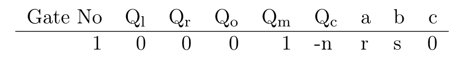
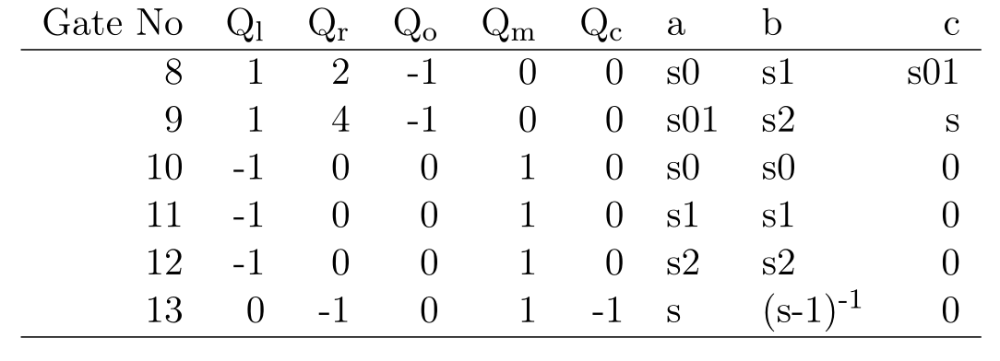

# ZK Proofs

---

# Outline

<pba-flex center>

1. [ZK Proofs overview](#zk-proofs)
2. [Example](#simple-zk-example)
3. [zk-SNARKS](#zk-snarks)
4. [Application of zk-proofs](#zk-application)
5. [Under the hood of zk-proof](#zk-practice)
6. [Generating ZK-proofs using circom and snarkjs](#circom-snarkjs)

</pba-flex>

---

## ZK Proofs

How do we do private operations on a public blockchain and have everyone know that they were done correctly?

Notes:

(we are working on substrate support for these and will use them for protocols)

---

## What is a ZK Proof?

- A prover wants to convince a verifier that something is true without revealing why it is true.

- They are mostly interactive protocols, but mostly we'll turn them  non-interactive and deal with their non-interactive variety. 
---

## What can we show?

- NP relation: `function(statement, witness) -> bool`

- Prover knows a witness for a statement:

  - They want to show that they know it (_a proof of knowledge_)

  - ... Without revealing anything about the witness (_ZK_)

---

## ZK Proof Interface

- NP relation: `function(statement, witness) -> bool`

- `prove(statement, witness) -> proof`

- `verify(statement, proof) -> bool`

---

## ZK Proof Example

_Example:_ Schnorr signatures are ZK Proofs

- They show that the prover knows the private key (the discrete log of the public key) without revealing anything about it.
- The statement is the public key and the witness the private key.

---

## Our ZK Proof Example we study in this module

_Example:_ Prover knows a non-trivial factorization of N.

- Prover wants to prove that they know $N = r \times s$  without revealing $r$ or $s$.

- The Prover should convince us they know the two non-trivial integer $r$ and $s$ that is $r,s \neq 1$ such that:
- $r\times s = N$ in $\mathbb{Z}$
- without revealing any other information about $r$ or $s$.

---
## ZK Proof properties.
 - Completeness: If the claim is true, then it *must* pass `verify(statement, proof) == true`
 - Statistical Soundness: If the claim is false (that is if $s\times r \neq N$ or $r  = 1$ or $s = 1$) then `verify(statement, proof) == false` with high probability.
 - Zero Knowledge: The verifier could fool an external party who was not part of the interaction that they have got a proof form the prover. 
 - The common way of implementing zero knowledge protocol is by means of zk-SNARK
---

## zk-SNARK

**Z**ero-**K**nowledge **S**uccinct **N**on-interactive **Ar**gument of **K**nowledge

- **Zero knowledge** - the proof reveals nothing about the witness that was not revealed by the statement itself.
- **Succinct** - the proof is small
- **Proof of knowledge** - if you can compute correct proofs of a statement, you should be able to compute a witness for it.

---

## What can we show?

- NP relation: `function(statement, witness) -> bool`

  - They want to show that they know it (_a proof of knowledge_)

  - ... Without revealing anything about the witness (_ZK_)

- With a small proof even if the witness is large (_succinctness_)

---

## What can we show?

- There are many SNARK schemes to produce succinct ZK proofs of knowledge (_ZK-SNARKs_) for every NP relation. We concentrate on PLONK in this course.

---

## ZK Proof Scaling

- A small amount of data, a ZK proof, and execution time can be used to show properties of a much larger dataset which the verifier doesn't need to know. 

- "doesn't want to" know as opposed to "is not supposed to" know.

---

## Scaling via ZK Proofs in Blockchain

- Large amount of data - a blockchain
- Verifier is e.g. an app on a mobile phone

Notes:

e.g. Mina do a blockchain with a constant size proof (of correctness of execution and consensus) using recursive SNARKs.

---

## Scaling via ZK Proofs in Blockchain

- The verifier is a blockchain: very expensive data and computation costs.

- Layer 2s using ZK rollups

Notes:

Of which Ethereum has many, ZKsync, ZKEVM etc.
Polkadot already scales better!

---

## Privacy

<pba-flex center>

A user has private data, but we can show publicly that this private data is correctly used. 
An example would a private cryptocurrency:

- Keep who pays who secret
- Keep amounts secret,   _But show they are positive!_

</pba-flex>

Notes:

You can do some of keeping amounts secret without ZK-SNARKs, but the positive part is difficult.
To do everything well, ZK-SNARKs are needed in e.g. ZCash and its many derivatives e.g. Manta.

---

## Making a SNARK out of our factorization problem
- The trick  is to transform our problem of proving the knowledge of factors (witnesses) into
- A problem of knowledge of a certain polynomials.
- Then verifier could ask me questions about those polynomials, and if the prover answer correctly,
- The verifier could be fairly confidant that the prover knows that polynomial hence also the witness.

---

## Making an SNARK for our problem
- A routine way of to turning our problem into a polynomials is:
- To represents our problem into an arithmetic circuit.
- Mathematically This is a n-variate polynomials, with some of the variables are public and some are not.
- Then are algorithms such as PLONK for representing the circuit as few uni-variate polynomials.
---

## The arithmetic circuit of our example
- $x_1*x_2 = N$
- We also need to make sure that prover doesn't fool us with trivial factors.
- $(x_1-1)*\frac{1}{x_1 - 1} = 1$
- $(x_2-1)*\frac{1}{x_2 - 1} = 1$
- We also prevent the prover from fooling us with a factorization like 
- $(N/r) \times r = N$ where $(N/r)$ is not an integer but a modular integer.
- This happens Because we are in a field and everything is invertable. 
- We use binary decomposition to prevent that:
- $x_1 = x_{10} + 2x_{11} + 4x_{12}$ where 
- $x_{ij}$'s are 0 or 1 which we need to prove with:
- $x_{ij} \times (x_{ij} - 1) = 0$

---

## The circuit

 To be: circuit's image

---

## Writing our circuit in Circom
 Circom demo.

---

## Circuit to SNARK Strategy
- To represent the circuit as a univariate polynomial called the "Trace Polynomial".
- The trace polynomial has a root for each gate of the circuit if the solution satisfies the gate relation.
- Then the verifier should be able to test if the polynomial actually has a root for every gate ...
- ... without knowing the polynomial: This is done using polynomial commitment.

---

## Universal PLONK Gate

- Supppose we have a left input $a$ and a right input $b$ and we are doing some addition and multiplication with them and the output is $c$. Then we could encode all of these operations as:

$Q_l\times a + Q_r \times b + Q_o \times c + Q_m \times a\times b + Q_c = 0$

- for some constant $Q_l$ $Q_r$ $Q_o$ $Q_m$ and $Q_c$
- in fact all the operation we discussed can be written using one of these gates.

---

## Gate table for factorization
 $Q_l\times a + Q_r\times b + Q_o\times c + Q_m\times a\times b + Q_c = 0$
 

---

## Gate table for left input to be integer and not 1
 $Q_l\times a + Q_r\times b + Q_o\times c + Q_m\times a\times b + Q_c = 0$
 

---

## Gate table for right input to be integer and not 1
 $Q_l\times a + Q_r\times b + Q_o\times c + Q_m\times a\times b + Q_c = 0$
 

---

## Encode the trace as a polynomial T
- You can always encode a column of a table into a polynomial.
- $Q_l(x)$ such that $Q_l(1) = 0, Q_l(2) = 1, Q_l(3) = 1, Q_l(4) = -1 ,...$
- When you have one polynomial for each column then you can turn the whole table into a polynomial:
- $Q_l(x)\times a(x) + Q_r(x)\times b(x) + Q_o(x)\times  c(x) + Q_m(x)\times a(x)\times b(x) + Q_c(x) = 0$

---

## Compute the trace polynomial from the gate table
 SAGE demo

---

## Prove that Validity of T
- T encode every gate is evaluated correctly: Zero test.
- The wiring is correct: Permutation test (we are not discussing it in this course). 

---

# Zero test
- if f(x) = 0 for x = 1,..,13 then
- $f(x) = q(x) \times  (x-1)\times ...\times (x-13)$
- $f(x)/q(x) = (x-1)...(x-13)$
- How to verifier this.

---

## Zero test on the resulting polynomial.
 SAGE demo

---

# Zero test without knowing the polynomial: Polynomial commitment
- Polynomial commitment is a tool that let the prover announce the value of a polynomial $f(x)$ at some point $u$.
- convince the verifier which it has done so honestly.
- The prover first commit to the polynomial $f(x)$ so later on, they can't back off and cheat (and use another polynomial).
- Then the verifier is going to ask the prover to evaluate the polynomials in random point $u$.
- The verifier is able to be confident that $f(u) = v$.

---

# Zero test using polynomial commitment.
- The prover claims it has $f(x)$ satisfying the circuit.
- The prover is also able to compute $q(x)$ such that 
- $f(x) = q(x) \times  \prod(x-1)..(x-13)$
- The prover commit to $f$ and $q$.
- The verifier ask the prover to provide them with $f(u)$ and $q(u)$ for some random point $u$
- The verifier computes $\prod(u-1)...(u-13)$
- The verifier verifies that $f(u) = q(u)\times \prod(u-1)...(u-13)$ and if so believes that the prover has a solution.

---

# KZG Polynomial-commitment
- Is the most space efficient polynomial commitment.
- Uses elliptic curve cryptography.
- It requires trusted setup: a pre-computation with toxic waste which needs to be discarded to keep the scheme secure.

---

## Making ZK non-interactive
- The only interactive step is when verifier is quizzing prover with a random value $r$.
- We replace that with asking the prover to apply a secure hash function to his commitment to generate $r$.
- That way if the prover changes his commitment his point also changes without his control. 

---

## Use Circom to generate trace polynomials.
 Circom demo

---
## Use snarkjs to generate the KZG parameters.
 Power of $\tau$ ceremony demo with snarkjs
---

## Use snarkjs to generate proofs
 Generate proof demo with snarkjs

---

## Use snarkjs to verify the proofs
Verify the proof snarkjs

---

## Practical Considerations

- Very powerful primitive

- Useful for both scaling and privacy

- One can design many protocols with ZK Proofs that wouldn't otherwise be possible

---

## Downside

- Slow prover time for general computation
- To be fast, need to hand optimize
- Very weird computation model: 
  Non-deterministic arithmetic circuits

---

## Summary
- We discussed the general idea of ZK-Proofs.
- Their application for scalability and privacy.
- We looked how a sample ZK Proof is generated.
- We generate and verify the proof using modern ZK tools.
---

<!-- .slide: data-background-color="#4A2439" -->

# Questions
