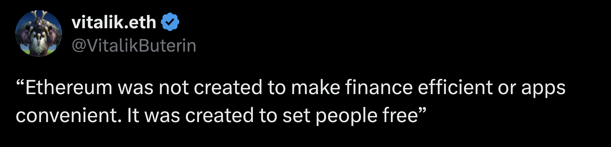

<!-- .slide: data-background-image="../../assets/img/0-Shared/bg/PBA_Background.png" data-background-size="cover" -->
## What is a Blockchain, Actually?

* `@kianenigma`
* kianenigma.com

---

## Prelude: Why My Bank Failed

note:

Let's start with a thought experiment.
I want to start a bank, a wonderful new bank that doesn't loan your money out to anyone else
It is all digital, no cash
Simple interface: Send money to this IBAN, I keep it safe, when you request to withdraw, I will give it back to you
Nobody trusted me
I decided to open-source my entire code-base
Nada
Have it be audited, uesed the best tools to make it secure
I even rewrote the whole thing in Rust
I even ran it in a TEE, attested that it doing the right thing, nada

But then, I legalized my bank, declared it to local regulatros of my country, and put into place where if I misbehave, the local police and courts could come after me, or at least I pretended to do so

And suddenly nobody even cared what my code is.

Truthfully, this is how all of the banks that you currently use work.

Nobody even knows what they do under the hood, just the possibility that they might get caught is enough.

Strong social institutions that enforce rules

---v

## Lack of Trust $\Rightarrow$ Authority

* Particularly exacerbated in the interconnected world we live in today
* Bank: One form of authority to manage our money

---v

## Your Bank

 

> Human-based Authority / Trust

---v

## Bitcoin

 

> Science/Technology-based Authority / Trust

Note:

My failed bank was a poor man's attempt at creating this science-based trust.

---v

## Why Bother?

* Human-based authorities: <!-- .element: class="fragment" -->
	* Corruptible
	* Limited
	* Not auditable
* Science-based authorities: <!-- .element: class="fragment" -->
	* Verifiable
	* Accessible
	* Auditable

---v

## Why Bother?

> absolute power corrupts absolutely

---v

## Revolution

* Bitcoin proved that, while my bank failed, it is in principle possible
* Trillions of dollars are entrusted today with this type of trust
* I can, in fact, with a few clicks, launch an ERC20 token and "run my own bank"

note:

Commoditization of creation of digital authorities

---v

## Not Just Banks

$\Rightarrow$ Contentious Social Interactions $\Leftarrow$

And more..

note:

* Land Registery
* Prediction markets
* Petitions / Donations
* Fundraising
* Freelancing and tipping (gitcoin)
* Gaming and game economies
* Lending compute and storage

And more, though for now it seems that the best use-case for blockchains is for social, and value-bearing interactions

---v

## Web3

* This revolution of creating systems with less/no human-based trust/authorities, and more science-based trust/authorities..
* When applied to the world-wide web Is what I call **Web3**

 

> Applications built with Web3 in mind are often called Decentralized Applications (DApps)

---v

## Trustless

* A system devoid of human-based trust/authorities..
* and enriched with science-based trust/authorities

---

## Blockchain-based Authorities

note:

So we established that we lack trust in the modern interconnecte worlds, and therefore we need authorities to manage our interactions
How can we model these blockchains and authorities

---v

## Decomposing an Authority

* Rules
* State
* Mutations based on user inputs and rules

 

* We can be 100% sure that the rules are respected 🪄

---v

## Model 1: Function

$$
F:(state, inputs) \rightarrow state'
$$

* We can be 100% sure $F$ is executed correctly and all states are correct 🪄

---v

## Model 2: State Machine

<diagram class="mermaid">
%%{init: {'theme': 'dark', 'themeVariables': { 'darkMode': true }}}%%
graph LR
    y((y)) -->|"F(y, input-1)"| yp(("y′")) -->|"F(y′, ...)"| ypp(("y″"))
</diagram>

* We can be 100% sure $F$ is executed correctly and all states are correct 🪄

---v

## Model 3: (Trustless) Computer

* Code (rules)
* Memory (state)
* Execution user inputs (mutations)

 

* We can be 100% sure the computer's code is executed correctly and all memories are correct 🪄

note:

Here we can connect this to my failed bank -- this computer is what my bank needed!

---v

## Bitcoin as An Authority:

* Rules: Valid transfer of BTC (based on UTXO model)
* State: How much BTC each person has
* Mutations:
	* Transfer of BTC between people, always signed by the `sk` sender
	* Bundled as a block of transactions

---v

## Sphere of Influence

* Bank of Portugal cannot confiscate the money I own in Singapore
* Each authority has a sphere of influence <!-- .element: class="fragment" -->
* For blockchain-based authorities, this is the their state <!-- .element: class="fragment" -->

---v

## Sphere of Influence

* Bitcoin's code/rules can freely:
	* Read how much BTC I have
	* Perform a valid transfer of BTC (**law enforcement!**)

---v

## The Real-World-Asset (RWA) Scam

* No blockchain can assert if:
	* I own a piece of gold
	* Force me to sell it to someone else

---v

## The Real-World-Asset (RWA) Scam

* Oracle Problem
* Chains of Trust
	* Bridges <!-- .element: class="fragment" -->
	* Tokenized RWAs <!-- .element: class="fragment" -->
	* Weakest Link Problem! <!-- .element: class="fragment" -->

---v

## Is It Really a Scam?

1. Science-based trust can be a spectrum 🤔
2. Blockchain-based authorities have multiple benefits, we chose a subset in such systems

---

## 3 Properties

* Verifiable Execution of Rules
* Correct Ordering of all events, and re-auditing of past events
* Accessible to all

 

> Trustless compute and storage under consensus

note:

1. As said before, blockchains bring about this property, where they provide guarantees that the whole system as a whole is correctly following its rules correctly.
	* Current latest state of the blockchain is correct
2. Besides this, it collects and retains evidence about what the exact order of all past events where that lead to current state
	* And what the exact order of past events were that led to current state
3. Ideally, it is accessible to all, as long as they meet the rules of the system
	* Ethereum doesn't let you transact with it if you don't pay for gas

---v

## RWA: Not a Scam, But..

2 out of 3 properties are fully met

note:

* My address owning 1 BTC
* My address owning 1000$ worth of some RWA

Verifiability is partial, rest is met

Ethereum can never excert with the same degree of confidence that you won a tokenized house on the Ethereum network, than that of owning ETH on the network.
But Auditability, and accessibility are fully met.

---

## Blockchains 101

notes:

Okay, enough with theoretical stuff, let's learn a bit more concretely about blockchains

Authoring:
Blockchains are a network of nodes, each running some software, called the "blockchain node software"
None of these nodes trust each other, yet they all encode within themselves the ruls of the blockchain
They each also hold their local copy of the blockchain's state
Users send their transactions (instrusctions) to different nodes, and nodes may gossip them to one another
Every now and then, one of these nodes, based on the rules of the blockchain is eligible to author a new block
Block author will create a new block, updates its local state, and send the block + an attestation of what the new state should be to other nodes
All other nodes verify that the rules were respected, with their local copy of the state and the ndoe software
Repeat

Genesis and Syncing:
Each node retains all of the previous blocks, such that it can always re-execute them, and re-verify all of the intermediary states

Alliances:
Sometimes, bank of Singapore might give limited (or full) access to Bank of Portugal to interact with it
Blockchains can do the same, and exchange messages, and in turn let other blockchains influence their state
This is called bridges, and when blockchains connect to one another.

Conclusion:
I have not really talked about how blockchains work, but if you even look at that, you will soon see that in systems that we as a whole call blockchains, blockchain is just one of the many components, and it only brings about 1 of the 3 properties: Ordering and auditable history of events.

---

## Evolution of Blockchains

As trustless compute and storage providers.

* Fixed Code (Bitcoin)
* Smart Contracts (Ethereum L1) <!-- .element: class="fragment" -->
* Rollups (Polkadot, Layer 2s, etc) <!-- .element: class="fragment" -->
* JAM (Supercomputer) <!-- .element: class="fragment" -->

notes:

1. Bitcoin, fixed state-transition-function
2. Ethereum: programmable state-transition-function
3. Polkadot: programmable state-transition-function, allowing multiple blockchains to coexist and interoperate
4. JAM: blockchain-based super-computer, running arbitrary code with much higher degree of flexibility

---

## The Bigger Picture

* (2013) Bitcoin was a proof of concept that it is possible to establish trustless compute and storage under consensus
* (2016) Ethereum was a proof of cocept that this can be generalized

---v

## The Bigger Picture

* Next decade (2016 - today):
	* Scaling the existing system (not expanding the horizon)
	* DeFi (PMF - money to be made)
	* Scam

---v

## The Bigger Picture

* Expanding the horizon
* Invention << Innovation

notes:

Making cars faster vs. Learning how to fly

I am glad to see that Polkadot, while it innovated on scaling a lot, it also invented a lot of new paradaigms:

* Layer 2s
* PVM and forkless upgrades
* Today: storage, privacy, personhood, etc.

---v

## The Bigger Picture

* Trustless computation and storage under consensus is not everything!
* What went missing:
	* computation and messaging outside of consensus
	* Storage
	* Privacy
	* Identity and personhood

---v

## The Bigger Picture

notes:

More examples in https://blog.kianenigma.com/what-blockchain-actually/Content/What/The-Bigger-Picture

---v

## The Bigger Picture

The challenge of for the next decade:

notes:

These components received some attention throughout the last decade, but not with the same degree of success or investment.

Next decade of blockchain development is a challenge to either:

* Solve the above problems, expand blockchain systems to the broader Web3 mission
* Admit defeat, and let it all be a new financial system, which is ever more being integrated into the existing one, rather than replacing it.

---v

## The Bigger Picture

notes:

https://x.com/VitalikButerin/status/2008174642066845778

---

## How To Think About Web3 Applications

note:

Look into your list of applications, websites, and serviced that you use, and ask yourself:

* In which ones I am interacting with other people over a contentious matter, and the platform is acting as an intermediary to establish that trust?
* In which ones I am revealing more data about myself than I should to the intermediary?
* In which ones the platform has an outsized control over the network and user-data, and can form a monopoly over it? Or it would be catastrophic if it decided to abuse it?

Recent example that I have been thinking about:

* ClassPass
* Self-guaranteeing promise

---

## Questions?

(Full text of the presentation)

