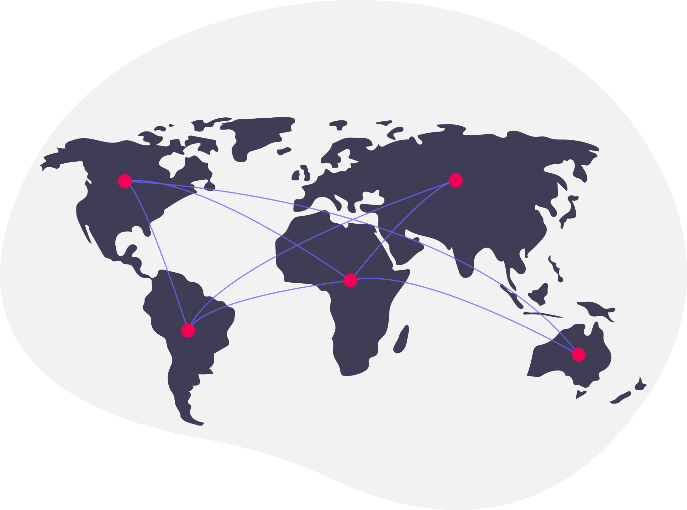
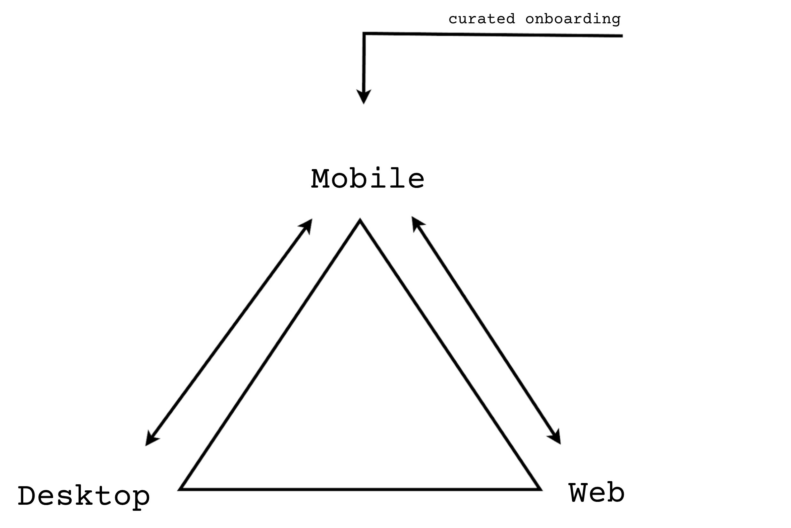

<!-- .slide: data-background-image="../../assets/img/0-Shared/bg/PBA_Background.png" data-background-size="cover" -->

# The Polkadot Stack

---

## The Driving Force

The world we live in has problems:

<div class="flex-container">
<div class="left">

- Financial Corruption
- Political Control
- Digital Servitude
- Erosion of Sovereignty
- Systemic Fragility
- and more…

</div>
<div class="right">



</div>
</div>

These problems all stem from the same place:

> **The growing power of central authorities.**

---

## A Simple Set of Conjectures

- Central authorities will always (eventually) abuse their powers.
<!-- .element: class="fragment" -->
- With the increasing globalization caused by technology, the reach of central authorities is greater than ever.
<!-- .element: class="fragment" -->
- Computers play a critical role in providing public digital infrastructure.
<!-- .element: class="fragment" -->
- We could create a world more resilient from these powers, if the world's public digital infrastructure were itself more decentralized and resilient.
<!-- .element: class="fragment" -->

> **Web3 describes that resilient public digital infrastructure.**

<!-- .element: class="fragment" -->

---

## The Great Mistake

Blockchain is not a product in and of itself.

The world does not want or need "more blockchains".

It is simply a tool that can be used to create **resilient products**.

---

## Two Different Products

Both built using blockchain technology.

<pba-cols class="text-small">
<pba-col>

#### Distributed Ledger Technology

- The primary purpose is to **store** data.
- The primary part of this product is the blockchain state.
- The backbone of decentralized finance.
- Think: Bitcoin, XRP, BNB, Solana.
- A proven product with clear market demand.

</pba-col>
<pba-col>

#### Decentralized Computer

- The primary purpose is to **execute** computation.
- The primary part of this product is the decentralized computation bandwidth.
- The backbone of the decentralized internet.
- Think: a decentralized AWS.
- A speculative but necessary future.

</pba-col>
</pba-cols>

---

## Who Does the World Computer Appeal To?

<div class="text-small">

- **A Distributed Computer**
  - a distributed computer is one which has natural fallback, and can provide incredible uptime and replication guarantees.
- **A Verifiable Computer**
  - a verifiable computer is one where people need not require trust in the platform or the other users they interact with.
- **A Resilient Computer**
  - a resilient computer is one where applications and services need not worry about the restrictions / laws of any particular nation, and can launch unstoppable applications.
- **A Financial Computer**
  - a platform which natively integrates global finances into your platform, and enables direct integration between you and your customers.

</div>

---

## Polkadot: Infrastructure for the Decentralized Web

Polkadot is building a **decentralized Web3 Cloud**:

- **Compute** - Execution sharding across multiple cores
- **Storage** - Persistent on-chain state and data availability
- **Networking** - Cross-chain messaging and trustless bridges
- **Identity** - On-chain identity, personhood, and name resolution
- **Finance** - Native token economics and DeFi primitives

> Polkadot will do to Web3 what AWS did to Web2.

---

## How Polkadot Delivers This

Polkadot fulfills this vision across three layers:

1. **Polkadot Triangle**: User Interfaces
1. **Polkadot Stack**: Developer Tools
1. **Polkadot Platform**: Web3 Cloud Infrastructure

---

## Agenda

1. **Why Polkadot Exists** - The Decentralized Web
1. **Polkadot Platform** - The Web3 Cloud Infrastructure
1. **Polkadot Stack** - Developer Tools & Experience
1. **Polkadot Triangle** - User Interfaces
1. **Putting It All Together** - The Complete Picture

---

# Polkadot Platform

## Web3 Cloud Infrastructure

---

## The Relay Chain

The **heart** of the Polkadot network.

- Provides **shared security** to all connected chains
- Validates and secures parachain blocks
- Does **NOT** host user applications directly
- The goal of being "Transaction-less"

<diagram class="mermaid">
graph TB
    RC["Relay Chain (Shared Security)"]
    RC --- AH["Asset Hub"]
    RC --- BH["Bridge Hub"]
    RC --- CT["Coretime"]
    RC --- PC["People"]
    RC --- CO["Collectives"]
    RC --- BC["Bulletin"]
    RC --- P1["Your Chain"]
</diagram>

---

## Asset Hub

The **primary user-facing chain** in the Polkadot ecosystem.

<div class="grid grid-cols-2">
<div class="text-left">

**Assets:**

- DOT native token management
- Fungible assets (tokens)
- NFTs (non-fungible tokens)
- DEX / asset conversion
- DOT native stable coin

</div>
<div class="text-left">

**Smart Contracts:**

- **pallet-revive**: EVM-compatible smart contracts
- Deploy Solidity to both **EVM** and **PolkaVM**
- Full Ethereum tooling support (MetaMask, Hardhat, Foundry)

</div>
</div>

and Governance, Staking, Identity, Utilities, etc...

---

## Other System Chains & Parachains

Parachains chains share security from the Relay Chain and communicate via **XCM** (cross-consensus messaging).

<div class="text-small">

| Chain                 | Purpose                                                                   |
| --------------------- | ------------------------------------------------------------------------- |
| **Bridge Hub**        | Connects Polkadot to external networks like Bitcoin, Ethereum and Kusama  |
| **Coretime**          | Marketplace for blockspace to buy cores for decentralized compute         |
| **People**            | On-chain identity and Proof-of-Personhood for sybil resistance            |
| **Collectives**       | Governance bodies, Technical Fellowship                                   |
| **Bulletin**          | Persistent and IPFS-compatible data storage                               |
| **Custom Parachains** | Build with Polkadot SDK (FRAME), deploy via Coretime, get shared security |

</div>

---

# Polkadot Stack

## Developer Tools & SDKs

---

## Polkadot SDK

The **monorepo** containing all core components for building on Polkadot.

<div class="grid grid-cols-3 text-small">
<div class="text-left">

**Substrate**

The blockchain framework.

- Node infrastructure
- Networking (libp2p)
- Consensus engines
- Database (RocksDB)
- RPC server
- WASM executor

</div>
<div class="text-left">

**FRAME**

The runtime framework.

- 120+ pallets
- Storage abstractions
- Dispatchable calls
- Events & errors
- Benchmarking
- Migrations

</div>
<div class="text-left">

**Cumulus**

The parachain toolkit.

- Parachain system pallet
- Collator logic
- Relay chain integration
- XCM support
- Omni-node binary

</div>
</div>

---

## FRAME: Building Blocks

**F**ramework for **R**untime **A**ggregation of **M**odularized **E**ntities

A **pallet** is a module of encapsulated blockchain logic:

- **Config** - configurable types and values
- **Storage** - on-chain state
- **Calls** - dispatchable functions (extrinsics)
- **Events** - observable outcomes
- **Errors** - well-formed error types
- **Hooks** - lifecycle callbacks

---

## Smart Contracts: pallet-revive

Write **Solidity** or **Rust** and deploy to Polkadot.

<diagram class="mermaid">
graph LR
    SOL["Solidity Source Code"]
    SOL -->|"solc"| EVM["EVM Bytecode (REVM)"]
    SOL -->|"resolc"| PVM["PVM Bytecode (PolkaVM / RISC-V)"]
    RUST["Rust Source Code"]
    RUST -->|"rustc + revive"| PVM
    EVM --> PR["pallet-revive (Asset Hub)"]
    PVM --> PR
</diagram>

<div class="text-left text-small">

- **Solidity** compiles to two targets: **EVM** (via `solc`) and **PVM** (via `resolc`)
- **Rust** compiles directly to **PVM** (PolkaVM / RISC-V) for native performance
- **EVM**: traditional Ethereum bytecode, runs in REVM interpreter
- **PVM**: PolkaVM (RISC-V based), native to Polkadot, more efficient
- All deployed through the same chain, same pallet

</div>

---

## The eth-rpc Sidecar

**Bridging Ethereum tooling to Substrate.**

<diagram class="mermaid">
graph LR
    MM["MetaMask Hardhat Foundry viem / ethers.js"]
    MM -->|"Ethereum JSON-RPC (port 8545)"| ETH["eth-rpc Sidecar"]
    ETH -->|"Substrate WebSocket"| NODE["Substrate Node"]
</diagram>

<div class="text-left">

- Runs as a **standalone process** alongside your Substrate node
- Translates Ethereum JSON-RPC calls into Substrate calls
- Supports: `eth_sendRawTransaction`, `eth_call`, `eth_getLogs`, `debug_traceTransaction`, etc.
- Maintains a **SQLite index** for receipts and blocks
- Pre-configured **dev accounts** for local development

</div>

---

## PAPI: Polkadot API

The modern **TypeScript** client for Polkadot.

<div class="grid grid-cols-2">
<div class="text-left">

**Key Features:**

- **Light-client first** - built on smoldot
- **Multi-chain first** - designed for cross-chain workflows
- **Typed API** - generated from on-chain metadata
- **Native BigInt** - no heavy BigNumber libraries
- **Promise & Observable APIs**

Replaces the older polkadot.js library.

</div>
<div>

```typescript
import { createClient } from "polkadot-api";
import { getSmProvider } from "polkadot-api/sm-provider";

// Connect via light client
const client = createClient(
  getSmProvider(
    smoldot.addChain({
      chainSpec,
    })
  )
);

// Typed storage query
const claim = await client.getTypedApi(descriptors).query.TemplatePallet.Claims.getValue(hash);
```

</div>
</div>

---

## subxt: Rust Client

The **Rust** equivalent of PAPI.

<div class="grid grid-cols-2">
<div class="text-left">

**Key Features:**

- **Typed API** from metadata
- **Dynamic API** for untyped access
- Full chain interaction: storage, extrinsics, events, blocks

Name stands for "**sub**mit e**xt**rinsics".

</div>
<div>

```rust
use subxt::{OnlineClient, PolkadotConfig};

let api = OnlineClient::<PolkadotConfig>
    ::from_url("ws://localhost:9944")
    .await?;

// Dynamic storage query
let claim = api.storage()
    .at_latest().await?
    .fetch(&subxt::dynamic::storage(
        "TemplatePallet",
        "Claims",
        vec![hash.into()],
    )).await?;
```

</div>
</div>

---

## Ethereum Tooling

Use your existing Ethereum skills and tools.

<div class="text-left">

**Frontend (TypeScript):**

- **viem** - modern, typed Ethereum client
- **ethers.js** - the classic
- **wagmi** - React hooks for Ethereum

**Backend (Rust):**

- **alloy** - next-gen Rust Ethereum library

**Development:**

- **Hardhat** - with `@parity/hardhat-polkadot`
- **Foundry** - forge, cast, anvil
- **MetaMask** - wallet

</div>

---

## DotNS: .dot Name Service

Human-readable names for the Polkadot ecosystem. Like ENS, but on Polkadot.

<diagram class="mermaid limit">
graph LR
    U["User types myapp.dot"] --> H["Host resolves name"]
    H --> C["DotNS Contract (Asset Hub)"]
    C --> CID["IPFS CID"]
    CID --> APP["dApp loads in sandbox"]
</diagram>

- Register `myapp.dot` → points to an IPFS CID (your dApp frontend)
- Solidity contracts on Asset Hub (via pallet-revive)
- Verified unique humans (personhood) get a free .dot name

---

## Development Infrastructure

<div class="grid grid-cols-2">
<div class="text-left">

**Local Development:**

- **Zombienet** - spin up local multi-chain networks
- **polkadot-omni-node** - generic parachain node binary
- **chain-spec-builder** - generate chain specifications

**Deployment:**

- Deploy to **Paseo testnet** (Polkadot's testnet)
- Deploy frontends to **IPFS** (web3.storage / Bulletin Chain)
- Register **.dot domains** via DotNS

</div>
<div class="text-left">

**Debugging & Monitoring:**

- **Blockscout** - block explorer with EVM support
- **Polkadot.js Apps** - Substrate explorer and governance UI
- **eth-rpc debug APIs** - transaction tracing
- **PAPI devtools** - chain interaction debugging

**Package Management:**

- **psvm** - Polkadot SDK Version Manager
- **Umbrella crate** - single dependency for polkadot-sdk

</div>
</div>

---

## Developer Stack Summary

<diagram class="mermaid">
graph TB
    subgraph Languages["Write In"]
        RUST["Rust (Pallets, CLI)"]
        SOL["Solidity (Contracts)"]
        TS["TypeScript (Frontend)"]
    end

    subgraph Frameworks["Build With"]
        FRAME["FRAME"]
        HH["Hardhat + resolc"]
        REACT["React + Vite"]
    end

    subgraph Libraries["Connect Via"]
        SUBXT["subxt"]
        ALLOY["alloy"]
        PAPIL["PAPI"]
        VIEML["viem"]
    end

    subgraph Access["Access Through"]
        WS["Substrate WS RPC"]
        HTTP["eth-rpc (port 8545)"]
    end

    RUST --> FRAME
    RUST --> SUBXT
    RUST --> ALLOY
    SOL --> HH
    TS --> REACT
    TS --> PAPIL
    TS --> VIEML

    FRAME --> WS
    SUBXT --> WS
    PAPIL --> WS
    ALLOY --> HTTP
    VIEML --> HTTP
    HH --> HTTP

</diagram>

---

# Polkadot Triangle

## User Interfaces

---

## The Polkadot Triangle



---

## The Triangle Architecture

<diagram class="mermaid limit">
graph LR
    Product["Product (Your dApp)"] -->|"window.host"| Host["Host (Triangle User Agent)"]
    Host -->|"Light client / RPC"| Chain["Blockchain"]
</diagram>

- **Host** owns security: wallet, keys, light clients, IPFS, DotNS
- **Product** runs in a strict sandbox: no network access, no key access
- **Blockchain** provides state: Asset Hub, Bulletin Chain, custom chains

---

## Triangle User Agents

<div class="grid grid-cols-3">
<div class="text-left">

**Mobile (Key Authority)**

iOS + Android

- Owns your private keys
- Biometric auth (Face ID, fingerprint)
- Signs transactions for Desktop and Web
- Curated onboarding for new users

</div>
<div class="text-left">

**Desktop**

Built with Tauri + Rust

- Full dApp host with sandbox
- Delegates signing to Mobile
- Maximum performance
- macOS, Linux, Windows

</div>
<div class="text-left">

**Web (dot.li)**

Browser-based

- Full dApp host, no install needed
- Delegates signing to Mobile
- JS smoldot light client
- PAPI for chain interaction

</div>
</div>

---

## Host SDK (UserAgentKit)

What the host provides to your dApp:

<div class="grid grid-cols-2">
<div class="text-left">

**Core Capabilities:**

- **Wallet** - BIP-39, sr25519, Ed25519, secp256k1
- **Light Clients** - smoldot (Substrate), Helios (Ethereum), Kyoto (Bitcoin)
- **DOTNS Resolution** - `.dot` name to IPFS content
- **IPFS** - P2P Bitswap + HTTP gateway fallback
- **Statement Store** - off-chain pub/sub messaging

</div>
<div class="text-left">

**Extensions (`window.host.ext.*`):**

- **data** - peer-to-peer data channels
- **media** - audio/video calls
- **files** - file saving
- **mesh** - distributed object storage
- **crdt** - collaborative editing
- **vrf** - Bandersnatch ring VRF

</div>
</div>

---

## Product SDK

What your dApp uses to talk to the host:

```typescript
import { getAddress, navigateTo, statements, storage } from "@polkadot-apps/product-sdk";

// Get the current user's account
const address = await getAddress();

// Navigate to another .dot product
navigateTo("other-app.dot");

// Scoped key-value storage
await storage.set("key", "value");

// Pub/sub via statement store
statements.subscribe(topic, msg => console.log("New message:", msg));
await statements.write(topic, payload);
```

---

## Product Isolation

Your dApp runs in a **strict sandbox**.

<div class="text-left">

**What products CANNOT do:**

- No network access (`connect-src 'none'`)
- No WebSocket, WebRTC, Workers, BroadcastChannel
- No localStorage, cookies, or caches
- No access to `window.ethereum`, `window.polkadot`, etc.
- No auto-approval of signing requests

**What products CAN do:**

- Run JavaScript and WASM
- Communicate through `window.host` bridge
- Request signatures (user must confirm each one)

</div>

---

## The .dot Resolution Flow

What happens when a user navigates to `myapp.dot`:

<diagram class="mermaid">
sequenceDiagram
    participant U as User
    participant H as Host (dot.li)
    participant C as Asset Hub
    participant I as IPFS Network

    U->>H: Navigate to myapp.dot
    H->>H: namehash("myapp.dot")
    H->>C: ReviveApi::call(DotNS contenthash)
    C-->>H: IPFS CID
    H->>I: Fetch content (Bitswap + HTTP)
    I-->>H: dApp bundle (HTML/JS/CSS)
    H->>H: Load in sandboxed iframe
    H-->>U: dApp renders

</diagram>

---

# Putting It All Together

---

## The Complete Flow

<diagram class="mermaid">
graph TB
    subgraph Dev["Developer Builds"]
        D1["FRAME Pallet (Rust)"]
        D2["Solidity Contract"]
        D3["React Frontend (PAPI + viem)"]
    end

    subgraph Deploy["Deploy To"]
        E1["Parachain Runtime (via Coretime)"]
        E2["Asset Hub (via eth-rpc)"]
        E3["IPFS (via Bulletin Chain)"]
        E4["DotNS (myapp.dot)"]
    end

    subgraph User["User Accesses"]
        U1["dot.li / Desktop / Mobile"]
        U2["Resolves myapp.dot"]
        U3["Loads from IPFS"]
        U4["Interacts via Host"]
    end

    D1 --> E1
    D2 --> E2
    D3 --> E3
    E3 --> E4

    E4 --> U2
    U1 --> U2
    U2 --> U3
    U3 --> U4
    U4 -->|"PAPI / viem"| E1
    U4 -->|"PAPI / viem"| E2

</diagram>

---

<!-- .slide: data-background-color="#000000" -->

# Questions
