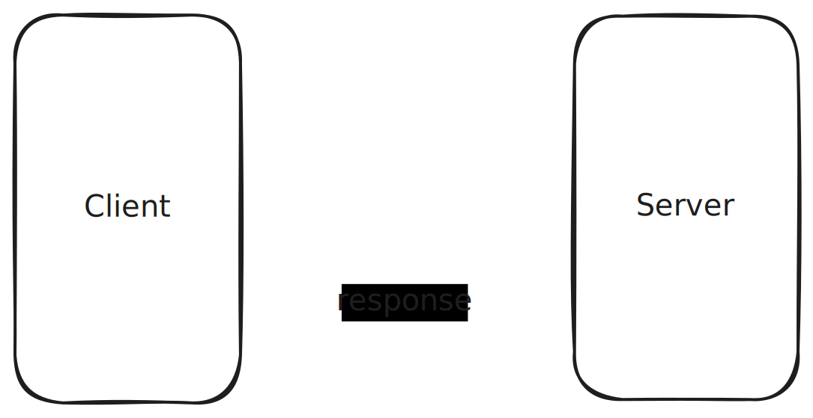
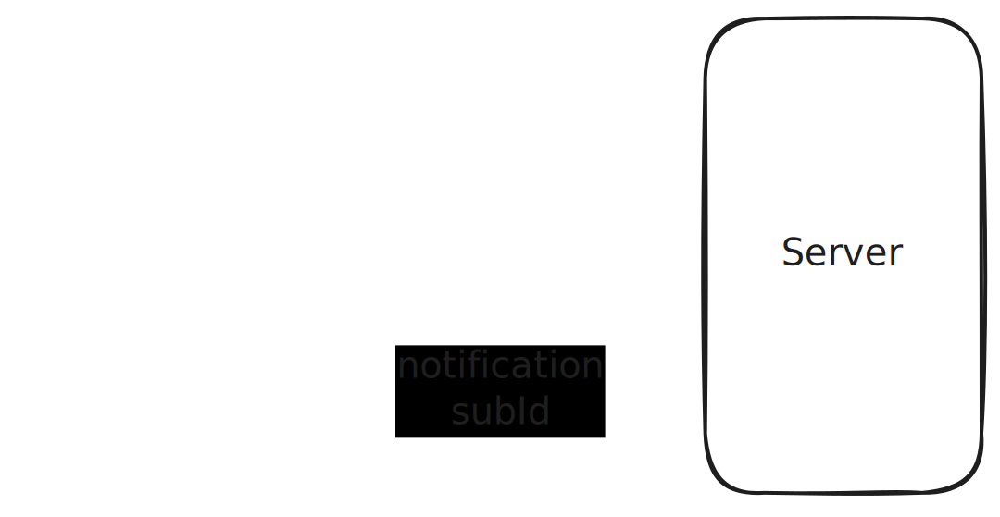

# JSON-RPC Spec

---

# JSON-RPC Spec

## What you will learn:

- What is JSON-RPC (v2)
  - Its stateless design
  - Conventions to make it stateful

<!-- .element: class="fragment" -->

- Do nodes have to expose JSON-RPC APIs?

<!-- .element: class="fragment" -->

- Legacy JSON-RPC APIs (Hands-on)
  - Summary of probems

<!-- .element: class="fragment" -->

- Modern JSON-RPC: Introduction and goals
  - Overview of the new JSON-RPCs APIs
  - Hands-on examples

<!-- .element: class="fragment" -->

---

## JSON-RPC 2.0

- JSON-RPC is a stateless, transport agnostic, light-weight remote procedure call (RPC) protocol.<!-- .element: class="fragment" -->
- Defines basic data-structures and the rules around their processing. It is transport agnostic.<!-- .element: class="fragment" -->

---

## JSON-RPC 2.0 - Request Object

```ts
{
  id: number | string | null,
  method: string,
  params?: Array<any> | Record<string, any>
}
```

---

## JSON-RPC 2.0 - Notification Object

```ts
{
  method: string,
  params?: Array<any> | Record<string, any>
}
```

Notes:

Like `Request` but without an `id`

---

## JSON-RPC 2.0 - Response

##### Success

```ts
{
  id: number | string | null,
  result: any
}
```

##### Error

```ts
{
  id: number | string | null,
  error: {
    code: number,
    message: string,
    data?: any
  }
}
```

Notes:

`code`: number that indicates the type of error. Error codes from -32768 to -32000 are reserved for pre-defined errors.

---

## JSON-RPC 2.0 Examples

https://www.jsonrpc.org/specification#examples

---

## Stateful connections and subscriptions



Notes:

https://excalidraw.com/#json=d-_ZoxX3cx8MJYiniJ0uS,i8WuAaK0yuV1kUT3TbDbIQ

JSON-RPC is designed on a client-server model of request/responses, as it is transport-agonstic and this way it can support transports that don't have server->client notifications.

If we want those kind of communications, to support things like subscriptions, we can just compose it by flipping the client/server roles (as long as the transport we use allows it).

---

## Stateful connections and subscriptions



---

## Stateful connections and subscriptions

```ts
>> { id: 0, method: "subscribe_to_news", params: { cb: "news_update" } }
<< { id: 0, result: "news-sub-1" }
…
<< { method: "news_update", params: { title: "PBA dev compiles runtime in under 4 hours. Community demands to know their secrets" } }
```

---

# JSON-RPC in Polkadot

- "Legacy" API <!-- .element: class="fragment" -->
- New JSON-RPC Spec API <!-- .element: class="fragment" -->

Notes:

Initially, the JSON-RPC methods to interact with a chain were all created ad-hoc, with no proper spec.

This created many inconstistencies across different methods, others that do the same behaviour but differently, and also incompatibilities with light clients.

There was a turning point when they decided to write a proper spec with a set of methods that tailor multiple actors.

---

# Do nodes have to expose JSON-RPC APIs?

- Different kinds of nodes, and differet kinds of usages:<!-- .element: class="fragment" -->

  - Light-node<!-- .element: class="fragment" -->
  - Full-node<!-- .element: class="fragment" -->
  - Archive-node<!-- .element: class="fragment" -->

- Different kinds of consumers<!-- .element: class="fragment" -->
  - Dapps<!-- .element: class="fragment" -->
  - Indexers<!-- .element: class="fragment" -->
  - Wallets<!-- .element: class="fragment" -->
  - Bridges<!-- .element: class="fragment" -->
  - Monitoring systems, node-admins, etc<!-- .element: class="fragment" -->

**Notes:**

- First ask users to list the different kinds of nodes that they are aware off.
- Ask them about different kinds of usages for different kinds of nodes.
- Explain why it makes sense to have different groups of functions depending on the type of node.

---

# Legacy JSON-RPC APIs (Hands-on)

**Notes:**

- Start by googling "polkadot json-rpc" and explaining why what we got into the results is very sad.
- Go to: https://polkadot.js.org/docs/substrate/rpc/
  - Briefly explain why that is a complete cluster-fuck
  - From the terminal try the `getHeader` API, show the returned payload and discuss the implications
  - From the terminal: use `substribeAllHeads` and explain the implications from a load-balancer stand-point
  - From the terminal: `state_call` vs `state_getMetadata`, why does `state_getMetadata` exist?

---

## Summary of problems

- Poorly documented<!-- .element: class="fragment" -->
- "Leaky": many endpoins are tightly-coupled to specific runtimes<!-- .element: class="fragment" -->
- Bad defaults: uses the best-block as the default block<!-- .element: class="fragment" -->
- Not "load-balancer-friendly": the server can't signal the client that a subscription is done.<!-- .element: class="fragment" -->
- Not "light-client friendly"<!-- .element: class="fragment" -->
- Can't be versioned<!-- .element: class="fragment" -->

**Notes:**

---

# Modern JSON-RPC: Introduction and goals

- Properly speced out<!-- .element: class="fragment" -->
- Different clients/consumers => different groups of functions<!-- .element: class="fragment" -->
- Minimal surface API<!-- .element: class="fragment" -->
- Load-balancer friendly: subscriptions can be terminated by the server<!-- .element: class="fragment" -->
- DoS attacks resilience<!-- .element: class="fragment" -->

**Notes:**

- Grouping functions using prefixes with versioning ensures clear evolution and compatibility.
- Each node type supports functions based on its capabilities, ensuring efficient and relevant operations.
- Clients should always use `rpc_methods` to verify supported functions on a given node.

---

## Overview of the new JSON-RPCs APIs

- https://paritytech.github.io/json-rpc-interface-spec/

**Notes:**

- Go the the spec and explain the contracts between the old and the new:
- Properly speced, errors well defined, cancelable subscriptions, etc
- Versions and groups of functions, etc
- ChainHead deep-dive

---

## Hands-on examples

**Notes:**

- Go to the termminal and walk them through the prepared scripts
