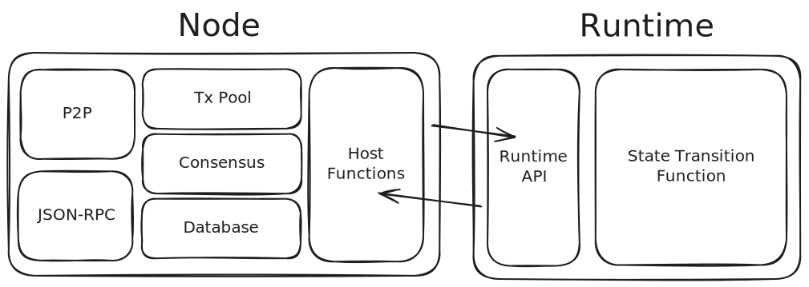
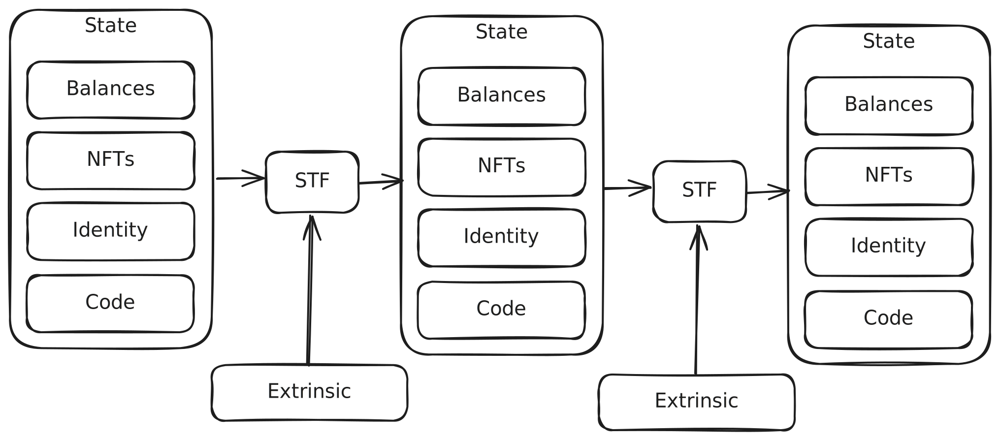

# Runtime

---

# Runtime

## What you will learn:

- What is the Runtime?
- Where is located?
- How does it work?
- Tradeoffs of having a dynamic STF.
- Who does it cater to?
- Types of Runtime APIs.

---

## Context

Notes:

https://excalidraw.com/#json=iOS40oD64cN2a5KAtqkyG,7pY8ug1NYwlh5IsadKjAVA

---

## Runtime: What is it?

- It's the logic of the State Transition Fuctions that defines the business logic of the chain.<!-- .element: class="fragment" -->
- It currently is WASM code that's stored on the state of the chain.<!-- .element: class="fragment" -->
- It's part of the state, and it also determines how this state changes 🤯.<!-- .element: class="fragment" -->

---

## Runtime: part of the state of the chain.

---

### Why?

Forkless upgrades 🌈

<!-- .element: class="fragment" -->

---

## Runtime: part of the state of the chain.

- How does it work
  - Every time that the WASM changes, the node instantiates the new WASM.

<!-- .element: class="fragment" -->

- Host Functions:
  - When the WASM is instaniated, the node provides an environment so that the WASM can interact with the node.
  - Eg: Access storage, Expensive cryptografic functions, etc.

<!-- .element: class="fragment" -->

- Can a new WASM version require newer/different host functions?

<!-- .element: class="fragment" -->

Notes:

TODO look for past examples where a node upgrade was required

- Discuss implications of changing host functions.

---

## Tradeoffs of having a dynamic runtime.

- The good: enables forkless upgrades.

<!-- .element: class="fragment" -->

- The not so good:
  - State migrations are complicated.
  - Transactions become invalid.
  - Makes DApps and tooling more complicated.

<!-- .element: class="fragment" -->

---

## Runtime functions

<pba-cols style="font-size: 26px">
<pba-col>

### How it started

- Core_initialize_block
- Core_execute_block
- Block_builder_apply_extrinsic
- TaggedTransactionQueue_validate_transaction

</pba-col>
<pba-col>

### How it's going

- DryRunApi_dry_run_call
- Metadata_metadata
- NominationPoolsApi_points_to_balance
- Inflation_inflation_prediction_info

</pba-col>
</pba-cols>

Notes:

- Discuss why it's a good idea to expose via runtime-apis functions that
  prevent DApps from re-implementing on-chain logic.

---

## Runtime: who does it cater to?

Runtime functions can be divided in 3 different groups:

- The node
  - Applying extrinsics
  - Handling blocks
  - etc.

<!-- .element: class="fragment" -->

- DApps
  - View functions
  - Custom logic

<!-- .element: class="fragment" -->

- Both
  - Transaction validation transactions
  - Calculating fees
  - etc.

<!-- .element: class="fragment" -->

---

# Let's deploy a runtime upgrade 🚀

---v

https://github.com/paritytech/polkadot-sdk-minimal-template
