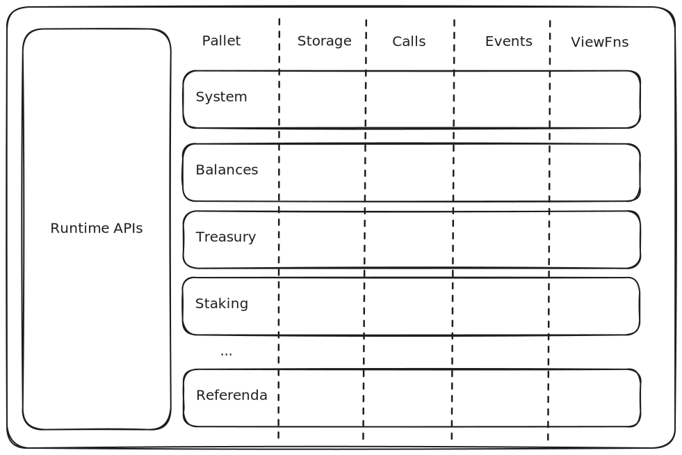

# FRAME Metadata

---

# FRAME Metadata

## What you will learn:

- What is it?
- What is it used for?
- How does it work?
- What are its shortcomings?
- Evolution of Metadata (V14, V15, V16)

---

## What is FRAME?

Rust framework for easily building Substrate runtimes.

_**F**ramework for **R**untime **A**ggregation and **M**odularized **E**ntities_

---

## Frame



Notes:

https://excalidraw.com/#json=Zz_9IUNReoyhCjYU1SG-1,CuUlGTxkMszqa0jkwQZzHw

---

## FRAME Metadata: What is it?

It's an opaque blob of bytes, that when decoded provides:

- The necessary context to encode/decode different chain interaction.
- Documentation about certain chain interactions.
- The value of all Pallet constants.

---

## FRAME Metadata: What is it used for?

- Creating types for other languages (eg: PAPI TS types).<!-- .element: class="fragment" -->
- Creating codecs on the fly.<!-- .element: class="fragment" -->
- Displaying rich information about what the user is about to sign. I.e: prevent blind-signing.<!-- .element: class="fragment" -->
- Creating docs for the chain.<!-- .element: class="fragment" -->
- Detecting compatibility changes.<!-- .element: class="fragment" -->

---

## FRAME Metadata: How does it work?

- Autogenerated by FRAME
- Available via a Runtime-API.

Notes:

We'll see it working on the demo at the end of the lesson

---

## FRAME Metadata: What's in it?

### Type Registry

- A normalized data-structure containing all the type information used for a given chain.<!-- .element: class="fragment" -->
- Its codec looks like this:<!-- .element: class="fragment" -->

Notes:

- Use dev.papi.how to navigate a decoded version of the metadata.

---

## FRAME Metadata: What's in it?

```js
Vector(
  Struct({
    id: compact,
    path: Vector(str),
    params: Vector(Struct({ name: str, type: Option(compact) })),
    def: Enum({
      composite: Vector(field),
      variant: Vector(
        Struct({
          name: str,
          fields: Vector(field),
          index: u8,
          docs,
        })
      ),
      sequence: compact,
      array: Struct({
        len: u32,
        type: compact,
      }),
      tuple: Vector(compact),
      primitive,
      compact: compact,
      bitSequence,
    }),
    docs: Vector(str),
  })
);

const field = Struct({
  name: str,
  type: compact,
  typeName: str,
  docs: Vector(str),
});
```

Notes:

- Use dev.papi.how to navigate a decoded version of the metadata.

---

## FRAME Metadata: What's in it?

- Pallets
  - Storage
  - Calls
  - Events
  - Constants
  - Errors
  - View functions
- Extrinsic
- Runtime-APIs

Notes:

- Use dev.papi.how to highlight this

---

## FRAME Metadata: What are its shortcomings?

- Autogenerated => leaks implementation details. Examples:<!-- .element: class="fragment" -->
  - Referenda vote.
  - Identity types.
- Native token is not a first class citizen. (Neither the symbol, nor the decimals are part of the metadata).<!-- .element: class="fragment" -->
- It requires a certain level of heuristics to use it properly. Eg: AccountId, AccountId20, etc.<!-- .element: class="fragment" -->

---

## FRAME Metadata: How it evolved?

- Prior to v14: It was not self-describing and incomplete.
  - Module storage, calls, etc.
  - Type Registry: based on name.

<!-- .element: class="fragment" -->

- v14
  - Self-describing
  - Complete type registry
  - `metadata_metadata` runtime API will always return metadata v14.

<!-- .element: class="fragment" -->

---

## FRAME Metadata: How it evolved?

- Metadata v15

  - Runtime-apis
  - Outer Enums
  - Complete extrinsic definition.

<div>

- Metadata v16
  - Extrinsic v5, versioned transaction-extensions
  - View functions
  - Deprecated methods, supports

</div>
<!-- .element: class="fragment" -->

---

# Let's explore!
