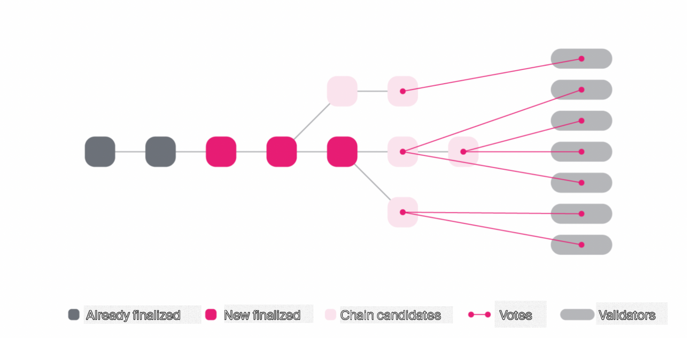
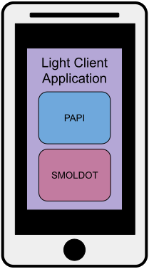

## Overview

In this presentation we will cover the end to end flow of a transaction.

1. Starting with a light client.
2. Learning about merkle proofs.
3. Reading data on-chain and constructing an extrinsic.
4. Submitting and tracking transactions.
5. Updating the state of the blockchain.

Along the way, we will remind you and touch on details you should already be familiar with.

---

# Light Client Transaction

#### Part 1: What is a Light Client?

---

## Block Verification

Blockchain systems are decentralized and trustless because anyone is able to fully verify the state transitions of the blockchain, across all blocks, and recreate the state of the chain at any point in time.

This verification usually happens through re-execution.

---

## Node Minimum Requirements

However, in order to "keep up" with the blockchain, you require minimum hardware, which is usually more powerful than the average phone, laptop, or other mobile device.

- Execution Speed
- SSD Requirements
- RAM Requirements
- Networking Speeds
- etc...

---

## Scalability Through Speed

As you have learned with Polkadot, we employ lots of advance engineering to achieve a secure, scalable, and resilient blockchain. However, the reality is, if you use a more powerful computer across the nodes in your network, your blockchain will inherently perform better.

If you have a blockchain which can directly run on a phone, it is likely not performing at competitive speeds.

---

### So does the trustless decentralized future exclude mobile devices and other similar lower power hardware?

---

## Introducing Light Clients

This is where Light Clients come into play.

Light Client Nodes are those which do not fully execute and sync the state of the blockchain, but use verifiable proofs to be able to communicate and receive information trustlessly from another full node.

---

## How Do Light Clients Work?

Light clients synchronize and verify **block headers** rather than the full blocks themselves.

These block headers tell the light client everything it needs to know to trustlessly follow the chain.

---

## Block Breakdown

A block is split into two main parts:

- Block Header
  - Parent Hash, Block Number, State Root, Extrinsic Root, Digest
- Block Body
  - Vector of Extrinsics

> Each block can be uniquely represented by a **Block Hash**.

- Block Hash is simply the hash of the data inside the header.
  - The block body is already represented by the Extrinsic Root.

---

## Block Header

Inside the block header is:

- **Parent Hash**: The hash of the preceding block's header.
  - This is what links blocks together to form the blockchain.
- **Block Number**: The height of the block in the chain.
- **State Root**: This single merkle root hash represents all current data stored in the blockchain.
  - Allows clients to create and verify proofs that the blockchain contains some specific state.
- **Extrinsics Root**: This merkle root of the extrinsics found in the block's body.
  - Allows a client to prove that a specific extrinsic was or was not included in the block without needing to download the entire body.
- **Digest**: A list of log items containing "auxiliary" information needed to verify the block.
  - This is where consensus-related data lives.

For a light client, the digest is very important.

---

## Block Digest

- **Consensus Logs**: Data from the block production engine (BABE/SAFROLE).
  - This includes information like the slot number and the block author.
- **Seal**: A signature from the block author, proving they produced this block.
- **GRANDPA Logs**: This is how Polkadot's finality mechanism (GRANDPA) communicates validator set changes.
  - A light client will parse the digest for logs like `ScheduledChange` or `ForcedChange` to know when the validator set will be updated.
  - This is how a light client tracks the authority set without downloading the state.

---

## The Light Client's Job

- A light client's main goal is to verify the state of the blockchain with minimal resource usage.
- It achieves this by focusing on three critical tasks:
  1. Confirming Finality
  2. Verifying Block Authorship
  3. Following the Validator Set

---

## 1. Confirming Finality

Light Clients will receive new blocks from a full node..

> But why should it trust that this block is accurate and part of the canonical chain?

- The full node will share a **GRANDPA Justification**.
  - This is not part of the block, but something gossiped as part of the networking and consensus protocol.
  - Justification gossip happens in rounds, allowing the validators to give up-to-date votes on their latest view of the blockchain.

---

## GRANDPA Justification

The Justification includes signatures from current block producers / validators.

- Signatures show that they believe some chain of blocks are part of the canonical chain, and should be finalized.
- As soon as the Justification contains 2/3 + 1 of the validator signatures, the block is finalized.

---

## From the Perspective of Light Clients

- Light Clients are responsible for keeping track of the current validator set.
- They are able to individually verify the signatures of each validator in the Justification.

> By matching the **block hash** with the **signatures** from validators, they are then able to trust all the contents of the block header given to them by the full node!

**Less trust, more truth!**

---

## 2. Verifying Block Authorship

- Within the header itself are signatures and data from the block author who made the block.
- Inside the digest is a **seal**, which is simply a signature from the block author for the block hash.
- There is also a secret VRF which the block author reveals to show they are allowed to produce a block during that slot.

> All of this can again be independently verified by the nodes on the network, including light clients.

**Less trust, more truth!**

---

## 3. Following the Validator Set

- Verifying the Justification assumes the light client knows the current validator set.
  - Since it does not actually execute the blocks, it cannot simply query for that information.
- This information is constantly updated in the block digest along with the other consensus critical data.
  - Logs like `ScheduledChange` or `ForcedChange` signal when the validator set will be updated.

---

## Updating the Validator Set

Let's look more specifically at updating the validator set:

- The genesis block defines the initial state of the blockchain, including the initial validator set.
- Based on the state transition function of the blockchain, a new validator set might be queued for some future block.
- This will be "pre-announced" in the digest with the new validator set, for some point in the future.
  - Importantly, this will be **signed by the current validator set!**.

> With this announcement included in the digest, and backed by the GRANDPA Justification, light clients can always know who the active validators are, even as they change.

**Less trust, more truth!**

---

## Light Clients Verify Everything but the STF

As you can see, Light Clients are able to remain trustless within the blockchain ecosystem because they are able to verify all of the block headers of the canonical chain.

With this, it becomes simple to verify:

- A transaction has been included in the chain, from the extrinsics root.
- The state of the chain, from the state root.

And remember, the State Transition Function (Wasm) itself is stored on chain, but the light client is not expected to execute it.

---

## The Story Begins...

So we have seen so far, in general, how a light client would trustlessly follow the canonical version of the blockchain.

But let's assume the light client wants to interact with the chain. Something simple like a balance transfer from Alice to Bob.

How would it do that?

---

## Scenario

<table style="width: 100%; table-layout: fixed;">
  <thead>
    <tr>
      <th style="width: 30%;">Light Client App</th>
      <th style="width: 40%;">Full Node</th>
      <th style="width: 30%;">Authoring Node</th>
    </tr>
  </thead>
  <tbody>
    <tr>
      <td>
        <ul>
          <li>Queries Metadata</li>
          <li>Queries State</li>
          <li>Constructs Transaction</li>
          <li>Verifies State</li>
        </ul>
      </td>
      <td>
        <ul>
          <li>Provides Metadata</li>
          <li>Provides State and Proof</li>
          <li>Provides Subscription</li>
          <li>Gossips Transaction</li>
          <li>Imports Block</li>
        </ul>
      </td>
      <td>
        <ul>
          <li>Creates and Executes a New Block</li>
          <li>Gossips the New Block</li>
        </ul>
      </td>
    </tr>
  </tbody>
</table>

---

## The Light Client Application

Think of a decentralized application running directly on your phone.

Built with:

- Your favorite mobile development framework.
- A Light Client Engine (like Smoldot):
  - Talks with the full node.
  - Syncs block headers.
  - Verifies finality justifications.
- A Polkadot API (like PAPI):
  - Talks with the light client engine.
  - Runtime metadata and data types.
  - SCALE encoding/decoding.
  - Transaction construction.
  - State layout and queries.

---

#### For simplicity, we will call the whole decentralized application "the light client".

---

<!-- .slide: data-background-color="#4A2439" -->

# Questions
