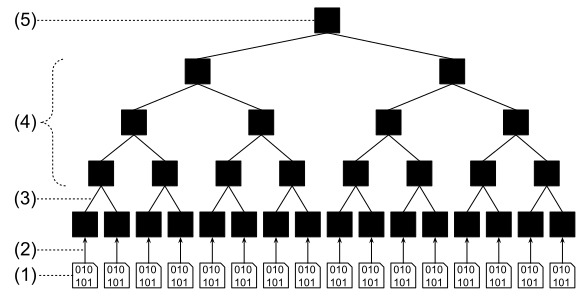
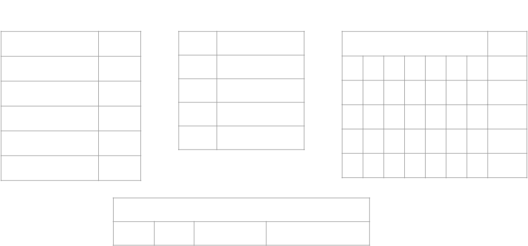
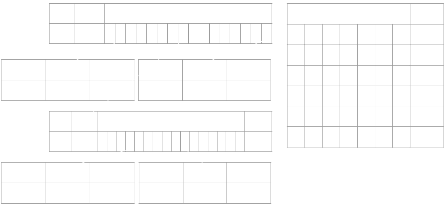
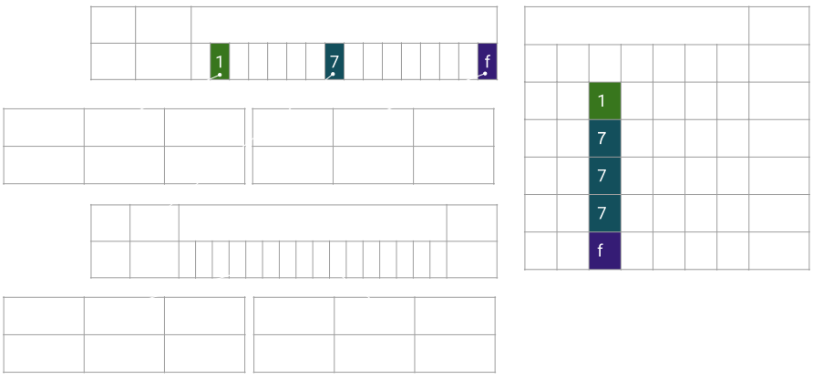
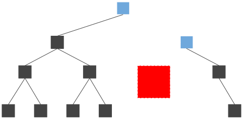

# Light Client Transaction

Part 2

---

# Part 2: Verifiable Storage Proofs

---

### Substrate Uses a Base-16 Patricia Merkle Trie

(hopefully you remember these key terms)

https://github.com/paritytech/trie

---

### Merkle Tree

> Raw data we want to store is represented with the data icons at the bottom, all the other white nodes are hashes.

Starting from the bottom to the top of the diagram:

1. Collect all the data you want to place in the merkle tree structure.
2. Find the hash of each piece of data.
3. Take two hash nodes and hash them into a new hash node.
4. Repeat this process for the new nodes until there is a single hash.
5. The final hash is the merkle root hash.

---

### Patricia Trie

- Position in the tree defines the associated key.
- Space optimized for elements which share a prefix.

---

### Base 16

- We will mostly show binary trees for simplicity.
- But everything scales up as you add more nodes.
- 16 is a nice choice because it is 1/2 of a byte (two hex characters)
  - one hex character is a "nibble"

---

### Merkle Trie Complexity

- Reading
- Writing
- Proofs

---

### Merkle Read

- $O(\log{n})$ reads
- Not so great.

---

### Merkle Write

- Very expensive for a database
- $O(\log{n})$ reads, hashes and writes

1. Follow the trie path to the value: $O(\log{n})$ reads
2. Write the new value: 1 write
3. Calculate new hash: 1 hash
4. Repeat (2) + (3) up the trie path: $O(\log{n})$ times

---

### Merkle Proof

- $O(\log{n})$
- Great for light clients!
- Low bandwidth, low computation!

1. Full Node: Follow the trie path to the value: $O(\log{n})$ reads.
1. Full Node: Upload data of trie nodes read.
1. Light Client: Download trie node data.
1. Light Client: Verify by hashing: $O(\log{n})$ hashes.

---

### Merkle Proof: More Specific

Notice how much data is NOT needed!

- The only data you need for the merkle proof are represented by light blue nodes.
- The dark grey nodes are data which exists in the full trie, but is not needed for the proof.
- The white nodes are hashes we can calculate using the blue nodes, so also not needed in the proof.
- The pink node is the merkle root, which should be known in advance to all parties.

---

### Two Kinds of Keys

The next slides will try to have you understand the difference and existence of:

 

1. Trie key path
2. KVDB key hash

 

It can be very confusing to mix these up, so lets make it clear the difference!

Notes:

Storage access path (corresponding to the `Runtime Api` level of the overview slide) can be seen as a third kind (module, storage structure and possibly key in storage structure) (translate to trie key that then query KVDB hash).

---

### What You Will See

---

### Navigating Substrate Storage

---

### Navigating Substrate Storage

---

### Navigating Substrate Storage

---

### Navigating Substrate Storage

---

### Navigating Substrate Storage

---

### Navigating Substrate Storage

---

### Navigating Substrate Storage

---

### What You Just Saw

 

Patricia provides the **trie path**.

 

Merkle provides the recursive **hashing** of children nodes into the parent.

---

<table style="background-color: white; color: black; width: 80%;" class="text-center">
  <tr><td style="background-color: lightgrey;" colspan="4">Trie Node</td></tr>
  <tr>
    <td style="background-color: red;">header</td>
    <td style="background-color: orange;">key</td>
    <td style="background-color: yellow;">children</td>
    <td style="background-color: green;">value</td>
  </tr>
</table>

 

- The Trie key path is set by you, for example `:CODE`.
  - Arbitrary Length!
- Trie Node:
  - header
  - key
  - possible children
  - possible value
- KVDB key = Hash([Trie Node])

---

### Given a value you want to store in the database (an encoded trie node), it will always have the same database key, because the key is simply the hash.

Notes:

Rocks db implementation details, the key is dirty with some prefix.

---

## But wait... there's more!

---

### Pruning (1)

- For holding older block states, and then cleaning up.
- Let’s update two values in this trie.

---

### Pruning (2)

- We create new database entries, but keep the old ones too!

---

### Pruning (3)

---

### Pruning (4)

- Eventually, we prune the old data.

---

### Child Trie

- Allows us to get a merkle root for some subset of data.
- We aim to allow child tries to be a different trie format in the future.

---

### Unbalanced Tree

- Operations can be more (bad) or less (good) than the expected $O(\log{n})$ average.
- This can lead to DoS attacks.
  - Can happen if the user can influence the trie path.
  - In FRAME we will talk about how we prevent this.
- Or we can use this as a feature to access specific storage cheaply.
  - `:code`
  - Each pallet gets its own prefix.
  - etc...

Notes:

Here (or somewhere else) it must be evoked that trie path (key for values) are whatever the runtime want.
This is a very important design consideration:
in ethereum for instance everything is stored under hash(key), which makes the trie balanced amongst all value.
in substrate we allow random length key (there is a limit but very high in the trie impl), because the runtime
can be responsible of trie unbalance.
A slide showing an unbalance trie could be nice:

- a branch with module balance prefix and a lot of balance behind: making the query cost like 2 nodes for prefix and let's say 100_000 account so 16^5 -> ~ 5 nodes (accounts are hash and under the prefix things are balanced). -> 7 nodes to access
- a branch with some random
  odule and a constant in it : 2 nodes for prefix, + 2 nodes to access the constant. -> 4 nodes to access
- the wasm runtime at :code -> only 2 nodes

---

### Heavy Node Problem

---

### Heavy Node Problem: Fixed

---

### Compact Proof

- Simple encoding to remove redundant information
- Trie node codec already strives for compact encoding
- Still hashes info is redundant
- Nodes are ordered to reflect the trie structure

Notes:

- trie node codec strives to make things compact

So merkle hash is calculated over most compact number of bytes.

- Still hashes info is redundant.

again in a three node V1 and V2 only tree, if proof is for V1 only, then the proof contains two nodes: root (a branch) and V1 (a leaf).
Then the encoding of root will contains two hashes V1 leaf hashes and V2 leaf hashes.
Obviously V1 leaf hashes can be calculated by hashing V1 leaf, so we can just remove it from the root node and gain 32 non compressable bytes.

- Nodes are ordered to reflect the trie structure

by ordering in a given way we can deduce the child parent relationship of nodes.
This can be done in multiple way, for instance encode in the trie node iteration: root -> V1 then when decoding stack root and when unstack complete with V1 hash.
or the other way V1 -> root (here the building need to stack root), then when decoding V1 then root.
Most/all trie algo are about keeping a stack of node (when more memory is used there is something wrong (~ 1 or two nodes)).

---

### Proof Recorder

- Simple footprint of all trie nodes accessed
- Then re-encoded (compact proof)
- Beware of caching hiding behavior of accessed values

Notes:

Another message to convey is that producing proof is really only recording all access made during some actions (key access, value insert, value change, trie iteration...).
Any kind of changes work.
-> write is a bit tricky in the sense it only read access and in memory changes. eg three node trie with V1 and V2 and a parent node, inserting V3 can just be adding a sibling to V1 and V2, but V3 will not be in proof, just the parent node.

This could be extended by the idea that key value caching should be disable for the first action otherwise trie node would not be access and we would not register proof correctly.
-> can extend to Basti pr where there is two kind of cache: trie node level cache that is safe to use and key value cache that
Not sure it is worth going to far on cache strategy, but may be relevant to mention that by its structure trie node cache is shared between block.

---

### Storage and Proof Size.

- Base 16 trie good for disk storage and computation.
- Binary trie proof footprint is smaller.

We are realizing that binaries tries are better for the current bottlenecks: networking.

Notes:

The trie structure (hexary) is mostly related to the storage model and do not produce the more compact proofs. One direction would be to decorelate storage from merklization. eg hexary node in storage but merklization over binary node. But the model get more complex.

A final message to it should be that (eth see it), the storage model is still not the most efficient: we use merkle trie index to access node that are stored under a btree index (rocksdb), a true state db would have it's inner indexing directly using the merkle structure.
Paritydb in this sense in a good middle ground as it implement a hash map access directly so the merkle trie index is over a hash map rather than a btree map: that is a huge gain.

What works in memory as simple data structure, also work as a db over disk and also extend to being merklized. Usually things can be mapped or referred to rather naturally. For instance an optimization of radix trie is not storing the full merkle path in each node and get the key with the value: this work in memory (not a huge gain), this work on disk (huge gain as you can have fix len node which is big gain for disk access), can work with merkle proof (but tricky if codec still store the full partial key).

---

<!-- .slide: data-background-color="#4A2439" -->

# Questions
