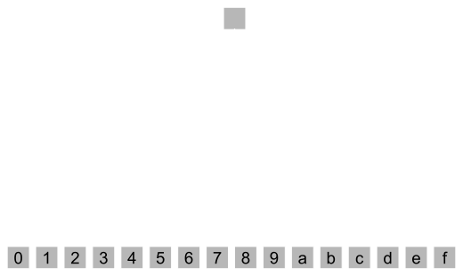
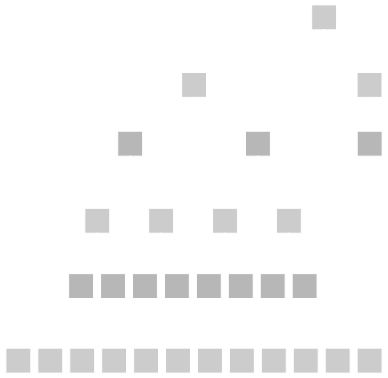
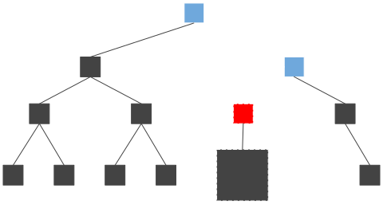

# Light Client Transaction

---

## Overview

In this presentation we will cover the end to end flow of a transaction.

1. Starting with a light client.
2. Learning about merkle proofs.
3. Trustlessly reading data on-chain.
4. Constructing an extrinsic.
5. Submitting and tracking transactions.
6. Updating the state of the blockchain.

Along the way, we will remind you and touch on details you should already be familiar with.

---

## Scenario


<table style="width: 100%; table-layout: fixed;">
  <thead>
    <tr>
      <th style="width: 30%;">Light Client App</th>
      <th style="width: 40%;">Full Node</th>
      <th style="width: 30%;">Authoring Node</th>
    </tr>
  </thead>
  <tbody>
    <tr>
      <td>
        <ul>
          <li>Queries Metadata</li>
          <li>Queries State</li>
          <li>Constructs Transaction</li>
          <li>Verifies State</li>
        </ul>
      </td>
      <td>
        <ul>
          <li>Provides Metadata</li>
          <li>Provides State and Proof</li>
          <li>Provides Subscription</li>
          <li>Gossips Transaction</li>
          <li>Imports Block</li>
        </ul>
      </td>
      <td>
        <ul>
          <li>Creates and Executes a New Block</li>
          <li>Gossips the New Block</li>
        </ul>
      </td>
    </tr>
  </tbody>
</table>

---

## Building a Light Client Application

<div class="flex-container">
<div class="left-small">


</div>

<div class="right text-small">

Think of a decentralized application running directly on your phone.

Built with:

- Your favorite mobile development framework.
- A Light Client Engine (like Smoldot):
  - Talks with the full node.
  - Syncs block headers.
  - Verifies finality justifications.
  - Communicates with the full node.
- A Polkadot API (like PAPI):
  - Talks with the light client engine.
  - Runtime metadata and data types.
  - SCALE encoding/decoding.
  - Transaction construction.
  - State layout and queries.

</div>
</div>

---

#### For simplicity, we will call the whole decentralized application "the light client".

---

# Part 1: What is a Light Client?

---

## Block Verification

Blockchain systems are decentralized and trustless because anyone is able to fully verify the state transitions of the blockchain, across all blocks, and recreate the state of the chain at any point in time.

This verification usually happens through re-execution.

---

## Node Minimum Requirements

However, in order to "keep up" with the blockchain, you require minimum hardware, which is usually more powerful than the average phone, laptop, or other mobile device.

- Execution Speed
- SSD Requirements
- RAM Requirements
- Networking Speeds
- etc...

---

## Scalability Through Speed

As you have learned with Polkadot, we employ lots of advance engineering to achieve a secure, scalable, and resilient blockchain. However, the reality is, if you use a more powerful computer across the nodes in your network, your blockchain will inherently perform better.

If you have a blockchain which can directly run on a phone, it is likely not performing at competitive speeds.

---

###  So does the trustless decentralized future exclude mobile devices and other similar lower power hardware?

---

## Introducing Light Clients

This is where Light Clients come into play.

Light Client Nodes are those which do not fully execute and sync the state of the blockchain, but use verifiable proofs to be able to communicate and receive information trustlessly from another full node.

---

## How Do Light Clients Work?

Light clients synchronize and verify **block headers** rather than the full blocks themselves.

These block headers tell the light client everything it needs to know to trustlessly follow the chain.

---

## Block Breakdown

A block is split into two main parts:

- Block Header
  - Parent Hash, Block Number, State Root, Extrinsic Root, Digest
- Block Body
  - Vector of Extrinsics

> Each block can be uniquely represented by a **Block Hash**.

- Block Hash is simply the hash of the data inside the header.
  - The block body is already represented by the Extrinsic Root.

---

## Block Header

Inside the block header is:

<div class="text-small">

- **Parent Hash**: The hash of the preceding block's header.
  - This is what links blocks together to form the blockchain.
- **Block Number**: The height of the block in the chain.
- **State Root**: This single merkle root hash represents all current data stored in the blockchain.
  - Allows clients to create and verify proofs that the blockchain contains some specific state.
- **Extrinsics Root**: This merkle root of the extrinsics found in the block's body.
  - Allows a client to prove that a specific extrinsic was or was not included in the block without needing to download the entire body.
- **Digest**: A list of log items containing "auxiliary" information needed to verify the block.
  - This is where consensus-related data lives.

</div>

For a light client, the digest is very important.

---

## Block Digest

- **Consensus Logs**: Data from the block production engine (BABE/SAFROLE).
  - This includes information like the slot number and the block author.
- **Seal**: A signature from the block author, proving they produced this block.
- **GRANDPA Logs**: This is how Polkadot's finality mechanism (GRANDPA) communicates validator set changes.
  - A light client will parse the digest for logs like `ScheduledChange` or `ForcedChange` to know when the validator set will be updated.
  - This is how a light client tracks the authority set without downloading the state.

---

## The Light Client's Job

- A light client's main goal is to verify the state of the blockchain with minimal resource usage.
- It achieves this by focusing on three critical tasks:
  1. Confirming Finality
  2. Verifying Block Authorship
  3. Following the Validator Set

---

## Confirming Finality

Light Clients will recieve new blocks from a full node..

> But why should it trust that this block is accurate and part of the cannonical chain?

- The full node will share a **GRANDPA Justification**.
  - This is not part of the block, but something gossiped as part of the networking and consensus protocol.
  - Justification gossip happens in rounds, allowing the validators to give up to date votes on their latest view of the blockchain.

---

## GRANDPA Justification

The justification includes signatures from current block producers.


- Signatures show that they believe some chain of blocks are part of the cannonical chain, and should be finalized.
- As soon as the Justification contains 2/3 of the validator signatures, the block is finalized.


---

## From the Perspective of Light Clients

- Light Clients are responsible for keeping track of the current validator set.
- They are able to individually verify the signatures of each validator in the justification.

> By matching the **block hash** with the **signatures** from validators, they are then able to trust all the contents of the block header given to them by the full node!

**Less trust, more truth!**

---

## Block Author

Within the header itself are signatures and data from the block author who made the block.

Inside the digest is a **seal**, which is simply a signature from the block author for the block hash.

There is also a secret VRF which the block author reveals to show they are allowed to produce a block during that slot.

All of this can again be independently verified by the nodes on the network, including light clients.

---

## Following the Validator Set

Verifying the Justification assumes the light client knows the current validator set. Since it does not actually execute the blocks, it cannot simply query for that information.

Instead, this information is constantly updated in the block digest along with the other consensus critical data.

---

## Updating the Validator Set

The genesis block defines the initial state of the blockchain, including the initial validator set.

From there, based on the state transition function of the blockchain, a new validator set might be queued for some future block.

This will be pre-announced in the digest, and signed by the current validator set, showing that a new validator set will be active in the future.

With this announcement included in the digest, and backed by the GRANDPA Justification, light clients can always know who the active validators are, even as they change.

---

## Light Clients Verify Everything but the STF

As you can see, Light Clients are able to remain trustless within the blockchain ecosystem because they are able to verify all of the block headers of the canonical chain.

With this, it becomes simple to verify:

- a transaction has been included in the chain, from the extrinsics root.
- the state of the chain, from the state root.

And remember, the State Transition Function (Wasm) itself is stored on chain, but the light client is not expected to execute it.

---

## The Story Begins...

So we have seen so far, in general, how a light client would trustlessly follow the canonical version of the blockchain.

But let's assume the light client wants to interact with the chain. Something simple like a balance transfer from Alice to Bob.

How would it do that?

---

# Part 2: Verifiable Storage Proofs

---

### Substrate Uses a Base-16 Patricia Merkle Trie

(hopefully you remember these key terms)

https://github.com/paritytech/trie

---

### Merkle Tree

<div class="flex-container">
<div class="left text-small">


> Raw data we want to store is represented with the data icons at the bottom, all the other white nodes are hashes.

</div>

<div class="right text-small">

Starting from the bottom to the top of the diagram:

1. Collect all the data you want to place in the merkle tree structure.
2. Find the hash of each piece of data.
3. Take two hash nodes and hash them into a new hash node.
4. Repeat this process for the new nodes until there is a single hash.
5. The final hash is the merkle root hash.

</div>
</div>

---

### Patricia Trie

<div class="flex-container">
<div class="left-small">


</div>

<div class="right">

- Position in the tree defines the associated key.
- Space optimized for elements which share a prefix.

</div>
</div>

---

### Base 16

<div class="flex-container">
<div class="left">



</div>

<div class="right">

- We will mostly show binary trees for simplicity.
- But everything scales up as you add more nodes.
- 16 is a nice choice because it is 1/2 of a byte (two hex characters)
  - one hex character is a "nibble"

</div>
</div>

---

### Merkle Trie Complexity

- Reading
- Writing
- Proofs

---

### Merkle Read

<div class="image-container">


<div class="top-right">

- $O(\log{n})$ reads
- Not so great.

</div>
</div>

---

### Merkle Write

<div class="image-container">


<div class="top-right text-small">

- Very expensive for a database
- $O(\log{n})$ reads, hashes and writes

</div>

<div class="bottom-left black-box text-small">

1. Follow the trie path to the value: $O(\log{n})$ reads
2. Write the new value: 1 write
3. Calculate new hash: 1 hash
4. Repeat (2) + (3) up the trie path: $O(\log{n})$ times

</div>
</div>

---

### Merkle Proof

<div class="image-container">


<div class="top-right text-small">

- $O(\log{n})$
- Great for light clients!
- Low bandwidth, low computation!

</div>

<div class="bottom-left black-box text-small">

1. Full Node: Follow the trie path to the value: $O(\log{n})$ reads.
1. Full Node: Upload data of trie nodes read.
1. Light Client: Download trie node data.
1. Light Client: Verify by hashing: $O(\log{n})$ hashes.

</div>
</div>

---

### Merkle Proof: More Specific

<div class="flex-container">
<div class="left">


Notice how much data is NOT needed!

</div>

<div class="right">

- The only data you need for the merkle proof are represented by <span style="background-color: #00ffff; color: black;">light blue</span> nodes.
- The <span style="background-color: #0f0f0f;">dark grey</span> nodes are data which exists in the full trie, but is not needed for the proof.
- The <span style="background-color: #fff; color: #000;">white nodes</span> are hashes we can calculate using the blue nodes, so also not needed in the proof.
- The <span style="background-color: #ff00ff;">pink node</span> is the merkle root, which should be known in advance to all parties.

</div>
</div>

---

### Two Kinds of Keys

The next slides will try to have you understand the difference and existence of:

<br>
<div class="text-center">

1. Trie key path
2. KVDB key hash

</div>

<br>

It can be very confusing to mix these up, so lets make it clear the difference!

Notes:

Storage access path (corresponding to the `Runtime Api` level of the overview slide) can be seen as a third kind (module, storage structure and possibly key in storage structure) (translate to trie key that then query KVDB hash).

---

### What You Will See


---

### Navigating Substrate Storage


---

### Navigating Substrate Storage


---

### Navigating Substrate Storage


---

### Navigating Substrate Storage


---

### Navigating Substrate Storage


---

### Navigating Substrate Storage


---

### Navigating Substrate Storage


---

### What You Just Saw

<div class="flex-container">
<div class="left">

<div>


</div>

<br>

Patricia provides the **trie path**.

</div>
<div class="right">

<div>


</div>

<br>

Merkle provides the recursive **hashing** of children nodes into the parent.

</div>
</div>

---

<table style="background-color: white; color: black; width: 80%;" class="text-center">
  <tr><td style="background-color: lightgrey;" colspan="4">Trie Node</td></tr>
  <tr>
    <td style="background-color: red;">header</td>
    <td style="background-color: orange;">key</td>
    <td style="background-color: yellow;">children</td>
    <td style="background-color: green;">value</td>
  </tr>
</table>

<br>

- The Trie key path is set by you, for e.g. `:CODE`.
  - Arbitrary Length!
- Trie Node:
  - header
  - key
  - possible children
  - possible value
- KVDB key = Hash([Trie Node])

---

### Given a value you want to store in the database (an encoded trie node), it will always have the same database key, because the key is simply the hash.

Notes:

Rocks db implementation details, the key is dirty with some prefix.

---

## But wait... there's more!

---

### Pruning (1)

<div class="image-container">


<div class="top-right" style="width: 40%">

- For holding older block states, and then cleaning up.
- Let’s update two values in this trie.

</div>
</div>

---

### Pruning (2)

<div class="image-container">


<div class="top-right" style="width: 40%">

- We create new database entries, but keep the old ones too!

</div>
</div>

---

### Pruning (3)


---

### Pruning (4)

<div class="image-container">


<div class="top-left" style="width: 30%">

- Eventually, we prune the old data.

</div>
</div>

---

### Child Trie

<div class="image-container">


<div class="bottom-left black-box text-small">

- Allows us to get a merkle root for some subset of data.
- We aim to allow child tries to be a different trie format in the future.

</div>
</div>

---

### Unbalanced Tree

<div class="flex-container">
<div class="left-small">



</div>
<div class="right">

- Operations can be more (bad) or less (good) than the expected $O(\log{n})$ average.
- This can lead to DoS attacks.
  - Can happen if the user can influence the trie path.
  - In FRAME we will talk about how we prevent this.
- Or we can use this as a feature to access specific storage cheaply.
  - `:code`
  - Each pallet gets its own prefix.
  - etc...

</div>
</div>

Notes:

Here (or somewhere else) it must be evoked that trie path (key for values) are whatever the runtime want.
This is a very important design consideration:
in ethereum for instance everything is stored under hash(key), which makes the trie balanced amongst all value.
in substrate we allow random length key (there is a limit but very high in the trie impl), because the runtime
can be responsible of trie unbalance.
A slide showing an unbalance trie could be nice:

- a branch with module balance prefix and a lot of balance behind: making the query cost like 2 nodes for prefix and let's say 100_000 account so 16^5 -> ~ 5 nodes (accounts are hash and under the prefix things are balanced). -> 7 nodes to access
- a branch with some random
  odule and a constant in it : 2 nodes for prefix, + 2 nodes to access the constant. -> 4 nodes to access
- the wasm runtime at :code -> only 2 nodes

---

### Heavy Node Problem


---

### Heavy Node Problem: Fixed



---

### Compact Proof

- Simple encoding to remove redundant information
- Trie node codec already strives for compact encoding
- Still hashes info is redundant
- Nodes are ordered to reflect the trie structure

Notes:

- trie node codec strives to make things compact

So merkle hash is calculated over most compact number of bytes.

- Still hashes info is redundant.

again in a three node V1 and V2 only tree, if proof is for V1 only, then the proof contains two nodes: root (a branch) and V1 (a leaf).
Then the encoding of root will contains two hashes V1 leaf hashes and V2 leaf hashes.
Obviously V1 leaf hashes can be calculated by hashing V1 leaf, so we can just remove it from the root node and gain 32 non compressable bytes.

- Nodes are ordered to reflect the trie structure

by ordering in a given way we can deduce the child parent relationship of nodes.
This can be done in multiple way, for instance encode in the trie node iteration: root -> V1 then when decoding stack root and when unstack complete with V1 hash.
or the other way V1 -> root (here the building need to stack root), then when decoding V1 then root.
Most/all trie algo are about keeping a stack of node (when more memory is used there is something wrong (~ 1 or two nodes)).

---

### Proof Recorder

- Simple footprint of all trie nodes accessed
- Then re-encoded (compact proof)
- Beware of caching hiding behavior of accessed values

Notes:

Another message to convey is that producing proof is really only recording all access made during some actions (key access, value insert, value change, trie iteration...).
Any kind of changes work.
-> write is a bit tricky in the sense it only read access and in memory changes. eg three node trie with V1 and V2 and a parent node, inserting V3 can just be adding a sibling to V1 and V2, but V3 will not be in proof, just the parent node.

This could be extended by the idea that key value caching should be disable for the first action otherwise trie node would not be access and we would not register proof correctly.
-> can extend to Basti pr where there is two kind of cache: trie node level cache that is safe to use and key value cache that
Not sure it is worth going to far on cache strategy, but may be relevant to mention that by its structure trie node cache is shared between block.

---

### Storage and Proof Size.

- Base 16 trie good for disk storage and computation.
- Binary trie proof footprint is smaller.

<div class="flex-container">
<div class="left" style="margin: 20px;">


</div>
<div class="right" style="margin: 20px;">


</div>
</div>

We are realizing that binaries tries are better for the current bottlenecks: networking.

Notes:

The trie structure (hexary) is mostly related to the storage model and do not produce the more compact proofs. One direction would be to decorelate storage from merklization. eg hexary node in storage but merklization over binary node. But the model get more complex.

A final message to it should be that (eth see it), the storage model is still not the most efficient: we use merkle trie index to access node that are stored under a btree index (rocksdb), a true state db would have it's inner indexing directly using the merkle structure.
Paritydb in this sense in a good middle ground as it implement a hash map access directly so the merkle trie index is over a hash map rather than a btree map: that is a huge gain.

What works in memory as simple data structure, also work as a db over disk and also extend to being merklized. Usually things can be mapped or referred to rather naturally. For instance an optimization of radix trie is not storing the full merkle path in each node and get the key with the value: this work in memory (not a huge gain), this work on disk (huge gain as you can have fix len node which is big gain for disk access), can work with merkle proof (but tricky if codec still store the full partial key).

---

# Part 3: Light Client Reads Storage

---

## Fetching the Metadata

The first thing the light client will do is fetch the up to date metadata of the chain.

Remember that in the Polkadot ecosystem, chains can constantly upgrade and update their state transition function, changing the functionality of the chain and even what extrinsics are available.

---

## State Transition Function is Self Describing

To get the metadata itself, we must query the Runtime via the State Transition Function Code.

The Runtime exposes an API: `state_getMetadata`, which will return a SCALE encoded blob with all the data you need to know about the blockchain.

---

## FRAME Metadata Format

- Versioned, and occasionally changes over time.
- Defined by: https://github.com/paritytech/frame-metadata
- Automatically generated if you use FRAME macros.
- Output can be turned into JSON, which is easiest for human readability:
  - https://dev.papi.how/metadata/json

---

## Get Your Current Balance

Using the Metadata we can see the following:

- System is pallet index 0.
  - With storage Prefix "System".
- There is a storage item called "Account".
  - With storage prefix is "Account"
- It uses hasher `Blake2128Concat`.
- It has a key using "type 0".
- It has a value using "type 3".

This tells us everything we need to know to query and understand the blockchain.

---

## Key Type Lookup

Under the `lookup` section of the metadata, we can see all the Type Information, and how to serialize and deserialize this correctly in SCALE.

```json
{
  "0": {
    "id": 0,
    "path": ["sp_core", "crypto", "AccountId32"],
    "params": [],
    "def": {
      "tag": "composite",
      "value": [
        {
          "name": null,
          "type": 1,
          "typeName": "[u8; 32]",
          "docs": []
        }
      ]
    },
    "docs": []
  }
}
```

---

## FYI: Alice Address

The address for Alice is:

```text
5GrwvaEF5zXb26Fz9rcQpDWS57CtERHpNehXCPcNoHGKutQY
```

This can be generated using the "default mnemonic":

```text
bottom drive obey lake curtain smoke basket hold race lonely fit walk
```

Then adding the **hard key**:

```text
//Alice
```

The same can be done for `//Bob`, `//Charlie`, etc...

---

## Storage Key

We can now generate the storage key for querying an account balance:

https://crates.parity.io/frame_support/pallet_prelude/struct.StorageMap.html

```text
Twox128(Prefix::pallet_prefix())
	++ Twox128(Prefix::STORAGE_PREFIX)
	++ Hasher1(encode(key))
```

```rust
Twox128("System") = 0x26aa394eea5630e07c48ae0c9558cef7
Twox128("Account") = 0xb99d880ec681799c0cf30e8886371da9
encoded("5GrwvaEF5zXb26Fz9rcQpDWS57CtERHpNehXCPcNoHGKutQY")
  = 0xd43593c715fdd31c61141abd04a99fd6822c8558854ccde39a5684e7a56da27d
Blake2128Concat(0xd43593c715fdd31c61141abd04a99fd6822c8558854ccde39a5684e7a56da27d)
  = 0xde1e86a9a8c739864cf3cc5ec2bea59fd43593c715fdd31c61141abd04a99fd6822c8558854ccde39a5684e7a56da27d
```

Simple hashing tool (and other utilities):

https://www.shawntabrizi.com/substrate-js-utilities/

```text
0x26aa394eea5630e07c48ae0c9558cef7b99d880ec681799c0cf30e8886371da9de1e86a9a8c739864cf3cc5ec2bea59fd43593c715fdd31c61141abd04a99fd6822c8558854ccde39a5684e7a56da27d
```

---

## Query the Value from the Full Node

To get the value at that storage key from the full node, we could call the `state_getStorage` RPC directly.

This will return a value like:

```text
0x62030000010000000100000000000000fb2f65285e71000000000000000000008be5934d786800000000000000000000a243556c7f3e0000000000000000000000000000000000000000000000000080
```

But this is not "trustless".

We have no proof this data is actually in the state of the blockchain.

---

## Request a Proof from the Full Node

So we should instead use `state_getReadProof`, which returns the both the value and the data needed for a merkle proof of that value.

Using the storage key we want, `at` a specific block hash, we get:

<div style="font-size: 24px;">

```json [0|5]
{
  "at": "0x13fa9048b826f669180f9981e62038f0091aa5c07c8c7fdd8f12b154016c8421",
  "proof": [
    "0x3f3a01fd2745691cf138e0b26aec874adf51a47b72795366d52285e329229c836ea7bbfe139dbe8fa0700c4f86fc5650b3fb47f9da187da0485eb016fc2f0d011a9fd384c74ff1836539010f657cd1",
    "0x62030000010000000100000000000000fb2f65285e71000000000000000000000157bb6b876800000000000000000000a243556c7f3e0000000000000000000000000000000000000000000000000080",
    "0x80120080298466742961a84a35976e457875b7761f5fcef23e8a0dd3e08058a0b30c854e80ee8654089b3f5a0916909a1f3e57d1252065a36dc778dd30c9892f2585889aaf",
    "0x8040118031009821c8fc75a472d3e000c873958982a6d04b4337ce119c4ae3b93684fbe9802bf60c90aa404eb7b3d5c7a3e69a9a319ce6a0df43b4f40c3eff7aee338e373f801d8eab22fd1f62b8d22fb61901f79aa5f333a2845785affcc98b2aa0b566511b",
    "0x80bdfe8011d131577e76212c69d2c0605ada9e8619174beccc0611a7a7624e9e57f541a180e92193de444c9c6374719a4841739aec186b234e3769a607b591521edd49f24e800690b07bb4c8b464a4147762e3844b2d4da43bc9944aa0c2cbe4ccc15b71cd6d800f99d8ac48eb3c0cc67df9d83abc4a549a93924e59796de233f1ba54a3737b3e801512eec335aa497c3b8d4778f72addc07a827ba28cf47732a169f520a741460880f87f77b22729747e703a675417b5d48c1fdd7410813268e650cea57d184053d0808f936212652a913ef0caaca34bcaf04df6ae088649ab524238ff82f75f8e8a7b8066d71eb4417654e91d977dc62074b972884dd3e884840882e18b624e1728ec9c80ba48d2e6311ecd0d8746e3874ca0eb80498928668e5bc3cecf9dd25c5d619d468049c0a1b8abbe2b63653c07f7e830265af78773666b7639dab47b8a7b949547ea80b3f39be76fdad7cfc722334ab68bbe42434e1662671be1d7dbd7395174082d018094b60d9d3c431179ef836182e9785bad81cebcc27e5c830c7010f289982df8a380c2b3f8af267af4be7eec61b66ad59e6d720674f342d38df6a1970bf1e63fef77",
    "0x80c1c0800cbcf4cde9cde12c990f39bf76a498963f333bf9fc71222f08be5fdfb791b6e880716ea511058836fa134c3acb1dcf373e1dc19d3e79c12b9fbaa1ac44576df78880257442a3193ebf64fb8a0019b2d9fc1d97734011eb5a8d2ea414f5ff9a27952b8073e9f40b89bfcf9d50848f2edb4ef2466391cc7037b54cba3ecb285a8709e7d58097730e250f80f29663ea44b6d09d3afea85d349fc4949a773e3f094e62cea191",
    "0x80ffff8027ac6843f40635b38ea221e363fd14ca3e125ccaf9888b46e3ea088f64e9251780299cf2717b9c52a2c23397f4d6085c48e47ac5511d0035cd322d7c1331d7b35f8030b30d431b311e929d92cf7c131ec667a9b6f6b279fb77a1bd143afb2e13dc1e803499fbc3e7b1fcc59b69eadb612e312d018076fd6f0f27100e8afef49b7b182480221283e0d7e31a9cb2914a00fc180759cd126f453438ab840739ecea2be8caa380a3c4ec4ac6348bcf2ecd2c267ec7f22b75ece4e84435bc0993792377f58e6b01803a7f81603ef75820f5ab3ae57db5c3a5eb2f454c2797aad75e140d07f63b63d0803e7c0d105c23bfe25d7b76b0e7e78adb4dd96ad1877ba27ded6da1fa8c018e678082c29963d2f4b445eee90317482e436c98d7c0f042b70313679f9fb1a82c2ac78080489f6ad13782fe73dd28031c3c382ea09a942f72b46eabd5e7907e7b8e2d6180ec31e2ea18ea5fd6816c1c1192241394366060a6661078b5b73cabc7f0accf41802859bdfc40d5d44e0236ca450ea9c249e3d01668802b455b845b4313ec96f92d80c0aec4c1dcc10d5d9750a73f6911e48c2bac4b7e3f4675a3f1f41b38b01937588042a8bc11daed8180a820f9ceff5c851cff8ab73a813b864d1412ffb3e5a3098780a5644d5f211733648af29b8400ccebabcedfb0030bd4f184adf176e414e7ecd580a58fc4ae12a8b51c8565b256f2ad8db015b150bb9f7b5412278f787afafbf4e6",
    "0x80ffff804dfedfd795fecec0bba4ad236c5d8ce3595ac3e4cc39c44df07e34084eaf8a5c80541f359346f619b10c53f12d8c59950f06998cdc8d7bee35b47543022c45335b802829f348a535440feae24f50a8df10d3e3aac323c337dcf7e225fbbcf9fe768d80557d4b7d3047fa43f3adc0f13293880f2f2ef7a60f2d4276fd1aff35ba3c733980f095569e9ef2c932419c92a97ee0141263dab9ed1773fbe5ba23d45570e7cfe880f857e00671ae2b07cd7eefc9c63d7b5d5cf2cfbc0d83a105fbeac82b03348428804988d3f20d8ce681673ea0f1b6f6d92ba93f08a3139892455469313aebe22af280a2238999717a3bd490cf41737d3d0b8877c1680eb510ad433cac3d1e7551d43e8094c86a5c1ffa5c7f5c0ff635328808ddec863f78df01c8a49b50973dd12cf2d98056fdc2487db54d98b7ac2e44987337a539090165940446c6edf4af126963209280580ebdffd03b7d87dda8a0e389312ef7125a1d58135694d6e10358e9704904da80a29041bb78cc02297a0a83612f32b3a77715204801f7d826d0b84b18feb372fb804bb8d0fce0646bca22150608a53b0dd6247c629366ca58edd180d8d1191b4a1f808ac3509e99a74816b613d45474e7050669287f2a3f45475cf911b061d1660d0180b3922013273dd03c50ce3a7adf82a2867152597bce9c2ed1b2a4673be94a5bbb80bd7e88289ddcbde4a3a2030b23b05ebd17cd7d1ec15361c01d36db179b7710b2",
    "0x80ffff80cc70e7072048b0f48ce7c9304cac762153936a52b1c2a601872bc688a89fff6d80b79173db08a3a50f9ebafa05ac6b0eb9c5123b2bf9dfc6b328bd7ee11dfe5af580a950c1537efafa4c2aea6eaca379ff37b83d58a43d39cec90ef651c89519f90b80a2cc18b84484c8912042e9f6c3123aea3547a2785395015373efe52bb6cd2a1580cf506f4c71cba517308ed0023d1d5095c8ca00563f337a63622fb5626cebae8a804c8b25016ce9479481484d767fc2b847697e16519f14a2d3991187af140f2c5080109ad293e4e5ce1b81a0c6e466cf6e78657ae7fe21f3aeb08a9e77105def9d3d80544392b8eff9834281a0661cc6669362ebfa6adf6e406a9b075695070a817c0d809d34a72e4550b5d9575259fd7fb1619cc3dc656a08732bd0b0e81b7c4fc3622a801a79985abb32c29c9b8b899c2a539b1110e0ba8ae92377e88963d15a7b06469a80d736d734350608abe23dfd0dabde28fda330a12b5a38c74cb16463d30c0d0c1580e6b952d3eb8e8abb1743545c2f71a0cc9306988cc9d14f224c3ea47ed3e9eeb7801b331084d90342d4b9d239cde72090215bddf210e9a64dfda130d84b09ec2c7580570a6f0a1ba5c9ba8043100b629823a8b07bae5c6cbb8ad18114e5539e7be5db8036343a2e2905c865a560ceb8b75b8f523912c3d67d5a5a3a4d7649754901881e806f2000490f44762c006e5d190310c682f42e6571bf2bdee74c5f3d105c1a61e4",
    "0x80ffff80f66f7d8b4d0129c2023e0790051382c63856cbd4fef81ced27e7b8e01bf652e2802aa6446c883890efe6334b63e1b63811ef63c9f10e56146eb92c829c043f209280557d667d5b72e66c89528d5d9f0e217860b6da7422033d4e7dd7a2f294e536a780a1d9ded3577f705f1412cae7a8a8151c83a1a094df8b59c59b87b63bd5e9fabd80e577a54776912bf5a2291ead45d8362432bde785630f15e2c2a43347b72693e28031e96f21602d0d8cee9caa33f2aed7fdc55dff08fb41043e5bc94ea3c4a9cf7b804ca3cc93c3e40f9c5b3be4ad4c207a5b5c011572985441c32e821c2b799e879080b883d82d277c7e5fe004946999984fe0af9ccb94cab5dcd4fc0bc45e4906286880889f43ce9f186d389f8d7cfc93728c9166c056c3c16e8ebcd39c8f3f4d15abeb8058d3377db476957ef132dcd9225b2c770e1d8258981fa2e90388f3d686a72695800fba99b9cceb0170342bd94370bbf104a2f52fa4c89712b4349166a556cb81ba80ef13f5f64361e8610130f7cfca7c373e72c368e2f1f3236ae591e0b192f7f2bf80c4d6671286c16191e4681f32634021008262b197bd74ab06316f6217ccd6595c802f076e5c9645ecad58d577c58483851f9fa5d365b3598c4049e853f8459fd0b3802ba1d6d021ff61ca27ce51f55cfe5eee261de49fcc14f87be88da5bfc0c0b585807b93ba6c7cadcb9d814e782a86650ec91b6c076915e0e84e379c655b8f7b4c04",
    "0x9eaa394eea5630e07c48ae0c9558cef7399f8040b6e571bb88c919dbb532a170b1432934cd91fd851ad7eb198d979de9882d7f8070948170255450f97fff46dae5a1a64a56ba13e5ac76cb920be37f783675d7cf505f0e7b9012096b41c4eb3aaf947f6ea4290800004c5f0684a022a34dd8bfa2baaf44f172b710040180c70e4f7eb66b8cc0232f03f079a1937bc13fb3734dc0f1c7966af58b4cf45bc880126f6e8f9215e0e73a09efa7de7a12506f823abc3ac71a0077cd753640e9166a80b7afcaaa4831f61d51dc405f9cf361ef73fdbefe2debc426ec0aa1ac9e65ac0f80ac7bf64c5400450cf68789645778ff10562ff95d7bfae93f051a8e037702887c4c5f021aab032aaa6e946ca50ad39ab6660304017c5f09cce9c888469bb1a0dceaa129672ef834c6663d0020706f6c6b61646f74",
    "0x9f099d880ec681799c0cf30e8886371da9ffff80390c36d994280a925ea8f9fe4e649a98a27b7b96f9d29f737699acdf2d95a8ba8092e74f0ccdaf09e632c57f0bee707e1639506ae00ff85443a0a42a00f114853c8004d665fc4a709ce8313c59522eb026ab012bbeac82af356975f6ad83c41d71738011c4fbbd0601987a449d68da7ac091cc0bc93fb435f50131a7579cdfbf35742a80ec5e1519d0e2b39d84e47b343e693376d5a7304997560818f1e8a5aabf22c813803cc4dbc4d5f838d380af0e00efd83eb7c2f5d73f5ed1b0b0c4fa0fbd46bf0b128038e5e0be466594e416f1842539c00e74f6001a51d49cf0417b83d5c5f0e3096480c0bdffae2524d296a3e750c1d7f039750c260d5822ac23b79143242ed5c5b27c80ff5c8959273753911d81f14e949c38020afdd5fe1ff91ddf311342c68919910180e3d6f4604817ea2da2767c5b4ec26bbb7c78e1eab1b629c98548c68ed2db8b5680b3e13553e53325f68da16dcbda7f2f08e32a6a10431040e754deb8aa16f0c858804e63e9d616bee1d03d61ba17d732e654b7d3f263bfd671f6a9073b3cc321139e807e77ec3f7652a205b685df91239274e769c073b4f2d0d6fa529206952116cf2180b678af79c99ae5f2b83fe563c4f0042446d27dc57fcd4699a00572ea3e9560c3804847aa862cef5a41028d869ce7b6a9f0ea765c01688f557bb525ba5da42ba9948028f3d4234f5b919e350b16716e3a67577d6e2cfc4e095dd00fdbc6fbbeba8b97"
  ]
}
```

</div>

Magic computer science stuff verifies the proof:

https://github.com/shawntabrizi/polkadot-storage-read-proof

---

## Value Type Lookup

We need to also understand the types of the returned value, and how to deserialize it.

<div class="flex-container">
<div class="left text-small" style="max-width: 600px;">

```json
"3": {
  "id": 3,
  "path": ["frame_system", "AccountInfo"],
  "params": [
    {
      "name": "Nonce",
      "type": 4
    },
    {
      "name": "AccountData",
      "type": 5
    }
  ],
  "def": {
    "tag": "composite",
    "value": [
      {
        "name": "nonce",
        "type": 4,
        "typeName": "Nonce",
        "docs": []
      },
      {
        "name": "consumers",
        "type": 4,
        "typeName": "RefCount",
        "docs": []
      },
      {
        "name": "providers",
        "type": 4,
        "typeName": "RefCount",
        "docs": []
      },
      {
        "name": "sufficients",
        "type": 4,
        "typeName": "RefCount",
        "docs": []
      },
      {
        "name": "data",
        "type": 5,
        "typeName": "AccountData",
        "docs": []
      }
    ]
  },
  "docs": []
},
```

</div>

<div class="right text-small" style="max-width: 600px;">

```json
"4": {
  "id": 4,
  "path": [],
  "params": [],
  "def": {
    "tag": "primitive",
    "value": {
      "tag": "u32",
      "value": null
    }
  },
  "docs": []
},
"5": {
  "id": 5,
  "path": ["pallet_balances", "types", "AccountData"],
  "params": [
    {
      "name": "Balance",
      "type": 6
    }
  ],
  "def": {
    "tag": "composite",
    "value": [
      {
        "name": "free",
        "type": 6,
        "typeName": "Balance",
        "docs": []
      },
      {
        "name": "reserved",
        "type": 6,
        "typeName": "Balance",
        "docs": []
      },
      {
        "name": "frozen",
        "type": 6,
        "typeName": "Balance",
        "docs": []
      },
      {
        "name": "flags",
        "type": 7,
        "typeName": "ExtraFlags",
        "docs": []
      }
    ]
  },
  "docs": []
},
"6": {
  "id": 6,
  "path": [],
  "params": [],
  "def": {
    "tag": "primitive",
    "value": {
      "tag": "u128"
    }
  },
  "docs": []
}
```

</div>
</div>

---

## Decoded Into Human Readable JSON

We can use this value type, and the returned hex value to construct a human readable JSON.

```json
{
  "nonce": 866,
  "consumers": 1,
  "providers": 1,
  "sufficients": 0,
  "data": {
    "free": "124649218584571n",
    "reserved": "114865906902411n",
    "frozen": "68716999295906n",
    "flags": "170141183460469231731687303715884105728n"
  }
}
```

---

# Part 4: Light Client Constructs a Transfer Extrinsic

---

## Full Extrinsic Payload

The extrinsic payload will encode a lot of information:

```
Extrinsic Version
	++ Preamble (Address, Signature, Signed Extensions)
	++ Function Call
```

You can find this in the code by searching:

`pub struct UncheckedExtrinsic`

---

## Metadata for the Transfer Call

From the Metadata, we can see:

- A pallet called "Balances".
  - With pallet "index 5". (check field, not order in the JSON)
- With Calls of "type 126".
  - This shows us the list of available Calls.
  - One of which is `transfer_keep_alive`,
    - With "call index 3". (check field, not order in the JSON)
  - With two parameters:
    1. `dest` with type `AccountIdLookupOf`
       - Which allows various address formats as input.
    2. `value` with type `T::Balance`
       - Which is `compact` + `u128`

---

## Construct the Transfer Call

```text
pallet_index ++ call_index ++ parameters
```

```text
pallet_index = 0x05
call_index = 0x03
```

Param 1:

```text
AccountId Index = 0x00

Bob = 5FHneW46xGXgs5mUiveU4sbTyGBzmstUspZC92UhjJM694ty
	= 0x8eaf04151687736326c9fea17e25fc5287613693c912909cb226aa4794f26a48
```

Param 2:

```text
Balance = 12345 = 0xe5c0
```

Final:

```text
0x0503008eaf04151687736326c9fea17e25fc5287613693c912909cb226aa4794f26a48e5c0
```

---

## Transaction Extensions

Additional functions and information needed to validate an extrinsic, also found in the metadata.

Some of this is specifically included in the signature, which are called "Signed Extensions".

```json
"signedExtensions": [
  { "identifier": "CheckNonZeroSender", "type": 874, "additionalSigned": 36 },
  { "identifier": "CheckSpecVersion", "type": 875, "additionalSigned": 4 },
  { "identifier": "CheckTxVersion", "type": 876, "additionalSigned": 4 },
  { "identifier": "CheckGenesis", "type": 877, "additionalSigned": 13 },
  { "identifier": "CheckMortality", "type": 878, "additionalSigned": 13 },
  { "identifier": "CheckNonce", "type": 880, "additionalSigned": 36 },
  { "identifier": "CheckWeight", "type": 881, "additionalSigned": 36 },
  { "identifier": "ChargeTransactionPayment", "type": 882, "additionalSigned": 36 },
  { "identifier": "PrevalidateAttests", "type": 883, "additionalSigned": 36 },
  { "identifier": "CheckMetadataHash", "type": 884, "additionalSigned": 34 }
]
```

---

## Specific Signed Extensions Explained Simply

```
[F] - Functional check, no data needed.
[H] - Hidden in signature, reintroduced by runtime.
[I] - Directly included, plus some functional logic.
```

<div class="text-small">

1. `CheckNonZeroSender`: [F] Ensures that we do not allow calls from the all `0` address.
2. `CheckSpecVersion`: [H] Verifies the transaction was created for the current runtime specification.
3. `CheckTxVersion`: [H] Confirms the runtime can understand the transaction payload.
4. `CheckGenesis`: [H] Makes sure the transaction is valid only for a specific blockchain.
5. `CheckMortality`: [I] Guarantees a transaction is only valid for a limited time, preventing replays.
6. `CheckNonce`: [I] Enables transaction ordering and prevents transaction replay.
7. `CheckWeight`: [F] Checks transaction's weight fits in the block.
8. `ChargeTransactionPayment`: [I] Allows tips and deducts the final transaction fee.
9. `PrevalidateAttests`: [F] Specifically used for Ethereum ICO claims of DOT.
10. `CheckMetadataHash`: [H] Ensures the transaction was created using the appropriate metadata.

</div>

---

## Hidden Data: Simplified

Suppose we want to submit a message for a specific chain like Polkadot.

Everyone knows the Polkadot Genesis Hash is:

```0x91b171bb158e2d3848fa23a9f1c25182fb8e20313b2c1eb49219da7a70ce90c3```

We can construct a message like:

```rust
// Simplified idea of a signature
Blake2_256(
  "hello, world!",
  "0x91b171bb158e2d3848fa23a9f1c25182fb8e20313b2c1eb49219da7a70ce90c3",
) = 0x4429c519aac4859ac0f7783dc42f230264959edcbcb8d70d9d784907bcb98c76
```

Then we only send to the node the message, and the final hash / signature:

```rust
message: "hello, world!"
hash / signature: "0x4429c519aac4859ac0f7783dc42f230264959edcbcb8d70d9d784907bcb98c76"
```

And the node can re-inject the genesis hash, calculate, and ensure the final hash / signature matches.

---

## Final Signed Payload

To create the signature, we will sign:

- Call Payload
- All Extension Data
  - Era, Nonce, Tip, Spec Version, Transaction Version, Genesis Hash, Block Hash, etc...
  - But remember we only include into the extrinsic payload what is not "hidden".

If the final payload is larger than 256 bytes (which is almost always is), we will hash the payload, and sign the hash instead, saving compute complexity.

See: `struct SignedPayload`.

---

# Part 5: Submit and Track Transaction

---

## Submitting the Extrinsic

- The light client will then call the RPC `author_submitAndWatchExtrinsic` over a WebSocket connection.
- This will accept the extrinsic payload AND return a subscription id to track the progress of the extrinsic.
- From that point forward, the node will push updates back to the light client, with the `SubscriptionId`.

See: https://github.com/paritytech/jsonrpsee

---

## Stages of the Subscription

```rust
pub enum TransactionStatus<Hash, BlockHash> {
  /// Transaction is part of the future queue.
  Future,
  /// Transaction is part of the ready queue.
  Ready,
  /// The transaction has been broadcast to the given peers.
  Broadcast(Vec<String>),
  /// Transaction has been included in block with given hash
  /// at the given position.
  InBlock((BlockHash, TxIndex)),
  /// Transaction has been finalized by a finality-gadget, e.g. GRANDPA.
  Finalized((BlockHash, TxIndex)),
  /// Transaction is no longer valid in the current state.
  Invalid,
  /* -- more variants not included -- */
}
```

---

## Purpose of Transaction Pool Validation

Moving transactions from one list to the other.

<diagram class="mermaid" style="display: flex; width: 80%">
graph LR
    W --"😇 ⏳"--> F["⏰ Future"]
    W --"😇 ⌛️"--> R["✅ Ready"]
    W["🤠 Wild West"] --"😈"--> T["🗑️ Invalid"]
</diagram>

---

### Transaction Validation Logic

- Transaction validity is exclusively outside of the transaction pool, and is **100% determined by the Runtime**.
- Transaction validation should be **cheap** to perform.
- Transaction pool is entirely an **offchain operation**.
  - No state change

Once these checks pass, an subscription update is sent with the `Ready` or `Future` status.

Notes:

Important, must pause and ask!

- Why is it from the runtime? because the transaction format is opaque and the node doesn't even know what to do with it.
- Why does it have to be cheap? wild west, unpaid, DoS!
- Pesky question: but be aware that from the runtime's perspective, the node could be malicious. The runtime cannot trust the node to obey.
  ** THE RUNTIME MUST RE-VALIDATE TRANSACTIONS LATER in block building and import as well **

---

## Basic Transaction Pool Validation

The transaction pool first does low cost, fast to validate operations coming from transaction extension logic:

- Is the included signature valid?
- Is the provided nonce valid?
- Is the provided era still ongoing?
- Does the user have enough balance to pay the transaction fee?
- Is the transaction targeting the correct chain?
- etc...

---

### The `validate_transaction` Function

The runtime API.

```rust[1-100|6]
impl TaggedTransactionQueue<Block> for Runtime {
  fn validate_transaction(
    source: TransactionSource,
    tx: <Block  as BlockT>::Extrinsic,
    block_hash: <Block as BlockT>::Hash,
  ) -> TransactionValidity {
    ..
  }
}
```

---

### Representation of `TransactionValidity`

```rust[1-100|5-6|8-9|11-12|14-100|1-100]
pub type TransactionValidity = Result<ValidTransaction, TransactionValidityError>;

/// This is going into `Ready` or `Future`
pub struct ValidTransaction {
  /// If in "Ready", what is the priority?
  pub priority: u64,

  /// For how long is this validity?
  pub longevity: u64,

  /// Should be propagate it?
  pub propagate: bool,

  /// Does this require any other tag to be present in ready?
  ///
  /// This determines "Ready" or "Future".
  pub requires: Vec<Tag>,
  /// Does this provide any tags?
  pub provides: Vec<Tag>,
}

type Tag = Vec<u8>
```

---

### Banning Invalid Transactions

- If a transaction is discovered to be invalid, **its hash** is banned for a fixed duration of time.
- Default in substrate is `Duration::from_secs(60 * 30)`, can be configured via CLI.

Notes:

See: https://github.com/paritytech/substrate/pull/11786

we probably also ban the peer who sent us that transaction? but have to learn.

---

## Transaction Gossipping (Broadcast)

- If a transaction is determined to be valid, the node starts gossipping it to peers.
- Another subscription update is sent with `Broadcast`, and a list of peers it was sent to.
- The basic validation and gossiping process will repeat throughout the network.

---

## Transaction Pool Ordering

In the `ValidTransaction` struct contains parameters `provides` and `requires`, which allows us to:

  - Specify if a transaction is "Ready" or "Future".
  - Determine what transactions should ge before which.

Transactions will not be `Ready` until another transaction `provides` what it `requires`, if anything.

Note: it essentially forms a graph.

Order mostly matters within the ready pool. I am not sure if the code maintains an order in `future` as well. In any
case, not a big big deal.

---

### Nonce

The nonce helps with transaction ordering and more!

1. Ordering
2. Replay protection
3. Double spend protection

---

### `Provides` and `Requires` Examples

- A transaction in Bitcoin-like chain will:
  - `provide` generated UTXOs.
  - `require` UTXOs it is still awaiting for.

- A transaction in account-based chain will:
  - `provide` a `(sender, nonce)` as one tag.
  - `require` `(sender, nonce - 1)`.

---

### Transaction Ordering: Quiz Time (1)

<pba-cols>
<pba-col>

```
(
  A,
  provides: vec![],
  requires: vec![]
)
```

</pba-col>

<pba-col>
<table>
<thead>
  <tr>
    <th>Ready</th>
    <th>Future</th>
  </tr>
</thead>
<tbody class="fragment">
  <tr>
    <td>
    <pre>(A, pr: vec![], rq: vec![])</pre>
    </td>
    <td></td>
  </tr>
</tbody>
</table>
</pba-col>

</pba-cols>

---

### Transaction Ordering: Quiz Time (2)

<pba-cols>
<pba-col>

```
(
  B,
  provides: vec![2],
  requires: vec![1]
)
```

</pba-col>

<pba-col>
<table>
<thead>
  <tr>
    <th>Ready</th>
    <th>Future</th>
  </tr>
</thead>
<tbody class="fragment">
  <tr>
    <td>
      <pre>(A, pr: vec![], rq: vec![])</pre>
    </td>
    <td>
      <pre>(B, pr: vec![2], rq: vec![1])</pre>
    </td>
  </tr>
</tbody>
</table>
</pba-col>

</pba-cols>

---

### Transaction Ordering: Quiz Time (3)

<pba-cols>
<pba-col>

```
(
  C,
  provides: vec![3],
  requires: vec![2]
)
```

</pba-col>

<pba-col>
<table>
<thead>
  <tr>
    <th>Ready</th>
    <th>Future</th>
  </tr>
</thead>
<tbody class="fragment">
  <tr>
    <td>
      <pre>(A, pr: vec![], rq: vec![])</pre>
    </td>
    <td>
      <pre>(B, pr: vec![2], rq: vec![1])</pre>
    </td>
  </tr>
  <tr>
    <td>
    </td>
    <td>
      <pre>(C, pr: vec![3], rq: vec![2])</pre>
    </td>
  </tr>
</tbody>
</table>
</pba-col>

</pba-cols>

---

### Transaction Ordering: Quiz Time (4)

<pba-cols>
<pba-col>

```
(
  D,
  provides: vec![1],
  requires: vec![]
)
```

</pba-col>

<pba-col>
<table>
<thead>
  <tr>
    <th>Ready</th>
    <th>Future</th>
  </tr>
</thead>
<tbody class="fragment">
  <tr>
    <td>
      <pre>(A, pr: vec![], rq: vec![])</pre>
    </td>
    <td>
    </td>
  </tr>
  <tr>
    <td>
      <pre>(D, pr: vec![1], rq: vec![])</pre>
    </td>
    <td>
    </td>
  </tr>
  <tr>
    <td>
      <pre>(B, pr: vec![2], rq: vec![1])</pre>
    </td>
    <td>
    </td>
  </tr>
  <tr>
    <td>
      <pre>(C, pr: vec![3], rq: vec![2])</pre>
    </td>
    <td>
    </td>
  </tr>
</tbody>
</table>
</pba-col>

</pba-cols>

Note: The oder in this slide matters and it is top to bottom.

---

### Further Transaction Ordering: `priority` and more...

- From the `Ready` pool, when all requirements are met, then `priority` dictates the order.
- Priority is assigned by runtime logic, and can be controlled by runtime engineers!
- Beyond priority, there are further tie breakers:
  1. ttl: shortest `longevity` goes first
  2. time in the queue: longest to have waited goes first

Note:

https://github.com/paritytech/polkadot-sdk/blob/bc53b9a03a742f8b658806a01a7bf853cb9a86cd/substrate/client/transaction-pool/src/graph/ready.rs#L146

---

## Block Inclusion

The transaction will make its way into a block producing node, and eventually included in the new block.

---

# Part 6: The State Transition Function

---

## Enter the Runtime

Once the transaction is included in the block, we need to execute the state transition function.

At this point all of the execution is happening inside the Runtime via Runtime APIs.

---

## The Client vs Runtime

A key concept that we will touch on over and over is the separation of the client and runtime in Substrate and the Polkadot SDK.

- Important for Forkless Runtime Upgrades
- Important for Parachain Rollup Validation
- Important for Allowing 3rd Party Runtime SDKs
- Important for Enabling Support for Native Applications
- and more!

---

## Substrate Architecture


---

#### Substrate (simplified) Architecture

<pba-cols>

<pba-col center>
<h3 style="color: var(--substrate-runtime); top: 0"> Runtime (Protocol) </h3>

- Application logic aka. How we execute block
- Stored as a part of your chain state as a WASM Blob
- Upgradeable
- Also known as: STF

</pba-col>

<pba-col center>


</pba-col>
</pba-cols>

---

#### Substrate (simplified) Architecture

<pba-cols>
<pba-col center>
<h3 style="color: var(--substrate-host); top: 0"> Fixed Node (Meta-protocol) </h3>

- Native Binary
- Executes the Wasm runtime
- Everything else: Database, Networking, Mempool, Consensus..
- Also known as: Host, Client

</pba-col>

<pba-col center>


</pba-col>

</pba-cols>


---

## Game Console Analogy

<pba-cols>
<pba-col>


Substrate Node: A Wasm Executor

</pba-col>
<pba-col>


Substrate's Runtime: A Wasm Blob

</pba-col>
</pba-cols>

---

## Runtime APIs and Host Functions

- **Runtime APIs**: APIs used when the Client calls the Runtime.
  - Logic which is commonly upgraded and customized.
  - Ex: Block Execution, Signed Extensions, etc...
- **Host Functions**: APIs used when the Runtime calls the Client.
  - Logic which generally needs higher performance computation.
  - Ex: Batch Signature Verification, Storage, etc...

Passing data between the runtime and client is relatively slow, so doing so is always an active decision.

---

## Opaque Encoding

The client and runtime interface should not change frequently, even though both the client and runtime can upgrade and change.

One way we achieve this is by passing data between the two with an **opaque encoding**:

```rust
/// Simple blob that hold a value in an encoded form without committing to its type.
pub struct OpaqueValue(Vec<u8>);
```

This is also called **double encoding** because you simply encode any type one more time into a vector of bytes.

---

## Using Opaque Encoding

- One relevant place we use opaque encoding is for extrinsics included in the block.
- This allows a client to be able to read and process all historical blocks of a blockchain, even though the extrinsic encoding may have changed or been upgraded.
- The runtime can then decode the opaque extrinsic into a transparent, well-known type, which is understood by that version of the runtime.
- You can imagine this kind of practice being used anywhere that two actors are communicating, and that their underlying code and types might change.

---

## Block Creation Runtime API

There are a set of Runtime APIs specifically for **creating** a block, which allows you to apply and execute extrinsics one by one, allowing us to construct and calculate the results of a valid block.

```rust
	impl sp_block_builder::BlockBuilder<Block> for Runtime {
		fn apply_extrinsic(extrinsic: <Block as BlockT>::Extrinsic) -> ApplyExtrinsicResult {
			Executive::apply_extrinsic(extrinsic)
		}

		fn finalize_block() -> <Block as BlockT>::Header {
			Executive::finalize_block()
		}

		fn inherent_extrinsics(data: sp_inherents::InherentData) -> Vec<<Block as BlockT>::Extrinsic> {
			data.create_extrinsics()
		}

		fn check_inherents(
			block: Block,
			data: sp_inherents::InherentData,
		) -> sp_inherents::CheckInherentsResult {
			data.check_extrinsics(&block)
		}
	}

	impl sp_api::Core<Block> for Runtime {
		fn version() -> RuntimeVersion {
			VERSION
		}

		fn execute_block(block: Block) {
			Executive::execute_block(block)
		}

		fn initialize_block(header: &<Block as BlockT>::Header) -> sp_runtime::ExtrinsicInclusionMode {
			Executive::initialize_block(header)
		}
	}
```

---

## Terminology: Call, Extrinsic, and Dispatch

The term "call", "extrinsic", and "dispatchable" all get mixed together.

Here is a sentence which should help clarify their relationship, and why they are such similar terms:

> Users submit an **extrinsic** to the blockchain, which is **dispatched** to a Pallet **call**.

---

## Extrinsic Dispatch

Once the extrinsic is being processed by the state transition function, it needs to be dispatched to the appropriate function call.

We already know the extrinsic payload will contain information like:

- Pallet Index
- Call Index
- Function Parameters
- etc...

The runtime will also inject data called the `Origin`, which in basic terms, tells us where the extrinsic originated from.

Most commonly this is `Signed(SomeAddess)`.

---

## Function Execution

Rust simply executing with the parameters passed in from the extrinsic.

> It is worth noting that the only reason an extrinsic is able to trigger the execution of some code is because there is a dispatch pipeline.

As a runtime developer, you can really do anything:

- Mint tokens.
- Update storage.
- Destroy your chain.
- etc...

Unlike smart contract systems, you execute in a nearly limitless execution environment. But not everything is safe; that is up to you.

---

## State Update

The most common after effect of function execution is storage updates.

Your functions can call simple direct APIs like:

```rust
sp_io::storage::set(key, value);
```

Or our more friendly APIs like:

```rust
MyValue::set(value);
```

---

<div class="flex-container">

<div class="left-small">
	<table class="storage-layer-table">
	<tr><td class="ends">Developer</td></tr>
	<tr><td style="background-color: lightcoral;">Runtime Storage API</td></tr>
	<tr><td style="background-color: orange;">Storage Overlays</td></tr>
	<tr><td style="background-color: lightgreen;">Patricia-Merkle Trie</td></tr>
	<tr><td style="background-color: lightblue;">Key-Value Database</td></tr>
	<tr><td class="ends">Computer</td></tr>
	</table>
</div>
<div class="right">

### Storage layers

There are four core layers to Substrate's storage system.

Data that is written from the runtime is propagated down these layers, until it is stored on the computer itself.

</div>
</div>

---

## Block Import Runtime API

Once all extrinsics are executed, and the new block has been constructed, it is gossiped to peers, and each node imports the block by re-executing it, and verifying the results, like the new state root.

```rust
	impl sp_api::Core<Block> for Runtime {
		fn version() -> RuntimeVersion {
			VERSION
		}

		fn execute_block(block: Block) {
			Executive::execute_block(block)
		}

		fn initialize_block(header: &<Block as BlockT>::Header) -> sp_runtime::ExtrinsicInclusionMode {
			Executive::initialize_block(header)
		}
	}
```

---

## Finalization

Block production (BABE/SAFROLE) is separated from finalization (GRANDPA), ensuring the network stays **live**, even when there are networking issues.


2/3 + 1 validators can finalize a chain of blocks.

---

## Final State Verification

If there are any doubts about the after effects of your finalized transaction:

- Using the block hash, you query the events emitted in that block.
  - This is also a storage query.
  - Look for `ExtrinsicSuccess` event for your extrinsic.
- Look at the storage, and check that Alice and Bob has their balances updated.

We again can use the `state_getReadProof` to be able to verify the state.

#### Less trust, more truth!

---


# Any questions?
