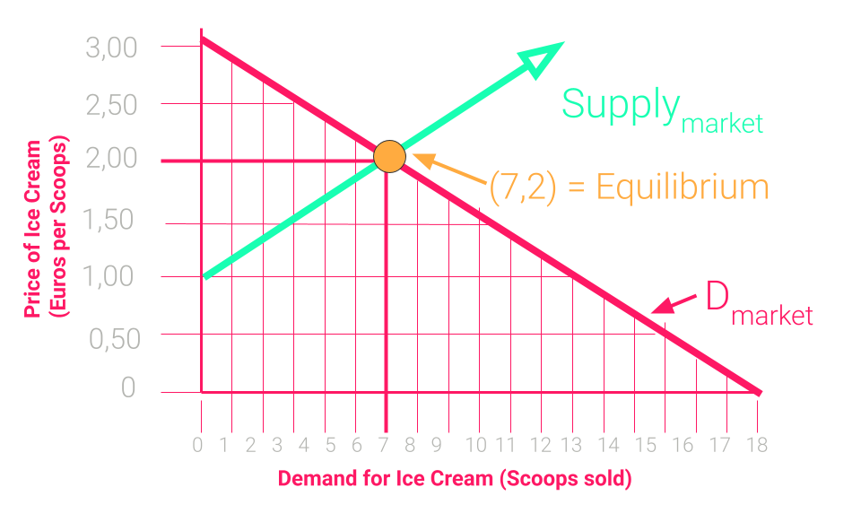
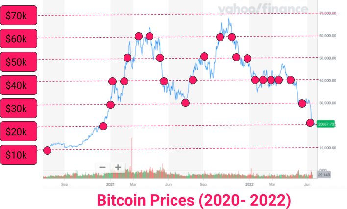

# Economic Basics

---

<widget-speaker name="Alfonso Cevallos" position="Research Scientist at Web3 Foundation" image="../../../assets/img/0-Shared/people/alfonso.png" github="AlfonsoCev" twitter="" linkedin="alfonso-cevallos-9b8b2a121" matrix="alfonso:web3.foundation"></widget-speaker>

---

### Cryptography $🤖~~~~~~~~~~~~$  🤝  $~~~~~~~~~~~~👪$ Economics 

<widget-columns>
<widget-column> 

<widget-text center >

- Mathematical guarantees about behavior of _machines_
- Objective
- Unbiased & Deterministic behavior
- Toolbox that tells which actions computers can do securely.

</widget-text>

</widget-column>
<widget-column>

<widget-text center>

- Social predictions about behavior of _humans_
- Subjective
- rational incentives & social preferences drive behavior
- Toolbox that tells which actions humans would take.

</widget-text>
</widget-column>
</widget-columns>

Notes:

- Note that cryptographic primities offer guarantees while economic principles offer vague predictions.
- They often fail for individuals but mostly hold for the collective.
- Crypto & Econ pair well!
- Togehter they are the toolbox to design unstoppable systems.
- They have a great symphony: where cryptography's has boundaries, economics offers solutions and vice versa.

---

> An incentive is a bullet, a key: an often tiny object with astonishing power to change a situation

_Steven Levitt_

Notes:

- Human behavior is driven by economic incentives.
- Human behavior creates societies.
- Carefully designing incentives lays the ground for functioning systems.
- You might be asked to implement certain protocols, which you have to judge if they make sense / can be improved.
- Blockchain space is economics on steroids.
  Trustlessness mostly mean that we do not trust any humans / institutions, but we have to certainly trust that cryptography works and that economics are sound.

---

## Why are economic concepts important for YOU?

 Economic principles (and limits of those) are important to ...  <!-- .element: class="fragment" -->

- ... help you make decisions in your daily life. <!-- .element: class="fragment" -->
- ... efficiently work in start-ups and small teams where every individual has big impact on protocol design. <!-- .element: class="fragment" -->
- ... better understand other protocols. <!-- .element: class="fragment" -->

---

## Outline

1. **Lecture** (around 60 minutes)
   1. [Demand & Supply](#demand-&-supply): Market Equilibrium, Decreasing Marginal Utility.
   1. [Market Forms](#market-forms): Monopoly and Oligopoly vs. Perfect Competition.
   1. [Economics of Specialization](#economics-of-specialization): Comparative Advantage, Opportunity Costs, Gains from Trade.
   1. [Behavioral Biases](#behavioral-biases): Where human decision making might be different than traditional economic theories predict.
1. **Discussion & Workshop** (around 120 minutes)
   1. Discussions to foster and apply concepts we learned.
   1. Hands-on applications.

---

## Demand & Supply

- Underlying mechanism of the functioning of markets.
- Determines the quantity of produced goods and their market prices.

---

## Why do we discuss this?

- Demand and supply are fundamental to understand market equilibrium.
- Understanding market equilibrium is crucial both,
  - to make sense of what happens in current blockchain markets, and
  - to design new markets.

Notes:
- A strong summer at the German Nordsee reduces hotel prices in Sicili, a famous artist dies and her art increases in price.

---

## Demand

**Law of demand**: When prices increase, quantity demanded of a good (generally) decreases.

Notes:

- Exception are Veblen goods where demand increases when price increases.
- Mostly luxury goods that signal something addition useful to consumption (e.g., status, reputation).

---

## Demand Schedule

 
---

## Influences on demand?

- Price (Demand moves along the curve) <!-- .element: class="fragment" -->
- Income <!-- .element: class="fragment" -->
- Price of substitution goods <!-- .element: class="fragment" -->
- Preferences <!-- .element: class="fragment" -->
- Expectations <!-- .element: class="fragment" -->
- Number of consumers <!-- .element: class="fragment" -->

---

## Supply

- **Law of supply**: All other things being equal, the supplied quantity increases in the price of a good.

---

## Demand meets Supply

- What happens when the price is higher than the Eq. Price? <!-- .element: class="fragment" -->
- What if the Quantity is lower than the Eq.Q? <!-- .element: class="fragment" -->
- Moving either supply or demand lead to new Eq. <!-- .element: class="fragment" -->

Notes:

- Combining the previous graph of market demand with supply we get this graph

---

## Influences on Supply

- Technology <!-- .element: class="fragment" -->
  - Technological advances reduce the production cost and lead to higher output at the same prices. <!-- .element: class="fragment" -->
- Expectations <!-- .element: class="fragment" -->
  - The produced quantity might depend on the expectation about the future prices of the good. <!-- .element: class="fragment" -->
- Number of Sellers <!-- .element: class="fragment" -->
  - Adding or removing sellers from the market drives the overall supply. <!-- .element: class="fragment" -->

---

## What did we learn?

- Demand & Supply are fundamental forces in markets to find quantity and price in equilibrium. <!-- .element: class="fragment" -->
- All other things being equal: <!-- .element: class="fragment" -->
  - demand decreases with increasing price <!-- .element: class="fragment" -->
  - supply increases with increasing price <!-- .element: class="fragment" -->
- There are different factors influencing supply & demand curves. <!-- .element: class="fragment" -->
  - Some shift the equilibrium on the curve <!-- .element: class="fragment" -->
  - Others move the entire curves. <!-- .element: class="fragment" -->

---

## Market forms

### (Or: why monopoly bad?)

- Typically, economists distinguish between three market forms. <!-- .element: class="fragment" -->
  - Perfect competition: Many firms, many consumers. <!-- .element: class="fragment" -->
  - Oligopoly: More than one firm, many consumers. <!-- .element: class="fragment" -->
  - Monopoly: One firm, many consumers. <!-- .element: class="fragment" -->
- The more competition a firm faces, the less market power it has. <!-- .element: class="fragment" -->
- Market power: ability to affect the price (through choosing a certain production level). <!-- .element: class="fragment" -->

Notes:

- Special form of Oligopoly is the Duopoly with two firms, something that we see later.

---

## Market Form Examples

- Monopoly: <!-- .element: class="fragment" -->
  - Postal services in many European countries. <!-- .element: class="fragment" -->
  - Railway services in many European countries. <!-- .element: class="fragment" -->
- Oligopoly: <!-- .element: class="fragment" -->
  - Cloud provider (AWS, Google, ...) <!-- .element: class="fragment" -->
  - Mobile phone service. <!-- .element: class="fragment" -->
- Perfect Competition: <!-- .element: class="fragment" -->
  - Consumer products with low barrier to entry (e.g., iced tea) <!-- .element: class="fragment" -->

---

## Why do we discuss this?

The current web2 landscape consists of several firms with a lot of market power in their respective market segment. <!-- .element: class="fragment" -->

We want to understand, from an economic perspective, why too much market power is not a good thing. <!-- .element: class="fragment" -->

---

## Perfect Competition

- Under perfect competition ...
  - ... there are so many firms that a single firm's production quantity, does not affect the price, in the market. <!-- .element: class="fragment" -->
  - ... the marginal costs ("the cost of one additional unit") of the production quantity equals the market price. <!-- .element: class="fragment" -->
  - ... firms have 0 profit. <!-- .element: class="fragment" -->

Notes: 
- This makes sense: The firm produces up to the point where an additional unit costs exactly what it gets for it on the market. <!-- .element: class="fragment" -->

---

## Monopoly

- The monopolist is the single seller of the good or service and it serves the entire market. <!-- .element: class="fragment" -->
- Generally the market is characterized by a high barrier of entry (either by investment or legal restrictions). <!-- .element: class="fragment" -->
- The monopolist is price maker (by choosing quantity) and profit maximizer. <!-- .element: class="fragment" -->

---

## The Problem with Monopoly

- Prices are higher and quantities are lower. <!-- .element: class="fragment" -->
- However, the monopolist could produce more. <!-- .element: class="fragment" -->
- There are consumers that would buy additional quantity at a slightly reduced price. <!-- .element: class="fragment" -->
- Those consumers are left out and are not able to purchase / consume the good. <!-- .element: class="fragment" -->
- The total welfare could be higher but monopolies "steal" rent from consumers. <!-- .element: class="fragment" -->
- From a utilitarian perspective, total welfare should be maximized in a market. This does not happen in a monopoly. <!-- .element: class="fragment" -->

---

## The Problem with Monopoly

Monopolies are bad because there are unrealized _gains from trade_!

- Often monopolies are deemed to be bad because they charge high prices to existing customers and that is seen as unfair. 
- This is _not_ the economic argument against monoopolies. Economically, monopolies are bad because they prevent potential buyers from buying _at all._ If the price were lower, then the monopoly could serve more customers. <!-- .element: class="fragment" -->
- Prices merely constitute a transfer. But transfers do not matter for the utilitarian who wants to maximize total welfare. 

---

## Oligopolies

- Oligopolies are somewhere between monopolies and perfect competition. <!-- .element: class="fragment" -->
- Because of the competition between firms, <!-- .element: class="fragment" -->
  - prices are lower, <!-- .element: class="fragment" -->
  - quantities higher, and <!-- .element: class="fragment" -->
  - the unrealized gains from trade are lower. <!-- .element: class="fragment" -->

---

## What did we learn?

- Markets differ in how much market power the firms possess. <!-- .element: class="fragment" -->
- Economics typically distinguishes between three forms (ordered by increasing market power): <!-- .element: class="fragment" -->
  - Perfect competition: many firms in the market. <!-- .element: class="fragment" -->
  - Oligopoly: few firms in the market. <!-- .element: class="fragment" -->
  - Monopoly: one firm in the market. <!-- .element: class="fragment" -->
- The problem of monopoly is: unrealized gains from trade because monopolist produce inefficiently low quantity, resulting in an inefficiently high price. <!-- .element: class="fragment" -->

---

## Economics of Specialization

### (or: why trade good?)

> It is the maxim of every prudent master of a family, never to attempt to make at home what it will cost him more to make than to buy.

_(Adam Smith, 1776)_

- In this part, we take a closer look at the following concepts: <!-- .element: class="fragment" -->
  - Comparative advantage. <!-- .element: class="fragment" -->
  - Opportunity costs. <!-- .element: class="fragment" -->
  - Gains from trade. <!-- .element: class="fragment" -->

---

## The economic question

- Empirical puzzle: many countries trade even though one has an advantage in producing many of the traded goods. <!-- .element: class="fragment" -->
- For example, the US are theoretically well-equipped to cheaply produce both <!-- .element: class="fragment" -->
  - complex computer chips, <!-- .element: class="fragment" -->
  - agricultural goods (e.g., potatoes). <!-- .element: class="fragment" -->
- However, US have specialized in producing the former and importing many agricultural goods from abroad. <!-- .element: class="fragment" -->
- Question: Why do countries specialize; why do countries trade? <!-- .element: class="fragment" -->

---

## Why do we discuss this?

- Polkadot allows for specialized blockchains (so-called parachains) to share security and trustless communicate.
- We want to understand, from an economic perspective, the gains that arise from such specialization.

---

## Opportunity costs

- Whenever you do something you refrain from doing something else that is possibly profitble. 
- The foregone profit is you opportunity cost.
- For example, suppose you could watch a soccer game or do some consulting work, thereby earning 200$ per hour.
- So, your opportunitiy cost of watching a soccer game is 400$ (supposing the game incl. break and overtime takes 2h). 
- **Conclusion**: There is no such thing as a free lunch.

---

## Comparative advantage

- Back to our trade example: 
  - Suppose the US can produce ten times more chips than potatoes per hour.
  - Supose there is another country (a potential *exporter*) that can produce ten times more potatoes than chips per hour.
- The US has a *comparative* advantage over the exporter at producing chips.
  - The US has lower *opportunity* costs of producing chips (in terms of foregone potatoes).
  - That is, to produce one chip the US gives up much less produced potatoes than the exporter would.
- By the same observation, the exporter has a comparative advantage at producing potatoes.
  - The exporter has lower *opportunity* costs of producing potatoes (in terms of foregone chips).
  - That is, to produce one potato the exporter gives up much less produced chips than the exporter would.

---

## Comparative advantage II

- If both the US and the exporters focus on their comparative advantage, then total welfare is higher than in a situation of autarky!
- Why?
  - Suppose both the US and the exporter require both chips and potatoes.
  - Situation A: both the US and the exporter divide their time equally between producing chips and producing potatoes.
  - Situation B: the US only produces chips and the exporter only produces potatoes.
  - Total production of chips and potatoes is higher in Situation B!
- **Specialization result**: If, in Situation B, the countries can trade with each other they are both better off than in Situation A.
---

## Behavioral Biases

- For a long time economic theory was built on the assumption that their actors were rational. <!-- .element: class="fragment" -->
  - No other-regarding preferences. <!-- .element: class="fragment" -->
  - Processes all available information efficiently. <!-- .element: class="fragment" -->
  - Not influenced by emotions. <!-- .element: class="fragment" -->
- This works well in many circumstances (e.g., on an aggregate level or assuming highly rational actors like firms executives) but in many it doesn't <!-- .element: class="fragment" -->
- Most humans are prone to Behavioral Biases and are influenced by social preferences. <!-- .element: class="fragment" -->

---

## Behavioral Economics

- Behavioral economics is mainly concerned with the bounds of rationality of economic agents. <!-- .element: class="fragment" -->
- Influenced by psychological aspects such as emotions, cogntition as well as cultural and societal factors. <!-- .element: class="fragment" -->
- Daniel Kahnemann, a psychologist, received the 2002 Nobel Prize for Prospect Theory, a fundamental theory in Behavioral Economics. <!-- .element: class="fragment" -->
  - PT models the fact that individuals assess their losses differently than their gains. <!-- .element: class="fragment" -->

---

## Behavioral Economics

### Behavior is not random! <!-- .element: class="fragment" -->

- Confirmation Bias: Decision makers focus on information that cater to their prior belief / opinion and neglect other information. <!-- .element: class="fragment" -->
- Sunk Cost Fallacy: Instead of cutting losses, decision makers continue to pour resources into a failed endeavour. <!-- .element: class="fragment" -->
- Herding Effect: Heuristic where people follow the crowd without making their own informed decision. <!-- .element: class="fragment" -->
- Gambler's Fallacy: In many situations probabilities of repeated events are independent from each other. Often decision makers fail to understand this. <!-- .element: class="fragment" -->
- Default Effect: People tend to stick with pre-selected choices. <!-- .element: class="fragment" -->
- Overconfidence: People overestimate their abilities. <!-- .element: class="fragment" -->

Notes:

- Overconfidence: If asked, more than 50% of people think they drive above average. BUT has also positive effects.

---

> Simply put, the stock market is a creation of man and therefore reflects human idiosyncrasy -- Ralph Nelson Elliott

---

<!-- .slide: data-background-color="#000" -->

# Break (10 minutes)

---

<!-- .slide: data-background-color="#8D3AED" -->

# Classroom Discussions

Notes:

- Roughly 20 minutes

---

## Behavioral Biases

- Which biases might be responsible for the following situations?
- How can we mitigate the impact of those biases?

---

## Situation 1:

> Warren Buffett announces that he increased his exposure to Apple by buying more stocks. The price of AAPL goes up.

Note:

- Herding effect
- Cannot be in the hope of a price response by Buffett's trade because it already happened.
- Self-fulfilling profecy
- Maybe still rational?

---

## Situation 2:

> A stock investor bought a big position in Wirecard at around 100 USD per share. Then, the scandal unfolds and the price plummets. The investor keeps buying in at 80 USD, 50 USD and finally at 5 USD, 3 USD and 1 USD. When a friend asks him to stop he keeps argueing to recover the losses by "buying the dip" and to "further reducing the average buying price".

Notes:

- Sunk Cost Fallacy
- Learn to accept losses

---

## Situation 3:

> Peter wants to buy a new smartphone and fancies the new iPhone. Mentally, he is already looking forward to finally buy it, but a friend urges him to do some more research. He agrees and is reading through articles that pop up after googling "Why you should buy the new iPhone".

Notes:

- Confirmation Bias
- Mitigating by actively looking outside the echo-chamber that is just catering to your opinion.

---

## Situation 4:

> A Swiss energy company could increase the number of new renewable electricity contracts from 3% to 80-90% by pre-selecting the green option when customers were renewing their energy contracts.

Notes:

- Default effect
- Is it always good? People might consume more energy because they feel better about their contract, companies can exploit this effect "default to accept all cookies". 
- https://www.bbc.com/news/science-environment-56361970
- [Paper](https://www.nature.com/articles/s41562-021-01070-3.epdf?sharing_token=4HCcx-Aouj5gOGkD37i319RgN0jAjWel9jnR3ZoTv0MsXRMaQ2nk_xsjwawpA_drZ4p8HWONsx-i-1PN3ZRN0hxsKmhDtSpN5xn5qXXWcPCTjRQxPpY5yovJQehlrDn56a7Ff3-f5ESorQLlggQObIrxTOC9Y4nefV5OGXZRww9iZyuuvAOwV0kRLk12-rKINRixIpE45bF2ZtQQdPcWuA%3D%3D&tracking_referrer=www.bbc.com)

---

<!-- .slide: data-background-color="#8D3AED" -->

# Where do you see yourself or others suffer from behavioral biases?

---

## Bitcoin Price Chart

Based on what we’ve discussed about market equilibrium, why might the price of Bitcoin have peaked at `~$68,000` in December 2021? What market dynamics would have to have been true to hit that peak, and then what might have changed for the price to drop to the current price of `$21,000` only 6 months later?

Notes:

- Open discussion with students. Answers to expect:
  - Price movement over time. I.e., the result of a Demand & Supply curve over time.
  - There is a shift in demand by expectations, (aggregated) income etc. all the previous factors that we described
  - Interestingly: Here is no shift in Supply if the protocol is seen as the producer of bitcoin!! It is fixed. However, the supply on the market does change.
- This discussion will lead to discussing where the demand of a token comes from.
- If possible: Grab this again in the discussion of inflation (i.e., the supply is increasing but deterministic, especially its independent of price)
- Where does demand come from?
- Why should Bitcoin have value?

---

## Monopoly

- We have seen: Monopolists' market power leads to inefficient outcomes.
- In the model we considered, the monopolist chose too low a quantity, which yielded too high a price, and too little trade.
- Web 2.0 is full of firms that have a monopoly-like position in their respective domain:
  - Google
  - Uber
  - AirBnb
  - ...
- How do these firms exert their market power, if not over quantities?

Notes:

- fees (uber, airbnb)
- surge pricing (uber)
- opaque auction mechanism (google in the case of online ads)

---

<!-- .slide: data-background-color="#8D3AED" -->

# Activities

---

## Activities Today & Tomorrow

- You can earn points by applying the concepts presented in this course to similar situations when playing with/against your colleagues. <!-- .element: class="fragment" -->
- In session 2.1, 2.2 and 2.3, you can increase your budget (starting at 0) during several economic games. <!-- .element: class="fragment" -->
- We have a total budget of $1800 for this. <!-- .element: class="fragment" -->
- The budget is split between all the games that we play and total points earned by all of you are dynamically adjusted to correspond to the budget. <!-- .element: class="fragment" -->
- In 2.3, there is a big final: You can use your earnings to bid for amazing NFTs by a professional artist in an experimental auction setting. <!-- .element: class="fragment" -->
- Disclaimer: If a bug occurs and the reward points are messed up or something else goes wrong, we may intervene. <!-- .element: class="fragment" -->

---

## Wallet creation

Create your wallet now here:

<!-- TODO Insert new production links to academy games -->
<!-- markdown-link-check-disable-next-line -->

#### **https://otree.w3f.tech/room/academy_wallet**

- Your balance is tracked in a wallet app.
- The points are translated to USD after each game.
- Keep your seed phrase and do not share it with others!
- You can constantly check your balance by opening the wallet app link.

Notes:

- Completely trusted and centralized xD
- If you leave your cookies you can simply log back in otherwise you need your seed phrase.

---

# Everybody got a wallet?

---

<!-- .slide: data-background-color="#8D3AED" -->

# Make sure to have your Seed phrase for all games!

---

<!-- .slide: data-background-color="#8D3AED" -->

# No seed - No payoff!

---

## Game 1: Ultimatum game

- You are randomly matched with another student in the classroom. <!-- .element: class="fragment" -->
- The interaction is anonymous. <!-- .element: class="fragment" -->
- Player 1 gets an endowment of 100 points. <!-- .element: class="fragment" -->
- Player 1 can offer Player 2 between 0 and 100 points. <!-- .element: class="fragment" -->
- Player 2 sees the offer and can decide to accept or reject the offer. <!-- .element: class="fragment" -->
- If the offer is accepted, the endowment is split according to the offer. <!-- .element: class="fragment" -->
- If the offer is rejected, both get 0 points. <!-- .element: class="fragment" -->
- Budget for the game $400. <!-- .element: class="fragment" -->
- There is no right or wrong here. It is your choice how to behave in this context! <!-- .element: class="fragment" -->

---

<!-- .slide: data-background-color="#8D3AED" -->

# Questions?

---

## Let's start!

<!-- TODO Insert new production links to academy games -->
<!-- markdown-link-check-disable-next-line -->

**https://otree.w3f.tech/room/academy_ultimatum**

---

## Game 1: Discussion

- What were your strategies here?
- What do you think we would expect from rational players?
- Why did people offer something?
- What did we measure here?

Notes:

- What would we expect from rational players (they do not know the concept of Nash Equilibrium yet but intuitively they can argue).
- What do you expect the data to look like?
- Did we measure fairness? No.
- How could we measure fairness?
  - Dictator game
- Talk about results in the literature:
  - Many people offer 40-50%
  - Almost nobody offers more than 50%
  - Many people reject below 30%
  - This is not only because of the stakes. There are experiments in Thailand and Indonesia where they play with half year salary.

---

<!-- .slide: data-background-color="#8D3AED" -->

# Game 1: Results!

---

## Game 2: Cournot Competition

- Economic model
- Firms compete by setting quantities
- Identical product
- Demand always meets supply
- Named after French mathematician Augustin Cournot.

Notes:

- Game 1: Cournot Competition with 2 firms (players from the audience) for 10 rounds

---

## Game 2: Overview

- Cournot competition (Duopoly!) <!-- .element: class="fragment" -->
- 2 firms (you play 1 firm!) <!-- .element: class="fragment" -->
- Each of you individually set a quantity to produce. <!-- .element: class="fragment" -->
- All units are sold, but the price decreases in the quantity. <!-- .element: class="fragment" -->
- Repeated over 10 rounds <!-- .element: class="fragment" -->
- Points accumulate and are added to your budget. <!-- .element: class="fragment" -->
- Budget for the game: $400 <!-- .element: class="fragment" -->

---

## Game 2: Rules

---

<!-- .slide: data-background-color="#8D3AED" -->

# Questions?

---

## Let's start!

<!-- TODO Insert new production links to academy games -->
<!-- markdown-link-check-disable-next-line -->

#### **https://otree.w3f.tech/room/academy_cournot**

---

## Game 2: Discussions

- What strategy did you employ?
- Did your behavior change over the rounds?
- What was the best choice for each firm?

Notes:

- Calculate equilibrium:
- $\pi = P(Q) * q$
- For Firm 1: $\pi = (60 - q_1 - q_2) * q_1$
- solve for optimal $q_1$ -> delta-pi / delta-q1 = -2q_1 - q_2 + 60 =! 0
- q_1\* = (60 - q_2) / 2
- q_2\* = (60 - q_1) / 2
- q1* = (60 - (60-q1*)/2) / 2
- = 30 - 15 + (q_1*/4) = q_1*
- = q_1* = q_2* = 20
- Show with example. If firm 1 plays 20 then 19 leads to smaller payoff and 21 for other firm

---

<!-- .slide: data-background-color="#8D3AED" -->

# Game 2: Results!

---

## Conclusion

- We learned:
  - fundamental economic concepts that are important to navigate the blockchain space.
  - a few behavioral biases that cause humans to behave suboptimally.
  - to transfer the concepts to the blockchain space.
  - experienced economic concepts ourselves by playing a cournot competition.

---

## Further studying material

**Economics**

- [Polkadot Economics](https://research.web3.foundation/en/latest/polkadot/overview/2-token-economics.html) - Tokenomics of Polkadot

**Stablecoins**

- [Before Terra Luna collapse](https://www.coindesk.com/layer2/2022/04/22/built-to-fail-why-terrausds-growth-is-giving-finance-experts-nightmares/) - An article that warns about the risks of Terra Luna just two weeks before its collapse.
- [After Terra Luna collapse](https://thebittimes.substack.com/p/what-can-other-algorithmic-stablecoins?s=r) - Interesting information about how Terra luna collapsed.
- [Deep Dive into Collapse](https://github.com/adit313/TerraDeepDive)
