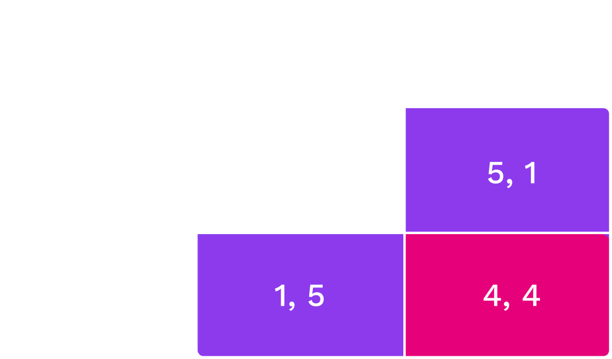
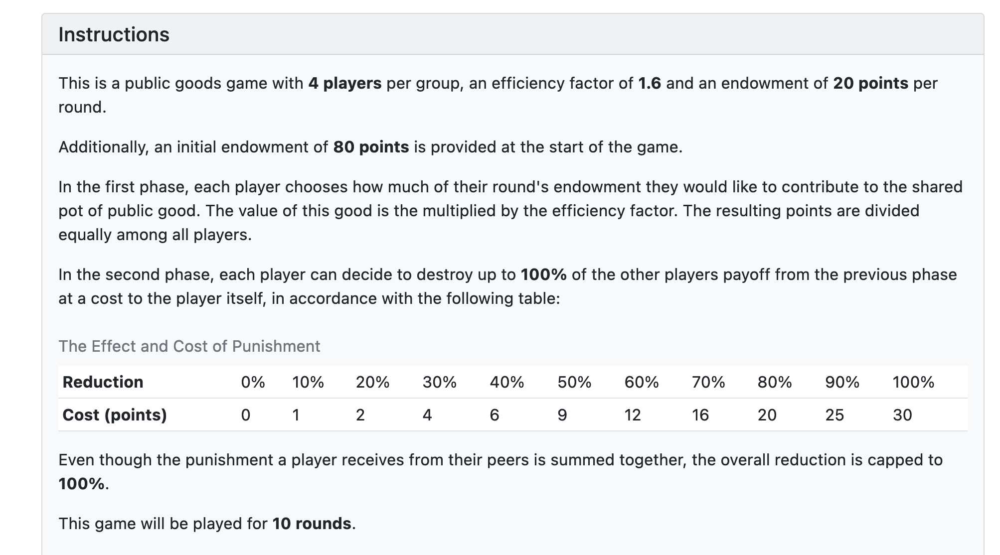

# Game Theory Basics

---

<widget-speaker name="Jonas Gehrlein" position="Research Scientist at Web3 Foundation" image="../../../assets/img/0-Shared/people/jonas.png" github="jonasW3F" twitter="GehrleinJonas" linkedin="jonas-gehrlein" matrix="jonas:web3.foundation"></widget-speaker>

---

# Outline

- Lecture (60 minutes)
  - [What is Game Theory?](#what-is-game-theory)
  - [What is a Game?](#what-is-a-game)
  - [Types of Games](#types-of-games)
  - [Public Goods and the Tragedy of the Commons](#public-good-game)
- Workshop & Activities (120 minutes)
  - Discussions & more games

---

## What is Game Theory?

> Game theory is the study of mathematical models of conflict and cooperation between intelligent and rational decision makers.
> Rational means that each individual’s decision-making behavior is consistent with the maximization of subjective expected utility.
> Intelligent means that each individual understands everything about the structure of the situation, including the fact that others are intelligent rational decision makers.

_Roger Myerson, 1986_

Notes:

- This sets the stage for this lecture
- Some important keywords:
  - conflict and cooperation: Depending on the situation, there might be cooperation or conflict between the players, sometimes both.
  - Rationality is a big assumption here, mainly to maximize utility.
  - Often (as we saw in 2.1) this solely means to maximize monetary payouts, but the utility functions could depend on more factors.
  - We (generally) assume that all players know about the rules of the game and that they have enough processing power to compute everything necessary.

---

## Game Theory in Web3

In the context of blockchains, game theoretic reasoning is used for:

- **Tokenomics**: The specific design of how people interact in the ecosystem.
- **Consensus**: Do the nodes in the network have the right incentives to follow the consensus protocol?

Notes:

You wont recognize these terms just yet, but next module we will dive deep into them.
Keep them in mind as we move forward: this is _why_ we study Economics in this academy.

- Blockchain economics/tokenomics is all about understanding how people will act in situations where information and rules are transparent.
- We’ll cover the basics of game theory today, but let’s look through some of the core moments in this field so that you can go as deep as you’d like.

---

## History of Game Theory

- Early “game theoretic” research early 19th century, still relevant.
- The systematic study of games started in the 20th century.
- Modern game theory is used in economics, biology, sociology, political science, psychology, among others.

In economics, game theory is used to analyze many different strategic situations like auctions, industrial economics, and business administration.

<!-- .element: class="fragment" -->

Notes:

**History of Game Theory**

- Early “game theoretic” research that still resonates today goes way back into the early 19th century:

  - 1838, Antoine Augustin Cournot: Cournot competition, uses an early, simplified version of Nash equilibrium.
  - 1881: Francis Edgeworth: trade with two consumers and two goods.
  - 1913, Ernst Zermelo: chess, first formal application of backward induction.

- The systematic study of games started in the 40/50s of the 20th century:
  - 1944: John von Neumann and Oscar Morgenstern publish _Theory of Games and Economic Behavior_.
  - 1949: John Nash writes his dissertation.
    His best known contribution is on the general existence of a solution (the Nash equilibrium) for the important class of finite games.
  - 1963: Douglas Gale and Lloyd Shapley publish seminal work on matching.
  - 1973: John Harsanyi provides important insights into mixed strategies.
  - 1976: Robert Aumann publishes seminal work on common knowledge of rationality.

---

## Game theory is _abstract_

Game theoretic models aim to get at the essence of a given strategic problem.
This often requires that many facets of the problem are assumed away.

- Pro: _Abstraction_ makes the problem amenable to analysis and helps to identify the key incentives at work.
- Con: A certain lack of realism.
- In any case: Modeling a strategic situation always entails a tradeoff between tractability and realism.

Notes:

- Need to explain what we mean by lack of realism:
  - Often people have more choices than we model.
  - Often people take other things into consideration when making choices than the model allows.
  - Often people know more/less than we assume.
- How to resolve the tradeoff between tractability and realism is often subjective and depends on the taste of the modeler.

---

# What is a Game?

---

## Definition: (Economic) Game

A game is a strategic interaction between several players, where _common knowledge_ among all the players of the game includes:

1. all the possible _actions_ of the players
1. all the possible _outcomes_
1. how each combination of actions affects the outcome

---

## Definition: Common Knowledge

An event $X$ is common knowledge if (1) everyone knows $X$, (2) everyone knows that everyone knows $X$, (3) everyone knows that everyone knows that everyone knows $X$, and so on ad infinitum.

---

## Examples: Common Knowledge

Auctions

- Actions: Bids. <!-- .element: class="fragment" -->
- Outcome: Winner and Payment. <!-- .element: class="fragment" -->

Price-competition between firms <!-- .element: class="fragment" -->

- Actions: Price charged. <!-- .element: class="fragment" -->
- Outcome: Demand for each firm, profit of each firm. <!-- .element: class="fragment" -->

Notes:

Crucial feature of a game: outcome not only depends on own actions but also on the actions of the other players.

---

## Types of games

Game theory distinguishes between:

- static and dynamic games <!-- .element: class="fragment" -->
- games of complete information and games of incomplete information. <!-- .element: class="fragment" -->

---

## Types of games

|                  | Static Game                                                                              | Dynamic Game                                                                                           |
| ---------------- | ---------------------------------------------------------------------------------------- | ------------------------------------------------------------------------------------------------------ |
| Definition       | All players take their actions at the same time                                          | Players move sequentially and possibly multiple times, (at least partially) observing previous actions |
| Simple Example   | Rock-Paper-Scissors.                                                                     | Tic-Tac-Toe                                                                                            |
| Economic Example | Sealed-bid auction. All bidders submit their bids simultaneously (in a sealed envelope). | English auction. Auctioneer publicly raises price if at least one bidder accepts the price.            |

---

## Types of games

|                  | Game of Complete Information                                                 | Game of Incomplete Information                                                                       |
| ---------------- | ---------------------------------------------------------------------------- | ---------------------------------------------------------------------------------------------------- |
| Definition       | Preferences and types of the players are common knowledge.                   | Preferences and types are not common knowledge.                                                      |
| Simple Example   | Tic-Tac-Toe. Both players prefer winning over losing.                        | Cluedo/Among us.                                                                                     |
| Economic Example | Competition between firms (assuming that all firms know other firms' costs). | Most art auctions. People tend to have highly subjective preferences that they only know themselves. |

Notes:

- There is also the notion of perfect and imperfect information which we should skip here.
  More info: https://economics.stackexchange.com/questions/13292/imperfect-vs-incomplete-information

---

<!-- .slide: data-background-color="#8D3AED" -->

# Quiz

---

### Three firms want to hire an engineer...

<widget-columns>
<widget-column>

- The engineer brings added value to each firm of $300,000$ USD per year.
- The payoff of the firm is $300,000$ USD minus the salary.
- The payoff to the engineer is salary minus cost of working, which is known to everyone.
- All firms make a salary offer at the same time.

</widget-column>
<widget-column>

### Quiz Questions:

1. Is this game static or dynamic?
   What would need to change in the description of the game such that it would fall in the other category?
1. Is this game of complete or incomplete information?
   What would need to change in the description of the game such that it would fall in the other category?

</widget-column>
</widget-columns>

Notes:

1. The game is static.
   For it to be dynamic, firms would need to make offers sequentially, _knowing what the firms before had offered_.

- This lecture focuses on static games of complete information.

1. The game is of complete information.
   To make information incomplete, we would need to have that the value of hiring the engineer differs between firms and is unknown between firms.
   Or that the cost of working for the engineer is not known to the firms.
   The point is that we need to have uncertainty over payoffs.

- When we look at auctions in Session 3.3, we will also consider games of incomplete information, both dynamic and static.

---

<!-- .slide: data-background-color="#8D3AED" -->

# Well-known Games

---

## Prisoners' Dilemma

A fundamental problem:

> Even though everyone knows that there is a socially optimal course of actions, no one will take it because they are rational utility maximizers.

It's a static game of complete information.

Notes:

One of the most famous games studied in game theory.

- Static because both players take their action at the same time.
- Complete because everybody is aware of all the payouts.

---

## Bonnie and Clyde

Bonnie and Clyde are accused of robbing two banks: <!-- .element: class="fragment" -->

- The evidence for the first robbery is overwhelming and will certainly lead to a conviction with two years of jail. <!-- .element: class="fragment" -->
- The evidence for the second robbery is not sufficient and the two will only be be convicted for that robbery in case of a confession by either or both. <!-- .element: class="fragment" -->

---

## Bonnie and Clyde

In the interrogation they both are offered the following: <!-- .element: class="fragment" -->

- If you both confess you will both go to jail for four years. <!-- .element: class="fragment" -->
- If you do not confess while your partner does, you will go to jail for five years (one additional year for obstruction of justice). <!-- .element: class="fragment" -->
- However, if you confess but your partner does not, then we reduce your jail time to one year. <!-- .element: class="fragment" -->

Notes:

They are interrogated in different rooms, apart from each other.

---

## Bonnie and Clyde

- **Cooperate** ($C$) with each other and not tell anything
- **Defect** ($D$) and confess their crime

Notes:

They can either cooperate or defect
First payoff is Clyde, second is Bonnie

---

## Bonnie and Clyde

Choosing D is a _dominant strategy_.

Notes:

No matter what Clyde does, it is always the best choice.
So, they end up both defecting, resulting in 4 years each.
It would be in their best interest to cooperate and not to say anything.
This would minimize the total jail time for the two.
However, both Bonnie and Clyde are rational utility maximizers.
So, they end up in a situation where they not only fare worse _individually_ (4 instead of 2) but also _jointly_ (the total jail time is 8 years rather than 4 years).

---

## Prisoners' Dilemma IRL

**[Nuclear Arms Race](https://www.history.com/topics/cold-war/arms-race)**

NATO and Russia prefer no arms race to an arms race.
Yet, having some arms is preferable to having no arms, irrespective whether the other one is armed.

**[OPEC](https://www.opec.org/opec_web/en/)**

Limiting oil supply is in the best interest of all.
However, given the high price that thus results, everyone has an incentive to increase individual oil supply to maximize profits.

Notes:

OPEC and Cartels generally seems to overcome the Prisoners' Dilemma...
More on that later.

---

## Coordination Game

The prediction of play in the Prisoner's Dilemma was easy: both will defect. <!-- .element: class="fragment" -->
This is the optimal thing to do no matter what the other player does. <!-- .element: class="fragment" -->

In other games, predictions of play are not so clear. <!-- .element: class="fragment" -->
One instance is the coordination game. <!-- .element: class="fragment" -->

---

## Coordination Game

> A coordination game is a type of simultaneous game in which a player will earn a higher payoff when they select the same course of action as another player.

---

## Coordination Game Example

<widget-columns>
<widget-column>

- Choose $L$ or $R$. <!-- .element: class="fragment" -->
- The numbers represent the payoffs a player receives. <!-- .element: class="fragment" -->
- The players only obtain utility if they coordinate their actions. <!-- .element: class="fragment" -->

</widget-column>
<widget-column>

</widget-column>
</widget-columns>

Notes:

Examples:

- Driving on the right/left side of the road.
- Money adoption.
- Standard adoption.

---

## Coordination Game Example

<widget-columns>
<widget-column>

- The coordination game has two outcomes $(L,L)$ and $(R,R)$ that stand out. <!-- .element: class="fragment" -->
- Clearly, if the other player chooses $L$ ($R$), then it is optimal for the other to do so also. <!-- .element: class="fragment" -->
- So, in the outcomes $(L,L)$ and $(R,R)$ the players choose mutually optimal actions. <!-- .element: class="fragment" -->

</widget-column>
<widget-column>

</widget-column>
</widget-columns>

Notes:

- That is, for both players it holds:
  - Playing $L$ is a _best response_ to the other player playing $L$.
  - Playing $R$ is a _best response_ to the other player playing $R$.

---

## Coordination Game Example

<widget-columns>
<widget-column>

- Both $(L,L)$ and $(R,R)$ are instances of Nash equilibrium. <!-- .element: class="fragment" -->
- By their very nature, coordination games always have multiple equilibria. <!-- .element: class="fragment" -->
- The outcome $(D,D)$ in the Prisoner's dilemma is the unique Nash equilibrium. <!-- .element: class="fragment" -->

</widget-column>
<widget-column>

</widget-column>
</widget-columns>

Nash Equilibrium: A combination of actions such that all players choose optimally given the actions of the other players. <!-- .element: class="fragment" -->

---

## Equilibrium selection

- So, which outcome does the theory of Nash equilibrium predict in the coordination game? <!-- .element: class="fragment" -->
- Sometimes people switch between equilibria (if they are made to)... <!-- .element: class="fragment" -->

<!-- .element: class="fragment" -->

_Sweden, 1967._ <!-- .element: class="fragment" -->

Notes:

- Outcome? Answer: neither.

---

## Schelling Points

- Nash equilibrium _does not_ predict which strategies the players actually take.
- This is especially pronounced in games with multiple equilibria (e.g., coordination games).
- There are theories that offer insights into which strategies players actually take.

---

## Schelling Points

> If you are to meet a stranger in New York City, but you cannot communicate with the person, then when and where will you choose to meet?

Literally _any_ point and time is a Nash equilibrium...
However, most people responded: noon at (the information booth at) Grand Central Terminal.

Basic idea: in case of multiple equilibria, **social norms may help to choose one.**

<!-- .element: class="fragment" -->

Notes:

Schelling ran a couple of informal experiments in which he asked his students (quote on slide)

This is a coordination game.

---

# Summary (so far...)

Notes:

- Typology of games: static/dynamic and complete/incomplete information.
- Two canonical games: Prisoner's Dilemma and Coordination game.
- The Prisoner's Dilemma has a unique Nash equilibrium whereas the Coordination game has two Nash equilibria.
- To select among multiple equilibria, the notion of a _Schelling_ point is sometimes invoked.

---

## Why are theories of equilibrium important?

Notes:

- Nash Equilibria are used to predict the behavior of others in a closed system, like a blockchain.
- If you can identify the unique Nash Equilibrium or the Schelling point in a system, you have a strong prediction of user behavior.
- So, you can begin to drive user behavior by designing incentives accordingly.

---

## Public-Good Game

What is a public good?

- Non-rivalrous: My consumption does not affect yours. <!-- .element: class="fragment" -->
- Non-excludable: No-one can be excluded from consumption. <!-- .element: class="fragment" -->

e.g., Fireworks, Public Park <!-- .element: class="fragment" -->

---

## Public-Good Game

- All players have some endowment, e.g., 10 US Dollars.
- Each player $i$ can choose how much to contribute, $c_i$, to the public good.
- The consumption value of the public good is $\alpha (c_1+c_2+c_3)$ with $\alpha < 1$.
  - The value of the public good increases with the amount of contributions.
  - Every player (regardless of the contribution) will consume the public good.

---

## Public-Good Game

The payoffs of the players:

- Each player $i$ contributes an amount $c_i \in [0,10]$.
- The payoff function of each player $i$ is
  $$10 - c_i + \alpha (c_1+c_2+c_3)$$

- How would you interpret $\alpha$ ?
- How would you interpret $3\alpha$?
- What would be the best for the collective?

<!-- .element: class="fragment" -->

Notes:

- $\alpha$ is the private marginal benefit of contributing to the public good.
- $3\alpha$ is the social marginal benefit (there are three players!).

---

## Public-Good Optimization

The optimum for the collective maximizes total welfare:

<!-- prettier-ignore -->
\begin{gathered}
&3\cdot 10 - (c_1-c_2-c_3) + 3\alpha (c_1-c_2-c_3) \\\\ 
&= \\\\
&30 - (1-3\alpha)(c_1-c_2-c_3)
\end{gathered}

Clearly, if $3\alpha > 1$, then it is socially optimal if everyone contributes, $c_i = 10$.

Notes:

Observe: $3\alpha>1$ means that the marginal social benefit of the joint contributions is higher than the marginal social cost of the contributions.

---

## Public-Good Optimization

Is the socially optimal behavior an individually optimal strategy here?

No.
We have $\alpha<1$.

<!-- .element: class="fragment" -->

So, the individual payoff $$10 - c_i + \alpha (c_1+c_2+c_3)$$ is always maximized when not contributing at all.

Observe: Not contributing is a _dominant strategy_.

<!-- .element: class="fragment" -->

**Question:** What if $\alpha>1$? $\alpha < 1/3$.

<!-- .element: class="fragment" -->

Notes:

- So, if $1/3 < \alpha < 1$, then our public good game really is a prisoner's dilemma with more than two players: it is socially optimal for everyone to contribute but not contributing is a dominant strategy for everyone.
- If $\alpha > 1$, then the individual marginal benefit is always higher than the individual marginal cost, and it becomes a dominant strategy for all players to fully invest in the public good.
  Then, there would be no public goods problem...
- If $\alpha < 1/3$, there is no public good problem, either.
  It is socially and individually optimal not to contribute.

---

## Public-Goods in the laboratory

What do you think happens when playing this with real humans:

- for one round?
- for many rounds?
- when allowing for communication?
- with different sizes of the groups?

Notes:

What about empirical evidence?

- Little contribution when played for one round.
- Some little contribution but quickly to 0.
- Some longer and stronger contribution but eventually going to 0 quickly
- The more people the higher the perceived possibility to free ride.
- Question: How to find out if people only freeride because they believe others freeride or if they actually want to freeride?
- Answer: Conditional Cooperation table where you can specify your contribution conditional on the other's (average) contribution.
- Draw pictures of CC, freeriders,

---

## Tragedy of the Commons

Tragedy of the commons is related to public good provision.

A Common good is:

- **Rivalrous**: My consumption reduces your possibility to consume.
- **Non-excludable**: No one can be excluded from consuming the good.

i.e., a public park, an office coffee machine

Notes:

- Recall: Public good was _non_-rivalrous.

Examples:

- Public park: anyone can go; too many people spoil the experience.
- Coffee machine in the office: anyone can use it; too many users may cause congestion.

---

## Public vs. Common good

The main difference to a public good is that in a common good your consumption reduces the value of the good to others.
This is called a _consumption externality_ that you impose on others (and others impose on you.)

The _tragedy of the commons_ is that, because you do not take this externality into account, consumption is higher than would be socially optimal.

---

## Overfishing

- Fishing gives private benefit but might destroy the broader ecosystem, which has its own value for everyone (due to, e.g., tourism). <!-- .element: class="fragment" -->
- Because individual fishermen do not have to pay for the damage they cause to the broader ecosystem, they will individually fish too much. <!-- .element: class="fragment" -->

---

## Air pollution

- Producing a good yields private profit but reduces air quality for everyone. <!-- .element: class="fragment" -->
- Because there is no price attached to air quality, the firms do not have to pay for its reduction and, hence, will produce too much. <!-- .element: class="fragment" -->

---

## But...

- There should be fishing/production/mining! <!-- .element: class="fragment" -->
  After all there are always benefits to these activities. <!-- .element: class="fragment" -->
- The tragedy of the commons is that the externality is not priced into these activities, driving them to inefficiently high levels. <!-- .element: class="fragment" -->

---

## Summary (so far...)

Notes:

What have we done in this section?

- Analyzed a public good situation and their respective problems.
- Both feature non-excludable consumption.
- Public good features non-rivalrous consumption whereas the common good features rivalrous consumption.
- Both the public good and the common good are characterized by a distinct externality.
- The public good features a (positive) production externality: I profit from your production (and you do so from mine).
  - This might lead to underproduction, because individual marginal benefits from the good are lower than the social marginal benefits.
- The common good features a (negative) consumption externality: I impose a loss on you through my consumption (and vice versa).
  - This might lead to a tragedy of the commons, which is characterized by inefficiently high consumption.

---

<!-- .slide: data-background-color="#8D3AED" -->

# Discussion

Notes:

- roughly 15 minutes

---

## Open-source

> Providing open-source software is like contributing to a public good and the community will therefore sooner or later collapse.

---

<!-- .slide: data-background-color="#8D3AED" -->

# Discussion

Notes:

- roughly 15 minutes

---

## Design a 2x2 game

> Jack and Christine are rivals and keep taunting each other in front of others.
> At one time, Jack challenges Christine to a game of chicken.
> He proposes that they both get in their cars and drive towards each other on a road.
> In the middle of the distance between each other, there is a small bridge with a single lane.
> Whoever swerves away before the bridge _chickened out_.
> If both keep straight, there is no way to avoid a strong collision between the two cars.
> All friends will be present to see the result.

---

## Task

- Design this game in a 2x2 matrix
- Assign payoffs to the different outcomes
- What is/are the Nash Equilibrium/Equilibria here?
- Which type of games does this remind you of?
- How would you translate this game to real scenarios?

---

<!-- .slide: data-background-color="#8D3AED" -->

# Workshop: Games

Notes:

- roughly 70 minutes

---

## Game 1: Guessing Game

- We divide the classroom into three groups and play a guessing game.
- The budget for this game is: $200.
- The game is simple: The player who guessed closest to the 2/3 of the average guesses wins.
- If multiple people win, the payoff is split equally.
- The game is repeated for ten rounds.
- Three different group sizes: 10, 20 and 30 students.

---

## Game 1: Guessing Game

#### https://otree.w3f.tech/room/academy_guess

---

<!-- .slide: data-background-color="#8D3AED" -->

## Questions?

---

## Game 1: Discussion

- What number did you choose / what was your strategy? (which group were you in?)
- Did your strategy change over time?

Notes:

- A number above 2/3\*100 does not make sense
- If everybody believes that, choosing a number above 2/3*2/3*100 does not make sense
- ... it goes to 0
- But does 0 Win? No!
- FT asked their readers to submit their solution: Winning number was 13 (~1500 participants)

---

## Game 1: Results!

---

## Game 2: Prisoner's Dilemma

- You play a Prisoner's Dilemma (groups of 2) over 10 rounds.
- You will be randomly matched to another student in the class.
- Budget for this game: $400
- You have the option to chat between rounds.
- Important: Keep the chat civil and do not reveal any identifying information about yourself.

---

## Game 2: Payoffs

 

|           |               | **_The other participant_** |                        |
| --------- | ------------- | --------------------------- | ---------------------- |
|           |               | **Cooperate**               | **Defect**             |
| **_You_** | **Cooperate** | 200 points, 200 points      | 0 points, 300 points   |
|           | **Defect**    | 300 points, 0 points        | 100 points, 100 points |

---

<!-- .slide: data-background-color="#8D3AED" -->

## Questions?

---

## Game 2: Let's go!

#### https://otree.w3f.tech/room/academy_prisoner

---

## Game 2: Results!

---

## Game 3: Public Good Game

- We will play a public good game as presented in the lecture.
- Budget for this game: $400
- Groups of 4 over 10 periods.
- The efficiency factor is 1.6 - (that is 4 \* 0.4, which is the social marginal benefit as we discussed before).
- With one additional mechanism: After each round each player sees the contributions of the other players and can decide to deduct points from them (at own costs).

---

## Game 3: Instructions

<!-- TODO CONTENT replace above with text & table (if needed) -->

Notes:

- We play it for 10 rounds not only 2

---

## Game 3: Contribution

---

## Game 3: Punishment

---

## Game 3: Payout

---

<!-- .slide: data-background-color="#8D3AED" -->

## Questions?

---

## Game 3: Let's go!

#### https://otree.w3f.tech/room/academy_publicgood

---

## Game 3: Discussion

- What was your strategy?
- Were your group able to sustain cooperation?
- Why do people cooperate?
- Why do people punish?

Notes:

- Additional free rider problem: Punishment was fixed to 100% of the other's points.
  That means, it was better to hope for other players to punish a player.
- They cooperate maybe because they did not understand the game.

---

<!-- .slide: data-background-color="#8D3AED" -->

## Game 3: Results!

---

## Summary

Notes:

- the basics of game theoretic concepts.
- different types of games.
- how games can be modeled.
- how to apply game theoretic thinking in our decision making in certain games.
