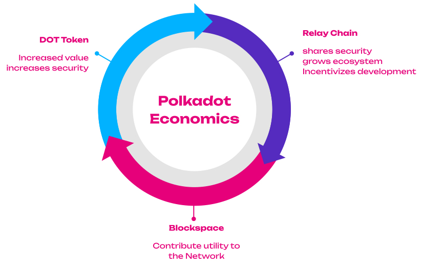

# The Economics of Polkadot

---

## Overview

- Which economic pieces build the the Polkadot Network?
- What are their mechanisms and incentives?
- How are those pieces interrelated?

---

FIXME - diagram https://docs.google.com/presentation/d/1zc1ViMiRSlbyTG-nqtxCiM7cQDbEy5G9qT5jMHSH5UE/edit#slide=id.g11e938688b1_0_46

---

# Token Economics

---

## DOT Token

<!-- FIXME https://github.com/Polkadot-Blockchain-Academy/pba-content/issues/684 to render math for offline use -->

- Native token of the Polkadot network.
- 1 DOT = \\(1\mathrm{e}{10}\\) Plancks
- Planck = smallest unit of account.
  - Reference to Planck Length = the smallest possible distance in Physics.
- **Utility Token** with several use-cases:
  - Governance (decentralization)
  - Bonding in slot auctions (utility)
  - Staking (security)
  - Message passing (e.g., transfers)

---

## Inflation Model

- Expansion in token supply.
- Token minted from thin air.
  - Used to pay staking rewards for validators and nominators.
  - (Indirectly) fund Treasury.
- Central economic variables of the model are:
- **Exogenous**:
  - Staking rate (Total amount of staked DOT / Total amount of DOT).
- **Endogenous**:
  - Optimal staking rate (a sufficient backing for validators to provide reasonable security).
- Total inflation rate (10%).

---

## Inflation Model

- Different **states** of DOT:
  - **Liquid**: Used for messaging and liquidity on markets.
  - **Bonded (Staking)**: Economic mass that guarantees the security of the network.
  - **Bonded (Parachains)**: The demand for DOT tokens by parachains.
- The goal is to obtain (some) **sensible ratio** between those three token states.

---

## Inflation Model

<pba-cols>
<pba-col>
<pba-flex center>

FIXME https://docs.google.com/presentation/d/1zc1ViMiRSlbyTG-nqtxCiM7cQDbEy5G9qT5jMHSH5UE/edit#slide=id.g11d64647c6a_0_759 plot WITH!!!! Axis labels in the img!

</pba-flex>
</pba-col>
<pba-col>

- **Central variable**: Ideal staking rate of 53.5%.
  - Highest staking rewards at the ideal staking rate.
  - Incentives to (increase) decrease the staking rate it is (below) above the optimal.
- Staking inefficiencies -> Treasury.
- Ideal staking rate scales with number of active parachains.
  - 0.5% downwards with each active (non-system) parachain until a minimum of 45%.

</pba-col>
</pba-cols>

---

## Inflation

- In the fiat-world, inflation has a negative connotation.
- This is a general discussion in economics.
- My take on this:
  - Predictable (maximum) inflation is good.
  - It incentivizes to work with the tokens (i.e., bond for good parachains, use for message passing).
  - Deflation can cause a halt of economic activity, because people start hoarding tokens.

Notes:
Question: What do you think about Inflation?

---

## Inflation Model

<pba-cols>
<pba-col>
<pba-flex center>

FIXME https://docs.google.com/presentation/d/1zc1ViMiRSlbyTG-nqtxCiM7cQDbEy5G9qT5jMHSH5UE/edit#slide=id.g2573ec8a548_0_16 plot WITH!!!! Axis labels in the img!

</pba-flex>
</pba-col>
<pba-col>

FIXME update

</pba-col>
</pba-cols>

---

## Potential changes incoming

- The current system incentivizes to move the staking rate to the ideal rate.
- Then, Treasury inflow would be 0 DOT.
- That is not sustainable.
- Proposed change: Detach inflation to stakers from total inflation and divert the rest to Treasury directly.

---

## Staking: Concept

- **Nominated Proof-Of-Stake (NPoS)**.
- Economic incentives of **validators** and **nominators** are aligned with those of the network.
  - Good behavior is rewarded with staking rewards.
  - Malicious / Neglecting behavior is punished (slashed).
- Currently, minimum total stake is `~1.6M DOTs.
- The total stake in the system directly translates to the **economic security** that it provides.
- Total stake is pooled from validators (self-stake) and their nominators (nominated stake)
  - High degree of inclusion
  - High security
  - The goal is to get as much **skin-in-the-game** as possible.
---

## Validators

- What makes Validators resilient:
  - Self-stake
  - Reputation (identity)
  - High future rewards (self-stake + commission)

---

## Nominators

- Bond tokens for up to 16 validators that they deem trustworthy.
- They have an incentive to find the best ones that match their preferences.
- They are tasked to collectively curate the set of active validators.

---

## Rewards

<pba-cols>
<pba-col>
<pba-flex center>

FIXME https://docs.google.com/presentation/d/1zc1ViMiRSlbyTG-nqtxCiM7cQDbEy5G9qT5jMHSH5UE/edit#slide=id.g11ef14eef2c_0_463 into mermaid?

</pba-flex>
</pba-col>
<pba-col>

_What are staking rewards for?_

- **Validators**: Hardware, networking, and maintenance costs, **resilience**.

- **Nominators**: Curation of the active set of validators, sort out the good from the bad ones (_Invisible Hand_).
  - Effort compensation.
  - Risk compensation.

</pba-col>
</pba-cols>

---

## Validator Selection

- The job of nominators is to find and select suitable validators.
- Nominators face several trade-offs when selecting validators:
  - Security, Performance, Decentralization
  - Ideally those variables in their historic time-series.
- Economic Background:
  - Self-stake as main indicator of skin-in-the-game.
  - Higher commission, ceteris paribus, leaves a validator with more incentives to behave.
- Various sources of trust: [Nominating and Validator Selection On Polkadot](https://polkadot.network/blog/nominating-and-validator-selection-on-polkadot/)
- Efficient validator recommendation is one of my research topics.

---

# Parachains

---

## What are Parachains?

- Parachains are the layer-1 part of the protocol.
- Blockchains of their own that run in parallel.
  - Highly domain specific and have high degree of flexibility in their architecture.
  - Share same messaging standard to be interoperable and exchange messages through the Relay Chain.
- Polkadot: 43 Parachains, Kusama: 46 Parachains.
- Their state transition function (STF) is registered on the Relay Chain.
  - Validators can validate state transitions without knowing all the data on the Parachain.
  - Collators keep the parachain alive (but are not needed for security).
- Offer their utility to the network.

---

## Parachain Slots

- The access to the network is abstracted into the notion of “slots”.
  - Leases for \~2 years on Polkadot (\~1 year on Kusama).
  - Only limited amount of slots available (networking).
  - The slots are allocated through a candle auction.
- Bonded tokens held (trustlessly) in custody on the Relay Chain.
- The tokens will be refunded after the slot expires.

---

## Economic Intuition

- Tokens cannot be used for anything (staking, transacting, liquidity, governance).
  - That means, tokens locked cause opportunity costs.
  - An approximation is the trust-free rate of return from staking.
- Parachains need to compete with those costs and generate benefits that exceed those opportunity costs.
  - Sufficient crowdloan rewards.
  - Sufficient economic activity on-chain that justifies renewal.
- Slot mechanism creates constant demand for DOT token.
- It is costly to be and remain a parachain.
  - Natural selection mechanism to select useful parachains.
  - Continuous pressure to gather funds for extending slots.

---

## What do Parachains get?

- **Parachains pay for security**.
  - Every parachain is as secure as the Relay Chain.
  - Polkadot is a security alliance with network effects.
  - Not only scaling number of transactions, but it also scaling of security.
- Security is a pie of limited size, because financial resources are limited.
- Every chain that secures itself need cut a piece of the cake, which leaves less to others (zero-sum).
- Shared security protocols allow to keep the cake whole and entail it to all participants.
- Shared security is a scaling device, because the amount of stake you need to pay stakers to secure 100 shards is less than you need to pay stakers to secure 100 individual chains.

---

## Outlook Polkadot 2.0

- Based on [Gav’s Keynote at Polkadot Decoded](https://www.youtube.com/watch?v=GIB1WeVuJD0)
- A new narrative of the whole Polkadot system.
- We move away from regarding Parachains as a distinct entity but rather regard Polkadot as global distributed computer.
- It's spaces and apps rather than chains.
- This computer has computation cores that can be allocated flexible to applications that need it.
- Corestime can be bought, shared, resold.

---

## Core Attributes of Blockspace
- **Security**: The scarcest resource in blockchain, crucial in preventing consensus faults or 51% attacks that could compromise transactions.
- **Availability**: Ensuring blockspace is available without long waiting times or uncertain costs for a smooth, seamless interaction within the decentralized ecosystem.
- **Flexibility**: The ability of blockspace to be fine-tuned by the consumer for specific use-cases.

---

## Blockspace Ecosystem
- A networked collection of individual blockspace producers (blockchains) offering secured, fit-for-purpose, efficiently-allocated, and cost-effective blockspace.
- A valuable aspect of a blockspace ecosystem is its connective tissue of shared security and composability.
- Dapp developers or blockspace providers can focus on their unique features, reusing existing capabilities within the ecosystem.

For example, a supply chain traceability application could use different types of blockspace for identity verification, asset tokenization, and source traceability.

---

## Bulk markets

It's not yet finalized how they work but likely:
- Around 75% of cores are allocated to the market.
- Cores are sold for 4 weeks as NFT by a broker.
- Unrented cores go to the instantanous market.
- Price de-/increases relative to demand.
- Current tenants have a priority buy right for their core (s).

---

## Why the change?

- This allows for low barriers of entry for people to simply deploy their code to a core and test stuff
- It makes blockspace more efficient, because not all teams can/want to have a full block every 6/12 seconds.

---

# Treasury

- The treasury is an on-chain fund that holds DOT token and is governed by all token holders of the network.
- Those funds come from:
  - Transactions
  - Slashes
  - Staking inefficiencies (deviations from optimal staking rate)
- Through governance, everybody can submit proposals to initiate treasury spending.
- It currently holds around 46M DOT.
- Spending is incentivized by a burn mechanism (1% every 26 days).

---

## Treasury as DAO

- A DAO (decentralized autonomous organization) that has access to funds and can make funding decisions directed by the collective (that have vested interest in the network).
- This has huge potential that might not yet have been fully recognized by the people.
- This provides the chain the power to fund its own existence and improves the utility in the future. It will pay …
  - … **core developers** to improve the protocol.
  - … **researchers** to explore new directions, solve problems and conduct studies that are beneficial for the network.
  - … for campaigns **educating people** about the protocol.
  - … for **systems-parachains** (development & collators).
- A truly decentralized and self-sustaining organization.

---

# How does it all fit together?

---

---

## Takeaways

- Polkadot is a system that offers shared security and cross-chain messaging.
- Security scales, i.e., it takes less stake to secure 100 parachains than 100 individual chains.
- The DOT token captures the utility that the parachains provide and converts it to security.
- The slot mechanics (renewal, auctions) creates a market where parachains need to outcompete opportunity costs to be sustainable (i.e., they need to be useful).
- Polkadot is a DAO that will be able to fund its own preservation and evolution.
- There are many changes to come with Polkadot 2.0 creating a much more agile system.

---

## Further Resources

- [Agile Coretime RFC](https://github.com/polkadot-fellows/RFCs/pull/1)
- [Discussion on Changing Inflation Model](https://forum.polkadot.network/t/adjusting-the-current-inflation-model-to-sustain-treasury-inflow/3301)
- [Gav's Talk about Polkadot 2.0](https://www.youtube.com/watch?v=GIB1WeVuJD0)