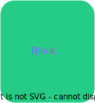
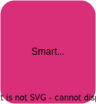

# Week Two

## Blockchain Smart Contracts

---

## Official Schedule

<pba-cols>
<pba-col>
Mon

</pba-col>

<pba-col>

Tue

</pba-col>

<pba-col>

Wed

</pba-col>

<pba-col>

Thu

</pba-col>

<pba-col>

Fri

</pba-col>
<pba-col>

---

## Hybrid Schedule

<pba-cols>
<pba-col>
Mon

</pba-col>

<pba-col>

Tue

</pba-col>

<pba-col>

Wed

</pba-col>

<pba-col>

Thu

</pba-col>

<pba-col>

Fri

</pba-col>
<pba-col>

---

## Smart Contracts Team

Notes:

Teaching today you'll have Lauren, Aaron, Joshy, and Andrew. 
Stephen from Moonbeam, Piotr and Filip from Aleph0, will all be here later this week to do some smart contract lectures and activities as well. 
The format for this morning will be lecture, activity, break, lecture, activity 
After lunch it will be the same: lecture, activity, break, lecture, and activity! 

---

## Blockchain Team

Notes:
Then tomorrow Josh, Andrew, and Maciej will go from Smart Contracts to Blockchain things. Remember we're bouncing back and forth during the week, continuously building on the content and our definitions.
But we'll continue to follow that same format of lecture then activity, lecture and activity and so on.
I should caveat and share that Joshy and I both prior teachers, so we're big fans of hands on activities. We feel it's the opportunity to put your learning into practice. We don't want to be up here the entire time talking at you. We want you to be able to get your hands dirty and get into the code.

---

## New Content Warning

> Cambridge-y (adj) - Overall good quality, but with rough edges or imperfections. Especially when related to PBA content.

Notes:

This is the third edition of the PBA.
That means a lot of our content is pretty polished and honed.
Whereas a year ago when we did this for the first time in Cambridge, a lot of stuff was, well, kinda Cambridge-y.

But this smart contract content is actually brand new.
In the past we had a very short module at the end of the course specifically about writing ink! smart contracts.
This time we have moved it much earlier to emphasize the impact smart contracts can have on society, and why blockchains are so important for their success.
We also take a broader view, looking not only at ink!, but also at the EVM, Solidity, and Vyper.

We have put a lot of love into this content, and we hope you'll enjoy it and give us constructive criticism to make it less Cambridge-y next time.
