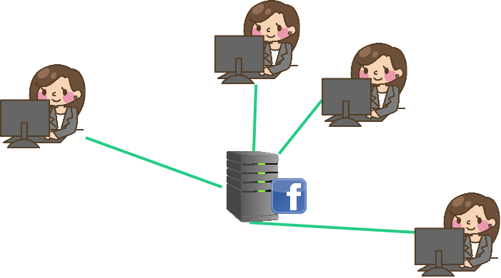
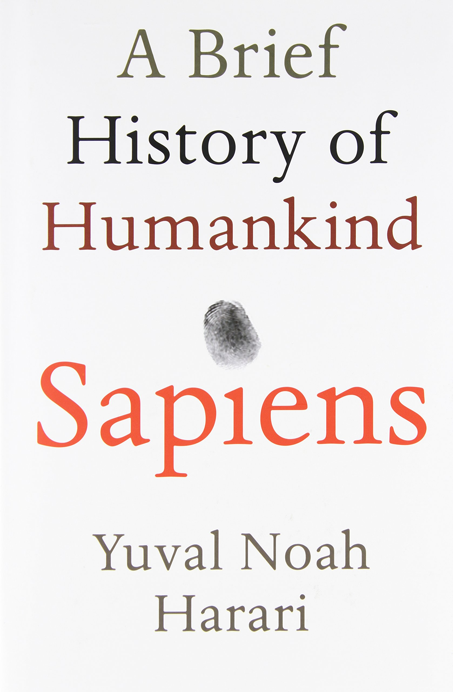
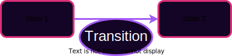
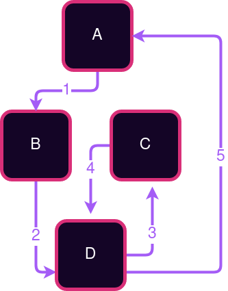
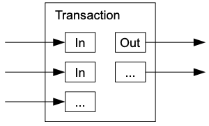
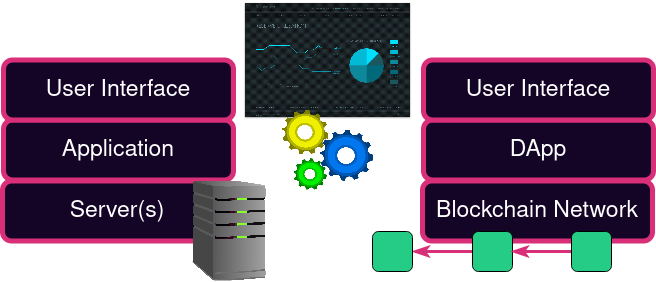

# Overview of Blockchains

---

## Upholding Expectations

What is the core problem we want to solve?

Trustless provisioning of infrastructure.

<!-- .element: class="fragment" data-fragment-index="2" -->

Notes:
Potential for some discussion here, engage the audience.

Something kind of like a server, that doesn't rely on a server operator, and has strong guarantees like Cryptography has to offer.

One framing: Coming to a shared understanding of a common history, and therefore a common state, of a system.

---

## Comparison with Cryptography

Cryptography provides strong guarantees about _messages_ without a trusted party, regardless of the conduit over which a message was transported.

Notes:
Crypto guarantees:

- No tampering
- No eavesdropping
- Authorship

---

## Web 0

Telegraph, Telephone

Users transmit information peer-to-peer.

Crypto not typically used except by military, but upheld guarantees when used.

---

## Web 1

Introduction of always-on servers.

Still mostly peer-to-peer.

Cryptography more often, but still not ubiquitous.

---

## Web 2

Introduction of **Digital Services** with **Rich State**.

Administered by service providers: "Send _us_ your information."

However, users must place faith in the service provider.

Cryptographic guarantees are about interactions with the service provider, not peers.

---v

## Digital Services

People rely on digital services every day.
They are inescapable and valuable.

- Twitter, Instagram, Facebook, etc.
- Journalism and sources
- Banks
- Lawyers, notaries, regulators

Notes:

- Ask class for more examples
- Digital services are not bad in and of themselves. They are very valuable. We use all of these every day. We are even using some to administer this course. But they are also hard to escape.

---v

## Trust Example

Two users on Twitter:

- Trust that we are seeing information from the same database\*
- Trust that if a tweet is from X, then X wrote that tweet\*
- Trust that others see our messages as from us\*
- Trust that the messages we see are the messages the users wrote\*
- Trust that we're interacting with the application as equals

Notes:

- Cryptography actually provides a lot of these guarantees, but not when an intermediary has stepped in between users.
- This is one example, but class should discuss.

---v

## God Mode Enabled

In web 2, service providers can perform abuses:

- Censoring user interaction
- Restricting users interaction
- Failing to produce requested data
- Mutating state opaquely

---v

## Thought experiment: Digital Currency

Bitcoin's application was digital currency - a trivially simple application.

Could this be built with Web2 technology?

Notes:
Yep it could. This is the kind of simple app you might build in a Freshman year course
on modern web interfaces. It just needs to maintain a set of bank notes and their owners (or alternatively a set of accounts and their balances.) So why didn't this exist in web 2? Because the provider could print money. Or steal money. Or freeze funds.
Side thought. How different is this from fiat currencies?

---v

## Distributed Applications in Web 2

Providers run redundant data centers to prevents accidents.

But it still assumes benevolent participants and some trusted leader.

Notes:
Even in web2 we start to see the idea of redundancy to prevent accidents from natural disasters, sabotage, hardware failure etc.
But we do not yet see disintermediation. In web 2, the masses become beholden to the service providers who were free to extract value and manipulate the users.

In fact redundant systems were widely studied even before web 2. Consider a flight computer that has sensors for things like air speed and altitude. If one sensor fails we want the plane to keep flying.

---

## Web3

A provision of digital services without the need to trust a service _provider_.

Providers do not need to be trusted; they are economically incentivized to behave honestly.

Notes:
We want to maintain the value, versatility, and richness of Web2, but remove the trust, and possibility of extractive behavior.

---v

## Desired Approach

Allow users to interact with a common system without trusting any intermediaries.

Opens the door to new application stacks:

- Shared state and state change rules
- Custom rendering, moderation, interfaces

---v

## Application Disentanglement

Removing trust allows us to unpackage applications.

Notes:

The idea here is to discuss how applications are often seen as an entire bundle: e.g.
Instagram is the database, the algorithms, the UX.
But when we have credible expectations that we're interacting with the same system, rules, data, it's possible to build lots of ways to access and interact with the system.
It also removes the need for a central authority to deal with all appeals/complaints from various users.

---

# Desired Properties

---v

## Permissionless access

Anyone should be able to access and interact with the system.

---v

## Privacy

Users should have credible expectations about what information they give up about themselves.

---v

## Authenticity

Users should have credible expectations about the messages they see, regardless of the platform the messages are on.

---v

## Finality

Users should be able to form credible expectations about when a state transition is final.

---v

## Behavior

The system should behave as expected, even if system operators do not.

---v

## _Unstoppability_

No individual actor, company, state, or coalition should be able to degrade any of these properties.

---

## A Shared History

Notes:
So now we understand the goals of web3. How do we achieve them? The key is allowing users to agree on a shared history. The simplest blockchains do nothing more than timestamp and attest to a stream of historical records. In Web 2 users have no visibility into the history of the app. They must trust the provider to accurately represent the current state. By giving the service provider the power to change the story, we give them the power to shape our understanding of reality and consequently our behavior.

---v

## A Shared History

<blockquote>
Any large-scale operation - whether a modern state, a medieval church, or an archaic tribe - is rooted in common stories that exist only in people's collective imaginations.
</blockquote>

<blockquote>
Telling effective stories is not easy. The difficulty lies ... in convincing everyone else to believe it. Much of history revolves around this question: How does one convince millions of people to believe particular stories about gods, nations, or LLCs?
</blockquote>
<!-- .element: class="fragment" data-fragment-index="2" -->

-- Yuval Noah Harari, Sapiens

---

## State Machines

We can formalize this notion of shared story with state machine model.

Notes:
Most systems that we care about can be modeled as state machines. A state machine is not a real machine that you can touch. It is a model comprised of a set of states and a set of rules about how to transition between the states.

---v

## Labelled Transition Systems

Sometimes you can map the entire state space as an LTS.

Other times it is too big.

Notes:
Consider if we tried to map all possible states of a social media app or a digital currency. Sometimes an LTS drawing like this is useful, other times it would be too large or even infinite. Even still, sometimes drawing part of it can help you think about what the states and transitions might be.

---v

## Example: Light Switch

Simple Switch: 2 States, 1 Transition

**Labelled Transition System** <!-- .element: class="fragment" data-fragment-index="2" -->

 <!-- .element: class="fragment" data-fragment-index="2" -->

**History** <!-- .element: class="fragment" data-fragment-index="3" -->

 <!-- .element: class="fragment" data-fragment-index="3" -->

---v

## State Machine Example: Digital Cash

Each state is a set of bank notes. Where a bank note has an amount and an owner.
A transition involves a user consuming (spending) some bank notes and creating new ones.

Notes:
Not all conceivable transitions are valid. Imagine a user consuming a bank note worth 5 coins, and creating two new ones each worth 3 coins.

---v

## Sate Machine Example: Social Media

Each state is a set of posts and their associated comments and emoji reaction counts.
A transition involves, making a new post, or reacting to someone elses, or commenting

Notes:
There is not a single model here. Some state machines will allow deleting or editing posts, while others will not. Some will allow disliking posts while others only allow liking.

---v

## More State Machine Examples:

<pba-flex center>

- Ride sharing platform
- Voting system
- Blackjack table

</pba-flex>

Notes:
Let's brainstorm what the state and the transitions might be for each of these.

---v

## Shared Story of a State Machine

<pba-cols>
<pba-col>
<pba-flex center>

If we agree on:

- The starting state (aka genesis state)
- The history of transitions

</pba-col>
<pba-col>
</pba-flex>

Then we _MUST_ agree on:

<pba-flex center>

- The current state

</pba-flex>

</pba-col>
</pba-cols>

Notes:
Now that we have a formal mathy model of systems that we care about, we can see that the notion shared stories being powerful is more than slick language of philosophical mumbo jumbo. Even the term genesis state (or genesis block) is taken straight from mythology. We aren't newly discovering or inventing the idea that having a shared understanding of our past is important. It dates back to pre-history. We are just formalizing it and applying it to digital services.

---

## Blockchains (Finally)

A blockchain can be thought of in three parts

<pba-cols style="margin-top: 0">
<pba-col>
<pba-flex center>

**State Machine**

What does the state hold?

What are the _rules_ to change it?

</pba-flex>
</pba-col>
<pba-col>
<pba-flex center>

**Data Structure**

How can we cryptographically represent a history so it is tamper-proof?
  

</pba-flex>
</pba-col>
<pba-col>

<pba-flex center>

**Consensus**

Which history is the real one?

What part of history is final?

</pba-flex>
</pba-col>
</pba-cols>

Notes:
First, each blockchain tracks some state machine. We've discussed several examples of what that might be already, we'll code some simple examples shortly, and we'll spend all of module 5 digging into how to create a blockchain-friendly production-ready state machine.

Next is the Blockchain Data structure. This data structure is basically a linked list of state transitions. But unlike the linked lists you studied in your data structures course, it isn't just linked by memory addresses or any other malleable thing. Instead it is cryptographically linked so that if anyone presents a different history, you can tell right away that you don't agree on a shared history. We'll dive into this data structure in the next lesson.

Finally, is a consensus mechanism. Defining a state machine alone does not uniquely define a history. There are many possible valid histories. Just like the many worlds interpretation of quantum mechanics. To really agree on the current state, we need to agree on which of the possible histories is the real one.

---v

## Short History of Blockchains

---v

## Bitcoin

<!-- TODO update above image to styled diagram -->

Uses an unspent transaction output (UTXO) model & Proof of Work (PoW) consensus.

Notes:

Source: [Bitcoin white paper](https://bitcoin.org/en/bitcoin-paper)

---v

## Ethereum

- Generalization of Bitcoin: provides a quasi-Turing-complete VM
- Uses an account-based system
- Accounts can store balances, but can also store executable code (smart contracts)
- Each contract can have its own internal state and API

---v

## Hard Forks

Historically, upgrading blockchains meant getting everyone to update their node software.

"This had made many people very angry and has been widely regarded as a bad move."

---

## Blockspace

A resource created, and often sold, by a decentralized blockchain network.

---

## Learn more:

- Article: https://a16zcrypto.com/blockspace-explained/
- Article: https://www.rob.tech/polkadot-blockspace-over-blockchains/
- Podcast: https://youtu.be/jezH_7qEk50?t=5330

Notes:
A Blockchain network is a replacement for a centralized server. It sells a product to application deployers. The state machine is the application layer, and the blockchain is the server replacement. In the same way that applications pay data centers for server resources like cpu time, disk space, bandwidth etc. Applications (maybe via their developers or users) pay for the privilege of having their history attested to and their state tracked by a trustless unstoppable consensus layer.
