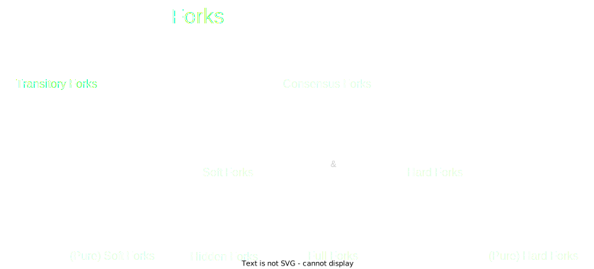
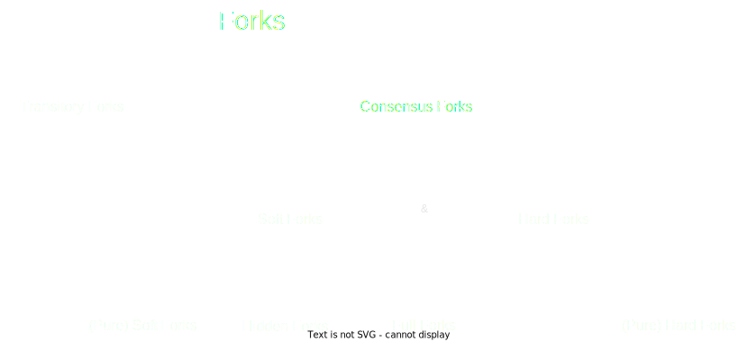
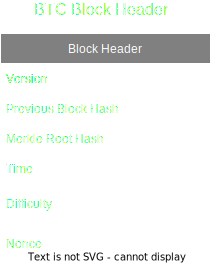
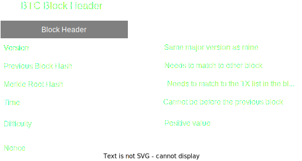
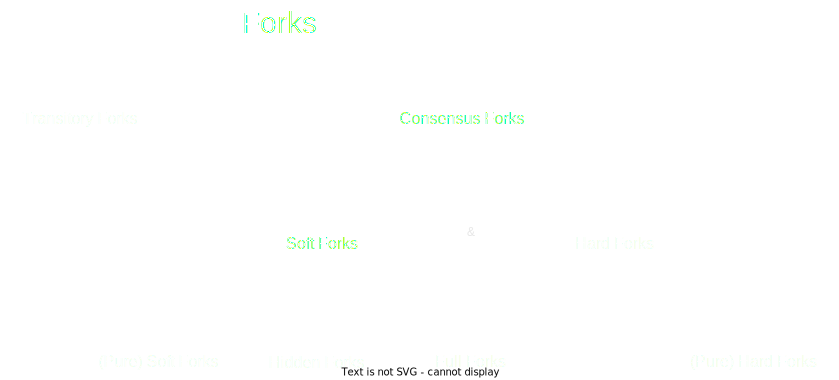
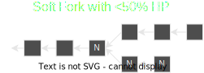
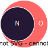
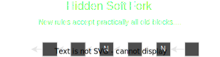
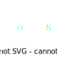
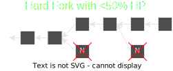

# Blockchain Forks

---

# Landscape

---v
## Landscape

#### Ideal World

In an ideal world blockchains would look like this:
  

---v
## Landscape

#### Real World

Things not always go according to plan:

 

---v
## Landscape

#### Chaotic Real World

And sometimes they get extra messy:

 

---

# What's the goal?

---v

## What's the goal?

#### _Fork Identification_

---v

## What's the goal?

#### _Fork Categorisation_

Notes:

Why? Forks in the same category will exhibit similar behaviour and will require similar handling. Then when making changs we can easily figure out to which box the change belongs and react accordingly.

---

# Fork Categorisation

---v

## Fork Categorisation

#### _Forks Family Tree_

 

---

# Transitory Forks

---v

## Fork Categorisation

#### _Transitory Forks_

 

---v

## Transitory Forks

 

---

# Consensus Forks

---v

## Fork Categorisation

#### _Consensus Forks_

 

---v

# Consensus Forks

## _Validity Set_

---v

## Consensus Forks

#### _Validity Set_
 

---v

## Consensus Forks

#### _Validity Set_
 

---v

## Consensus Forks

#### _Validity Set_
 

---v

## Consensus Forks

#### _Validity Set_
 

---v

## Consensus Forks

#### _Validity Set_
 

---v

## Consensus Forks

#### _Validity Set_
 

---v

## Consensus Forks

#### _Validity Set_
 

---v
## Consensus Forks

#### _Validity Set_

<pba-cols>
    <pba-col>
		
    </pba-col>
    <pba-col>
		
		
N ⊆ O

    </pba-col>
</pba-cols>

---

# Soft Forks

---v

## Fork Categorisation

#### _Soft Forks_

 

---v

## Fork Categorisation

#### _Soft Forks_

<pba-cols>
    <pba-col>
		
		
N ⊆ O

    </pba-col>
    <pba-col>
		<ul>
			<li>Backwards Compatible</li>
			<li>By making the consensus rules more restrictive the set of valid blocks gets smaller.</li>
			<li>Not every (and often none) of the blocks produced under old rules will get accepted by new nodes.</li>
		</ul>
    </pba-col>
</pba-cols>

Notes:
Is decreasing or increasing blocksize a soft fork?

---v

## Fork Categorisation

#### _Soft Forks_

<pba-cols>
    <pba-col>
		
		
N ⊆ O

    </pba-col>
    <pba-col>
		<strong>Examples:</strong>
		  
		<ul>
			<li>Decreasing blocksize</li>
			<li>Accepting only even/odd hashes</li>
			<li>Disallowing some transaction types</li>
		</ul>
    </pba-col>
</pba-cols>

---v

## Fork Categorisation

#### _Soft Forks_

<pba-cols>
    <pba-col>
		
		
N ⊆ O

    </pba-col>
    <pba-col>
		
    </pba-col>
</pba-cols>

---v

## Fork Categorisation

#### _Soft Forks_

<pba-cols>
    <pba-col>
		
		
N ⊆ O

    </pba-col>
    <pba-col>
		
    </pba-col>
</pba-cols>

---

# Hidden Forks

---v

## Fork Categorisation

#### _Hidden Forks_

 

---v

## Fork Categorisation

#### _Hidden Forks_

<pba-cols>
    <pba-col>
		
		
N ⊆ O

    </pba-col>
    <pba-col>
		<ul>
			<li>Conflictless</li>
			<li>The old, now excluded blocks were allowed but never used in practice.</li>
			<li>New nodes are theoretically stricter but practically accept all old blocks.</li>
			<li>Old nodes accept new blocks.</li>
		</ul>
    </pba-col>
</pba-cols>

---v

## Fork Categorisation

#### _Hidden Forks_

<pba-cols>
    <pba-col>
		
		
N ⊆ O

    </pba-col>
    <pba-col>
		<strong>Examples:</strong>
		  
		<ul>
			<li>Assigning non-conflicting uses to empty opcodes.</li>
			<li>BTC Ordinals using empty opcodes to implement BTC NFTs.</li>
		</ul>
    </pba-col>
</pba-cols>

---v

## Fork Categorisation

#### _Hidden Forks_

<pba-cols>
    <pba-col>
		
		
N ⊆ O

    </pba-col>
    <pba-col>
		
    </pba-col>
</pba-cols>

---
# Hard Forks

---v

## Fork Categorisation

#### _Hard Forks_

 

---v
## Fork Categorisation

#### _Hard Forks_

<pba-cols>
    <pba-col>
		
		
O ⊆ N

    </pba-col>
    <pba-col>
		<ul>
			<li>Forwards Compatible</li>
			<li>By making the consensus rules less restrictive the set of valid blocks gets bigger.</li>
			<li>Not every (and often none) of the blocks produced under new rules will be accepted by the old nodes.</li>
			<li>Every block produced under old rules will get accepted by new nodes.</li>
		</ul>
    </pba-col>
</pba-cols>

---v
## Fork Categorisation

#### _Hard Forks_

<pba-cols>
    <pba-col>
		
		
O ⊆ N

    </pba-col>
    <pba-col>
		<strong>Examples:</strong>
		  
		<ul>
			<li>Increasing blocksize</li>
			<li>BTC Cash fork at first*</li>
			<li>Adding new transaction types</li>
			<li>Increasing max nonce value</li>
		</ul>
    </pba-col>
</pba-cols>

---v
## Fork Categorisation

#### _Hard Forks_

<pba-cols>
    <pba-col>
		
		
O ⊆ N

    </pba-col>
    <pba-col>
			
    </pba-col>
</pba-cols>

---v
## Fork Categorisation

#### _Hard Forks_

<pba-cols>
    <pba-col>
		
		
O ⊆ N

    </pba-col>
    <pba-col>
			
    </pba-col>
</pba-cols>

---

# Full Forks

---v

## Fork Categorisation

#### _Full Forks_

 

---v

## Fork Categorisation

#### _Full Forks_

<pba-cols>
    <pba-col>
		
		
O ∩ N = ∅

    </pba-col>
    <pba-col>
		<ul>
			<li>Fully Incompatible</li>
			<li>Soft + Hard</li>
			<li>By changing the consensus rules the sets can become disjoint or overlapping.</li>
			<li>Most (and often all) blocks produced under one ruleset are not accepted under the other.</li>
		</ul>
    </pba-col>
</pba-cols>

---v
## Fork Categorisation

#### _Full Forks_

<pba-cols>
    <pba-col>
		
		
O ∩ N = ∅

    </pba-col>
    <pba-col>
		<strong>Examples:</strong>
		  
		<ul>
			<li>Changing the hashing function</li>
			<li>Changing the signature scheme</li>
			<li>Specific combinations of soft and hard forks</li>
			<li>BTC Cash fork in the end*</li>
		</ul>
    </pba-col>
</pba-cols>

---v

## Fork Categorisation

#### _Full Forks_

<pba-cols>
    <pba-col>
		
		
O ∩ N = ∅

    </pba-col>
    <pba-col>
		
    </pba-col>
</pba-cols>

---

## Summary

<pba-cols>
    <pba-col>
		
		 
		
    </pba-col>
	<pba-col>
		
		 
		
    </pba-col>
    <pba-col>
		
    </pba-col>
</pba-cols>

Notes:
- Bitcoin cash pivot from hard to full because they didn't have enough HP.
- Soft are often preferred for changes because with >50%HP they do not fracture the community (BTC community logic)
- Hard can be preferred as they seem to better represent minorities. If some people don't agree with the majority they naturally fork off and are not peer pressured to follow (ETH community logic)

---

# Thank you!

---

