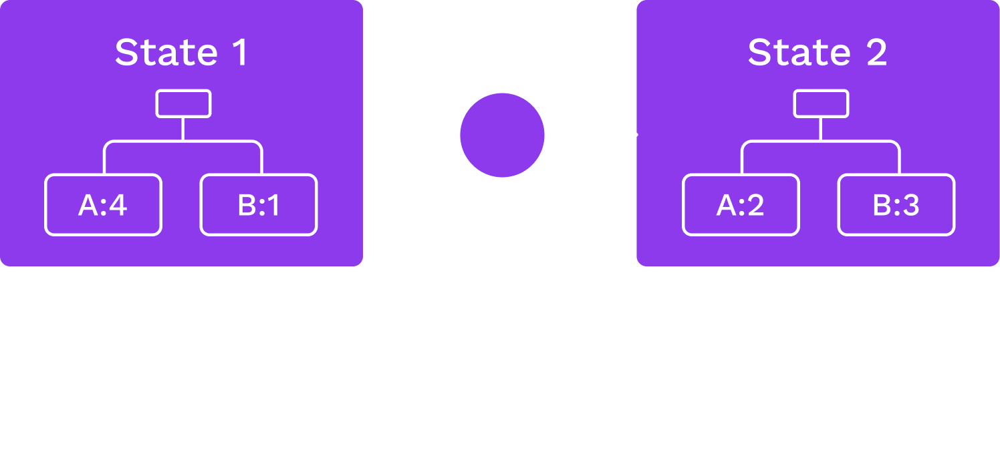
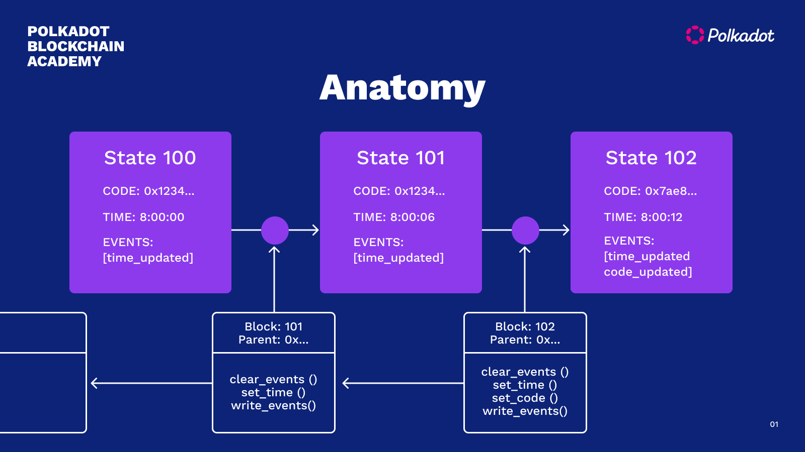

TODO Emphasize that state is not part of block.

TODO important idea

## Shared Story

Blockchain allows participants to tell a shared story, and know when someone rewrites history

---
## State Machine



## Blockchains

<widget-columns>
<widget-column>

<center>

**Consensus**

How does the state advance?

Which changes are final?

</center>
</widget-column>
<widget-column>
<center>

**State Transition Function**

What does the state hold?

What are the _rules_ to change it?

</center>
</widget-column>
</widget-columns>

---

## State Transition Function

A state transition function (STF) defines:

| Data Stored   | API & Behavior |
| :------------ | :------------- |
| Account Info  | Function calls |
| Balances      | Implementation |
| Authority Set | Responses      |
| Timestamp     |                |
| &c.           |                |

---

## Example: A Simple Storage Item Write

```rust
/// The ideal number of staking participants.
#[pallet::storage]
#[pallet::getter(fn validator_count)]
pub type ValidatorCount<T> = StorageValue<_, u32, ValueQuery>;

/// Sets the ideal number of validators.
#[pallet::call]
impl<T: Config> Pallet<T> {
	pub fn set_validator_count(origin: OriginFor<T>, new: u32) -> DispatchResult {
		ensure_root(origin)?;
		ValidatorCount::<T>::put(new);
		Ok(())
	}
}
```

Notes:

This example is from Substrate, which we will cover more in depth in the next module.

---

## Anatomy



---

## Blocks

- Includes a header and a body.
- Header includes consensus-related info: number, parent hash, some digests.
- Body contains an ordered set of _extrinsics_: Packets from the outside world with _zero_ or more signatures attached.

---

## Blocks in Substrate

```rust
/// Abstraction over a Substrate block.
pub struct Block<Header, Extrinsic: MaybeSerialize> {
	/// The block header.
	pub header: Header,
	/// The accompanying extrinsics.
	pub extrinsics: Vec<Extrinsic>,
}
```

Notes:

This example is also from Substrate, we will cover more in depth in the next module.

---

## Headers

Consensus-related info. Varies per blockchain, but in Substrate:

- Parent hash
- Number
- State root
- Extrinsics root
- Digest

The parent hash links blocks together (cryptographically linked list). The other info is handy for other infrastructure and applications (more on that later).

---

## Other Headers

<widget-columns>
<widget-column>

<center>

**Bitcoin**

</center>

- Version
- Previous Hash
- Tx Merkle Root
- Time
- N_Bits
- Nonce

</widget-column>
<widget-column>

<center>

**Ethereum**

</center>

- Time
- Block NUmber
- Base Fee
- Difficulty
- Mix Hash
- Parent Hash
- State Root
- Nonce

</widget-column>
</widget-columns>

---

## Extrinsics

Packets from the outside world with _zero_ or more signatures attached.

- Function calls to the STF
- Some functions require signatures (e.g., transfer some tokens)
- Others don't, but usually have some validation means

---

### Consensus

Whole next lecture is dedicated to consensus, going to stay strictly conceptual here.

---