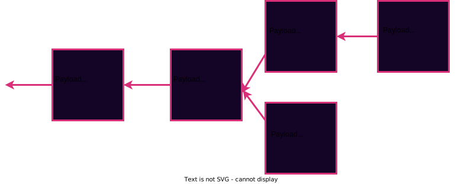
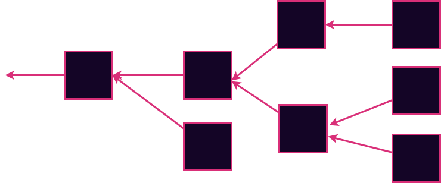
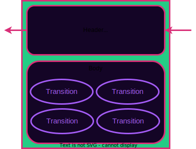

# Blockchain Structure


---

## Shared Story

A Blockchain **cryptographically guarantees** that a history of events has not been tampered with.
This allows interested parties to have a **shared history**.

---

## Hash Linked List



Notes:

This is a simplified blockchain. Each block has a pointer to the parent block as well as a payload.

---v

## Hash Linked List


Notes:

The pointer is a cryptographic hash of the parent block. This ensures data integrity throughout the entire history of the chain. This is the simplest form that a blockchain could take and indeed it allows us to agree on a shared history.

---v

## Hash Linked List


Notes:

This ensures data integrity throughout the entire history of the chain. This is the simplest form that a blockchain could take and indeed it allows us to agree on a shared history.

---v

### Genesis Block


Notes:

The first block in the chain is typically called a the "Genesis block" named after the first book in the judaeo-christian mythology - The beginning of our shared story. The parent hash is chosen to be some specific value. Typically we use the all-zero hash, although any fixed widely agreed-upon value would also do.

---

## State Machines (Again)

A state machine defines:

<pba-flex center>

- Set of valid states
- Rules for transitioning between states

</pba-flex>


---v

### Blockchain meet State Machine


Notes:

The simplest way to join a blockchain to a state machine is to to make the blockchain's payload a state machine transition.
By doing so, we effectively track the history of a state machine in a cryptographically guaranteed way.

---v

### Where do the States Live?

Somewhere else!


Notes:

There is a state associated with each block. But typically the state is NOT stored in the block. This state information is redundant because it can always be obtained by just re-executing the history of the transitions.
It is possible to store the state in the blocks, but the redundancy is undesirable. It wastes disk space for anyone who wants to store the history of the chain. Storing the state in the block is not done by any moderately popular blockchain today.
If you _want_ to store the states, you are welcome to do so. Software that does this is known as an Archive node or an indexer. But it is stored separately from the block
...Pause...
One more time to make sure it sinks in: The state is NOT in the block.

---v

### State Roots

A cryptographic anchor to the state


Notes:

Some data redundancy can be good to help avoid corruption etc. It is common for a block to contain a cryptographic fingerprint of
the state. This is known as a state root. You think of it as a hash of the state. In practice, the state is typically built into a Merkle tree like structure and the tree root is included. Not all blockchains do this. Notably bitcoin doesn't. But most do. We'll go into details about exactly how this state root is calculated for Substrate in the next two modules, but for now we just consider the state root to be some kind of cryptographic fingerprint.

---

## Forks



A state machine can have different possible histories. These are called forks.

Notes:

You can think of them like alternate realities. We need to decide which of the many possible forks is ultimately the "real" one. This is the core job of consensus and we will talk about it in two upcoming lessons in this module.

---v

## Invalid Transitions


Notes:

Before we even get to hardcore consensus, we can rule out _some_ possibilities based on the state machine itself

---

## Realistic Blockchain Structure



- Header: Summary of minimal important information about this block
- Body: A batched list of state transitions

Notes:

The header is a minimal amount of information. In some ways it is like metadata.
The body contains the real "payload". It is almost always a batch of state transitions.
There are many name aliases for what is included in the body:

- Transitions
- Transactions
- Extrinsics

---v

## Blocks in Substrate

```rust
/// Abstraction over a Substrate block.
pub struct Block<Header, Extrinsic: MaybeSerialize> {
	/// The block header.
	pub header: Header,
	/// The accompanying extrinsics.
	pub extrinsics: Vec<Extrinsic>,
}
```

Notes:

This example is from Substrate and as such it strives to be a general and flexible format, we will cover Substrate in more depth in the next module. This is representative of nearly all real-world blockchains

---

## Headers

Exact content varies per blockchain.
Always contains the parent hash.
Headers are the _actual_ hash-linked list, not entire blocks.

Notes:

The parent hash links blocks together (cryptographically linked list). The other info is handy for other infrastructure and applications (more on that later).

---v

## Header Examples

<pba-cols>
<pba-col>

<pba-flex center>

**Bitcoin**

</pba-flex>

- Version
- Previous Hash
- Tx Merkle Root
- Time
- N_Bits
- Nonce

</pba-col>
<pba-col>

<pba-flex center>

**Ethereum**

</pba-flex>

- Time
- Block Number
- Base Fee
- Difficulty
- Mix Hash
- Parent Hash
- State Root
- Nonce

</pba-col>
</pba-cols>

---v

## Substrate Header

- Parent hash
- Number
- State root
- Extrinsics root
- Consensus Digest

Notes:

Extrinsics root is a crypto link to the body of the block. It is very similar to the state root.
Consensus Digest is information necessary for the consensus algorithm to determine a block's validity. It varies widely with the consensus algorithm used and we will discuss it in two upcoming lectures.

---v

## Substrate Header (Full Picture)


---

## Extrinsics

Packets from the outside world with _zero_ or more signatures attached.

- Function calls to the STF
- Some functions require signatures (e.g., transfer some tokens)
- Others don't, but usually have some validation means

---

## DAGS

FIXME content here

---

FIXME - Split off into separate lecture about blockchains on P2P networks.
Include history stuff about bitcoin altcoins ethereum etc
Classify what is the state machine in each.
Point out that Ethereum allows user-deployable smart contracts
Remind of two definitions of contracts

## Nodes

Software agents that participate in blockchain network.<br/>
May perform these jobs:

<pba-cols>
<pba-col>
<pba-flex center>

- Gossip blocks
- Execute and Validate blocks
- Store blocks
- Store states
- Gossip transactions

</pba-flex>
</pba-col>
<pba-col>
<pba-flex center>

- Maintain a transaction pool
- Author blocks
- Store block headers
- Answer user requests for data (RPC)

</pba-flex>
</pba-col>
</pba-cols>
Notes:

Many nodes only perform a subset of these tasks

---v

## Types of Nodes

<pba-flex center>

- Full Nodes
- Light Nodes (aka Light clients)
- Authoring nodes
- Archive nodes
- RPC nodes

</pba-flex>

---

## Transaction Pool

Contains transactions that are not yet in blocks.

Constantly prioritizing and re-prioritizing transactions.

Operates as a blockspace market.

Notes:

Sometimes known as mempool (thanks bitcoin 🙄)
Authoring nodes determine the order of upcoming transactions. In some sense they can see the future.

---

FIXME Foreshadow forks where players disagree on the rules
History: dao fork bch fork
foreshadow consensus: arbitrary additional constraints for a block to be valid