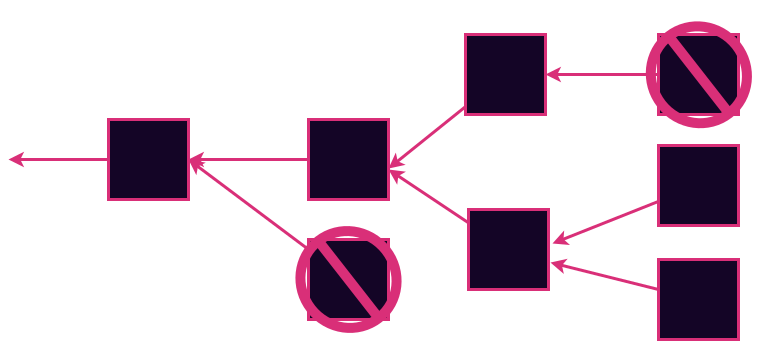
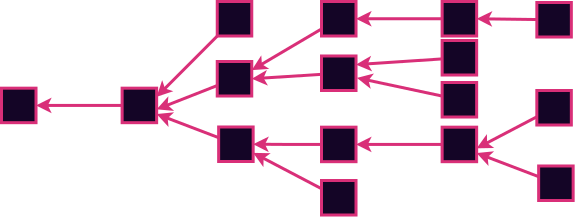

# Consensus: Authoring

---v

### Consensus is...

...a decision making process that strives to achieve acceptance of a decision by all participants.

---v

## Blockchain Consensus is...

...a decentralized consensus system to reach agreement over a shared history of a state machine.

---v

## Blockspace

Blockchain consensus systems produce a resource called blockspace.

Strong incentive alignments and strong guarantees make for high quality blockspace.

Notes:
As we discussed blockspace represents the right to contribute to the shared history. This is a valuable resource that is offered to users as a product. We will discuss the selling of this resource in a later lecture on allocation and fees. The consensus system used plays a large role in determining the quality of the blockspace.

---

## Forks Review

There are going to be forks. We need to decide which one is the real one.

We can rule some forks out to reduce the problem space. Then we are left to decide which is canonical.

Notes:
Forks represent alternate courses that history could take. They arise every time there is a difference of opinion.

You can think of them at a social level. Court cases, arguments, wars. Ideally we can resolve them peacefully

You can think of them at a very low physics-y level. Every time an electron encounters a potential barrier it either reflects of tunnels. When consensus is high-quality, the result is as objective as the outcome of a physical process.
---

## Five Aspects of Consensus

- State machine validity
- Arbitrary / Political validity
- Authorship throttling
- Fork choice heuristic
- Finality

Notes:
The first two aspects are relatively simple and I'll discuss them briefly right now. The third and fourth are the main topic of this lecture. The fifth is covered in detail two lectures from now in great detail.

The first three aspects are about ruling possibilities out. The fourth and fifth are about deciding between any remaining possibilities.

---v

## State Machine Validity

Some forks can be ruled out simply because they contain invalid state transitions.

Notes:
Example spending more money than you have. Noting your present location such that you would have traveled faster than speed of light since last record. Calling a smart contract with invalid parameters.

---v

## Arbitrary / Political Validity

Similar to state machine validity.
 
Examples:

<pba-flex center style="margin-top:0">

- Blocks that are too big
- Blocks that have "hack" transactions
- Empty blocks
- Block with Even state roots

</pba-flex>

Notes:
This concept is similar to the previous slide. In some sense this is even the same. This allows us to rule out some forks just for not having properties that we like. Or for having properties that we dislike.

Not everyone will agree on these properties ad that leads to long-term network splits.

---

## Authorship Throttling

Real-world blockchains impose additional restrictions on who can author blocks. Why?

Notes:
These blockchains are supposed to be permissionless right? At least many of them are. Some are even very hardcore about that goal. So why would we want to restrict the authoring.
Answer: So the nodes are not overwhelmed. Unthrottled authoring leads to fork chaos. If anyone authored at any moment there would be blocks raining down left and right. It would be impossible to check them all. It would be DOS central. So we need some organization / order to the process.

---v

## Leader Election

We need to elect a small set (or ideally a single) entity who are allowed to author next.

In pre-blockchain consensus this was called the "leader", and still often is.

Notes:
By electing a few leaders, we are able to throttle the authoring.

---v

## Liveness

The ability of the system to keep authoring new blocks

Notes:
Before we go on, I want to introduce the concept of liveness. It is a desireable property that consensus systems want to have. Systems that have better liveness properties offer higher quality blockspace. Chains without liveness guarantees become stalled.

---

## Proof of Work

Satoshi's Big invention.

Solve a Pre-image search - earn the right to author.

---v

## Proof of Work: Pros

- Permissionless (or so we thought)
- Requires an external scarce resource: Energy
- Blind: Nobody knows the next author until the moment they publish their block
- Expensive to author competing forks

Notes:
On the surface one big strength of PoW is that anyone can spin up a node and join at any time without anyone's permission. This is clearly how it was described in the whitepaper. In practice, many systems now have such a high hashrate that your home computer is useless. It is now permissioned by who can afford and acquire the right hardware.

The reliance on an external resource is good in some sense because it is an objective measure of the market's valuation of the consensus system. This helps valuate the blockspace.

The blindness is a good property because it makes it impossible to perform a targeted attack (DOS or physical) on the next leader to stall the network.

Some attacks rely on the leader authoring two competing forks and gossiping them to different parts of the network. With PoW, it costs energy for every block you author. This makes it expensive to perform such attacks.

---v

## Proof of Work: Cons

- Energy Intensive
- Irregular block time

Notes:
Energy consumption is more often considered a negative property. Sometimes called proof of _waste_. I won't go that far, but in a world where climate change is a reality, it is certainly not ideal to be spending so much energy if we can get away with far less.

Worth noting that some PoW schemes (eg Monero's) strive to minimize the energy impact by choosing algorithms that are "asic resistant". While these are decidedly better than Bitcoin's, they do not fundamentally solve the problem. Just alleviate it somewhat in practice.

Secondly, the block time is only probabilistically known. When waiting for block to be authored, there are sometimes spurts of blocks followed by long stretches without any.

---

## Proof of Authority

Traditional class of solutions.

Divide time into slots.

Certain identities are allowed to author in each slot.

Prove your identity with a signature.

---v

## Proof of Authority: Pros

- Low Energy Consumption
- Stable block time

Notes:

---v

## Proof of Authority: Cons

- Permissioned
- No external resource to aid valuation
- Incentives for honesty are not always clear

Notes:
Does anything bad happen if they misbehave?

---

# Some PoA Schemes

Reminder: PoA is a family of leader election schemes

---v

## Aura

The simple one.

Everyone takes turns in order.

Notes:
Pros:

- Simple
- Single leader elected in each slot

Cons:

- Not blind - welcome targeted attacks

---v

## Babe

VRF based.

Each authority reveals a VRF. If it is below a threshold, they are eligible to author.

Notes:
Pros:

- No fixed order helps alleviate DOS attacks

Cons:

- Some slots have no authors - There is a workaround for this
- Other slots have multiple authors which leads to forks. There is no workaround for this

---v

## Sassafrass

New and upcoming

Single blind VRF-based leader election

Notes:

- Has most of the Pros of PoW (except for the external resource based valuation hint)
- Has all the Pros of PoA

---

# Proof of Stake

It's just PoA in disguise 🤯

Uses an economic game to select the authorities.

Restores the permissionlessness to at least PoW levels.

Restores clear economic incentives

Notes:
There is an economic game called staking as part of the state machine that allows selecting the authorities who will participate in the PoA scheme.

---v

Coupling the consensus and the state machine

Runtime API

difficulty adjustment

---

## Fork Choice Heuristics

Your subjective preference for which fork is best

Eg - Longest chain rule

Notes:

- Most accumulated work
