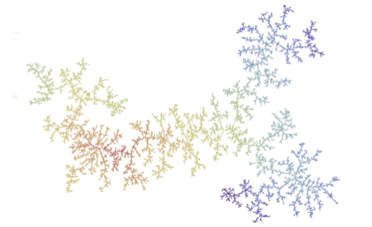
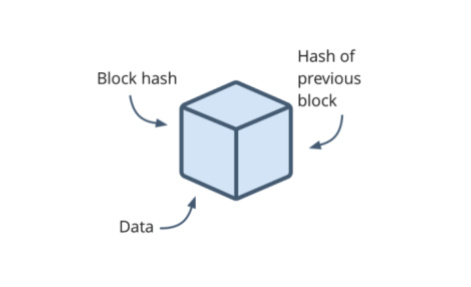
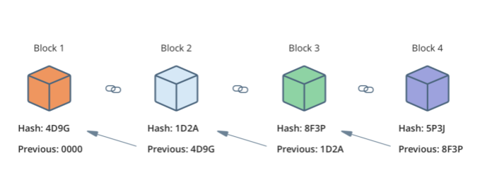
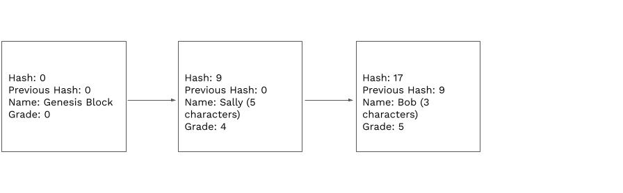

<!-- .slide: data-background-color="#8D3AED" -->

# Overview of a Blockchain Activity

### _Module 3, lecture 1_

---

## What is a Blockchain?

At its core, it is just another database. But it is different from the databases we’re used to

---

### The Blockchain datastructure

---

### The Blockchain datastructure

---

### So then what’s inside of a block?

---

### Block chaining

---

### Block chaining

---

<!-- .slide: data-background-color="#8D3AED" -->

## Any questions?

---

### Assignment Grade Chain

 

<widget-text center>

1. Each participant will get their own block, we will take turns and insert our own blocks
2. Input your data: Name and quiz grade
3. Input the hash of the previous block
4. Calculate your hash and add it to your block

    1. Add up the characters in your name with your grade and the previous hash values
    2. The sum will be the value of your hash
    3. Insert your hash value

---

### Assignment Grade Chain

---

### Assignment Grade Chain

