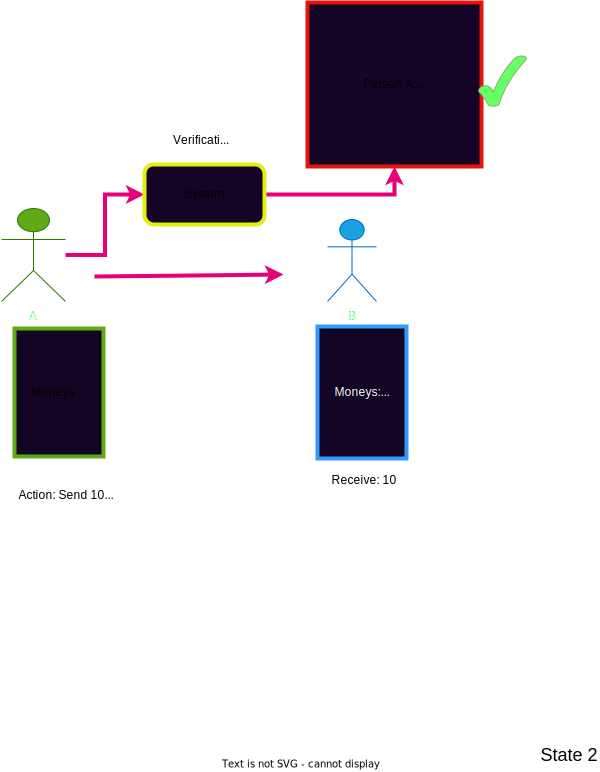
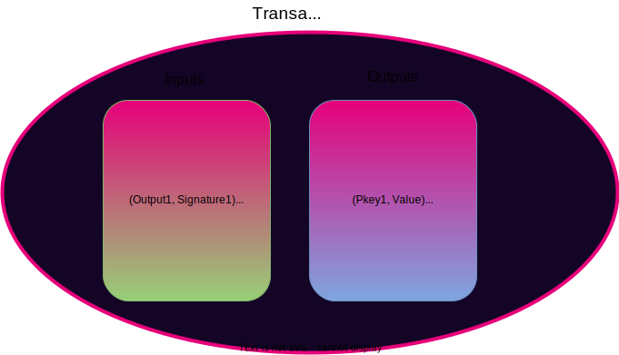
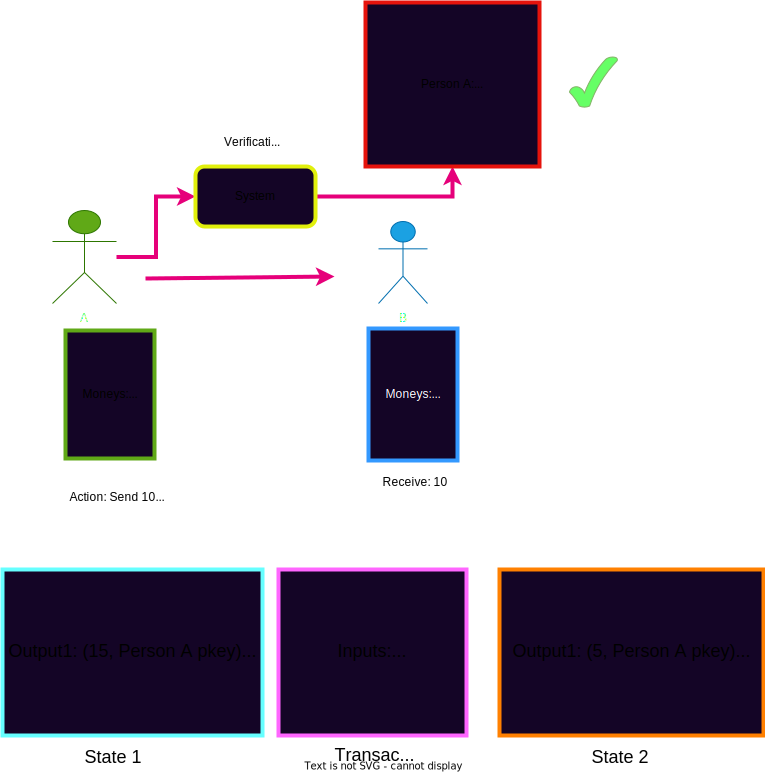
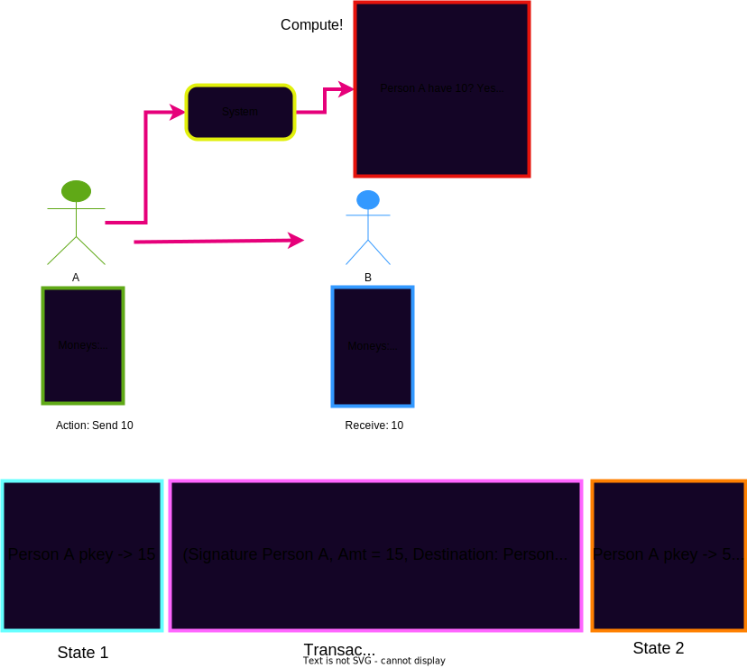

# Accounting Models & User Abstractions in Blockchains

- Andrew Burger
- Parity, Integritee. Yay blockchain and things

---

## Review what we have spoken about so far

- Cryptography (Signatures, Hash functions, Hash based Data Structures)
- Economics/Game Theory
- Blockchain structure (The overall blockchain primitive, a hash list)

---

## Where do we go from here?

- We have some base elements ideas and concepts
- now lets put them together into something cool..

 

Notes:
    TODO: Help format images to look better 
---
## What do we want to talk about today?

<pba-cols>
<pba-col style="font-size:smaller">

- Now that we have this structured decentralized tamper proof state machine..
- Let's think of ways we can formulate a state and a state transition in terms of representing users

</pba-col>

Notes:
    TODO: Help format image to look better on slide 
---
## Let us think of two different paradigms:
* A.) We craft a model in which the system acts as a global and trustless verifier
Notes:
    TODO: Insert picture here which shows some money being sent from person A to person B and the System box is verifying whether the money I am attempting to spend is mine and the result that I am specifying to happen is valid 
---
## Example

---
## Paradigm A How would we do this?
* 1.) You have some uniquely identifiable piece of data with a signature attached(A hash which signifies some id of a spendable thing + a signature saying I can spend that thing) In other words we have some data that can be altered only by a specific entity so we want to provide proof we can alter it. 
* 2.) You have data which can be altered along with a key stating who can alter it.(Value + Pubkey)
* Thing 1 we can refer to as an input
* Thing 2 we can refer to as an output
---
## Is this our State? What is our state?
* A bunch of "outputs" (Some value or data which can be altered via a particular specified owner)
Notes:
    TODO: Insert picture showing a table of hash values mapping to these "outputs"(Data + owner)
---
## Visual What are we talking about here?
| Key       | Value       |
| --------- | ----------- |
| Hash(tx0) | (Pubkey5, Value = 100)           |
| Hash(tx1) | (Pubkey2, Value = 42)          |
| Hash(tx2) | (Pubkey1, Value = 33)          |
| **Hash(tx3)** | **(Pubkey3, Value = 20)**          |
| **Hash(tx3)** | **(Pubkey1, Value = 74)** |
| Hash(tx4) | (Pubkey42, Value = 200000)           |
| Hash(tx5) | (Pubkey39, Value = some big a&* number)           |
| Hash(tx6) | (Pubkey780, Value = 80)        |
---
## So what is the notion of a User?
* A public key and all of the uniquely identifiable data which can be manipulated by that public key
---
### We described somewhat of the `State` Now lets talk about how to transition the State using this new verification model.
Notes:
    TODO: Show some image of something transitioning
---
### A "Transaction"
* Dont be confused it is essentially a request to change the state of the system.
* What does a Transaction look like? How do inputs map to outputs?
* A list of inputs + a list of outputs
---
### What were those input output thingies again?

Notes:
    TODO: Show picture of inputs and outputs in a transaction similar to UTXO frameless explain how new outputs are derived from previously specified outputs from the input 
---
## So what happens in a state transition or verification in this model?
* Inputs signal which outputs from the state will be consumed
* We must verify the signature given in the input with the corresponding specified outputs pubkey or owner 
* We must verify that the resulting state which has been provided is a valid one(We define what this is)
* In the case of money or just a raw value we can assume that you cannot take some piece of moneys worth 10 and create a list of new outputs which have more than 10 moneys
---
## Transition

---
## Unspent Transaction Outputs(UTXOS) solved...

<pba-cols>
<pba-col>

- Now whenever someone mentions UTXO's and the UTXO model you can now fundamentally know what actually is being referenced..(Hopefully!)

</pba-col>

Notes:
    TODO: Add some picture of a person cheering and happy
---
## Paradigm B..
* B.) We craft a model in which the system acts as a computer and by submitting some input it will determine the result from my input.
Notes:
---
## Well lets make things more intuitive!
* So instead of doing the computation ourselves and then submitting it to the system to verify...(i.e. understanding the present state and then computing the resulting state) 
* Why dont we just let the system hold our state information or data in the form of an "Account" and we submit requests and data to the system.
* This means we can let the system be our computer for us! 
---
## Well well what is state then in this system?
* Accounts -> Values
Notes:
    TODO: Show picture of a table mapping a pubkey to a value or data item(in its simplest form a value)
---
## Accounts State Table

| Key   | Value       |
| ----- | ----------- |
| 0xa32 | 5           |
| 0x002 | 53          |
| 0xaf5 | 68          |
| 0x805 | 42          |
| 0xbc3 | 30000000000 |
| 0x429 | 4           |
| 0x8c7 | 1           |
| 0x30a | 3823        |

---

## Now that state is much easier to comprehend!!

- What about transitioning my state or account?

---

## State transitions a "Transaction"

- What does a transaction look like now?

Notes:

TODO: Insert some picture here which shows some money being sent from person A to person B but instead person A just signs a message saying to send to person B and the system determines what the updated output result or state will be

---

## Transaction + Transition

---

## So what happens in a State transition in this computation model?

- We still verify but we verify less and determine more!
- Check the signature of the message or computational instruction given
- Verify that the account that is being requested to be modified is the signers account
- Perform the computation necessary given by the instruction and update the account accordingly!

---

## Accounts vs UTXO model

- Oh the fun begins..

---

## Size(Storage)

### Accounts wins this one...

- Question: UTXOS are much heavier in terms of raw data stored + transaction size can anyone think of why...?

---

## Answer..

- In Accounts model just a single balance or data value is stored.
- In UTXO model each data item has a specific unique ID assosciated with it and as such data items are unique/non-fungible as represented in the system.
- In UTXO model as more items are consumed more are being produced and storage size can grow much more quickly
- Transactions are generally more simple in the Accounts model because no output state must be specified.(Sender, Receiver, value to change)

---

## Privacy

- Both have their merits in different ways regarding privacy can anyone think of an advantage to one over the other in this regard and why?

---

## Answer..

- Accounts model in its default state utilizes the efficiency of address reuse but this makes transaction history easy to aggregate.
- UTXO model can utilize a change address such that the resulting Output is assigned to a completely new user whom is unknown to the system
- If no change addresses are used in the UTXO model there is perfect linking between transactions providing a very obvious chain of events
- Accounts model when using mixing allows for obfuscation due to fungability. There is no differentiator between values of a single account.

---

## Smart contracts of general compute platforms

- Based on all previous information can we think of which model is more intuitive and seems to make more sense..?

---

## Answer..

- Verification is easier if all that is needed is to check a value assosciated with a pubkey rather than verifying if an Output has been consumed
- No necessity on defining output state that is the point of the computer to determine it for you!
- Smart contract UTXO would need to select which outputs to use when trasacting as well as how to handle state outputs causing huge overhead and bloat
- A specific contract(or program) which a specific ID is easy to track and to transact with other programs by simple checks of values

---

## Parallelization

- Which model seems easier to paraellelize and why??

---

## Answer..

- Multiple transactions which touch a single Account generally should be executed in sequence.
- Seperate UTXOs have no relation making them easy to execute on seperately given there is no race conditions..

---

## Conclusion..

- Both are good depending on the usecase!!

---

## At the end of the day it is just a state machine

Notes:

TODO: Insert some fun picture and hint at how to agree on all of these now understood (Transactions) to come...
