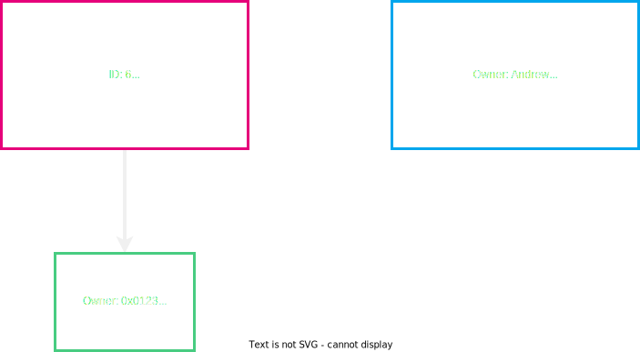

# Accounting Models & User Abstractions in Blockchains

---

<section>
    <h2>Discussion Overview</h2>
    <ul>
        <li class="fragment">Cryptography, Signatures, Hash functions, Hash based Data Structures</li>
        <li class="fragment">Economics/Game Theory</li>
        <li class="fragment">Blockchain structure</li>
    </ul>
</section>

---

<section>
    <h2>Where do we go from here?</h2>
    <ul>
        <li class="fragment">We have some base elements, ideas, and concepts</li>
        <li class="fragment">Now, let's put them together into something cool..</li>
    </ul>
</section>

---

## What are we talking about?

<pba-cols>
<pba-col style="font-size:smaller">

- Now that we have this structured decentralized tamper proof state machine..
- Let's think of ways we can formulate a state and a state transition in terms of representing users

</pba-col>

---

<section>
    <h2>State User Model</h2>
     
</section>

---

<section>
    <h2>State User Model</h2>
     
</section>

---

<section>
    <h2>How to represent Joshy and Andrew?</h2>
    
</section>

---

<section>
    <h2>User Representation</h2>
    
</section>

---

<section>
    <h2>How to send from Joshy to Andrew? What do you need?</h2>
    
</section>

---

<section>
    <h2>What if we want to spend this?</h2>
    
</section>

---

<section>
    <h2>Input</h2>
    
</section>

---

<section>
    <h2>Transaction</h2>
    
</section>

---

<section>
    <h2>How to verify this state change is valid?</h2>
    <ul>
        <li class="fragment">We can actually spend this thing signature verification!</li>
        <li class="fragment">Sum of the inputs is >= sum of the outputs</li>
        <li class="fragment">No coins are worth 0</li>
        <li class="fragment">Has this already been spent before?</li>
    </ul> 
    <aside class="notes">
        Which did I forget??
    </aside>
</section>

---

<section>
    <h2>Our new state</h2>
    
</section>

---

<section>
    <h2>How do we generalize beyond money?</h2>
    
</section>

---

<section>
    <h2>How do we generalize beyond money?</h2>
    
    <aside class="notes">
        How are we going to verify now that the state transition is valid?
    </aside>
</section>

---

<section>
    <h2>Transaction</h2>
    
</section>

---

<section>
    <h2>Transaction</h2>
    
</section>

---

<section>
    <h2>Is this a good model? Why or why not? Lets Discuss</h2>
    <ul>
        <li class="fragment">Scalability</li>
        <li class="fragment">Privacy</li>
        <li class="fragment">General Computation smart contracts</li>
    </ul>
</section>

---

## Paradigm B..

- B.) We craft a model in which the system acts as a computer and by submitting some input it will determine the result from my input.

Notes:

TODO make some notes

---

## Well lets make things more intuitive!

- So instead of doing the computation ourselves and then submitting it to the system to verify...(i.e. understanding the present state and then computing the resulting state)
- Why dont we just let the system hold our state information or data in the form of an "Account" and we submit requests and data to the system.
- This means we can let the system be our computer for us!

---

## Well well what is state then in this system?

- Accounts -> Values

Notes:

TODO: Show picture of a table mapping a pubkey to a value or data item(in its simplest form a value)

---

## Accounts State Table

| Key   | Value       |
| ----- | ----------- |
| 0xa32 | 5           |
| 0x002 | 53          |
| 0xaf5 | 68          |
| 0x805 | 42          |
| 0xbc3 | 30000000000 |
| 0x429 | 4           |
| 0x8c7 | 1           |
| 0x30a | 3823        |

---

## Now that state is much easier to comprehend!!

> What about transitioning my state or account?

---

## State transitions a "Transaction"

> What does a transaction look like now?

Notes:

TODO: Insert some picture here which shows some money being sent from person A to person B but instead person A just signs a message saying to send to person B and the system determines what the updated output result or state will be

---

## Transaction + Transition

---

## So what happens in a State transition in this computation model?

- We still verify but we verify less and determine more!
- Check the signature of the message or computational instruction given
- Verify that the account that is being requested to be modified is the signers account
- Perform the computation necessary given by the instruction and update the account accordingly!

---

## Accounts vs UTXO model

**Oh the fun begins..**

---

## Size(Storage)

### Accounts wins this one...

> Question: UTXOS are much heavier in terms of raw data stored + transaction size can anyone think of why...?

---

## Answer..

- In Accounts model just a single balance or data value is stored.
- In UTXO model each data item has a specific unique ID assosciated with it and as such data items are unique/non-fungible as represented in the system.
- In UTXO model as more items are consumed more are being produced and storage size can grow much more quickly
- Transactions are generally more simple in the Accounts model because no output state must be specified.(Sender, Receiver, value to change)

---

## Privacy

- Both have their merits in different ways regarding privacy can anyone think of an advantage to one over the other in this regard and why?

---

## Answer..

- Accounts model in its default state utilizes the efficiency of address reuse but this makes transaction history easy to aggregate.
- UTXO model can utilize a change address such that the resulting Output is assigned to a completely new user whom is unknown to the system
- If no change addresses are used in the UTXO model there is perfect linking between transactions providing a very obvious chain of events
- Accounts model when using mixing allows for obfuscation due to fungability. There is no differentiator between values of a single account.

---

## Smart contracts of general compute platforms

- Based on all previous information can we think of which model is more intuitive and seems to make more sense..?

---

## Answer..

- Verification is easier if all that is needed is to check a value assosciated with a pubkey rather than verifying if an Output has been consumed
- No necessity on defining output state that is the point of the computer to determine it for you!
- Smart contract UTXO would need to select which outputs to use when trasacting as well as how to handle state outputs causing huge overhead and bloat
- A specific contract(or program) which a specific ID is easy to track and to transact with other programs by simple checks of values

---

## Parallelization

> Which model seems easier to paraellelize and why??

---

## Answer..

- Multiple transactions which touch a single Account generally should be executed in sequence.
- Seperate UTXOs have no relation making them easy to execute on seperately given there is no race conditions..

---

## Conclusion..

**Both are good depending on the usecase!!**

---

## At the end of the day it is just a state machine

Notes:

TODO: Insert some fun picture and hint at how to agree on all of these now understood (Transactions) to come...
