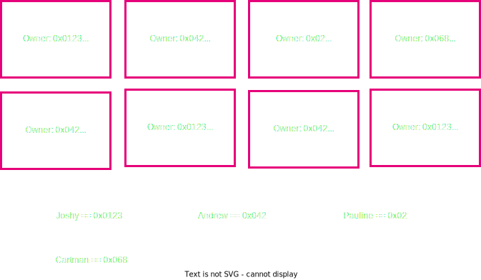
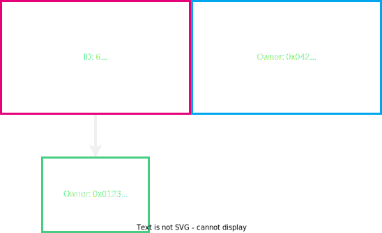

# Accounting Models & User Abstractions in Blockchains

---

<section>
    <h2>Discussion Overview</h2>
    <ul>
        <li class="fragment">Cryptography, Signatures, Hash functions, Hash based Data Structures</li>
        <li class="fragment">Economics/Game Theory</li>
        <li class="fragment">Blockchain structure</li>
    </ul>
</section>

---

<section>
    <h2>Where do we go from here?</h2>
    <ul>
        <li class="fragment">We have some base elements, ideas, and concepts</li>
        <li class="fragment">Now, let's put them together into something cool..</li>
    </ul>
</section>

---

## What are we talking about?

<pba-cols>
<pba-col style="font-size:smaller">

- Now that we have this structured decentralized tamper proof state machine..
- Let's think of ways we can formulate a state and a state transition in terms of representing users

</pba-col>

---

<section>
    <h2>State User Model</h2>
     
</section>

---

<section>
    <h2>State User Model</h2>
     
</section>

---

<section>
    <h2>How to represent Joshy and Andrew?</h2>
    
</section>

---

<section>
    <h2>User Representation</h2>
    
</section>

---

<section>
    <h2>How to send from Joshy to Andrew? What do you need?</h2>
    
    <aside class="notes">What would be catastrophic if we got wrong??</aside>
</section>

---

<section>
    <h2>What if we want to spend this?</h2>
    
    <aside class="notes">Why do we say spend here and not modify?</aside>
</section>

---

<section>
    <h2>Input</h2>
    
</section>

---

<section>
    <h2>Transaction</h2>
    
    <aside class="notes">Why do we not send all of the 70 to Andrew?</aside>
</section>

---

<section>
    <h2>How to verify this state change is valid?</h2>
    <ul>
        <li class="fragment">We can actually spend this thing signature verification!</li>
        <li class="fragment">Sum of the inputs is >= sum of the outputs</li>
        <li class="fragment">No coins are worth 0</li>
        <li class="fragment">Has this already been spent before?</li>
    </ul> 
    <aside class="notes">
        Which did I forget??
    </aside>
</section>

---

<section>
    <h2>Our new state</h2>
    
</section>

---

<section>
    <h2>How do we generalize beyond money?</h2>
    
</section>

---

<section>
    <h2>How do we generalize beyond money?</h2>
    
    <aside class="notes">
        How are we going to verify now that the state transition is valid?
    </aside>
</section>

---

<section>
    <h2>Transaction</h2>
    
</section>

---

<section>
    <h2>Transaction</h2>
    
</section>

---

<section>
    <h2>Is this a good model? Why or why not? Lets Discuss</h2>
    <ul>
        <li class="fragment">Scalability</li>
        <li class="fragment">Privacy</li>
        <li class="fragment">General Computation</li>
    </ul>
</section>

---

<section>
    <h2>Is there a different way?</h2>
    
    <aside class="notes">Now ease them to the solution of Accounts</aside>
</section>

---

<section>
    <h2>Accounts</h2>
    
    <aside class="notes">Now ease them to the solution of Accounts</aside>
</section>

Notes:
This seems logical right?

---

<section>
    <h2>State Transition Accounts</h2>
    
</section>

---

<section>
    <h2>State Transition Accounts</h2>
    
</section>

---

<section>
    <h2>How do we verify and handle this transaction?</h2>
    <ul>
        <li class="fragment">Verify enough funds are in Joshys account</li>
        <li class="fragment">Verify this amount + Andrews amount dont exceed the max value</li>
        <li class="fragment">Check the nonce of the transaction</li>
        <li class="fragment">Do the actual computation of output values</li>
    </ul>
    <aside class="notes">Did I forget any?</aside>
</section>

---

<section>
    <h2>State Transition Accounts</h2>
    
</section>

---

<section>
    <h2>What did we do differently in Accounts vs UTXO model?</h2>
    <aside class="notes">Verify as opposed to determining the outcome. Not submitting output state in transaction</aside>
</section>

---

<section>
    <h2>Account Arbitrary Data</h2>
    
</section>

---

<section>
    <h2>Is this a good model? Why or why not? Lets Discuss</h2>
    <ul>
        <li class="fragment">Scalability</li>
        <li class="fragment">Privacy</li>
        <li class="fragment">General Computation</li>
    </ul>
    <aside class="notes">Parallelization? Storage space, privacy solutios?</aside>
</section>

---

<section>
    <h2>Small shill Tuxedo</h2>
    https://github.com/Off-Narrative-Labs/Tuxedo
</section>

---

<section>
    <h2>The end</h2>
</section>
---
