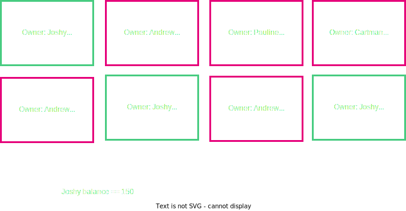
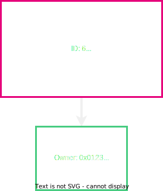
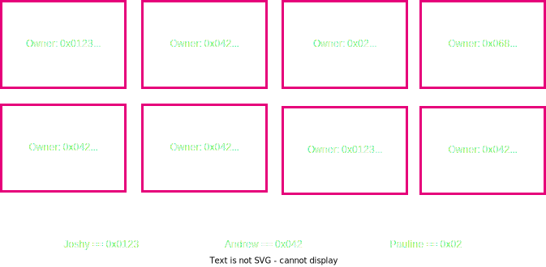
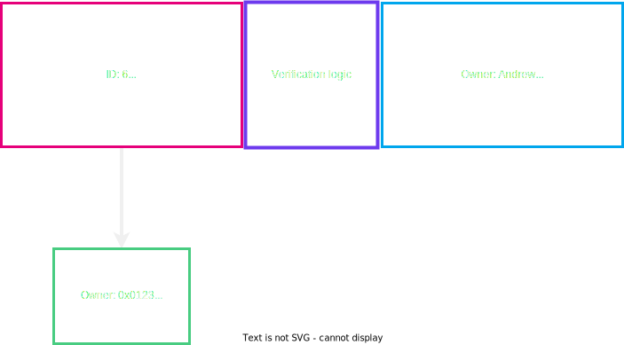
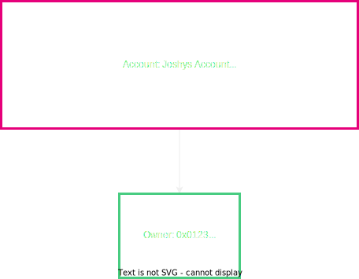

# Accounting Models & User Abstractions in Blockchains

---

## Overview

- Cryptography, Signatures, Hash functions, Hash based Data Structures
  <!-- .element: class="fragment" data-fragment-index="2" -->
- Economics/Game Theory
  <!-- .element: class="fragment" data-fragment-index="3" -->
- Blockchain structure
  <!-- .element: class="fragment" data-fragment-index="4" -->

---

## Where do we go from here?

- We have some base elements, ideas, and concepts
  <!-- .element: class="fragment" data-fragment-index="2" -->
- Now, let's put them together into something cool..
  <!-- .element: class="fragment" data-fragment-index="3" -->

---

## What are we talking about?

<pba-cols>
<pba-col style="font-size:smaller">

- Now that we have this structured decentralized tamper proof state machine..
- Let's think of ways we can formulate a state and a state transition in terms of representing users

</pba-col>

---

## State User Model

---

## State User Model

---

## How to represent Joshy and Andrew?

---

## User Representation

---

## How to send from Joshy to Andrew? What do you need?

Notes:

What would be catastrophic if we got wrong??

---

## What if we want to spend this?

Notes:

Why do we say spend here and not modify?

---

## Input

---

## Transaction

Notes:

Why do we not send all of the 70 to Andrew?

---

## How to verify this state change is valid?

- We can actually spend this thing signature verification!
- Sum of the inputs is >= sum of the outputs
- No coins are worth 0
- Has this already been spent before?

Notes:

Which did I forget??

---

## Our new state

---

## How do we generalize beyond money?

---

## How do we generalize beyond money?

Notes:

How are we going to verify now that the state transition is valid?

---

## Transaction

---

## Transaction

---

## Is this a good model? Why or why not? Let's discuss

- Scalability
- Privacy
- General Computation

---

## Is there a different way?

Notes:

Now ease them to the solution of Accounts

---

## Accounts

Notes:

Now ease them to the solution of Accounts

---

## State Transition Accounts

---

## State Transition Accounts

---

## How do we verify and handle this transaction?

- Verify enough funds are in Joshy's account
- Verify this amount + Andrews amount don't exceed the max value
- Check the nonce of the transaction
- Do the actual computation of output values

Notes:

Did I forget any?

---

## State Transition Accounts

---

## What did we do differently in Accounts vs UTXO model?

Notes:

Verify as opposed to determining the outcome. Not submitting output state in transaction

---

## Account Arbitrary Data

---

## Is this a good model? Why or why not? Lets Discuss

- Scalability
- Privacy
- General Computation

Notes:

Parallelization? Storage space, privacy solutions?

---

# Adding Privacy

---

## Input/Output-based Cryptocurrencies

- Transactions have a list of unspent transaction outputs (UTXOs) as its inputs
- Each input is signed
- The transaction is allowed to spend as much funds as the sum of its inputs
- The transaction spends funds by creating outputs and by paying a fee

---

## Input/Output-based Cryptocurrencies

- Inputs must only refer to actually existing outputs (membership)
- The output spent must not be prior spent (linkability)
- The output's owner must consent to this transaction (ownership)
- The transaction's inputs and outputs must be balanced (sum check)

---

## Bitcoin

- Bitcoin specifies the spent output. This satisfies membership and linkability
- Each Bitcoin output has a small, non-Turing complete program (Script) specifying how it can be spent
- Each input has a `scriptSig` which proves the script is satisfied and this is an authorized spend (ownership)
- The outputs cannot exceed the inputs, and the remainder becomes the fee (sum check)

---

## ZK Proofs

- ZK-SNARKs - A small proof that's fast to verify (<= $O(\sqrt{n})$)
- ZK-sNARKs - A small proof that's not fast to verify (>= $O(n)$, frequently $O(n log n)$)
- ZK-STARKs - A small proof that's fast to verify, based on hash functions
- All of these can prove the execution of an arbitrary program (via an arithmetic circuit)
- None of these reveal anything about the arguments to the program

---

## Merkle Proofs

- Merkle proofs support logarithmically proving an item exists in a tree
- For 2\*\*20 items, the proof only requires 20 steps
- Even if a ZK proof is superlinear, it's a superlinear encoding of a logarithmic solution

---

## Private Membership

- When an output is created on-chain, add it to the Merkle tree
- When an input specifies an output, it directly includes the output it's spending
- It also includes a Merkle proof the output exists _somewhere_ on chain, embedded in a ZK proof

---

## Pedersen Commitments

- A Pedersen commitment has a value (some number) and a mask (also some number)
- There's as many masks as there private keys, hiding the contained value
- Pedersen commitments can be extended to support multiple values

---

## A New Output Definition

<pba-flex center>

- ID
- Amount
- Owner
- Mask
- All in a single 
  Pedersen commitment

</pba-flex>

---

## Private Membership

- We don't prove the included output exists on chain
- We prove an output with identical fields exists on chain _yet with a different mask_
- This allows spending a specific output without revealing which it is

---

## Ownership and linkability

- A ZK proof can take the output ID and apply some transformation
- For every output ID, the transformation should output a single, unique ID
- Not just anyone should be able to perform this transformation
- This provides linkability, and if only the owner can perform the transformation, ownership

---

## Sum check

- One final ZK proof can demonstrate the sum of inputs - the sum of outputs = fee
- There are much more efficient ways to prove this

---

# Summary

- This hides the output being spent and the amounts transacted
- Combined with a stealth address protocol, which replaces addresses with one time keys, it hides who you're sending to as well
- This builds a currency which is private w.r.t. its on-chain transactions

---

## Small shill... Tuxedo 👔

> <https://github.com/Off-Narrative-Labs/Tuxedo>

---

<!-- .slide: data-background-color="#4A2439" -->

# Questions?
