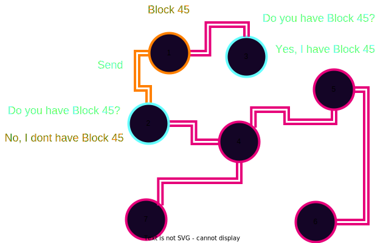
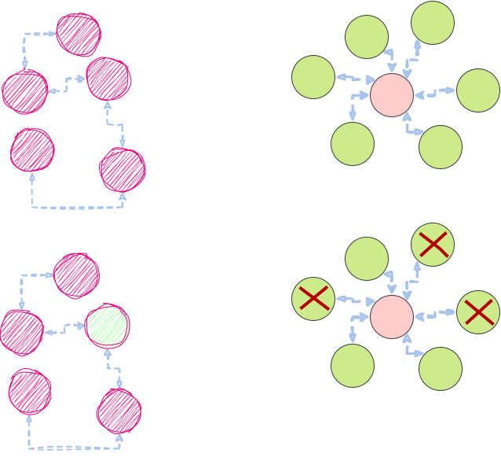
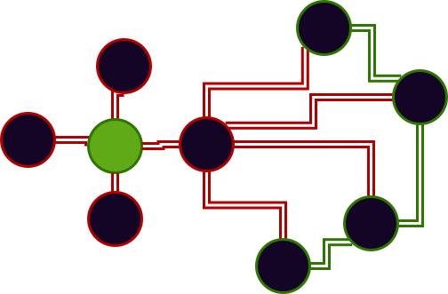

# Peer-to-Peer Networking

---

## Introduction/Agenda

- Discuss the network layer and network conditions that blockchains operate on(Mostly)
- Talk about traditional web2 network overlays pros vs cons with web3 network overlays
- Discuss attacks and how to address along with the underlying threat model
- Libp2p

---

## Centralized vs Decentralized Networks

Notes:

2.) Not all p2p clients must run the same software they can develop their own (BTC, Ethereum etc...) Further decentralization.

---

## Advantages to Decentralized Networks

- No privileged nodes
- Less bottlenecks with bandwidth
- DOS resistent
- No centralized infrastructure necessary(Except internet for now...)

Notes:

1. No single node or nodes(CDN) have access to all of the content or files or is critical for operating the network. Each node has a copy of the data.
1. No central node carrying all of the load of traffic. Block production and Block peering/importing can be mentioned here
1. Difficult to overload the network or DOS (Not single node is privileged)
1. Although many nodes are run on Centralized cloud compute platforms they don't have to be(Typically)

---

## Difficulties or Disadvantages

- Since it is permissionless a node can share malicious resources
- Latency
- Difficult to regulate illicit activity
- The network is limited by nodes with the weakest hardware

Notes:

2. Latency may be an issue if we need to wait for many peers to receive the data produced from a single node since everyone may not have a direct connection mention finality time!
3. No central point to go and snoop all users data(for better or for worse)
4. Why we have hardware requirements for blockchain networks

---

## Initial Discovery

- Bootnode/bootnodes (More on this later in Substrate)

Notes:

1.) Must know someone who is participating in the network initially(Bootnode)

---

## Gossip Protocol


Notes:

- Talk about how we have and want block 45 being peered to others

---v

## Gossip Protocol



Notes:

Talk about advertising vs just blind sending and how that can be inefficient

---

## Discovery

<pba-flex center>

1. Connect to a peer
1. Ask peer for a list of their known nodes(Addresses to fill DHT)
1. Connect to random subset of peers from the list
1. Repeat steps 2 and 3

</pba-flex>

---

## Partitions



Notes:

Talk about how when a partition happens in P2P vs Centralized
In p2p only one node needs to have a full copy in order for the file to
be able to be distributed across the network

---v

## Partitions


Notes:

1. This is horrible and means all nodes are totally screwed

---

## Attacks

Notes:

Show picture of something scary and devious here

---v

## Eclipse Attack



Notes:

1. Distorts view of the healthy normal honest state of the network
1. Transaction confirmations can be fictions

---v

## Eclipse Attack Execution

<pba-flex center>

1. Flood a target node with a bunch of malicious peer addresses
1. The targeted node then stores these malicious peers and utilizes them when re-syncing on next bootup
1. DOS targeted node to take it offline to force a resync with these new malicious peers

</pba-flex>

---v

## Preventing Attacks

<pba-flex center>

- Restrict inbound connections in some way
- Random selection of peers to connect with
- Deterministic node selection. (Bootnodes)
- Restricting new nodes (Probably not what we want...)

</pba-flex>

Notes:

1. Be wary of new connections with other nodes
   <br/>
1. Don't just take the most recent request for connections to avoid the flooding
   <br/>
1. Bootnodes with higher credibility and trust (Can be a bottleneck) - Rotate bootnodes they are subject as well to attacks and should be rotated

---

## libp2p

<pba-flex center>

- Toolbox for developing systems built on top of the p2p networking
- Simply put helpful in establishing encrypted and authenticated channels between two peers

</pba-flex>

Notes:

What is libp2p

---

## Addressing(MultiAddress)

<pba-flex center>

- Generalization of an IP
- Multiaddress is to an IP address what a transport is to TCP/IP
- EX
- `/ip4/127.0.0.1/tcp/30333`
- `/dns/example.com/udp/5015/quic`
- `/ip6/fe80::0202:b3ff:fe1e:8329/tcp/10350/ws`

</pba-flex>

Notes:

Show example here, it is important for looking at chain-spec

---

## Protocols<br/>(Generic Protocol Negotiation)

- You can change your encryption protocol via the protocol negotiation!
- Ping
- Identify

Notes:

1. ProtocolIds to differentiate
   <br/>
1. Health checks to check the liveness of a node is it even online?
   <br/>
1. Peers exchange information about each other such as public keys and known addresses

---

## KAD-DHT

- Simply put a hash table containing a set of data entries these data entries are distributed across the network
- There is no central registry where to obtain everything
- When we want some piece of data offered by the network we search for its distance to specific peers

---v

## DHT Operations in libp2p

- `FIND_NODE`: given a key, find the closest nodes to the key
- `PUT_VALUE`: add a `key-value` mapping to the DHT
- `GET_VALUE`: given a key, retrieve the value
- `ADD_PROVIDERS`: advertising in the network that a peer is providing a given key
- `GET_PROVIDERS`: finding out what peers can provide the value for a specified key

---v

## Example Findkey(k=Block45)


---

## Peers

```rust
// PeerId
/ip4/7.7.7.7/tcp/4242/p2p/QmYyQSo1c1Ym7orWxLYvCrM2EmxFTANf8wXmmE7DWjhx5N
```

```rust
// PeerInfo
struct Peerinfo<PeerId, Others> {
    peer_id: PeerId,
    other_multiaddresses: Others // Others is a type which is a Set
}

// PeerStore
```

Notes:

1. You can encapsulate a p2p address into a new multi address to provide enough info to dial a peer over TCP!
   <br/>
1. Set of multiaddresses a particular peer is listening on
   <br/>
1. Table of peer keys and addresses and associated metadata like an address book. Universal multiaddress book.

---

## Transports

<pba-flex center>

- TCP
- UDP
- QUIC and more...

</pba-flex>

Notes:

2. Generally for p2p connections we need ordering though so UDP alone doesn't work for everything
   <br/>
3. Ordering built on udp

---

## Stream Multiplexing

Notes:

Very Brief overview.

---

## Security and Maliciousness

From Game theory...<br/>
Just because a particular type of attack is theoretically possible/feasible does not mean that it is practical...

---v

## Identity and Trust

<pba-flex center>

- Every node has an public private key pair or `PeerId`.
- Authorization is NOT default.

</pba-flex>

Notes:

1. Allows to verify who we are talking too.
1. Some systems may not require any authorization from a peer you can think of this as a tuning on permission...

---v

## Reputation systems

<pba-flex center>

- Blacklist IP
- Duplicate messages
- Connections with high reputation nodes,<br/>_Any issues with this?_

</pba-flex>

Notes:

1. Identify bad actors we use reputation in Substrate
1. People may be malicious and spam us with duplicate data
1. Try to maintain connections with the nodes that have the highest reputation (With some randomness to allow new nodes to join)

---

## DOS

<pba-flex center>

- KAD-DHT are vulnerable to sybil attacks.
- Querying
- Targeting of specific keys(Block 42)
- Do this by generating Ids close to the target key based on the DHT distance metric

</pba-flex>

Notes:

2.) A DHT query may need to be routed through several peers before the query is fulfilled.(Those peers can be malicious and attempt to lie)

3.) If a malicious actor wants to target a specific key they can improve their chances of being in the lookup path. By spinning up nodes next to the nodes providing a specific key based on the DHT distance metric

---v

## Sybil Attacks

<pba-flex center>

- Sybil attacks are hard to defend against and<br/>precautions can be taken at the application level to mitigate<br/>
  (Proof of work perhaps?)

</pba-flex>

Notes:

1. So even though we might be receiving malicious blocks we can identify that by verifying that block is valid and edit reputation accordingly

---v

## S/Kademlia paper in libp2p

<pba-flex center>

- Query multiple disjoint lookup paths<br/>
  (Paths which don't share any routing peers)<br/>
  _in parallel_

</pba-flex>

---

## Additional Resources

<pba-flex center>

- https://curriculum.pl-launchpad.io/curriculum/libp2p/
- https://docs.libp2p.io/concepts/

</pba-flex>

---

<!-- .slide: data-background-color="#4A2439" -->

# Questions
