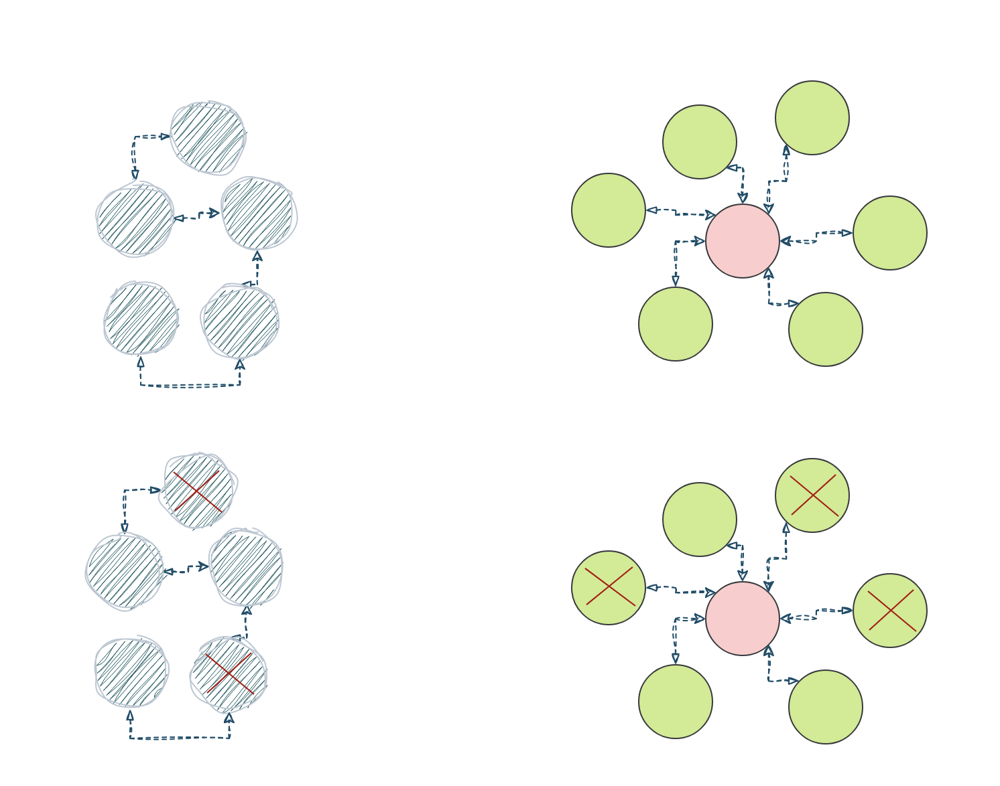
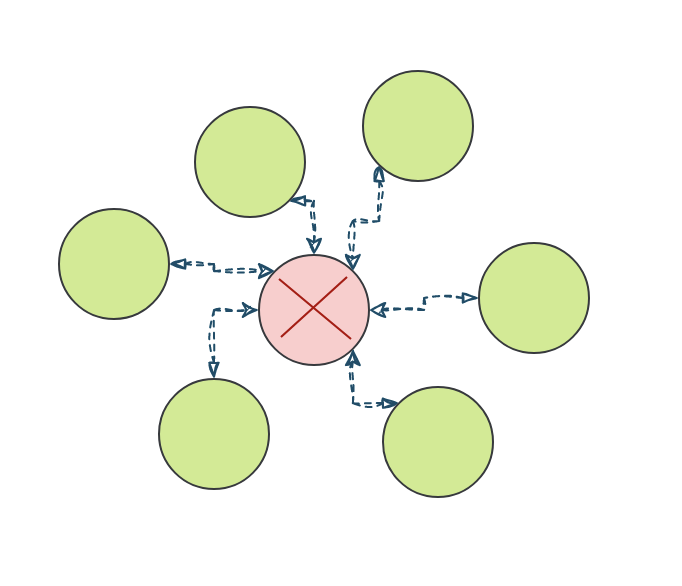
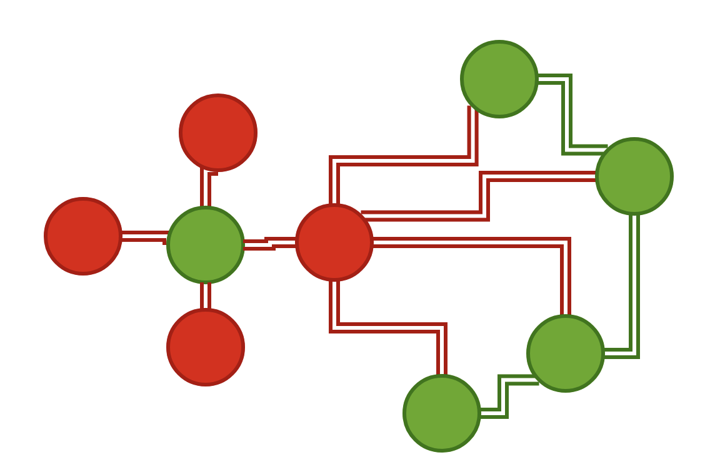
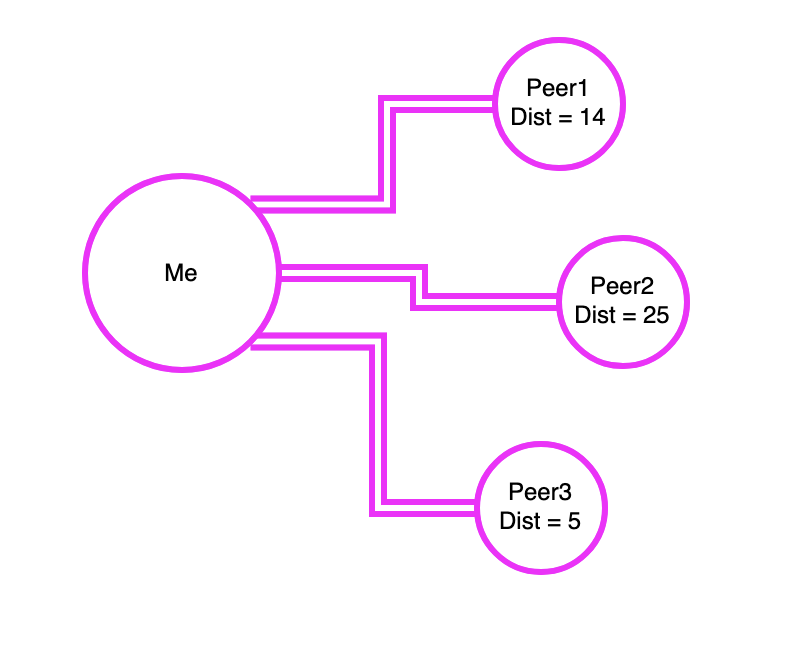

# Peer-to-Peer Networking
Andrew Burger, Parity, Integritee, Blockchains Yay
---
## Introduction/Agenda
* Discuss the network layer and network conditions that blockchains operate on(Mostly)
* Talk about traditional web2 network overlays pros vs cons with web3 network overlays 
* Discuss attacks and how to address along with the underlying threat model
* Libp2p
---
## Centralized vs Decentralized networks
Notes:
    1.) Picture here showing the two different node overlays
    2.) Not all p2p clients must run the same software they can develop their own (BTC, Ethereum etc..) Further decentralization.
---
## Advantages to Decentralized networks
* No single node or nodes(CDN) have access to all of the content or files or is critical for operating the network. Each node has a copy of the data.
* No bottlenecks with bandwidth
* Latency may be an issue if we need to wait for many peers to receive the data produced from a single node since everyone may not have a direct connection
* Difficult to overload the network or DOS (Not single node is privledged)
* No centralized infrastructure necessary(Except internet for now..)
Notes: 
    Block production and Block peering/importing can be mentioned here
---
## Difficulties or disadvantages
* Since it is permisionless a node can share malicious resources
* Difficult to regulate illicit activity
* The network is limited by nodes with the weakest hardware(Why we have hardware requirements for blockchain networks)
---
## Initial discovery
* Must know someone who is participating in the network initially
* Bootnode/bootnodes (More on this later in Substrate) 
---
## Gossip Protocol
Notes:
    Some picture showing one node looking for a packet via another node and asking its neighbors for packets
---
## Discovery
* 1.) Connect to a peer
* 2.) Ask peer for a list of their known nodes(Addresses to fill DHT)
* 3.) Connect to random subset of peers from the list 
* 4.) Repeat steps 2 and 3 
---
## Paritions

Notes: 
    Talk about how when a partition happens in P2P vs Centralized
    In p2p only one node needs to have a full copy in order for the file to
    beable to be distributed accross the network
    Show picture of centralized network and p2p network with part of the network with a green check mark and the other with a red X
---v
## Partitions cont..

---
## Attacks
Notes: Show picture of something scary and devious here 
---
## Eclipse Attack

Notes:
    1.) Distorts view of the healthy normal honest state of the network 
    2.) Transaction confirmations can be fictious
---v
## Executing the Attack
- 1.) Flood a target node with a bunch of malicious peer addresses
- 2.) The targeted node then stores these maliciious peers and utilizes them when resyncing on next bootup
- 3.) DOS targeted node to take it offline to force a resync with these new malicious peers 
---
## Preventing Attacks
* Restrict inbound connections in some way and be wary of connections with other nodes
* Random selection of peers to connect with 
* Deterministic node selection, "Bootnodes" with higher credibility and trust (Can be a bottleneck)
* Restricting new nodes (Probably not what we want..)
Notes: Concise but revealing here..
       Important to remember Bootnodes are subject as well and should be rotated
---
## libp2p
* Toolbox for developing systems built ontop of the p2p networking 
* Simply put helpful in establishing encrypted and authenticated channels between two peers
Notes:
What is libp2p
---
## Addressing
Notes:
    Show example here, it is important for looking at chain-spec
---
## Protocols
* Ping
* Identify
* Kad-dht
Notes: Overview of a few protocols from docs 
---
## KAD-DHT
* Simply put a hash table containing a set of data entries these data entries are distributed accross the network
* There is no central registry where to obtain everything
* When we want some piece of data offered by the network we search for it distance to specific peers
---v
## DHT Operations in libp2p
* `FIND_NODE`: given a key, find the closest nodes to the key 
* `PUT_VALUE`: add a `key-value` mapping to the DHT
* `GET_VALUE`: given a key, retrieve the value
* `ADD_PROVIDERS`: advertising in the network that a peer is providing a given key
* `GET_PROVIDERS`: finding out what peers can provide the value for a specified key
---v
## Example Findkey(k=Block45)

---
## Peers
* PeerId
* PeerStore
* PeerDiscovery
Notes: Give some information on each 
---
## Transports
* TCP
* UDP
* QUIC and more..
Notes: Talk here about how you can use not only TCP but various other transports..
---
## Stream Multiplexing
Notes: Very Brief overview maybe..
---
## NAT
Notes: Very Brief overview maybe..
---
## Security and Maliciousness
* From Game theory.. Just because a particular type of attack is theoretically possible/feasible does not mean that it is practical..
---v
## Identity and Trust
* Every node has an public private key pair or PeerId which allows to verify who we are talking too.
* Authorization is NOT default. (Some systems may not require any authorization from a peer you can think of this as a tuning on permission..) 
* Reputation systems are one way to identify bad actors(Blacklist IP for instance)
---
## DOS
* KAD-DHT are vulnerable to sybils.
* A DHT query may need to be routed through several peers before the query is fulfilled.(Those peers can be malicious and attempt to lie)
* If a malicious actor wants to target a specific key they can improve their chances of being in the lookup path.
* Do this by generating Ids close to the target key based on the DHT distance metric
---v
## Sybils
- Sybils are hard to defend against and precautions can be taken at the application level to mitigate(Proof of work perhaps?)
---v
## S/Kademlia paper in libp2p
* Query multiple disjoint lookup paths(Paths which dont share any routing peers) in parallel
---
## Additional Resources
* https://curriculum.pl-launchpad.io/curriculum/libp2p/
* https://docs.libp2p.io/concepts/
---
