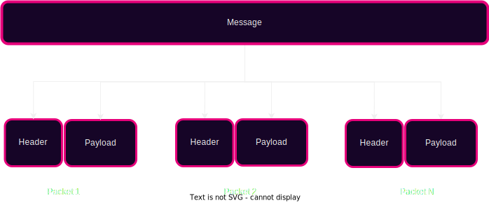
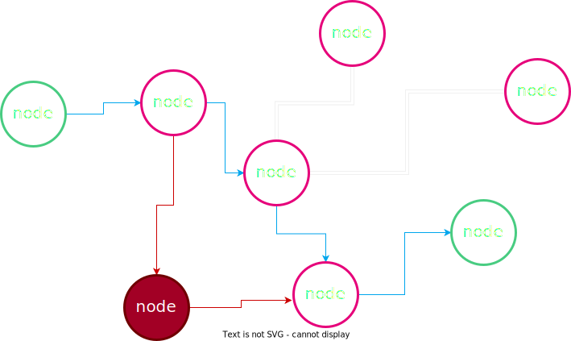
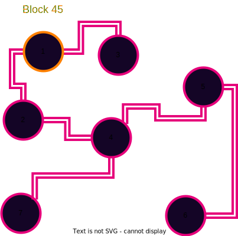

# Peer-to-Peer Networking

---

<section data-auto-animate data-transition="fade">
  <h2>Introduction/Agenda</h2>
  <ul>
    <li class="fragment">History of p2p networks</li>
    <li class="fragment">Discuss the network layer and network conditions that blockchains operate on(Mostly)</li>
    <li class="fragment">Talk about traditional web2 network overlays pros vs cons with web3 network overlays</li>
    <li class="fragment">Discuss attacks and how to address along with the underlying threat model</li>
  </ul>
</section>

---

<section data-auto-animate data-transition="fade">
    <h2>ARPANET</h2>
    <ul>
        <li class="fragment">First operational packet-switching network</li>
        <li class="fragment">Developed in the late 1960s by DARPA</li>
        <li class="fragment">Laid the foundation for the modern internet</li>
    </ul>
</section>
 
---

<section data-auto-animate data-transition="fade">
    <h2>Packet Switching</h2>
    <ul>
        <li class="fragment">Mode of data transmission in which a message is broken into a number of parts that are sent independently(Packets)</li>
        <li class="fragment">Packets are sent over whatever route is optimal</li>
        <li class="fragment">Packets are reassembled at the destination</li>
    </ul>
</section>

Notes:
    Mention TCP/UDP use packet switching to deploy their data transport protocol
---

<section>
    <h2>Packet Switching</h2>
    
</section>

Notes:
    Mention that headers contain some addressing, destination information, and ordering typically depending

---

<section>
    <h2>Packet Switching</h2>
    
</section>

---

<section>
    <h2>Packet Switching</h2>
    
</section>

---

<section>
    <h2>Packet Switching</h2>
    
</section>

---

<section>
    <h2>Packet Switching</h2>
    
</section>

---

<section data-auto-animate data-transition="fade">
    <h2>Peer-to-Peer (P2P) Networks</h2>
    <ul>
        <li class="fragment">P2P is a decentralized form of network structure</li>
        <li class="fragment">Unlike client-server model, all nodes (peers) are equal participants</li>
        <li class="fragment">Data is shared directly between systems without a central server</li>
        <li class="fragment">Peers contribute resources, including bandwidth, storage space, and processing power</li>
    </u1>
</section>

---

# Historical P2P applications

Notes:
    Napster, Limewire
---

<section>
    <h2>Napster</h2>
    <ul>
        <li class="fragment">Launched in 1999, popular P2P platform</li>
        <li class="fragment">Central server for indexing, P2P for transfers</li>
        <li class="fragment">Shutdown in 2001 due to legal issues</li>
    </ul>
    <aside class="notes">
        Napster's story is closely tied with the band Metallica. In 2000, Metallica discovered that a demo of their song "I Disappear" was being circulated via Napster before its official release. This led to Metallica filing a lawsuit against Napster for copyright infringement. Napster had to comply by banning hundreds of thousands of users from their platform who were sharing Metallica's music. This was a turning point in digital copyright law and played a significant role in Napster's eventual shutdown in 2001.
    </aside>
</section>

---

<section>
    <h2>Napster Setup</h2>
    
</section>

---

<section>
    <h2>Napster Setup</h2>
    
</section>

---

<section>
    <h2>Napster Setup</h2>
    
</section>

---

<section>
    <h2>Napster Setup</h2>
    
</section>

---
<section data-auto-animate data-transition="fade">
    <h2>Gnutella(Limewire)</h2>
    <ul>
        <li class="fragment">Each node serves as both a client and a server no central server</li>
        <li class="fragment">Query all connected nodes for files</li>
        <li class="fragment">Gain peer connections to the network via Bootnodes</li>
        <li class="fragment">Ordered to shutdown in 2010 by United States Court</li>
    </u1>
    <aside class="notes">
        <ul>
            <li>Check local filestore for file and if it is not available, forward the request to all connected peers.</li>
            <li>Gnutella generates a significant amount of network traffic by flooding the network with requests.</li>
        </ul>
    </aside>
</section>
---

<section>
    <h2>Client-Server vs Peer-to-Peer (P2P) Networks</h2>
    <table>
        <thead>
            <tr>
                <th></th>
                <th>Client-Server Network</th>
                <th>P2P Network</th>
            </tr>
        </thead>
        <tbody>
            <tr class="fragment">
                <td>Structure</td>
                <td>Centralized: One or more central servers control the network</td>
                <td>Decentralized: All nodes (peers) participate equally</td>
            </tr>
            <tr class="fragment">
                <td>Data Flow</td>
                <td>Server provides data to clients</td>
                <td>Peers directly share data with each other</td>
            </tr>
            <tr class="fragment">
                <td>Resource Management</td>
                <td>Servers manage resources and control access</td>
                <td>Peers contribute resources including bandwidth, storage space, and processing power</td>
            </tr>
            <tr class="fragment">
                <td>Scalability</td>
                <td>Can be limited by server capacity</td>
                <td>Highly scalable due to the distribution of resources</td>
            </tr>
            <tr class="fragment">
                <td>Security</td>
                <td>Centralized security measures, single point of failure</td>
                <td>Potential for some security issues, malware(Depending on how it is implemented)</td>
            </tr>
        </tbody>
    </table>
</section>

---

### Centralized vs Decentralized Networks

Notes:

Talk about how when a partition happens in P2P vs Centralized
In p2p only one node needs to have a full copy in order for the file to
be able to be distributed across the network

---v

## Centralized vs Decentralized Networks

Notes:

1. This is horrible and means all nodes are totally screwed

---

<section>
    <h2>Advantages to Decentralized Networks</h2>
    <ul>
        <li class="fragment">No privileged nodes</li>
        <li class="fragment">Less bottlenecks with bandwidth</li>
        <li class="fragment">DOS resistant</li>
        <li class="fragment">No centralized infrastructure necessary (Except internet for now...)</li>
    </ul>
    <aside class="notes">
        <ol>
            <li>No single node or nodes (CDN) have access to all of the content or files or is critical for operating the network. Each node has a copy of the data.</li>
            <li>No central node carrying all of the load of traffic. Block production and Block peering/importing can be mentioned here.</li>
            <li>Difficult to overload the network or DOS (Not a single node is privileged).</li>
            <li>Although many nodes are run on Centralized cloud compute platforms, they don't have to be (Typically).</li>
        </ol>
    </aside>
</section>

---

<section>
    <h2>Difficulties or Disadvantages</h2>
    <ul>
        <li class="fragment">Since it is permissionless, a node can share malicious resources</li>
        <li class="fragment">Latency</li>
        <li class="fragment">Difficult to regulate illicit activity</li>
        <li class="fragment">The network is limited by nodes with the weakest hardware</li>
    </ul>
    <aside class="notes">
        <ol>
            <li>Latency may be an issue if we need to wait for many peers to receive the data produced from a single node since everyone may not have a direct connection. Mention finality time!</li>
            <li>No central point to go and snoop all users data (for better or for worse).</li>
            <li>Why we have hardware requirements for blockchain networks.</li>
        </ol>
    </aside>
</section>

---
## Gossip Protocol

Notes:

- Talk about how we have and want block 45 being peered to others

---v

## Gossip Protocol

Notes:

Talk about advertising vs just blind sending and how that can be inefficient

---
<section>
    <h2>Structured vs Unstructured P2P Networks</h2>
    <table>
        <thead>
            <tr>
                <th></th>
                <th>Structured P2P Networks</th>
                <th>Unstructured P2P Networks</th>
            </tr>
        </thead>
        <tbody>
            <tr class="fragment">
                <td>Organization</td>
                <td>Nodes are organized following specific protocols and structures (like Distributed Hash Tables)</td>
                <td>Nodes are connected in an ad-hoc manner without any particular organization</td>
            </tr>
            <tr class="fragment">
                <td>Search Efficiency</td>
                <td>Efficient search operations due to structured nature</td>
                <td>Search operations may be less efficient and can involve flooding the network</td>
            </tr>
            <tr class="fragment">
                <td>Flexibility</td>
                <td>Less flexible as changes in topology require restructuring</td>
                <td>Highly flexible as nodes can freely join, leave, and reorganize</td>
            </tr>
            <tr class="fragment">
                <td>Privacy</td>
                <td>Data location is predictable due to structured organization</td>
                <td>Greater potential for anonymity</td>
            </tr>
        </tbody>
    </table>
</section>

---

<section>
    <h2>Discovery</h2>
    

        <ol>
            <li class="fragment">Connect to a peer</li>
            <li class="fragment">Ask peer for a list of their known nodes (Addresses to fill DHT)</li>
            <li class="fragment">Connect to random subset of peers from the list</li>
            <li class="fragment">Repeat steps 2 and 3</li>
        </ol>
    

</section>

---

## Applications

Notes:
    1. What are some of the types of applications that lend themselves to this kind of network topology? Can anyone think of any?
    2. File sharing(Music)?
    3. Messaging and communication? 
---

## Initial Discovery

- Bootnode/bootnodes (More on this later in Substrate)

Notes:

1.) Must know someone who is participating in the network initially(Bootnode)

---

## Attacks

Notes:
Can anyone think of a way to exploit some of these networks?
What would be some things to try to take advantage of?

---v

## Eclipse Attack

Notes:

1. Distorts view of the healthy normal honest state of the network
1. Transaction confirmations can be fictions

---

<section>
    <h2>Eclipse Attack Execution</h2>
    

        <ol>
            <li class="fragment">Flood a target node with a bunch of malicious peer addresses</li>
            <li class="fragment">The targeted node then stores these malicious peers and utilizes them when re-syncing on next bootup</li>
            <li class="fragment">DOS targeted node to take it offline to force a resync with these new malicious peers</li>
        </ol>
    

</section>

---

<section>
    <h2>Preventing Attacks</h2>
    

        <ul>
            <li class="fragment">Restrict inbound connections in some way</li>
            <li class="fragment">Random selection of peers to connect with</li>
            <li class="fragment">Deterministic node selection (Bootnodes)</li>
            <li class="fragment">Restricting new nodes (Probably not what we want...)</li>
        </ul>
    

    <aside class="notes">
        <ol>
            <li>Be wary of new connections with other nodes</li>
            <li>Don't just take the most recent request for connections to avoid the flooding</li>
            <li>Bootnodes with higher credibility and trust (Can be a bottleneck) - Rotate bootnodes as they are also subject to attacks</li>
        </ol>
    </aside>
</section>

---

<section>
    <h2>Conclusion</h2>
    P2P networks offer us a path forward towards applications which are more decentralized and censorship resilient
</section>

---
