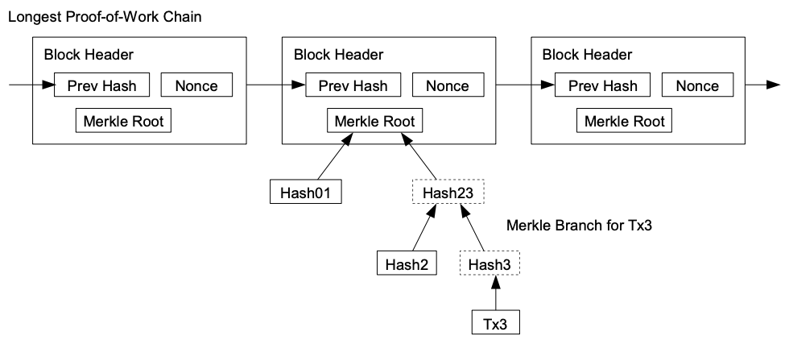

# Light Clients

<pba-cols>
    <pba-col>
        
    </pba-col>
    <pba-col>
        <blockquote>What can I say?<!-- .element: class="fragment" data-fragment-index="2" --></blockquote>
        <blockquote>It's a client but light.<!-- .element: class="fragment" data-fragment-index="3" --></blockquote>
    </pba-col>
</pba-cols>

---

# 😢 Running a Node is Hard 😭

Ideal: Everyone runs their own node.

Reality:

- It takes a lot of disk, memory, etc
- It takes some know-how
- I don't need it _all the time_

Notes:
The bitcoin whitepaper clearly assumes that users will run their own nodes. This is the most trustless and decentralized way to operate, and you should do it whenever you can. If you think you can't you're probably wrong. Just ask the Monero community.

There are _some_ reasons not to run a full node and the reality is that not everyone will. So even though we should always run our own nodes, let's look at some alternatives and ways we can make node running more accessible.

---v

## RPC Nodes

AKA, trust somebody else's node.

- 🕵️ Spy on you ([like infura](https://decrypt.co/115486/infura-collect-metamask-users-ip-ethereum-addresses-after-privacy-policy-update)).
<!-- .element: class="fragment" data-fragment-index="2" -->
- 🔞 Censor you
<!-- .element: class="fragment" data-fragment-index="3" -->
- 🤥 Lie to you
<!-- .element: class="fragment" data-fragment-index="4" -->
- 💔 Steal your boyfriend
<!-- .element: class="fragment" data-fragment-index="5" -->

Notes:
The easiest thing to do is just trust some expert to run a node for you. Very web2. Lot's of things can go wrong.

So this is definitely not the best option. Let's see if we can do better.

---v

## Lighten the Load

For resource constrained systems and people in a hurry

- Phone
- Raspberry pi
- Microcontroller
- Inside Web Browser

Notes:
One of the complaints was that the node takes too much resources. This is especially true if we want people to be able to run the node in all kinds of exotic environments. And we do want that because we want people to run their own node even when they're just paying the bill at dinner from their phone or liking social posts while scrolling on the bus. Let's make the client lighter so it doesn't require as much resources.

---v

## Light Client Duties

- ❌ Sync blocks
- ❌ Execute blocks
- ✅ Sync headers
- ❔ Maintain Transaction Pool
- ✅ Checks consensus
- ❌ Maintains state

---v

## Trustless

- Relies on full node for data
- Does not have to trust data
- State root helps a lot

Notes:
The figure is from the Bitcoin whitepaper. The concept of light clients has been around since bitcoin. At that time it was known as Simplified Payment Verification. You could confirm that a payment was sent or received. But you couldn't confirm that the tokens in question still existed or anything else about the state.

Chains with state roots can have much more powerful light clients

---v

## Syncing Strategies

- Full header sync
- Checkpoints in code
- Warp sync

Notes:
We also need to address the use case of clients that are not always on. For example if you only need your node on your phone, or when using a specific web page, that means it will have some syncing to do.

Doing a full sync is already a lot faster than on a full client because you aren't downloading or executing the blocks. But by the time you have a few million headers, it does still take some time.

The naive solution is to just have relatively recent headers hard-coded in the client. This works pretty well. You already have to trust the client developers for the entire implementation so you aren't trusting a new party at least.

Warp sync is possible when you have deterministic finality. In dead simple PoA you just check that the authorities have signed the latest block and you are good. If you have authority hand-offs, there is more work to be done. You have to check that each authority set signs the transition to the next authority set. But this is still only even N blocks instead of every block.

---v

## Self Defense

Stay in the gossip protocol or you might get got.

Notes:
In the main gossip protocol, if authorities finalize two conflicting blocks, then we can prove that they have broken the rules and slash them. If we don't watch the gossip and only peer with a single full node, then our view is entirely defined by that node. They may gossip us an attack chain and we won't know. So it is important to communicate with many different full nodes.

---

# Bridges

Transport layers between independent consensus systems

---

---
