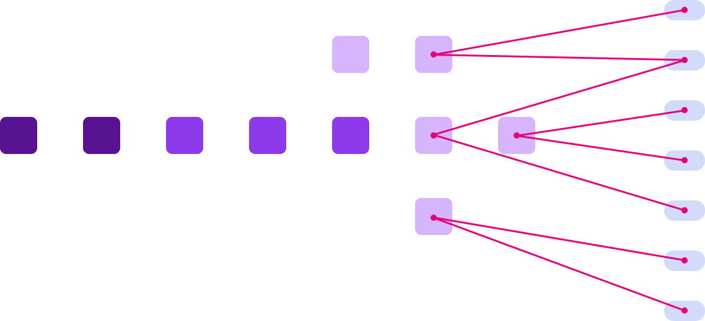
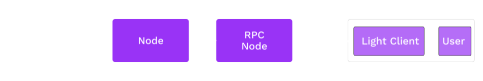

# Unstoppable Applications

---

## Motivation

So far, we have discussed state machines and consensus.

But spent little time addressing the _contexts in which they operate_.

---

## Attacking Web3

Notes:

Key point: your "perfect" system in is likely weak to things outside of the "rules"!

Source: [XKCD](https://xkcd.com/538/)

---

## Expectations vs. Reality

<widget-columns>
<widget-column>

### This column has a bit of a statement to make.

</widget-column>
<widget-column>

- Lorem ipsum dolor sit amet, consectetur adipiscing elit
- Ut enim ad minim veniam, quis nostrud exercitation
- Duis aute irure dolor in reprehenderit in
- Excepteur sint occaecat cupidatat non proident, sunt in

</widget-column>
</widget-columns>

---

## People over Platforms

Web3 should prioritize _people_ over _platforms_.

Platforms are OK as service providers, but peer-to-peer guarantees must be upheld without requiring trust in a service provider.

---

## Web3 Tech Stack

TODO: update this graphic, rather stale (Joe mentioned in Cambridge)

---

## A Lot More Than Blockchain

Blockchains only form one part of the stack.
Web3 applications must prevent attacks at all layers.
For discussion today:

<widget-text center>

- Networking
- Consensus
- Node access
- Validator power
- Inter-consensus system trust

</widget-text>

---

## Criticisms

There are valid criticisms of how many blockchain applications operate today.

<widget-text center>

- Mining pools (and other centralizing factors)
- RPC providers
- Bridges

</widget-text>

We will discuss these and what we're building to realize a better stack.

Notes:

https://moxie.org/2022/01/07/web3-first-impressions.html great critique on the state of the space.

---

# Network Level

---

## Peer-to-Peer Networks

---

## Network Attacks

<widget-text center>

- Entry/Boot nodes and peer discovery
- Data center faults
- Traffic analysis and targeted takedowns
- Eclipse attacks

Notes:

Boot nodes typically _hard coded_ to "bootstrap" and start peer discovery.
Boot nodes can decide what peers to advertize, or can be inaccessible.
Common data centers (AWS, GCP, ...) could fail or censor, potentially large number of peers go dark.
Hard to hide! Most p2p traffic is easy to identify vs. web2 traffic.

---

# Consensus

---

## Mining Pools

Proof of Work authority sets have no finite bound.
But people like to organize.

We actually don't want authority sets to organize because it creates risk.

---

## Mining Pools

Source: [Buy Bitcoin Worldwide](https://www.buybitcoinworldwide.com/pages/mining/pools/img/pool-graph.png)

---

## Security Dilution

Security is always a finite resource:

<widget-text center>

- Centralized: Cost of corruption/influence
- Proof of Work: Number of CPUs in the world
- Proof of Stake: Value (by definition, finite)

---

## Security Dilution

Consensus systems compete for security, and they have reason to attack each other.

Emergence of obscure/niche "Proof of X" algorithms to shelter from attack only goes so far.

---

## Proof of Work Battles

---

## Authority Misbehavior

<widget-text center>

- Lack of availability
- Equivocation
  - Authorship: Proposing mutually exclusive chains
  - Finality: Voting for mutually exclusive chains to be final
- Invalidity

---

## Equivocation

---

## Provability

Some types of misbehavior are harder to prove than others.

Equivocation is simple: Someone can just produce two signed messages as cryptographic proof.

Others rely on challenge-response games and dispute resolution.

---

## Validator Consolidation

How many validators does a system need?

Higher numbers should lead to a decrease in the ability for entities to collude.

But validators are expensive, both economically and computationally.

---

## Authority from Accountability

Authority should imply accountability.

No matter how you design an authority selection mechanism, some people will have a privileged position within it.

Those who _choose_ to become authorities should be liable for their actions.

---

## Polkadot Pause

A few interesting design decisions in Polkadot w/r/t its architecture:

- More validators increases the state transition throughput of the network.
- Individual shards have full economic freedom by being members of a larger consensus system.
- Superliner slashing puts colluding validators at existential risk (while well-meaning ones should have little to worry about).

---

# Network Access

---

## Web2 Access

Heavily based on trust.

Any cryptographic guarantees are between central authority and users.

---

## Blockchain Node Queries

In an ideal case, application users would run nodes themselves, so as to not trust a provider.

But nodes can consume large amounts of storage, network, and CPU resources.

---

## Node Queries

So, most people outsource.

These service providers wield large amounts of power to deceive, censor, and surveil.

---

## Multi-Chain Applications

If running _one_ node is burdensome, try multiple.

---

## Light Clients

Light clients only store block headers and consensus-critical information.

- Allow users to query full nodes from RPC providers,
- but take advantage of hash-based data structure to _verify_ the information coming from the provider.
- Low storage and bandwidth requirements (use in a browser extension or mobile device).

---

## Light Clients

---

# Validator Power

---

## STF Upgrades

Validators all execute the state transition function.

What happens when people (<--intentionally vague, for now) want to upgrade the STF?

---

## Hard Forks

Traditionally, all nodes need to upgrade their software to apply any upgrades.

This gives node providers huge power: Even if every other group wants to make a change, "authority nodes" can refuse to upgrade.

---

## Hard Forks

If the chain does split into two, who decides which chain is which?

<widget-text center>

- Greater hashpower or value at stake
- Whatever is recognized by service providers
- Whatever is recognized by data aggregators

**But not the stakeholders of the system**

</widget-text>

---

## Hard Forks and Substrate

Substrate separates the state transition _logic_ from the _executor_.

The executor is WebAssembly
The STF is part of the state and can be upgraded.

**Authority nodes should _execute_ the STF, not be trusted to _choose_ it.**

---

## Transaction Censorship and Ordering

Block authors choose the transactions they include and in what order.

<widget-text center>

- Censorship attacks
- "Miner extractable value"

---

## Censorship

There are a lot more system users than system authorities.

However, every transaction must be included by an authority.

If no authority will include a user's transaction, they do not have permissionless access.

---

## Censorship

But all nodes _can_ censor but still uphold the expectation that the system is available to everyone.

As long as no transaction is in the intersection of the censored sets.

Deterministic finality helps.

---

## Maximal Extractable Value (MEV)

A measure of the value that block authors can extract based on their knowledge of pending transactions and ability to order them.

<widget-text center>

- Frontrunning
- Backrunning
- Sandwiching

> https://www.mev.wiki/

Notes:

Emergent behavior.
Not realized as possible by many until it quietly became the norm.

---

## Maximal Extractable Value

#### "[Ethereum is a Dark Forrest](https://www.paradigm.xyz/2020/08/ethereum-is-a-dark-forest)"

> An environment in which detection means certain death...
> ...publicly identifying someone else’s location is as good as directly destroying them.

---

<!-- .slide: data-background-color="#8D3AED" -->

# Classroom Discussions

Front-running as a Service (FaaS) & MEV Auctions (MEVA)

_A solution or crutch?_

Notes:

- Flashbots & Friends

<!-- TODO Forest game on Ethereum testnet... or other zk game? -->

---

## Revisiting Transactional and Free Execution

Transactional execution means that logic must be "woken up" by transactions.

Free execution provides more power to application developers to deliver behavior guarantees.
Function calls can be scheduled and automatically dispatched.
Uses include:

<widget-text center>

- Automated decision enactment
- Logic to execute at the start or end of each block
- "Cleanup" tasks when blocks are not full

---

# Dependencies

---

## Separate Consensus Systems

Two consensus systems may have differing levels of security and definitions of finality.

When these systems interact, they must trust messages from the other system.

---

## Reversions

---

## Reversions

---

## Blockchain Wars

Systems with high security have the incentive to attack systems with low security whom they perceive as competitors.

---

## Trustless Messaging

In order to handle messages _without trust_, systems must share common finality guarantees.

`A` should never process a message from `B`, where `B` is reverted and `A` is not.

---

## A Note on Synchronicity

Smart contracts on a single chain (e.g. Ethereum) can interact trustlessly because of their shared view of finality.

Asynchronous systems can also share finality (i.e., be members of the same consensus system).

---

## Human Nature

People are **_LAZY_**, expect them to trend towards the easiest option.

---

<!-- .slide: data-background-color="#8D3AED" -->

# Classroom Discussions

Minimum viable decentralization.

_What key aspects should be considered?_

Notes:

- Quantitative: nodes needed (for what), incentives, ... TODO
- Qualitative: social norms, ... TODO

---

## Governance... unstopable?

<iframe width="1120" height="630" src="https://www.youtube-nocookie.com/embed/Q6euy5W1js4" title="YouTube video player" frameborder="0" allow="accelerometer; autoplay; clipboard-write; encrypted-media; gyroscope; picture-in-picture" allowfullscreen></iframe>

[Unstoppable Code: The Difference Between Can't and Won't](https://www.youtube-nocookie.com/embed/Q6euy5W1js4)

Notes:

Watch if time allows for class discussions.
More likely to assign informally to everyone to watch in the next few days.
Also ensure everyone researches the effects of OFAC has had on validator compliance because of Tornado Cash.

---

## Democratic Systems

Democratic Mediums is a directory of patterns for decision, deliberation, and noise.

> https://medlabboulder.gitlab.io/democraticmediums/
> https://metagov.org/ -- weekly seminar
> https://daocollective.xyz/
> https://www.smartcontractresearch.org/

Notes:

Many novel and niece definitions in this wiki.
Very much encouraged to explore after class!

---

## DAOs

Decentralized Autonomous Organizations ([DAOs](https://www.investopedia.com/tech/what-dao/)).

> A **coordination** mechanism.

---

## Modeling Behavior

https://tokenengineeringcommunity.github.io/website/

Notes:

Mostly free education and tools to dive deeper on tokenomics.
Remember, these are _models_ of idealized systems in general, real world conditions will differ!

---

## Wrap Up

End of Module 3.
Goal is that you now have the primitives and concepts necessary to dive into Substrate and Polkadot and start building unstoppable Web3 applications.
