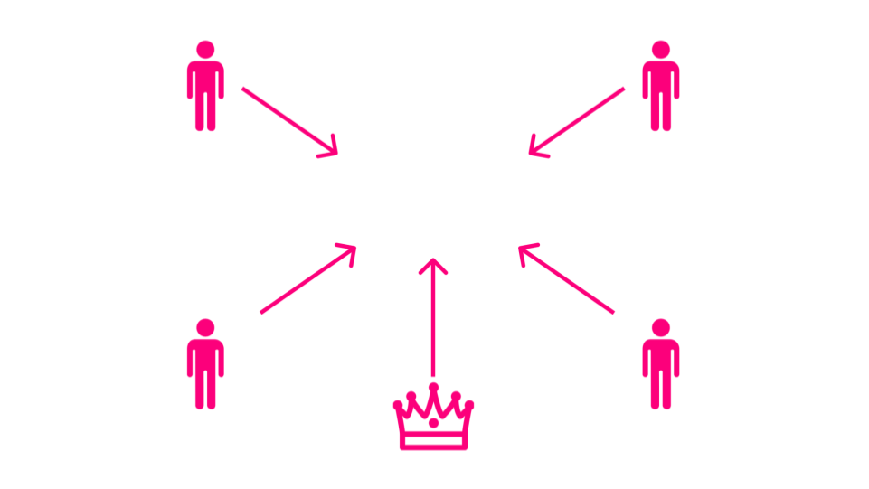
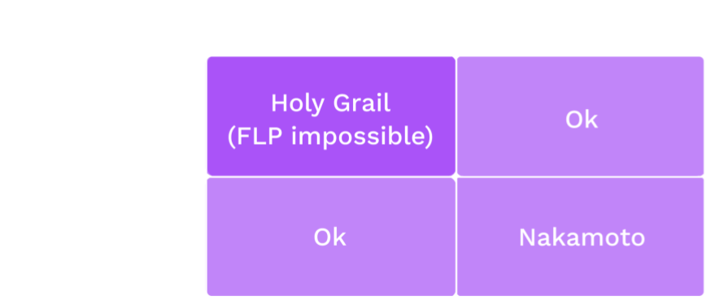

# Consensus: Finality

---

## Consensus is...

...a decision making process that strives to achieve acceptance of a decision by all participants.

Notes:

If we have external factors like trust relationships or Social hierarchy it can be quite easy.

Trust example: If everyone trusts each other, then any one person can propose an outcome, and all the others will trust that it is in the community's best interest.

Social Hierarchy example: If a community has an executive (President, Queen, CEO), the executive can propose her preference and everyone will accept it based on the external mechanism that keeps her as the executive.

But these conditions are not interesting, and are often not realistic. It gets interesting when we don't make these simplifying assumption.

---v

## Adversarial Conditions

- The participants want to agree on _something_
- They don't trust each other
- Some could be faulty, or make mistakes
- Some could be straight up malicious (aka Byzantine)

---

# One Shot Consensus

A single decision to make.

Once it is made, we are done.

---v

## Desired Properties

All honest participants...

- Termination - Eventually reach some decision
- Agreement - Reach the same decision
- Integrity - Reach at most one decision, which was proposed by at least one participant.

---v

## Also Validity

If all participants unanimously propose the same decision, all honest participants reach that decision.

Notes:

Another desireable property that is sometimes too obvious to say.

---

## Example 1: Where to go for dinner

<pba-cols>
<pba-col>

</pba-col>

<pba-col>

- Termination - Stan, Kyle, and Kenny will each eventually decide where to eat.
- Agreement - Stan, Kyle, and Kenny will each decide to eat at the same place.
- Integrity - Stan, Kyle, and Kenny will eat at either Whistlin' Willies or Casa Bonita.

</pba-col>
</pba-cols>

Notes:

Stan, Kyle, Kenny, and Cartman are trying to decide where to have dinner.
Stan, Kyle, and Kenny want to have something yummy and spend time together.
Cartman is secretly pursuing his own goals and doesn't care whether dinner is yummy.
In fact he secretly hopes they won't decide at all so he can go home and eat KFC with his mom.

Stan and Kyle both propose Whistlin' Willie's for dinner.
Kenny and Cartman propose Casa Bonita.

In the end Kenny may not agree that Whistlin' Willie's is the best option for dinner, but he will agree that it is the legitimate group decision.

Image source: https://southparkstudios.mtvnimages.com/images/shows/south-park/clip-thumbnails/season-14/1402/south-park-s14e02c03-ill-show-them-f-obscene-16x9.jpg

---v

## Example 2: Which side of the road to drive on

In the last module we discussed the coordination game and its two Nash equilibria. We discussed that if there is no communication allowed among participants, a Shelling point may help.

Luckily in real life, communication is possible so we can run a consensus algorithm instead of rely on a Shelling point.

- Termination -
- Agreement -
- Integrity -

Notes:

Imagine all the drivers are allowed to participate in the consensus. Most are honest because they don't want to crash, but
some may be Byzantine.
Someone please volunteer to describe what one of these means in this example.

- Termination - All honest drivers will eventually decide which lane to drive in
- Agreement - All honest drivers will agree on the same lane to drive in
- Integrity - The decision will be one of the participants suggestions. Doesn't mean much in this case because there are only two choices. It's basically guaranteed that they will both be suggested by at least _someone_

---

## Byzantine Generals Problem

<pba-cols>
<pba-col>

</pba-col>

<pba-col>

- Divisions plan to attack
- Must make coordinated attack to succeed
- Some generals might be traitors and behave maliciously

</pba-col>
</pba-cols>

Notes:

Several divisions of the Byzantine army are camped around an enemy city. They plan to attack the city, but have not yet decided when to attack.
If the attack is coordinated, they will probably be successful, but if it is uncoordinated, they will probably be defeated.
What do our three properties mean in this scenario?

- Termination -
- Agreement -
- Integrity -

---v

## Mistakes vs Malice

**Crash Tolerance** - A system can keep operating normally when some actors crash or go offline.

**Byzantine Fault Tolerance** - A system can keep operating normally when some actors are intentionally malicious. Byzantine actors may:

- Crash - Or pretend to have crashed - Byzantine faults are a superset of crash faults
- Lie - Sending false information to peers
- Equivocate - Send inconsistent information to different peers

Notes:

These examples and many others are _instances_ of the Byzantine Generals Problem

---v

## Mistake or Malice?

<pba-cols>
<pba-col>

</pba-col>

<pba-col>

- Consider an Airplane flight computer.
- The pilot _must_ know the airspeed at all times.
- Airspeed sensors can fail.
- Sensors can be buggy.
- Are these malicious?

</pba-col>
</pba-cols>

Notes:

Consider an Airplane flight computer. It is critical that the pilot (human or automated) knows the aircraft's airspeed at all times.
Airspeed sensors can fail due to extreme temperatures, icing, solar radiation, and other reasons.
For this reason, there are redundant sensors, and they run a consensus protocol.

Imagine that one of the sensors has an overflow _bug_ such that when the airspeed exceeds a certain threshold, maybe `u8::max_value()`, it actually reports a much lower speed.

Are these crash faults or byzantine?

In a blockchain system, bugs in the code may cause nodes whose operators are intending to be honest, to deviate from the protocol anyway. This is why client diversity is important.

---

# History Lesson

---

## Synchrony

A network is one of:

- **Synchronous** - When a message is sent, it is received immediately by all recipients.
- **Asynchronous** - When a message is sent it may be received after some delay, or not at all. The sender doe not know whether it is received. Messages may be received in different orders by different parties.
- **Partially Synchronous** - When a message is sent, it may be received after some delay up to a maximum delay, $T$. It may not be dropped entirely. Messages may be received in different orders by different parties.

Roughly analogous to real-time (async) vs. turn-based (sync) games.

---v

## Sync or Async?

<widget-text center>

Classify each of these:

- Telephone call
- Mail communication
- Text message
- Jitsi video call
- Element chat

Notes:

- Telephone call is sync. You say something and wait for the other party to reply
- Mail is async. You send a letter, then go do other stuff for several days
- Jitsi video call is basically sync just like the phone call.
- The others can be either. Sometimes you text back and forth quickly and wait for replies. Other times you send and come back later like mail.

---

## Determinism

A system is one of:

- **Deterministic** - The same inputs give the same outputs every single time.
- **Probabilistic** - The same inputs may not give the same outputs. Requires a source of entropy. eg coin flipping.

---

## FLP Impossibility

Notes:

Once it was shown that deterministic consensus is impossible in an async network, the field split into two major parts. Either you:

- Assume the network is (at least partially) synchronous
- Introduce non-determinism

One interesting thing about Nakamoto pow consensus is that it does _both_.

- Nondeterminism because you don't know who will solve the pow first
- Partial synchrony because it only works if the time to download and execute the block is much less than the time to solve the PoW

---

## Ongoing Consensus

We want to continue agreeing on an every-growing history of events

Notes:

Blockchains are intended to keep processing and finalizing transactions forever. This is more like deciding where to go to dinner every night over and over.

---v

## Desireable Properties

- **Safety** aka **Finality** - Nothing bad will happen
- **Liveness** - Something good will eventually happen

Notes:

Traditional literature typically uses the term safety. Blockchain folks typically talk about finality. They basically mean the same thing.

Finality can be proved to entities that are not involved in consensus.

We spoke about liveness previously in the authoring system. There it means that more blocks will be authored, more blockspace will be created and put up for sale. Here, in finality, it means that more blocks will be finalized. Of course liveness in the finality depends on liveness in the authoring.

These two decisions can be entirely orthogonal to one another, or wrapped up together.

---v

## Liveness vs Termination

Earlier I described Termination as desireable, now I'm saying Liveness is desireable.

Are these at odds with each other?

Notes:

Termination guarantees that, for a given decision, each honest participant will eventually decide something. This concept is relevant when there is a single decision to be made. In the blockchain context, it guarantees that we will eventually know which block is final at height n.

Liveness guarantees that a system that is intended to continue making progress, will indeed eventually make progress. In the context of the blockchain, liveness means that once we've decided what block is final at height n, we will eventually go on to decide what block is final at height n + 1.

---

## Finality in Nakamoto Consensus

- Longest chain rule\* - Longest chain is "best"... for now
- Someone could always start mining a chain and, with low but non-zero probability, end up with it longer.
- There could _already_ be a longer chain that you just haven't heard of.

The finality is only probabilistic. Nakamoto consensus in only safe in a synchronous network.

Notes:

This is to say that Nakamoto consensus is NOT safe on the real asynchronous internet. In practice, as long as
blocks can be downloaded and executed much more quickly than the target block time, it is usually good enough.

- Longest could also mean most accumulated work

---

## Deterministic Finality

- Based on traditional methods (BFT)
- Requires an honest-majority finite authority set

- Consensus protocol that assumes honest majority
- Economic game that keeps them honest
<!-- .element: class="fragment" data-fragment-index="2" -->

Notes:

If you want deterministic finality, it basically means employing BFT agreement protocols that we talked about in the history lesson. This means we need a finite authority set with an honest majority. And that means we need incentives to keep them honest.

---v

## Incentives: Game Theory!

Abstractly: You behave honestly when the utility of doing so exceeds the cost.

<widget-text center>

Incentive designers may potentially:

- Reward honest behavior
- Punish (aka slash) dishonest behavior

Notes:

Many systems use both of these, but doing so is not strictly necessary. Even without slashes, the opportunity cost of staking and the missed rewards from authoring invalid blocks may be sufficient.

It is often the case that blockchain systems give rewards in the authorship and punishments in the finality. There is no fundamental reason for this; it is just a little more straightforward to implement.

---v

## What is potentially punishable?

<widget-text center>

- Authoring when you aren't supposed to
- Failing to author when you are supposed to
- Casting finality votes for conflicting candidate blocks
- Casting a finality vote for a block (or chain) that includes an invalid state transition.

_How severe are each of these offences? Do they all warrant a slash? A full slash?_

Notes:

PoW has inherent punishment through wasted energy. BFT based system's don't.

Instead, aspiring participants will typically lock up a security deposit which can be slashed in part or in whole.

---v

### Concrete Punishment Example

Let's say a slash is 100 units, and the reporter gets 10%. I plan to attack the network. If my attack is successful, I expect to gain roughly 200 units worth of utility.

I ask another authority to cooperate with me: "I'll pay you 20 units to _not_ rat me out for my attack".

Question: How would you respond?

Notes:

"I don't believe you can carry out the attack because _someone else_ will report you and take the 10 units, leaving me with 0."

---

## Case Study: Tendermint

- Authorship is like Aura - simple round robin
- Naive but simple BFT implementation
- If the block has enough votes by the end of the slot, it is finalized. Otherwise, it is rejected via timeout.
- "Instant finality"
- Forkless - Forks are disallowed because blocks can only be authored on finalized parents.

Notes:

Tendermint assumes a partially synchronous network, like all the BFT based systems - That is to say that messages may not arrive immediately, but will arrive within a finite time bound. In practice this means it is slot-based just like so many of the authoring schemes.

Tendermint is often touted as "instant finality". It is instant in the sense that finality is tied to authorship. In practice this means that authorship, which is inherently O(n), is slowed down to stay in sync with finality which is O(n^2). They sacrifice liveness to guarantee absolute safety at all times.

---v

## Tendermint Deep Dive

1. Wait for a block (or author one if it is your turn)
2. Prevote

- If the block is valid, Prevote for it.
- If the block is invalid, Prevote `Nil`
<!-- .element: class="fragment" data-fragment-index="2" -->

4. Precommit

- Wait for 2/3 prevotes then Precommit
- If you don't get 2/3 prevotes, Precommit `Nil`
<!-- .element: class="fragment" data-fragment-index="3" -->

5. Complete

- Wait for 2/3 Precommits them finalize
- If you don't get it, throw the block away
<!-- .element: class="fragment" data-fragment-index="4" -->

https://medium.com/softblocks/explaining-how-tendermint-consensus-works-433066cbc465

---v

### Hybrid Consensus

Separating the block production from finality.

Allows the block production to stay live even if finality is lagging.

Allows lower overhead in the finality layer.

This approach is used in Substrate.

---

## Case Study: Grandpa

<widget-text center>

- Deterministic finality _only_
- Requires an external block authoring scheme with its own liveness proof.
- Kind of like Tendermint but better. Finalizes chains, not blocks.

---v

## Vote on Chains, not Blocks

TODO Revise this

Finalizing a block in a BFT system with $n$ participants is in $O(n^2)$, In Tendermint this communication has to happen at each and every block which puts a bound on the size of the validator set.

<widget-text center>

Now that finality is separated, we treat each vote as a vote not only for one block, but also for each ancestor block. This significantly reduces the number of total messages sent.

- Allows the chain to stay live even when many validators are offline
- Allows for a challenge period to delay finality if needed

---

TODO crib Andre's grandpa slides

---

## Summary

<widget-text center>

- Networks can be {Synchronous, Asynchronous}
- Consensus systems can be {Deterministic, Probabilistic}
- Consensus systems can be {Open participation, Finite participation}
- There is always an assumption that at least {1/2, 2/3} participants are honest
- In decentralized systems, we use Economics and Game Theory to incentivize honest execution of the consensus protocol

---

Now let's play the board game
