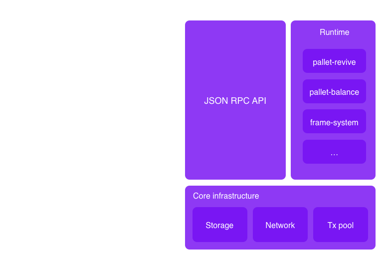
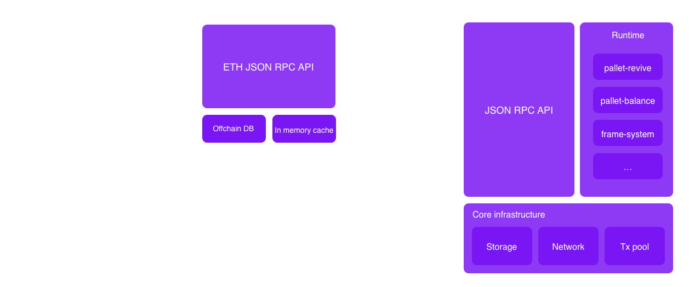
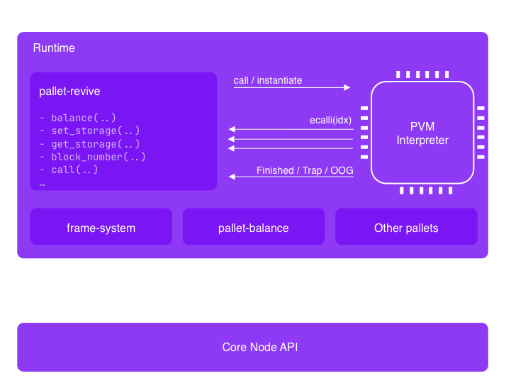
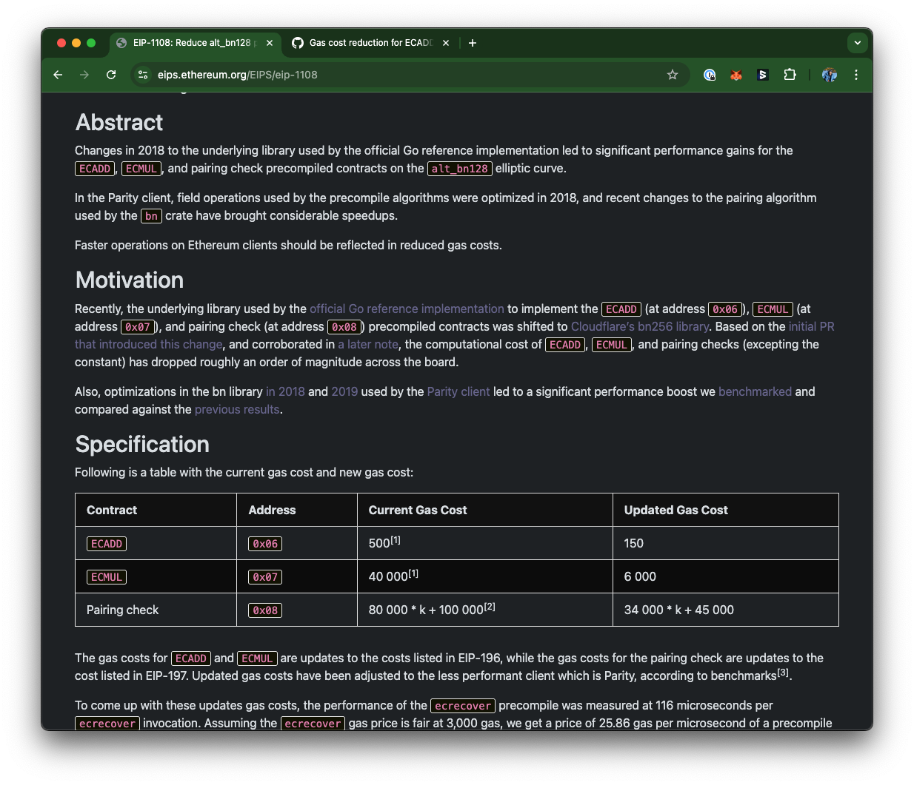

## Architecture overview



---

## ETH-RPC compatibility layer



Notes:
There are two things we want to enable with this compatibility layer

- Make is easy for builder to port existing Dapp to Polkadot, and use battle tested ooling already developed by the EVM community.
- Make it easy for EVM to onboard, by supporting EVM wallets such as MetaMask.
- easy on ramp for existing project and developers, existing projects can start working with minimal efforts, take
  existing contracts or Dapps, rebuild them and deploy them to Polkadot and they will work right away. The cool things
  is that developers can use the tools that they knows and love (remix, hardhat, foundry) that have been buily over
  the years by the EVM community. On top of that these contract now can take of all the features of the Polkadot ecosystem.

To get there, we need to speak the language of Ethereum, both on chain by running a compatible VM, but also by implementing Ethereum JSON-RPC specs, as all interactions with the chains are done through the RPC.

As we covered previously, there has been a few attempts, to bring EVM compatibility to Substrate.
There are two different approaches you can take.

- frontier opted to collocate the Eth compatibility in the Node
- We opted to build it as a separate binary, as a proxy layer to the Substrate node. This present a few benefits:
  - We can use the Omninode or any Substrate node implementation, if a Node operator decide to use a different Node
    implementation they can do so as this approach require no modification to the Node.
  - We can iterate quickly on the compatibility layer, without having to wait for the Node to be updated.

---

## EVM flow


--

# pallet-revive

Notes:

- pallet-revive is the runtime module, that handle smart contracts transactions, and manage the storage used by these contracts.

---

## pallet-revive Config

```rust[0|2-8|10-19|21-24]
impl pallet_revive::Config for Runtime {
  type Time = Timestamp;
  type Currency = Balances;
  type RuntimeEvent = RuntimeEvent;
  type RuntimeCall = RuntimeCall;
  type FindAuthor = <Runtime as pallet_authorship::Config>::FindAuthor;
  type WeightPrice = TransactionPayment;
  type RuntimeHoldReason = RuntimeHoldReason;

  type CallFilter = Nothing;
  type DepositPerItem = DepositPerItem;
  type DepositPerByte = DepositPerByte;
  type CodeHashLockupDepositPercent = CodeHashLockupDepositPercent;
  type WeightInfo = pallet_revive::weights::SubstrateWeight<Self>;
  type RuntimeMemory = ConstU32<{ 128 * 1024 * 1024 }>;
  type PVFMemory = ConstU32<{ 512 * 1024 * 1024 }>;
  type UnsafeUnstableInterface = ConstBool<false>;
  type UploadOrigin = EnsureSigned<Self::AccountId>;
  type InstantiateOrigin = EnsureSigned<Self::AccountId>;

  type ChainId = ConstU64<420_420_420>;
  type AddressMapper = pallet_revive::AccountId32Mapper<Self>;
  type NativeToEthRatio = ConstU32<1_000_000>;
  type EthGasEncoder = ();

}
```

Notes:

We won't go in depth about the config in this lecture, as this is something that will be covered by the upcoming classes on Frame, but will look at a few interesting bits specific to pallet-revive

---

## Dispatch functions

```rust[0|3|4-11]
/// Makes a call to an account, optionally transferring some balance.
#[pallet::call_index(1)]
#[pallet::weight(T::WeightInfo::call().saturating_add(*gas_limit))]
pub fn call(
    origin: OriginFor<T>,
    dest: H160,
    #[pallet::compact] value: BalanceOf<T>,
    gas_limit: Weight,
    #[pallet::compact] storage_deposit_limit: BalanceOf<T>,
    data: Vec<u8>,
) -> DispatchResultWithPostInfo { /* ... */  }
```

---v

## Dispatch functions

| pallet call                    | Description                                                                |
| ------------------------------ | -------------------------------------------------------------------------- |
| `call`                         | Makes a call to an account, optionally transferring some balance.          |
| `instantiate`                  | Instantiates a contract from a previously deployed binary.                 |
| `instantiate_with_code`        | Instantiates a new contract from the supplied code.                        |
| `upload_code`                  | Uploads new code without instantiating a contract from it.                 |
| `remove_code`                  | Removes the code stored under a hash and refunds the deposit to its owner. |
| `map_account`                  | Registers the caller's account ID for use in contract interactions.        |
| `unmap_account`                | Unregisters the caller's account ID and frees the deposit.                 |
| `dispatch_as_fallback_account` | Dispatches a call with the origin set to the caller's fallback account.    |

---

## VM API



Notes:

- Discuss how the VM interacts with the runtime
- Mention the `define_env` macro, equivalent to the `construct_runtime` in Frame that define the host functions available to the VM.

---v

## define_env macro

```rust
#[define_env]
pub mod env {
  /// ...

	/// Set the value at the given key in the contract storage.
	#[stable]
	#[mutating]
	fn set_storage(
		&mut self,
		memory: &mut M,
		flags: u32,
		key_ptr: u32,
		key_len: u32,
		value_ptr: u32,
		value_len: u32,
	) -> Result<u32, TrapReason> {
		self.set_storage(memory, flags, key_ptr, key_len, value_ptr, value_len)
	}
```

---v

## UAPI

```rust
#[polkavm_derive::polkavm_import(abi = self::abi)]
extern "C" {
  pub fn set_storage(
    flags: u32,
    key_ptr: *const u8,
    key_len: u32,
    value_ptr: *const u8,
    value_len: u32,
  ) -> ReturnCode;
```

Notes:

- The UAPI allow us to create a Rust RISCV contract, that can interact with the host functions defined in the runtime.

---v

## Activity: Build and deploy a Rust contract

> Build the fibonacci contract using Rust and `pallet-revive-uapi`

---

## Differences with EVM

---v

## Balance Decimals

- In EVM, the smallest unit of value is 1 wei, which is 10^-18 ETH.
- In Substrate, the smallest unit of value is 1 Planck, which is 10^-12 KSM or 10^-10 DOT.

```rust
pub trait Config: frame_system::Config {
    //...
    #[pallet::constant]
    type NativeToEthRatio: Get<u32>;
}
```

Notes:
In theory, EVM wallets are configurable, and should let you define the number of decimals you want to use.
In practice, most wallets use 18 decimals, and we have to play nicely with them.
Also everything that is passed by the contract as argument to any opcode is assumed to use 18 decimals.
A transaction that attempt to use a value that can't be translated to a substrate value without a rounding error, will be rejected.

---v

### Address mapping

- Most Substrate chain, including Asset Hub, use a 32 byte (AccountId32) address usually encoded in SS58 format.
- EVM uses a 20 byte address (H160), usually encoded in hex format.

```rust
use sp_core::{crypto::AccountId32, H160};

fn main() {
    println!("Substrate: {}", AccountId32::new([1u8; 32]));
    // Substrate: 5C62Ck4UrFPiBtoCmeSrgF7x9yv9mn38446dhCpsi2mLHiFT

    println!("EVM: {:?}", H160([1u8; 20]));
    // EVM: 0x0101010101010101010101010101010101010101
}
```

Note:
Substrate uses 32 bytes address, while EVM uses 20 bytes address.
Everything that is executed in the VM expect a 20 bytes address, we need to map the 32 bytes address to a 20 bytes address.

---v

### Address mapping

```rust[0|4-9|16-20|11-12]

#[frame_support::pallet]
pub mod pallet {
  pub trait Config: frame_system::Config {
    /// Use either valid type is [`address::AccountId32Mapper`] or [`address::H160Mapper`].
    #[pallet::no_default]
    type AddressMapper: AddressMapper<Self>;
    // ...
  }

  #[pallet::storage]
  pub(crate) type OriginalAccount<T: Config> = StorageMap<_, Identity, H160, AccountId32>;
  // ...
}

pub trait AddressMapper<T: Config> {
	fn to_address(account_id: &T::AccountId) -> H160;
	fn to_account_id(address: &H160) -> T::AccountId;
	fn map(account_id: &T::AccountId) -> DispatchResult;
  // ...
}
```

---v

### Address mapping

```rust[1-10| 12-21 | 12-27]
// H160 -> AccountId32 -> H160

//  alice_eth: 0x0101010101010101010101010101010101010101
let alice_eth = H160([1u8; 20]);

// alice_sub: 0101010101010101010101010101010101010101eeeeeeeeeeeeeeeeeeeeeeee (5C62Ck4U...)
let alice_sub = <Runtime as Config>::AddressMapper::to_account_id(&alice_eth);

// 👍 Convert back
assert_eq!(alice_eth, <Runtime as Config>::AddressMapper::to_address(&alice_sub));

// AccountId32 -> H160 -> AccountId32

// bob_sub: 0202020202020202020202020202020202020202020202020202020202020202 (5C7LYpP2 ...)
let bob_sub = AccountId32::from([2u8; 32]);

//  bob_eth: 0xaf32a8053c2d446446d7019359e210b82e53b8ba
let bob_eth = <Runtime as Config>::AddressMapper::to_address(&bob_sub);

// ❗ Original substrate accounts need a stateful mapping
assert_ne!(bob_sub, <Runtime as Config>::AddressMapper::to_account_id(&bob_eth));

// Map the account (this is a stateful operation)
<Runtime as Config>::AddressMapper::map(&bob_sub).unwrap();

// 👍 Convert back
assert_eq!(bob_sub, <Runtime as Config>::AddressMapper::to_account_id(&bob_eth));
```

---v

## Gas vs Benchmarked Weight

### Gas cost in EVM



---v

### Benchmarked weight in Substrate

```rust[0|10-13]
	#[benchmark(pov_mode = Measured)]
	fn bn128_add() {
		let input = hex!("089142debb13c46...");
		let expected = hex!("0a6678fd675a...");
		let mut call_setup = CallSetup::<T>::default();
		let (mut ext, _) = call_setup.ext();

		let result;

		#[block]
		{
			result = Bn128Add::execute(ext.gas_meter_mut(), &input);
		}

		assert_eq!(result.unwrap().data, expected);
	}
```

---v

### Gas estimation and encoding in lower digits

- When sending tokens, wallets automatically retrieves the correct gas parameters by calling `eth_estimateGas`
- The estimate encodes the gas limit, the gas price, and the storage deposit in a single value.

Notes:

On a Substrate chain, the gas estimation is 2 dimensional (ref_time, pov), this is not a single value like in EVM.
In pallet-revive, we also use a deposit for the storage used, to make sure that the chain isn't bloated with unused storage.

To be compatible with EVM though, we need to fit these 3 numbers in a single value, the `gas_limit` of the transaction.
To achieve that, we compress the ref_time, pv and storage deposit on the lowest digits of the gas_limit, using the
binary square root of these values, and storing on the lowest 6 digits.
