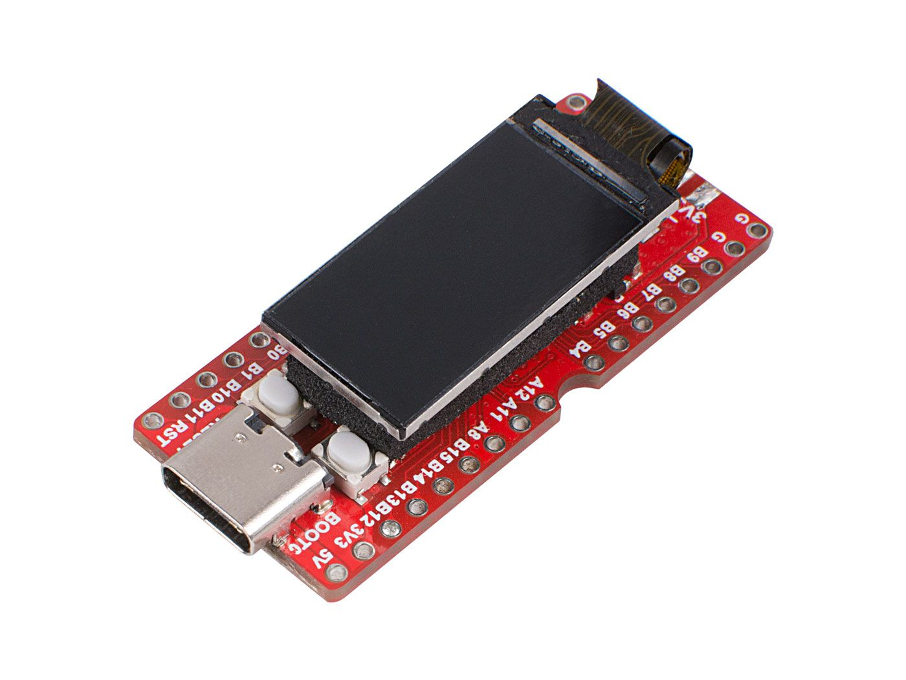
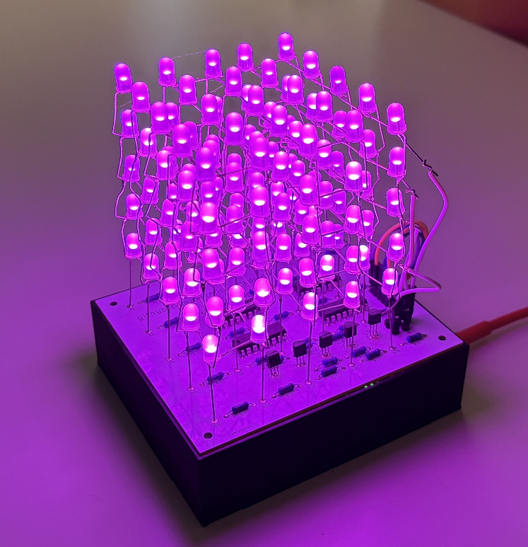
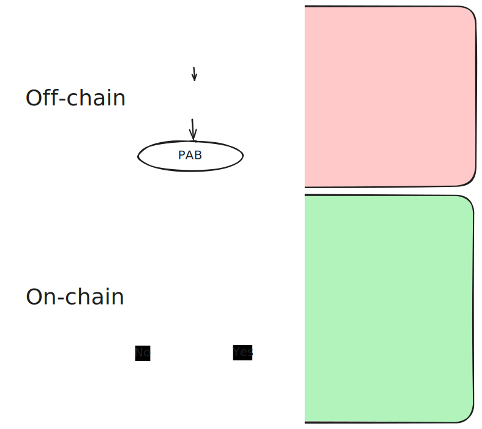
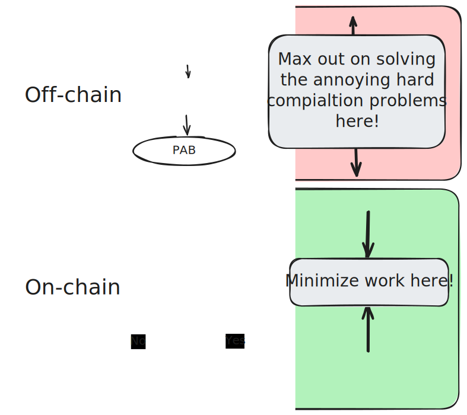

# PolkaVM

- From the past (Wasm) to the future (PVM)
- "the next generation virtual machine for Polkadot and PolkaJam"

---

# Wasm

Polkadot is abandoning Wasm: Here's why!

Note:

Click-baity introduction slide

---

# Wasm: The obvious choice?

- Open standard
- Mature and widely adopted
- Many production-grade implementation available
- Faster than EVM

---

# Wasm: The obvious choice **for blockchains**?

---

# Wasm shortcomings

- Determinism
- Compilation

---

## Determinism

- Wasm is not actually deterministic
- Example: Unbounded stack

---

## Determinism

What is the problem with the below snippet?

Hint: Think about the differences between how function arguments are passed in stack vs. register machines.


```wasm
(func (param i32) (param i32) (param i32) (param i32) (param i32) (param i32) (param i32) (param i32) (param i32)
    local.get 0
    local.get 1
    ;; ...
    local.get 8

    call $other
)
```

Note: 

https://forum.polkadot.network/t/deterministic-pvf-executor/4204
https://hackmd.io/@Ww6uNnIISmqGwXufqPYPOw/SklLYwb-T

---

## Determinism

```wasm
(func (param i32) (param i32) (param i32) (param i32) (param i32) (param i32) (param i32) (param i32) (param i32)
    local.get 0
    local.get 1
    ;; ...
    ;;
    ;; general purpose registers and ABI of the target platform and architecture?
    ;;
    ;; x86_64:  6 argument registers (rdi, rsi, rcx, rdx, r8, r9)
    ;; aarch64: 8 argument registers (r0..r7)
    ;; x86_64:  may eventually spill to stack
    ;; x86_64:  will eventually stack overflow
    ;; aarch64: probably fine?
    ;;
    ;; => indeterministic behavior!
    ;;
    local.get 8

    call $other
)
```

---

## Compilation

- Wasm code is hard to compile _efficiently_
- Register allocation
- High level control flow
- Loss of semantic information

---

### Register allocation

> In compiler optimization, register allocation is the process of assigning local automatic variables and expression results to a limited number of processor registers. 

https://en.wikipedia.org/wiki/Register_allocation


```wasm
(func (param i32) (param i32) (param i32) (param i32) (param i32) (param i32) (param i32) (param i32) (param i32)
    local.get 0
    local.get 1
    ;; ..
    local.get 8
    ;; Informally:
    ;;   Compiler needs to figure out which variable goes to which register
    ;;
    ;; For example adding two variables here requires them to be in
    ;; in registers on a real computer
)
```

---

###  Register allocation

> **NP-Problem**
> 
> Chaitin et al. showed that register allocation is an NP-complete problem. 

https://en.wikipedia.org/wiki/Register_allocation#Common_problems_raised_in_register_allocation

---

###  Register allocation

For those unfamiliar with the theory of computation, just read:

_Register allocation is a difficult problem_

---


### High level control flow

Let's do a quick experiment using ChatGPT

### High level control flow

Prompt: "Write me fibonacci in webassembly text"

```wasm
  (func $fibonacci (param $n i32) (result i32)
    (local $a i32)
    (local $b i32)
    (local $temp i32)
    (local.set $a (i32.const 0))
    (local.set $b (i32.const 1))
    
    (loop $loop
      ;; if n <= 1, return n
      (if (i32.le_s (local.get $n) (i32.const 1))
        (then
          (return (local.get $n))
        )
      )
    ..
```

---

### High level control flow

Prompt: "Write me fibonacci in x86_64 assembly"

```asm
fibonacci:
    cmp rdi, 1          ; If n <= 1, return n
    jle .base_case
    mov rax, 0          ; a = 0
    mov rbx, 1          ; b = 1
    mov rcx, rdi        ; counter = n
.loop:
    add rax, rbx        ; temp = a + b
    xchg rax, rbx       ; a = b, b = temp
    dec rcx             ; counter--
    jg .loop            ; If counter > 0, repeat loop
    mov rax, rbx        ; Result is in b
    ret
.base_case:
    mov rax, rdi        ; Return n if n <= 1
    ret
```

---

<section>
  <h3>High level control flow</h3>
  <table>
  <thead>
    <tr>
      <th>Wasm</th>
      <th>x86_64</th>
    </tr>
  </thead>
    <tr>
      <td>
        <pre><code data-trim data-noescape>
        (loop $loop
          (if (i32.le_s (local.get $n) (i32.const 1))
            (then
              (return (local.get $n))
            )
          )
        ..
        )
        </code></pre>
      </td>
      <td>
        <pre><code data-trim data-noescape>
        fibonacci:
            cmp rdi, 1
            jle .base_case
            mov rax, 0
            mov rbx, 1
            mov rcx, rdi
        .loop:
            add rax, rbx
            xchg rax, rbx
            dec rcx
            jg .loop
            mov rax, rbx
            ret
        </code></pre>
      </td>
    </tr>
  </table>
</section>

---

<section>
  <h3>High level control flow</h3>
  <table>
  <thead>
    <tr>
      <th>Wasm</th>
      <th>x86_64</th>
    </tr>
  </thead>
    <tr>
      <td>
        <pre><code data-trim data-noescape>
        (loop $loop
          (if (i32.le_s (local.get $n) (i32.const 1))
        </code></pre>
      </td>
      <td>
        <pre><code data-trim data-noescape>
            cmp rdi, 1
            jle .base_case
            jg .loop
        </code></pre>
      </td>
    </tr>
  </table>
</section>

---

### Compiler 101

1. Parse into Intermediate Representation (IR)
   - Static Single-Asssignment (SSA)
   - Control flow analysis on some tree-like data structure
2. Optimizations
3. Lowering into executable machine code

---

### Compiler 101

- Compilers are fun topic and a deep rabbit hole
- No time for this here
- Take-away: Most of those things are _difficult problems_
- Do you start to see a pattern?

---

## More problems

- Complexity of the Wasm spec
- Compiler bombs:
  - Optimizing compilers are not executing in linear time
  - Metering slows us down even more
- Open but our request were turned down in the past
- `wasmtime` sandboxing security issues in past

---

## Wasm compilation: Take-aways

It really doesn't look good from a theoretical perspective:
- Every Wasm contract needs to be compiled on every node executing it
- A transaction involving a stack of many contracts being amplifies the problem
- Caching
  - Harder than it seems on first glance
  - Doesn't entirely solve the problem

---

# PVM Architecture

The PolkaVM instruction set is based on RISC-V.

<!-- .element: class="fragment" data-fragment-index="1" -->


<!-- .element: class="fragment" data-fragment-index="2" -->

---

# RISC-V

Wait a minute!

<!-- .element: class="fragment" data-fragment-index="1" -->

RISC-V isn't a platform agnostic bytecode.

<!-- .element: class="fragment" data-fragment-index="2" -->

But a real CPU?

<!-- .element: class="fragment" data-fragment-index="3" -->

---

## RISC-V



---

## RISC-V



---

## RISC-V

Realizations:

- RISC-V is simple
- Can be seen as common denominator of widely used _real_ CPUs (x86, arm)

---

## RISC-V as PAB solves our Wasm problems!

- Determinism
  - We are not dictated by web2
  - Instead we can have our own requirements
  - Solved simply because we can define it as requirement
- Compilation
  - It follows that RISC-V bytecode is (much!) simpler to compile 
  - That is, minimizing the work done on-chain!

---

## RISC-V compilation



---

## RISC-V compilation



---

## On/off chain workload

Prompt: "Write me a fibonacci in RISC-V"

```
fibonacci:
    li t0, 1          # Load constant 1 into t0
    ble a0, t0, .base_case # If n <= 1, return n
    li t1, 0          # a = 0
    li t2, 1          # b = 1
    
.loop:
    add t3, t1, t2    # temp = a + b
    mv t1, t2         # a = b
    mv t2, t3         # b = temp
    addi a0, a0, -1   # n = n - 1
    bgt a0, t0, .loop # If n > 1, continue loop
    mv a0, t2         # Return b (Fibonacci(n))
    ret

.base_case:
    ret
```

---

<section>
  <h3>Intuitively: What's less work to compile to x86</h3>
  <h3>Wasm or RISC-V?</h3>
  <table width="100%">
  <thead>
    <tr>
      <th>Wasm</th>
      <th>x86_64</th>
      <th>RISC-V</th>
    </tr>
  </thead>
    <tr>
      <td>
        <pre><code data-trim data-noescape>
        (loop $loop
          (if (i32.le_s ..)
            (then
              (return (local.get $n))
            )
          )
        ..
        )
        </code></pre>
      </td>
      <td>
        <pre><code data-trim data-noescape>
        fibonacci:
            cmp rdi, 1
            jle .base_case
            mov rax, 0
            mov rbx, 1
            mov rcx, rdi
        .loop:
            add rax, rbx
            xchg rax, rbx
            dec rcx
            jg .loop
            mov rax, rbx
            ret
        </code></pre>
      </td>
      <td>
        <pre><code data-trim data-noescape>
        fibonacci:
            li t0, 1
            ble a0, t0, .base_case
            li t1, 0
            li t2, 1
        .loop:
            add t3, t1, t2
            mv t1, t2
            mv t2, t3
            addi a0, a0, -1
            bgt a0, t0, .loop
            mv a0, t2
            ret
        .base_case:
            ret
        </code></pre>
      </td>
    </tr>
  </table>
</section>

---

## JIT

## Compiler

## Sandboxing

---

# PVM Architecture

## ELF linker

---
# PVM Architecture

## RISC-V

---
# PVM Architecture

## RISC-V

---

# PVM Architecture

## RISC-V

---

# PVM Benchmarks

---

# PVM Demo

## Doom (maybe on-chain with JAM)

---