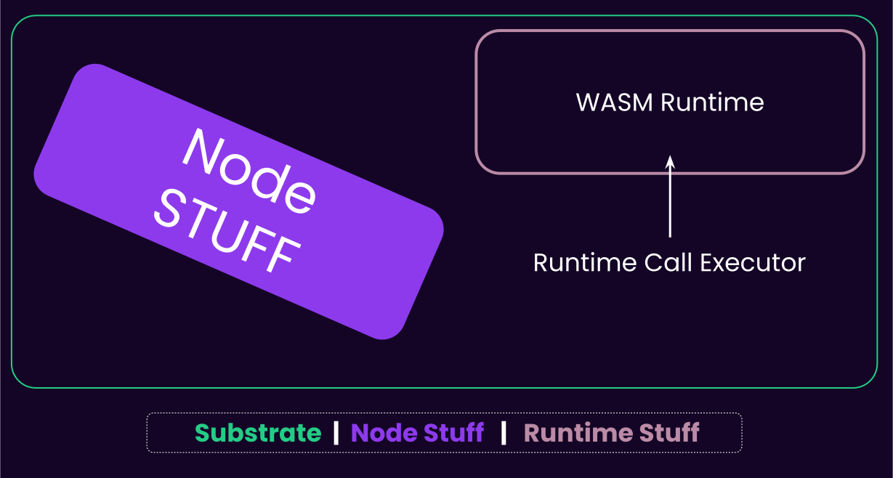
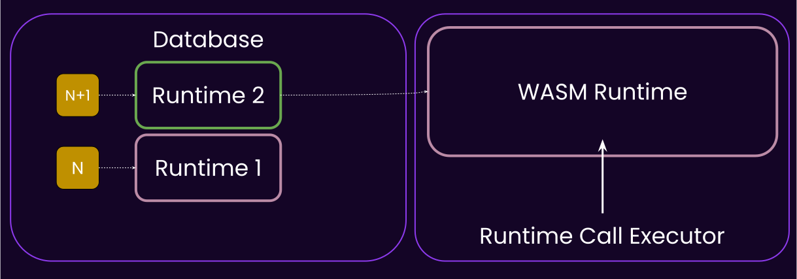
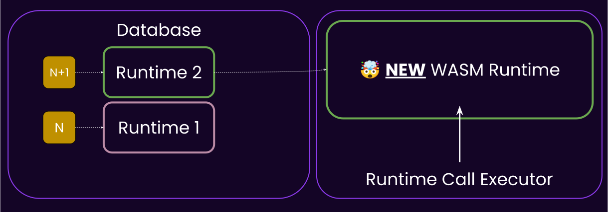
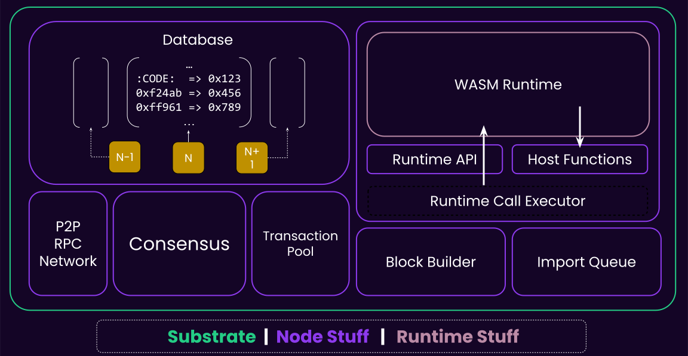

# Introduction to Substrate

---

## Blockchains are Fascinating!

<pba-flex center>

<h4 style="color: var(--substrate-host); top: 0">  They Enable </h4>
<!-- .element: class="fragment" -->

- 🤝 Trust without middlemen<!-- .element: class="fragment" -->
- 📜 History that cannot be forged <!-- .element: class="fragment" -->
- 💰 Digital Gold (Bitcoin) <!-- .element: class="fragment" -->
- 🌐 World Computer (Ethereum) <!-- .element: class="fragment" -->
- 🔮 Programmable Money (DeFi) <!-- .element: class="fragment" -->

### But...

<!-- .element: class="fragment" -->

</pba-flex>

---

## Building One is HARD 😰

You Need Expertise in (roughly) 8 Disciplines

<!-- .element: class="fragment" -->

 
<pba-cols>
<pba-col>

- 🌐 Networking <!-- .element: class="fragment" -->
- 🔐 Cryptography <!-- .element: class="fragment" -->
- 🤝 Consensus <!-- .element: class="fragment" -->
- 💾 Database <!-- .element: class="fragment" -->

</pba-col>
<pba-col>

- ⚙️ Execution <!-- .element: class="fragment" -->
- 💰 Economics <!-- .element: class="fragment" -->
- 🗳️ Governance <!-- .element: class="fragment" -->
- 🛠️ Application <!-- .element: class="fragment" -->

</pba-col>
</pba-cols>

**Each discipline = Years to master**

<!-- .element: class="fragment" -->

---

## So How Do You Build a Blockchain?

Option 1: Fork & Modify 🍴<!-- .element: class="fragment" -->

- 📚 Inherit all technical debt <!-- .element: class="fragment" -->
- 🔒 Stuck with original design <!-- .element: class="fragment" -->
- 🐛 Merge conflicts forever <!-- .element: class="fragment" -->
- 😱 One wrong line = disaster <!-- .element: class="fragment" -->

---v

## So How Do You Build a Blockchain?

Option 2: Build from Scratch 🏗️

- ⏰ Years of development <!-- .element: class="fragment" -->
- 💸 Millions in funding <!-- .element: class="fragment" -->
- 🐛 Reinvent every bug <!-- .element: class="fragment" -->
- 🎯 90% chance of failure <!-- .element: class="fragment" -->

---

## A History of Blockchain Disasters

<pba-flex center>

<h4 style="color: var(--substrate-host); top: 0"> Bitcoin Overflow (2010) </h4>

- 184 billion BTC created
- Integer overflow bug
- Emergency fix required

</pba-flex>
<!-- .element: class="fragment" -->

Notes:
https://en.bitcoin.it/wiki/Value_overflow_incident

---v

## A History of Blockchain Disasters

<pba-flex center>

<h4 style="color: var(--substrate-host); top: 0"> The DAO Hack (2016) </h4>

- $60M stolen
- Ethereum hard fork
- Community split forever

</pba-flex>

Notes:
https://www.gemini.com/cryptopedia/the-dao-hack-makerdao

---v

## A History of Blockchain Disasters

<pba-flex center>

<h4 style="color: var(--substrate-host); top: 0"> Parity Wallet (2017) </h4>

- $30M stolen
- $115M frozen permanently
- Simple library bug

</pba-flex>

Notes:
https://tc.gts3.org/cs8803/2023-spring/student_presentations/team7.pdf
---v

## A History of Blockchain Disasters

<pba-flex center>

<h4 style="color: var(--substrate-host); top: 0"> Solana Halts (2020+) </h4>

- Multiple downtimes
- Consensus failures

</pba-flex>

Notes:
https://www.helius.dev/blog/solana-outages-complete-history

---v

**Building blockchains is genuinely hard** 🎯

---

## Option 3: Something In Between? 🤔

<pba-flex center>

What if we could...

- ✅ Reuse battle-tested components <!-- .element: class="fragment" -->
- ✅ Pick & Choose components <!-- .element: class="fragment" -->
- ✅ Focus on your innovation <!-- .element: class="fragment" -->

</pba-flex>

---

## The Core Thesis of Polkadot

<pba-flex center>

> The Future is Multi-Chain 🌈

Not one chain to rule them all… <!-- .element: class="fragment" -->

But many specialized chains… <!-- .element: class="fragment" -->

All working together, yet… <!-- .element: class="fragment" -->

Under the same trust umbrella → Shared Security <!-- .element: class="fragment" -->  
</pba-flex>

---

## So We Built Substrate

<pba-flex center>

### A Blockchain Framework That:

- ✅ Handles the hard parts
- ✅ Lets you customize everything
- ✅ Battle-tested in production
- ✅ Fast & Interoperable

</pba-flex>

Notes:
Future proof (forkless upgrade and modular) discussed later.

---

## Powered By Substrate

<pba-flex center>

### Polkadot Ecosystem

- Polkadot relay chain
- Moonbeam (EVM based)
- HydraDX
- 100+ parachains

</pba-flex>

---v

## Powered By Substrate

<pba-flex center>

### Standalone Chains

- BitTensor
- Midnight
- Avail
- Starknet Madara
- Aleph Zero
- Tanssi

</pba-flex>

---v

## Powered By Substrate

What will you build? 🚀

---

## Why Rust? 🦀

<pba-cols>
<pba-col>

### Strong

- Memory safe
- Thread safe
- No null pointers
- No data races

</pba-col>
<pba-col>

### Popular

- Most loved language (8 years)
- Growing ecosystem
- Great tooling
- Active community

</pba-col>
<pba-col>

### Secure

- 70% fewer bugs
- Compile-time guarantees
- Perfect for blockchain

</pba-col>
</pba-cols>

---

## But Can We Do Better? 🤔

Notes:

- Forkless Upgrades
- Governance Baked In
- Modular

---

## Upgrading the Chain ✨

<h4 style="color: var(--substrate-host); top: 0"> Traditional Chains </h4>

<pba-flex center>

1. Convince all nodes
2. Schedule hard fork
3. Pray everyone updates
4. Deal with chain splits

</pba-flex>
<!-- .element: class="fragment" -->

 

😰 Coordination nightmare <!-- .element: class="fragment" -->

---v

## Upgrading the Chain ✨

<h4 style="color: var(--substrate-host); top: 0"> Substrate Chains </h4>

<pba-flex center>

- Propose a new runtime as a Wasm blob (via governance or sudo).
- If approved, all nodes auto-upgrade to the new runtime.

</pba-flex>
<!-- .element: class="fragment" -->
 

🎉 Forkless upgrades <!-- .element: class="fragment" -->

---

## Substrate Architecture

---v

#### Substrate (simplified) Architecture

<pba-cols>

<pba-col center>
<h3 style="color: var(--substrate-runtime); top: 0"> Runtime (Protocol) </h3>

- Application logic aka. How we execute block
- Stored as a part of your chain state as a WASM Blob
- Upgradeable
- Also known as: STF

</pba-col>

<pba-col center>

</pba-col>
</pba-cols>

---v

#### Substrate (simplified) Architecture

<pba-cols>
<pba-col center>
<h3 style="color: var(--substrate-host); top: 0"> Fixed Node (Meta-protocol) </h3>

- Native Binary
- Executes the Wasm runtime
- Everything else: Database, Networking, Mempool, Consensus..
- Also known as: Host, Client

</pba-col>

<pba-col center>

</pba-col>

</pba-cols>

---

## Analogy: The Gaming Console!

 
<pba-cols>
<pba-col>

Substrate Node

</pba-col>
<pba-col>

Substrate's Wasm Runtime

</pba-col>
</pba-cols>

Notes:

Another good analogy: Node is the FPGA, and FRAME/Wasm is the VHDL.

---

### 😎 Forkless Upgrade

---v

### 😎 Forkless Upgrade

---

## When Do Nodes Need Upgrading?

<pba-flex center>

### Host API Changes

- New crypto primitives
- Performance improvements
- Bug fixes in node software

---v

## Everything else?

<pba-flex center>

- Forkless Runtime Upgrades 🎉
- 65+ times since Polkadot went live (May 2020)

Notes:
https://polkadot.subscan.io/event?page=1&time_dimension=date&module=system&event_id=codeupdated&page_size=25

---

## Governance Baked In 🗳️

<pba-flex center>

- On-chain voting
- Treasury management
- Parameter changes
- Upgrade decisions

  

</pba-flex>

**The chain governs itself** <!-- .element: class="fragment" -->

---

## Maximum Modularity 🧩

<pba-flex center>

- **Database?** ParityDB, RocksDB
- **Networking?** QUIC, TCP
- **Consensus?** Choose AURA, BABE, or custom
- **Finality?** GRANDPA, or something else
- **Accounts?** 32-byte, 20-byte, or custom
- **Crypto?** Ed25519, Sr25519, ECDSA, or all

  

</pba-flex>

**Like LEGO for blockchains** <!-- .element: class="fragment" -->

---

## Full Substrate Architecture

Notes:

- Consensus not part of STF
- State is untyped key-value storage. Runtime can interpret it.

---

## Recap

- Substrate is a modular framework to build fast, secure, future-proof blockchain.
- Substrate Node architecture.
- Forkless Upgrades

---

### Repository Structure

#### [`polkadot-sdk`](https://github.com/paritytech/polkadot-sdk)

- Substrate + FRAME + XCM
- Cumulus
- Bridges
- Polkadot Node

**This is a big repo, please clone and run `cargo build` on it after this lecture**

 

#### [`polkadot-fellowship/runtime`](https://github.com/polkadot-fellows/runtimes)

- Polkadot Runtimes

Notes:

https://paritytech.github.io/polkadot-sdk/master/polkadot_sdk_docs/polkadot_sdk/index.html
